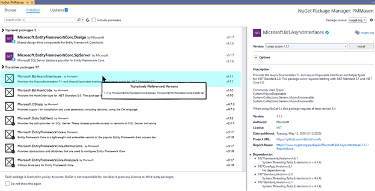
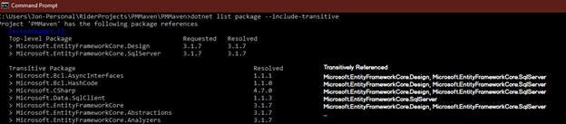

# Transitive Dependencies

* Status: Reviewed
* Author(s): [Jon Douglas](https://github.com/JonDouglas)
* Issue: [5887](https://github.com/NuGet/Home/issues/5887)

## Description: What is it?

When a developer uses NuGet in a CLI or IDE environment, they want to be able to see their project’s transitive dependencies and understand how certain dependencies are included in their package graph for PackageReference projects.

## Problem: What problem is this solving?

Developers are often confused with top-level & transitive dependencies in their project. A developer should be able to see all the transitive packages for their project or solution & understand where they originated from. A user should be able to promote a transitive dependency quickly & easily to a top-level dependency in the case there is a security concern on the package version depended on or if promoting to a top-level package will resolve a conflict. 

## Why: How do we know this is a real problem and worth solving?

Knowing how a package is being included in a project helps a developer diagnose many problems. It also provides them with an opportunity to understand complex dependency chains they may have within their projects. 
There is not a great solution that exists to understand the nature of top-level packages and their transitive dependencies.
The solution explorer in Visual Studio does the best job at allowing a user to dive into each NuGet package & see all transitive dependencies from the top-level dependency.

The dotnet CLI does not provide the insight into “why” a transitive dependency is listed, although it does list everything that has been resolved.

The Visual Studio Package Manager UI does not support the concept of showing transitive packages in any fashion.

## Success: How do we know if we have solved this problem?

By measuring the number of detractors regarding transitive dependencies & promoters of this new experience in future NuGet client surveys.

We will add telemetry to categorize when a top-level package is installed, and whether it was done in the context of promoting a transitive package to a top-level one.

## Audience: Who are we building this for?

We are building this for .NET users, both old and new, to be successful with understanding the types of NuGet dependencies in their projects and solutions.

## What: What does this look like in the product?

## Context and Scope

-	https://github.com/NuGet/Home/issues/5887 
-	https://developercommunity.visualstudio.com/content/idea/538119/add-dependency-tree-view-for-packagereferences.html 

## Minimal Requirements

-	Visual list of transitive dependencies.
-	Ability to see a transitive dependency package details.
-	Ability to determine where a transitive dependency originated.
-	Ability to promote a transitive dependency to a top-level dependency.

## Scenarios and User Experience

### CLI

We should consider a minor tweak to the existing experience of “dotnet list package --include-transitive” to provide the user with a sense of where the package came from. This could be a new column next to “Resolved” which says “Transitively Referenced” or “Referenced” and has a list of the top-level packages that requested the dependency.
Tracking issue can be found here: https://github.com/NuGet/Home/issues/11625

### Visual Studio

Within Visual Studio, there will be a new panel within the Visual Studio Package Manager UI named “Transitive Packages” in which all transitive packages will be displayed to the user. For the sake of not confusing the user, there will additionally be a header titled “Top-level Packages” where the current experience is today for top-level packages.

**By default, a user’s transitive packages will be collapsed** as a project can have hundreds, if not thousands of transitive packages & would potentially impact performance displaying these many records on each load.

When a user highlights a transitive package, they will see a pop-up that displays how the transitive dependency originated & what top-level package(s) are bringing it in.

Finally, selecting a transitive dependency will provide the user the ability to “Install” the package as you normally would a top-level dependency. This will promote the transitive dependency to a top-level dependency, and the transitive dependency will now be placed in the top-level packages list instead.

#### Detailed design

**Collapsible, vertical list group:** Direct and transitive packages will be grouped under collapsible list group

* **Labels:** List groups will be labeled “Top-level packages” and “Transitive packages” respectively 
* **Count:** List groups will display the number of packages in the group 
* **Default state:** Transitive packages list group will be collapsed by default 
* **Warnings:** List group headers will surface a warning icon for vulnerabilities and deprecations - see “Vulnerabilities and deprecation” section for relevant details 

**Package items:** The packages under the “Transitive packages” list group will have the same appearance/design as the “Top level packages” (Id, description, author, versions on the right, etc.) 
* **Status overlays:** Transitive packages will not show an “Update available” icon (upward arrow) or “Latest version installed” icon (check mark) - only directly installed packages will 
* **Tooltip:** Hovering over the package list item will show a pop-up that displays how the transitive dependency originated & what top-level package(s) are bringing it in. 

**Search:** Searching for a package ID will filter the packages shown in both list groups in the same way. 
* Searching for “Microsoft” will show all relevant filtered results for both the top level and transitive packages 
* If one list group or the other is collapsed, they will remain collapsed on search 
* The counter for the number of packages will change to reflect the number of packages being shown when filtered with a search query 

**Package details window:** The package details window will be the exact same for transitive and top level packages. 
* Similar to top-level packages, users will have the ability to “Install” the transitive package to make it a top-level package of the desired version. 
* PackageReference & packages.config: This feature will only be surfaced for PackageReference projects. The "transitive" list group will be hidden for package.config.

**Browse, Installed, and Updates tab behavior:**
* **Installed:** Transitive dependencies will only be shown and managed in the Installed tab 
* **Browse:** We will not surface transitive dependencies in the Browse tab. Transitively installed packages will not have an “Installed latest version” check mark. 
* **Updates:** We will not show transitive dependencies in the Updates tab. This is because users shouldn’t typically update transitive dependencies outside of extenuating circumstances like vulnerabilities and deprecation. 

**Feed selection:** Selection of different feeds won’t impact the packages shown, only some associated metadata like deprecation and vulnerabilities – the same behavior as exists today. 

**Vulnerabilities & deprecation:** Vulnerability and deprecation indicators will appear on transitive packages in the same way they appear for top-level packages. 

## Goals and Non-Goals

### Goals

-	View transitive dependency list displaying the version of each dependency.
-	See what brought in a transitive dependency & what version. 
-	Ability to promote a transitive dependency to a top-level dependency via typical NuGet PM UI commands.

### Non-Goals

-	Complete management of transitive dependencies.
-	Reinvent common UX patterns used in Visual Studio today for package management actions.

## Design

### Elements

There are three primary elements that will be added as part of this design to the existing Visual Studio Package Manager UI.

1.	ScrollViewer – To show transitive dependency nodes.
2.	Expander – To collapse transitive dependency nodes by default & expand upon user action. To collapse top-level dependency nodes.
3.	Tooltip – To show the transitive dependency’s origin.

The actual elements that will be implemented is up to the individual to which would best represent showing a scrollable list of transitive dependencies, collapse them, and provide a hover experience. These elements are simply the closest controls I found to convey the design.

The above elements will be checked against Accessibility Insights. We'll ensure screen-readers can differentiate Top versus Transitive dependencies, and the scrolling and expansion functionality will be accessible with the keyboard.

## Customer Development

### Pain Points

-	Frustration with lack of transparency for transitive packages during installs (did not realize installing package X would bring in so much other stuff)
-	Frustration with lack of transparency for debugging reasons on PackageReference (customers feel they would be able to better debug versioning issues if they had a clearer view of their dependency graph)
-	Some complaints about licensing issues in the case where a top-level package has a compatible license, but a transitive package does not.

### Verbatims

- Auditing/upgrading transitive dependencies. I can only do it manually by adding explicit packages.
- Drilling down the dependency tree
- In the package detail view, some way to explore dependencies of dependencies and then their dependencies and so on, any level deep, without installing the package.

## Cross-cutting Concerns

-	The words “top-level” & “transitive” are words most people must stop & think about.
    -	Should we use “direct” & “indirect”? Or “explicit” & “implicit”?
-	Should a transitive dependency have the “installed” text given it’s already technically installed? Should it be called “promote” instead?
- Given that the tooltip is not accessible for .NET Framework workloads, we will have to come up with an alternative experience or cut the tooltip experience until we have an accessible experience.

## Q&A

- Q: Can I see transitive dependencies on solution view or only project view?
- A: The scope today is project view first & seeing how complex including this in solution view would be in the engineering costing.

- Q: Who should ultimately own this work?
- A: The NuGet client team should own this work. They are familiar with the Visual Studio Package Manager UI & concepts of transitive dependencies.

- Q: Should packages.config be considered in this work?
- A: Since packages.config is based on top-level packages only, it will just use its existing experience by placing all packages in the top-level packages section unless it's technically convenient.

- Q: I want to know what transitive dependencies are being brought in by a package. How do I do that?
- A: You install package X & view the transitive dependencies panel inside Visual Studio or within the project system’s NuGet reference node. If we do CLI work, you would be able to type “dotnet list package –include-transitive” to see a similar output.

- Q: I want to know all the packages that depend on a transitive package. How do I do that?
- A: You would use the tooltip to hover over a transitive dependency & view the list of packages that bring it in. Otherwise you would use the dotnet CLI and view the “referenced” column.

- Q: Any thought towards seeing a visual graph for debugging transitive dependencies?
- A: Tools exist for this such as DGML, https://github.com/ThomasArdal/NuGetPackageVisualizer, & https://docs.microsoft.com/en-us/nuget/release-notes/nuget-1.4#package-visualizer. It is not in the scope of this feature & would likely need to be a part of “debugging dependencies” efforts.

- Q: Any indicator of transitive dependencies in search? We show top-level packages that are installed.
- A: No because these packages are not technically installed nor managed by the user. The user can only manage top-level dependencies. We want users to be able to promote to a top-level, but we do not need to let them know that something is already transitively brought in.

- Q: Is this really a feasible solution for license auditing? If 99 transitive dependencies are brought in, am I supposed to click through them all?
- A: It does not change the design of licenses today. It does, however, allow a user to see the details of transitive dependencies for licenses reasons. We would likely need to do more license indicator work outside of this design to make that experience better.

- Q: Will we surface how transitive dependencies will be changed when updating a top-level package?
- A: No, this is not a goal for this spec but may be a consideration in the future which would help a user determine if they want to update a package or not. We want to show things that are resolved, not requested.

- Q: How transitive packages/dependencies from referenced projects are shown?
- A: We will not show transitive dependencies from referenced projects in the first iteration.
