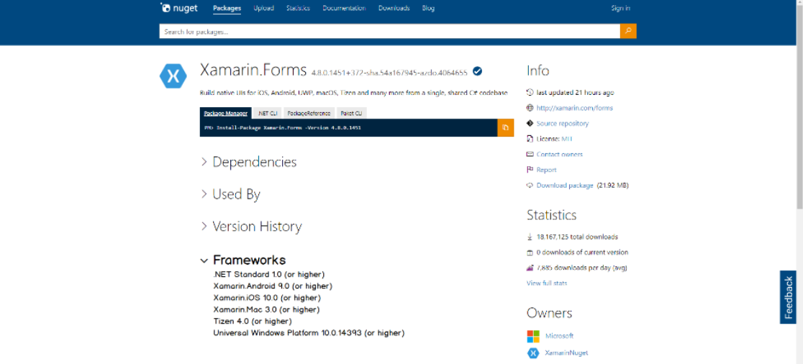

# NuGet Target Frameworks on Package Details Page

- Author Name (https://github.com/jcjiang)
- Start Date (2021-02-16)
- GitHub Issue (https://github.com/NuGet/NuGetGallery/issues/4843)
- GitHub PR ()
- Status: Accepted

## Summary

When a developer opens the package details page or tab on NuGet.org, they will see what frameworks the package can support. 

## Motivation

### Problem: What problem is this solving? 

Developers cannot use the package details page to determine what frameworks a NuGet package can support. In 2021, we live in a world where there are many evolutions of .NET coexisting on NuGet, such as .NET Framework and .NET 5.

Developers should be able to determine whether a package works for their project without having to first download it or rely on the author’s documentation. 

### Why: How do we know this is a real problem and worth solving? 

Finding a package that is compatible with your project is a challenge for the average developer in the .NET ecosystem. Over 21% of developers fail to install a package today. One of the top NuGet errors issued in telemetry is [NU1202](https://docs.microsoft.com/en-us/nuget/reference/errors-and-warnings/nu1202), which shows that we allow developers to install packages that are not compatible with their project or solution’s target framework. 

### Success: How do we know if we’ve solved this problem? 

- By gauging excitement/disappointment after blogging about this feature & analyzing sentiment on Twitter/GitHub/DevCom/etc.
- Compare the before and after numbers for error messages due to TFM incompatibility. Is there a noticeable decrease? If so, how long after the feature was rolled out for the decrease?

### Audience: Who are we building for? 

We are building this for the .NET developer who is browsing & making decisions about including a NuGet package into their project based on target framework & supported platform criteria. 

## Explanation

### Functional Explanation

Context and Scope: When a developer accesses the details page for a NuGet package, they will see information on target frameworks in an expandable section. The framework information will be surfaced from the package.

Minimal Requirements:
- List of Target Frameworks on NuGet.org's package details page. The Frameworks node will be expanded by default.
- Runtime, Content Build assets and Tools packages will display TFM details.
- Support for PackageReference project restore compatibility only.

**Target Framework** – A target framework is a specification of the APIs available to an application or library. 

Example: .NET Framework, .NET Core, .NET Standard, .NET 5 are target frameworks. 

**Supported Platform** – A supported platform is a target that the APIs can be ran on. 

Example: iOS, Android, Windows are platforms. 

- A .NET developer can view Frameworks of a package on NuGet.org: 

- We will have the list collapsed by default in order to track popularity. (See unresolved question on this.)

### Goals and Non-Goals 

#### Goals 

Make it clear to developers whether a package can be installed or updated for their project or solution based on a target framework. 

### Design 

#### Target Framework List 

Let's link to an explanatory document for any frameworks we expose here, for example: https://docs.microsoft.com/en-us/dotnet/standard/frameworks#latest-versions
- .NET Framework (net) 
- Xamarin/Mono (monoandroid, monotouch, xamarinios, monomac, xamarinmac, xamarinwatchos, xamarintvos) 
- .NET Core (netcoreapp) 
- .NET Standard (netstandard) 
- .NET 5 (net5.0) 

### Technical Explanation
- Packages whose layout follow our [guidelines](https://docs.microsoft.com/en-us/nuget/create-packages/supporting-multiple-target-frameworks) will be examined when uploaded and validated, prior to listing. Target Frameworks will be determined and displayed here.
- Note that packages which do not follow the guidelines may have inconsistent results.
- In cases where versions are not specified (such as .net) or other unexpected scenarios, these will be considered v0.0 and will be displayed as such. 
- When a portable TFM is being broken up and displayed (if feasible), we will need to flag it as portable, as portable assets are not the same as platform assets.

## Drawbacks
- We would need to focus on compatibility with PackageReference and not packages.config projects, as these two support compatibility in different ways.

## Rationale and alternatives
Q: I think build/{packageid}.[props|targets] poses a problem, because from NuGet's point of view this package is compatible with all TFMs, .NET, native/c++, or anything else. For packages like Nerdbank.GitVersioning, or SourceLink, this makes sense. But many .NET packages incorrectly use this, rather than build\{tfm}\{packageid}.[props|targets]. I think it's worthwhile pointing this out and explaining what our plan is for these packages.
A: Let's consider putting a link to a document which can call out corner cases such as this, and respond to direct customer concerns with advice on nupkg construction conducive to correct supprted TFM assessment.

Q: Will the "Frameworks" section be expanded by default? Should the "Frameworks" section explain how the customer should use this information? Should we add a link to docs? Consider moving up the "Frameworks" section. I would suggest "Documentation" first, followed by "Frameworks". The "Version History" table is noisy and it can be difficult to see what's below it. The "Dependencies" and "Used By" sections are useful information, but would claim "Frameworks" is more important.
A: Let's not expand by default--this will give us the option of trackiong the popularity of the section by tracking expansion clicks.

Q: Potentials for modelling our UX on:
 - https://docs.microsoft.com/en-us/dotnet/api/system.text.stringbuilder?view=net-5.0#applies-to
 - https://apisof.net/catalog/e40ef6ad-bd6e-9f29-7864-b942e37be11f
 - https://docs.microsoft.com/en-us/dotnet/standard/frameworks#latest-versions

A: From a sample of 100,000 package/versions, we have:
 - Only 445 have more than 5 supported TFMs
 - Only 16 have more than 10
 - Only 1 more than 15 (and it has 16)
 So, we'll go with a flat list for now and look at other options for subsequent work if desired.

### Unresolved questions

Q: Should the TM node be expanded or collapsed by default?
A: Driving this question is customer convenience. The tiles idea in Future Possibilities will also address this concern, and for now we may indeed decide to expand by default.

## Future Possibilities

- Filtering NuGet.org search by TFM
- TFM display in Visual Studio
- A series of tiles near package Id and version indicating supported platform--this is more populated when .NET5.0's (TargetPlatformIdenitifiers)[https://github.com/NuGet/Home/issues/9240] are in the TFM (which we can display versionless with full details in Frameworks node), and for earlier platforms we can have `.NET`, `.NET Core`, `.NET standard`, `Portable` (we can determine generational vs shared platform displays later), etc. TargetPlatformIdentifiers give us `iOS`, `Android`, `tvOS` etc., perhaps grouped alongside .NET (which will be visibly 5.0 when the Frameworks node is viewed).

