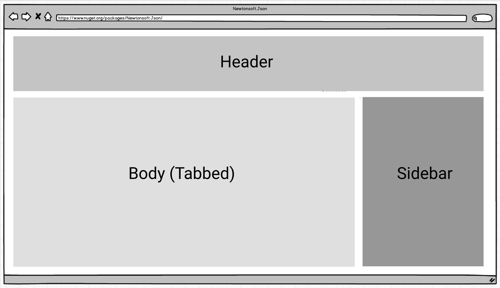
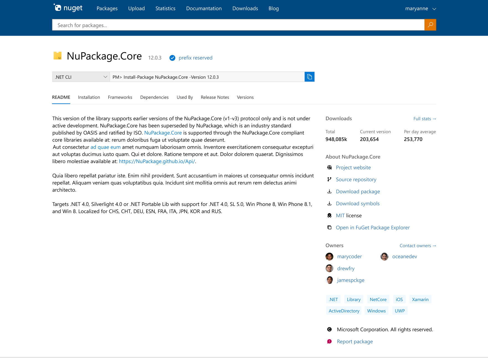
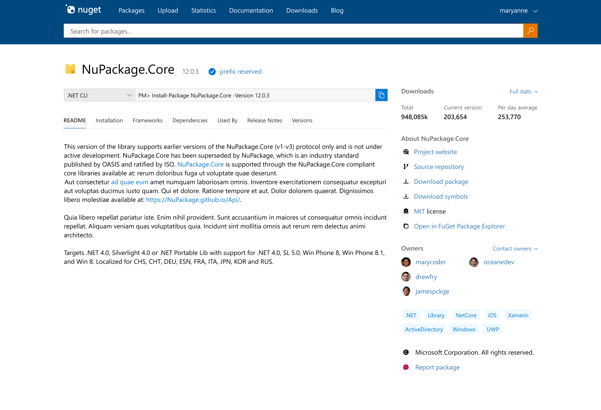
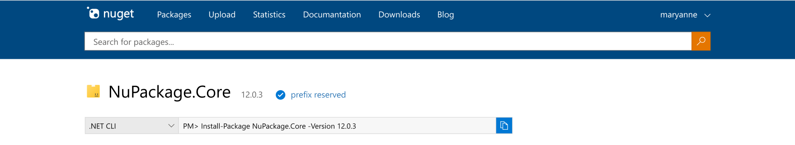
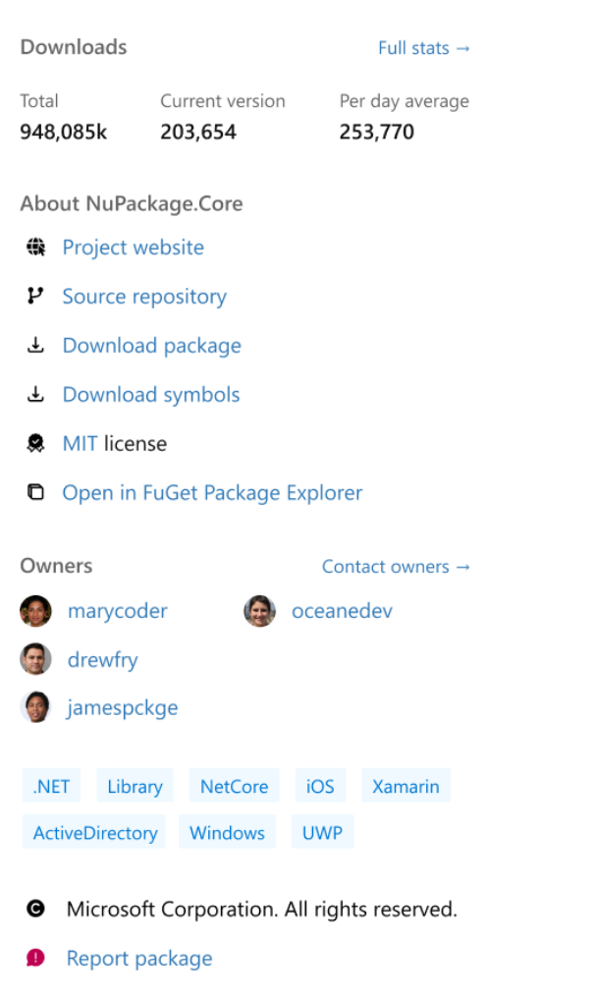
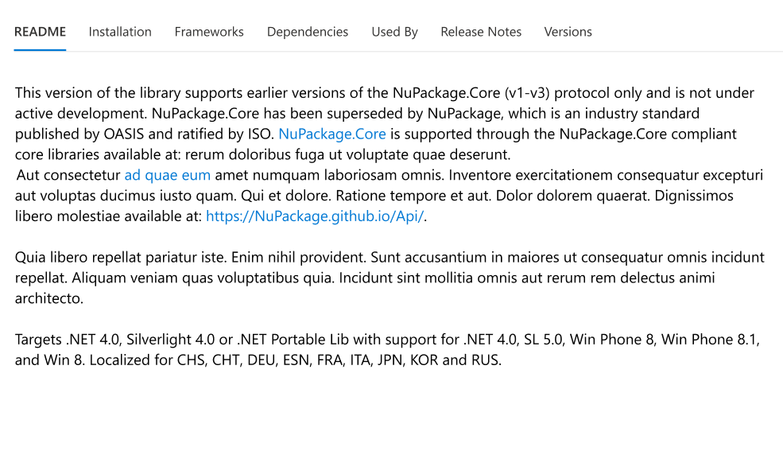

# NuGet.org Package Details Page Re-design

- Author Name [Jiachen Jiang (@jiachenjiang_)](https://github.com/jcjiang)
- Start Date 2021-05-03
- GitHub Issue: ()
- GitHub PR ()
- Status: Implemented

## Summary

When a developer clicks to see individual package detail on NuGet.org, they will see all the information they need, organized clearly and coherently by three sections – header, sidebar, and body. The body will consist of tabs and allow users to quickly switch between sections.

### Version 1: Tabs over Sidebar

### Version 2: Tabs next to Sidebar

## Motivation

We are running out of space on the page. We have lots of features we want to add like READMEs and changelogs. Currently, those additions would push content down the screen so much that users can’t read it. 

### Problem: What problem is this solving?

It is difficult for developers to use NuGet.org for finding packages. They struggle to navigate the site and find the info they need. They use external documentation on GitHub and personal blogs instead of the package details page.

### Why: How do we know this is a real problem and worth solving?

We have received many requests for UI improvements on GitHub. Developers have mentioned consistently in customer interviews that they do not like to use NuGet.org for finding and validating  packages and will look for other resources whenever they can. The information is not organized intuitively and caused users to scroll to the bottom of the page or use extra clicks. In addition, about 20% of our traffic comes from mobile usage and we need to make sure our design continues to work with mobile.   

We cannot improve the NuGet.org package details page entirely with small, undirected changes. Instead we need a coherent, comprehensive, and most importantly, modular plan of action that addresses the core problems but can be easily separated into manageable chunks of work.

### Success: How do we know if we’ve solved this problem?
- By HaTS survey results and customer interview replies  
- By measuring rates at which people click on sections/tabs on the package details page  
- By measuring changes in the NuGet.org traffic for the details page of our top 100 popular packages
- By gauging excitement/disappointment after blogging about this feature & analyzing sentiment on Twitter/GitHub/DevCom/etc.

### Audience: Who are we building for?

We are building this for the .NET developer who is browsing & making decisions about including a NuGet package. They want to:
-	Find information they need quickly and easily
-	Use higher quality packages
-	Use more secure packages

We are also building this for the .NET developer who is creating & publishing NuGet packages for public use. They want to:
-	Display relevant information about their package
-	Increase usage of their package

## Goals and Non-Goals

### Header

Information that needs to be seen at a glance such as package ID, description, and eventually, TFM badges.

**Requirements**        
- Title   
- Icon  
    - Hidden for packages without icon
- Version   
- Checkmark to indicate reserved prefix     
  - includes link to prefix reservation docs
- Installation instructions
  - Dropdown for choosing variant
  - Sticks to chosen variant for all future browsing
  - Additional, detailed installation instructions for new users in Installation Tab
- Vulnerability and other critical warning banners 
  - will be shown at very top of page 
  - catches immediate attention

**Non-Requirements**
- Target Framework badges
  - It's coming, just in a separate proposal!

### Sidebar

Additional helpful information such as package installation instructions, statistics, external links. 

**Requirements:**
- Download statistics 
  - Total downloads
  - Downloads of current version
  - Average downloads per day
- Release date
- External links
  - Personal site
  - Source repository
  - License
- Download package
- Open in FuGet
- Owners
  - Contact owners
- Tags 
- Report
  - Leads to a report page where users can choose from reporting copyright infringement, security vulnerabilities, inappropriate content, and others (in the works)
- Copyright

**Non-Requirements:**
- Authors
    - Eliminated from page due to hearing confusion from community surrounding authors vs. owners
      - There are 6,686 package IDs with "Microsoft" as its author. 
      - Of these, 23.2% are not actually owned by Microsoft. These packages have 330M total downloads. (Note that one package ID may have many package versions)

### Body

Tabs with titles that clearly convey what information is in them.

**Requirements:**       
- README Tab

    - Because this is a new feature, packages without a README will display the package description until a README is uploaded
- Installation Tab
    - Designed for new .NET developers
    - Walks through detailed installation instructions and general onboarding 
  ### **Questions**
    - **What are your expectations for an installation tab?**
    - **What information do you wish you had access to, when you were starting out in NuGet?** 
    - **What pain points come up when you teach others how to use NuGet?** 
- Frameworks Tab
    - Shows information on all supported target frameworks for the current version
    - Details to be announced in a coming proposal
- Dependencies Tab
  - What the package takes on from other ecosystems
- Used By Tab
  - The other ecosystems the package is a part of      
- Versions Tab
- Release Notes Tab

