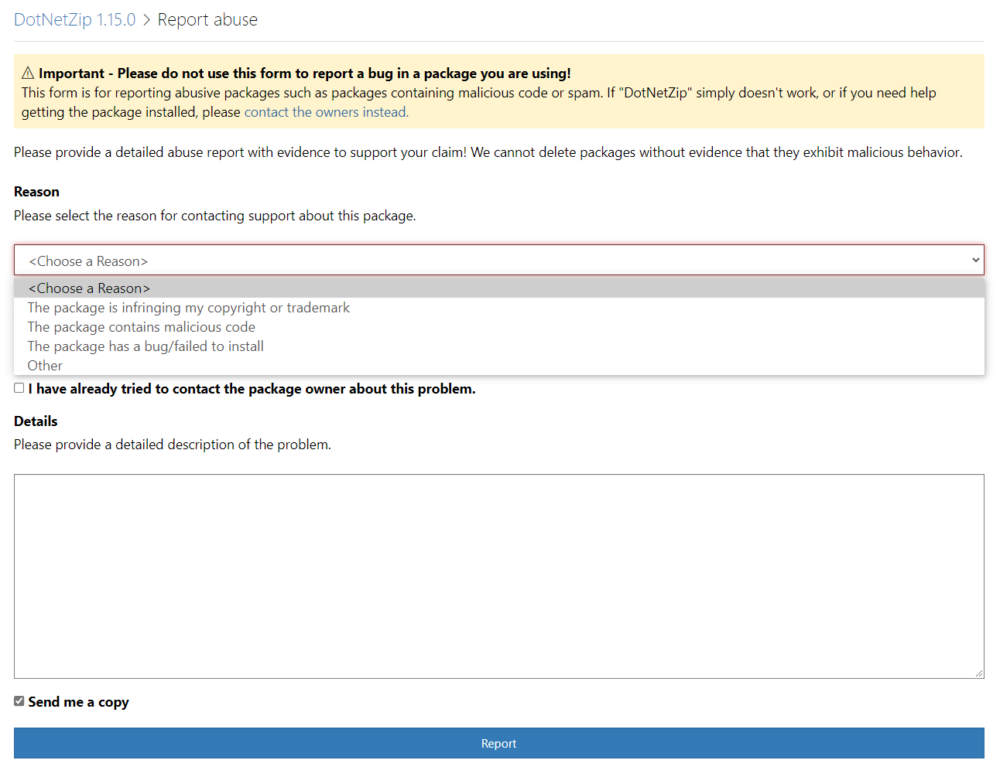

# NuGet.Org Reporting Form Changes for Online Safety

- Author name [Drew Gillies](https://github.com/drewgillies) (@drewgillies)
- Start Date 2021-05-24
- GitHub Issue https://github.com/nuget/nugetgallery/issues/8462
- Status: Implemented

## Summary

In order to provide adequate access to reporting tools for our customers in the event of a breach of online safety, we need to update our reporting form. It will cover a number of new categories and provide additional information per our online safety policies.

## Existing Form

## Alteration: New reasons in dropdown
### Existing, with form adjustments based on choice:
- _**The package is infringing my copyright or trademark**_
    - _Additional text for **Details** field:_ If you are reporting...
    - _Additional text below **Details** field for **Good Faith Belief**, **Authority to Act**, **512(f) Acknowledgement**
    - Additional field: **Signature**
- _**The package contains malicious code**_
    - No form adjustments
- _**The package has a bug/failed to install**_
    - _Additional test displayed about **Details** field:_ Unfortunately we cannot provide support for bugs in NuGet Packages. Please contact owner(s) for assistance.
    - _All other fields and submit button removed_
- _**Other**_

### Reasons and form adjustments to be added:
- _**Child sexual exploitation or abuse**_
    - No new fields
    - _Additional text above **Details** field:_ Note: Please complete this form and submit it so we can proceed with an appropriate response regarding the NuGet package (e.g. removing it). In addition, please proceed to https://report.cybertip.org/ to report the matter in more detail.
- _**Terrorism or violent extremism**_
    - No new fields
    - _Additional text above **Details** field:_ Note: Please complete this form and submit it so we can proceed with an appropriate response regarding the NuGet package (e.g. removing it). In addition, please proceed to https://www.microsoft.com/en-au/concern/terroristcontent to report the matter in more detail.
- _**This package contains hate speech**_
    - No form adjustments
- _**This package contains content related to imminent harm**_
    - No new fields
    - _Additional text above **Details** field:_ Note: please ensure when reporting this type of abuse that you've considered whether the following are present:
        - A targeted person or group (including self)
        - An identified actor--i.e. person intending to commit the offense
        - Details of the threat
        - Time and/or place where the act will be carried out
- _**The package contains non-consensual intimate imagery (i.e. "revenge porn")**_
    - No new fields
    - _Additional text above **Details** field:_ Note: Please complete this form and submit it so we can proceed with an appropriate response regarding the NuGet package (e.g. removing it). In addition, please proceed to https://www.microsoft.com/en-us/concern/revengeporn to report the matter in more detail.
- _**Other nudity or pornography (not "revenge porn")**_
    - No form adjustments

### Technical Details
- The categories in the dropdown map to `[dbo].[Issues].[Reason]` in the support requrest database and are stored as text - no adjustments required to tables to support the new reasons.
- There are no new fields required to support the new reasons, so we shouldn't see any backend adjustments there either--these have process implications only.
- [This enum](https://github.com/NuGet/NuGetGallery/blob/c11f41be85390ec653dc117990e4975a27412e41/src/NuGetGallery.Services/Models/ReportPackageReason.cs#L1) will need to be extended to cover the new reasons, and its new entries propagated throughout code.

## Alteration: Include a link to the NuGet Terms of Use
- Ensure we have a prominently displayed link on the Report Abuse form to the [Terms of Use](https://www.nuget.org/policies/Terms)
    - _Add this text to the start of the the "Please provide a detailed abuse report..." paragraph:_ If our [Terms of Use](https://www.nuget.org/policies/Terms) have been violated by this package, please provide a detailed abuse report... 

## Open questions
- We may need to include a new reason for security vulnerability reporting, which will remove all fields and redirect the customer to a page external to this app for reporting them. Investigation pending.
- We may remove the reporting of DMCA issues, leaving the reason (this package is infringing...) intact but removing all fields and referring customer to an external page. Investigation pending.