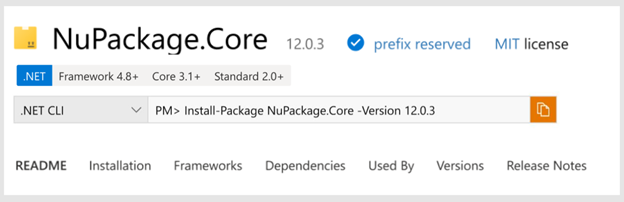

# Display Target Framework Info on NuGet.org
- Author Name: Jiachen Jiang (@jiachenjiang_)
- Start Date: 2021-05-24
- GitHub Issue: () GitHub PR ()

### Description: What is it?
When a developer opens the package details page or tab on NuGet.org or NuGet tooling, they will see what frameworks the package can support (target frameworks, or TFMs) in two places.
-	Badges in the header, which show basic target framework information at a glance
-	Dropdown/tab that shows all supported target framework for the current version 

### Problem: What problem is this solving?
Developers cannot use the package details page to determine what frameworks a NuGet package can support. In 2021, we live in a world where there are three evolutions of .NET coexisting on NuGet; .NET Framework, .NET Core, and .NET 5. 
Developers should be able to determine whether a package works for their project without having to first download it or rely on the author’s documentation.

### Why: How do we know this is a real problem and worth solving?
Finding a package that is compatible with your project is a challenge for the average developer in the .NET ecosystem. Over 21% of developers fail to install a package today. One of the top NuGet errors issued in telemetry is NU1202, which shows that we allow developers to install packages that are not compatible with their project or solution’s target framework.

### Success: How do we know if we’ve solved this problem? 
- Conducting user studies with new .NET developers
- By gauging excitement/disappointment after blogging about this feature & analyzing sentiment on Twitter/GitHub/DevCom/etc.
  
### Audience: Who are we building for?
We are building this for the .NET developer who is browsing & making decisions about including a NuGet package into their project based on target framework & supported platform criteria. 

More specifically, we are building this for the new .NET developer who may not be familiar with TFMs and their usage. They would benefit from simplicity/clarity of information and links to additional resources.

### What: What does this look like in the product?

#### Badges

**Requirements**
- Will show
  - net
  - netcore
  - netstandard
- Change .NET to 'Frameworks' 
  - does not conflict with branding
- If the package does not have any of the above frameworks, do not show badge
    - This is fine because the badges are currently on the package details page, so users can always access the Frameworks tab to understand why
    - Once we port to search page, we can consider visually showing an explanation why there are no badges

**Non-Requirements**
- Badges on Search Page
  - More – link to Framework tab on Package Details page
  - Asked for and makes sense, but right now we are limited to Package Details page
  - In addition, users expect badges on search page at same time as filtering
  - Our telemetry about usage on Package Details will guide our next steps
- All other supported TFMs – those will be shown in the dropdown/tab
- Breaking apart net* into netcore and netstandard
  - Requires additional mapping work that might not be necessary
- Text-heavy presentation
- Filters

#### Dropdown/Tab

**Requirements**
- lowest .NET frameworks
  - Description that explains compatibility with “following and later”
    - Not “and higher”, feedback from design
    - We can assume no gaps in compatibility
- all other TFMs
  - not immediately visible, hidden behind 'See more' 
  - Users must be able to tell that clicking on the link will lead them to these uncommon frameworks
  -  There might be gaps in compatibility so versions should be listed (example below, ignore the .NET frameworks) 
  
-	If the package is a .NET tool, template, or other kind of project type, the dropdown should display a message explaining that no frameworks can be found because of the type, not because there really are no supported frameworks
  - Right now, a similar dropdown (dependencies) just shows that there are no dependencies, which is confusing to users unfamiliar with other package types
- Emphasize vertical orientation instead of horizontal
    - For easy port to mobile view

**Non-Requirements**

-	Detailed package type work
    - Based on the type, the location of dependencies and frameworks (or even if it makes sense for the package to have them) differs
    - Right now we will show a message 
    - In the future we can do design work that better informs users of the differences/nuances of package types
-	TFM information for all versions
    - Was asked by customers, but makes more sense to show TFM for the current version since customers can look at different versions of the package
-	Listing out the versions for .NET TFMs
    - Implies that there are gaps in compatibility
    - Nikolche and Kat confirmed that there are no edge cases that would break the usage of ‘+’ or (or higher) 
    - Lots of information all at once
-	Version range syntax
    - Looks really mathematical and not easy to read (see right)

