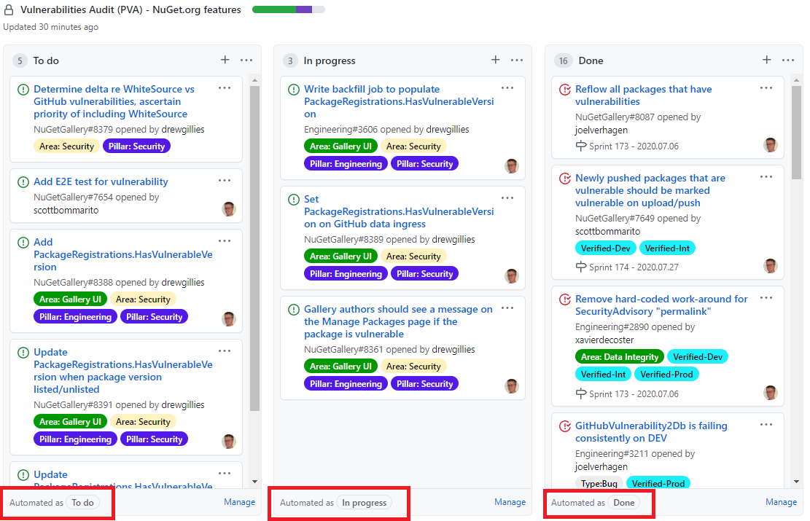
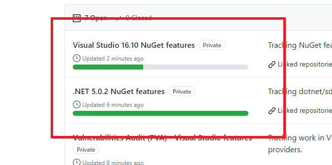

- Status: Implemented

# Using GitHub Project Boards for Customer Visibility and Tracking

Our project boards will need to be created and accessed at the organizational level, not in any one repo (i.e. not in Home), because this is a restriction on project boards--if they're in a repo, they will be locked only to issues from that repo. Here's where ours will live: [https://github.com/orgs/NuGet/projects](https://github.com/orgs/NuGet/projects)

We can use a simple or extended kanban column sets with automations (these are simply a template choice when a board is created), as we can see used in projects in other organizations:
- https://github.com/dotnet/msbuild/projects
- https://github.com/dotnet/roslyn/projects

...and there's nothing stopping us from a complete rework of columns for any given project if that's helpful. Let's keep in mind simplicity where we can, and kanban columns are a pretty well-known approach. Here's a very simple example with automations, and additional status columns could be added if useful:

Automations can extend to reviewing columns as well, e.g.:

## A project per feature area
Because issues can belong to multiple projects, and because automation in project boards will cause issues to move through various kanban columns, the overhead is low in tracking them separate locations.

## Release Tracking
We can track releases in projects too, adding issues to release that we intend to target. 

## Epics, Wikis and Specs
Our epics will continue to be our landing points for customers. In the case of PVA, it's [here](https://github.com/NuGet/Home/issues/8087) and will have links to project boards. Wikis can be linked to from epics also.

Specs can continue to accumulate in the Home repo's [designs](https://github.com/NuGet/Home/tree/dev/designs) folder, and we should ensure that they are linked to by their respoective issues. This ties their discoverability to their relevance to a customer. If we wish to show a spec in a project board, we can add cards which display the link.

