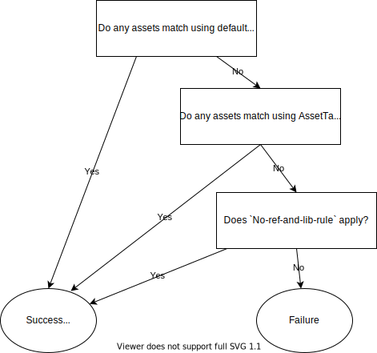

# Dependencies resolution for packages selected with AssetTargetFallback

- Author Name [Nikolche Kolev](https://github.com/nkolev92)
- GitHub Issue [5957](https://github.com/NuGet/Home/issues/5957) - Project A referencing package B via AssetTargetFallback, doesn't use that same AssetTargetFallback to pull B's dependency package C
- GitHub PR [4372](https://github.com/NuGet/NuGet.Client/pull/4372)

## Summary

This is a write-up for the fix of the long standing bug where packages resolved with AssetTargetFallback do not get their dependencies.

## Motivation

While .NET (Core) & .NET Framework are not fully compatible, often times packages written for .NET Framework only can be safely used on .NET (Core) as well.
AssetTargetFallback is the mechanism by which .NET (Core) projects can reference .NET Framework packages and projects.
Unfortunately due to a bug in the implementation, the transitive dependencies of packages and projects were not included. This could easily lead to runtime failures.

## Explanation

### Functional explanation

There is no change that package authors or consumers need to make.
This should be a change that enables more of their scenarios and removes the need to use workarounds for this problem.

### Technical explanation

To best understand the motivation behind the proposal here, one needs to understand the history of fallback frameworks in NuGet and how they work.

#### NuGet fallback frameworks, evolution to AssetTargetFallback

For the most complete background on AssetTargetFallback, refer to the original [design](#https://github.com/NuGet/Home/wiki/Enable-.NET-Core-2.0-projects-to-work-with-.NET-Framework-4.6.1-compatible-packages). The relevant information on AssetTargetFallback was duplicated from that spec.
The basic idea is that when a package is completely incompatible with the given project framework, we will attempt to select the best matching assets with a fallback framework.

AssetTargetFallback evaluates all assets groups for the project target framework before moving onto the fallback.
If it does not find compatible assets, it only then moves to the fallback frameworks. In that case, **only** the fallback frameworks will be used.

#### How does AssetTargetFallback work

Terms:

- `default-tfm-match`: Mechanism to find the best match based on the target framework of the project.
- `AssetTargetFallback`: Mechanism to find matching assets based on the targets specified using `AssetTargetFallback`.
- `No-ref-and-lib-rule`: If a package does not have a ref and lib asset groups (folders), then the package is deemed compatible even when there is no assets pulled in to the project by NuGet. This is to support meta-packages that have only dependencies and no assets.



**How does it behave for different package structures?**

For a .NET Standard 2.0 project, following is a table that explains which assets are pulled in, based on different approaches i.e. `default-tfm-match only` without PTF/ATF, with `AssetTargetFallback` ( for net461).

_Note: **NE** implies the corresponding mechanism was **Not Evaluated** and hence the assets pulled in by NuGet is due to default-tfm-match !_

| Package structure  | `default-tfm-match only` (netstandard2.0) | `AssetTargetFallback`(net461)  |
|---|---|---|
| `build\foo.targets`  | `build\foo.targets`  | **NE** `build\foo.targets`  |
| `build\netstandard1.0\foo.targets`  | `build\netstandard1.0\foo.targets`  | **NE** `build\netstandard1.0\foo.targets` |
| `build\net461\foo.targets`  | The package gets installed because of `No-ref-and-lib-rule` but no assets gets pulled in | `build\net461\foo.targets` |
| `build\netstandard2.0\foo.targets` `build\net461\bar.targets` `lib\netstandard2.0\libfoo.dll` `ref\net461\libbar.dll` | `build\netstandard2.0\foo.targets` `lib\netstandard2.0\libfoo.dll`  |
| `build\net461\bar.targets` `ref\net461\libbar.dll` | No matching asset; Package fails to install | `build\net461\bar.targets` `ref\net461\libbar.dll` | `build\net461\bar.targets` `ref\net461\libbar.dll` |
| `build\bar.targets` `ref\net461\libbar.dll` | `build\bar.targets` | **NE** `build\bar.targets` |

The caveat in the `AssetTargetFallback` implementation is that it is not considered when resolving the dependencies.
`PackageTargetFallback` did support this, but it also did not make the promise of global resolution that `AssetTargetFallback` does.

#### NuGet restore behavior

When restoring a project with PackageReference, NuGet firstly constructs the full dependency graph for the project and then only later do the asset selection & build the assets file.
The dependency resolution is target framework aware because it needs to discover the dependencies for the packages it restores.
Specifically say we have the following project:

```xml
    ...
    <PropertyGroup>
        <PackageId>A</PackageId>
        <TargetFrameworks>net472;netstandard2.0</TargetFrameworks>
    ...
    <ItemGroup>
        <PackageReference Include="X" Version="1.0.0" />
    ...
```

NuGet will try to resolve the best matching version of `X` from the sources, which in this case it's `1.0.0`.
NuGet then reads this package's nuspec and looks at the dependencies element.

```xml
    <dependencies>
      <group targetFramework=".NETFramework4.6.1">
        <dependency id="Y" version="2.0.0" exclude="Build,Analyzers" />
      </group>
      <group targetFramework=".NETStandard1.6">
        <dependency id="Z" version="3.0.0" exclude="Build,Analyzers" />
      </group>
    </dependencies>
```

For each framework it tries to resolve the best matching dependencies group. For example for `net472` that is `net461`. NuGet then gets package `Y` and does the same exercise.
Along the way NuGet will detect and resolve conflicts for package `Y`, before settling on an exact version.
The `netstandard2.0` gets the same exercise, in this case package `Z` is one that is used.
When NuGet completes the dependency resolution, it has a list of packages that it needs to install in the global packages folder. For example:

```text
net472:
    X 1.0.0
    Y 2.0.0
    W 3.0.0

netstandard2.0:
    X 1.0.0
    Z 3.0.1
    W 2.1.0
```

Lastly NuGet goes through each package for each framework does the asset selection and if needed applies `PackageTargetFallback` or `AssetTargetFallback`.

### The root cause of the problem - NuGet AssetTargetFallback and dependencies

The problem illustrated in the above issue happens due to the fact that NuGet does not consider `AssetTargetFallback` when selecting the dependencies group.

Here's a simple example using one of NuGet's libraries.

```xml
    ...
    <PropertyGroup>
        <TargetFramework>netcoreapp3.0</TargetFramework>
        <AssetTargetFallback>net461;net48</AssetTargetFallback> <!-- This is usually declared in the SDK, not the project file-->
    ...
    <ItemGroup>
        <PackageReference Include="NuGet.PackageManagement" Version="5.1.0" />
    ...
```

NuGet.PackageManagement is a package that contains only `net472` assets.

The directory structure of this package is:

```text
NuGet.PackageManagement.nuspec
lib
    net472
        NuGet.PackageManagement.dll
```

The dependencies section looks like below:

```xml
    <dependencies>
      <group targetFramework=".NETFramework4.7.2">
        <dependency id="NuGet.Commands" version="5.2.0" exclude="Build,Analyzers" />
        <dependency id="NuGet.Resolver" version="5.2.0" exclude="Build,Analyzers" />
        <dependency id="Microsoft.Web.Xdt" version="2.1.2" exclude="Build,Analyzers" />
      </group>
    </dependencies>
```

At restore time, NuGet constructs the dependency graph. It looks for a matching dependencies group for `netcoreapp3.0` and finds nothing. This means that the graph for this is like below with 3.0.100 P5:

```json
  "targets": {
    ".NETCoreApp,Version=v3.0": {
      "Microsoft.NETCore.Platforms/3.0.0-preview5.19224.8": {
        "type": "package",
        "compile": {
          "lib/netstandard1.0/_._": {}
        },
        "runtime": {
          "lib/netstandard1.0/_._": {}
        }
      },
      "NuGet.PackageManagement/5.1.0": {
        "type": "package",
        "compile": {
          "lib/net472/NuGet.PackageManagement.dll": {}
        },
        "runtime": {
          "lib/net472/NuGet.PackageManagement.dll": {}
        }
      }
    }
  },
```

Restore does not fail, but there will be runtime failure whenever the NuGet.PackageManagement.dll calls into either of its dependencies.

#### Options

There are 3 approaches NuGet can take:

- Synchronized - Dependencies - Dependencies are the source of truth. If the dependencies are selected with AssetTargetFallback, so will the package assets.

- Synchronized - Package assets - Package assets are the source of truth. If the package assets are selected with AssetTargetFallback, so will the dependencies.

- Independent - Both package assets and dependencies are going to be selected independently.

#### Behavior matrix

Installing the below package to a netcoreapp3.0 project:

Package A:

```text
lib/net472/a.dll
lib/netstandard2.0/a.dll
```

```xml
    <dependencies>
      <group targetFramework=".NETFramework4.7.2">
        <dependency id="X" version="2.1.2" exclude="Build,Analyzers" />
      </group>
    </dependencies>
```

Package B:

```text
lib/net472/b.dll
```

```xml
    <dependencies>
      <group targetFramework=".NETFramework4.7.2">
        <dependency id="Y" version="2.1.2" exclude="Build,Analyzers" />
      </group>
      <group targetFramework=".NETStandard2.0">
        <dependency id="Z" version="1.0.0" exclude="Build,Analyzers" />
      </group>
    </dependencies>
```

| | No Change | Synchronized - Dependencies | Synchronized - Assets | Not synchronized |
|-|-|-|-|-|
| A | No dependencies & lib/netstandard2.0 | X & lib/net472 | No dependencies & lib/netstandard2.0 (or fail?) | X & lib/netstandard2.0 |
| B | Z & lib/net472 | fails installing | Y & lib/net472 | Z & lib/net472 |

### Proposed solution - Independent selection of dependencies and package assets with AssetTargetFallback

When walking the dependencies, NuGet will consider AssetTargetFallback if no dependencies can be found, similarly to what's being done for package assets today, or what was supposed to be done for PackageTargetFallback.

When selecting package assets and dependencies indepently, we can choose what information we feel relevant to communicate to customers.

Here's the matrix of scenarios we need to consider.
| Scenario | Warnings |
|-|-|
| No ATF for package assets, no ATF for dependencies | None |
| ATF for package assets, no ATF for dependencies | The current ATF warning raised |
| ATF for package assets, ATF for dependencies | The current ATF warning raised. |
| No ATF for package assets, ATF for dependencies | No warning |

NuGet will not warn when AssetTargetFallback is used for dependencies. In this special case, effectively what would happen is that we would download more assemblies. The potential runtime errors are not made better or worse by this selection.

To better understand the reason behind the proposal, let's look at the packages on nuget.org in 2019.

### Data analysis - Are packages authored consistently?

This is an analysis of the packages on nuget.org in 2019, while not current, this data is still relevant.
This analysis was done on the latest versions of packages.

| | Total Count | Total percentage |
|-|-|-|
| (1) Total Packages | 2186044 | 100% |
| (2) Suspected Library Packages | 1869432 | 85.5% |
| (3) .NET Framework packages that do not have cross platform support | 1271227 | 58.2% |
| (4) Packages with cross platform support | 417079 | 19.1% |
| (5) Packages with target framework inconsistencies in compile/dependency groups | 68723 | 3.1% |
| (6) Packages with target framework inconsistencies in compile/dependency groups, but any dependency group | 32022 | 1.46% |
| (7) Packages with target framework inconsistencies in compile/dependency groups, no any dependency group | 36701 | 1.67% |
| (8) Packages with target framework inconsistencies but might work due to compatibility between the missing frameworks (compile -> dependency groups) | 21954  | 1.00% |
| (9) Packages with target framework inconsistencies but might work due to compatibility between the missing frameworks (dependency groups -> compile) | 16133 | 0.74% |
| (10) Packages with target framework inconsistencies that will never match consistently for compile & dependency groups | 14748 | 0.67% |
| (11) Unique package Ids | 202942 | 100% |
| (12) Unique package ids with target framework inconsistencies in compile/dependency groups without any dependency group | 4102 | 2.02% |
| (13) Unique package ids with target framework inconsistencies that will never match consistently for compile & dependency groups (compile -> dependency groups) | 2205 | 1.08% |
| (14) Packages with target framework inconsistencies that will never match consistently for compile & dependency groups where the bad match is .NET Framework (compile -> dependency groups) | 6241 | 0.29% |
| (15) Unique package ids with target framework inconsistencies that will never match consistently for compile & dependency groups (dependency groups -> compile) | 1141| 0.57% |
| (16) Packages with target framework inconsistencies that will never match consistently for compile & dependency groups where the bad match is .NET Framework (dependency groups -> compile) | 11176 | 0.51% |

- 58.2% (3) of the total packages are .NET Framework but not cross platform. This is the set of packages that require AssetTargetFallback to enable them to be used easily on .NET Core.

- 3.1% (5) of all (really only 85% can call into this) the packages have inconsistencies in the target frameworks defined in the compile and dependency groups.
These packages can be considered not well authored and are specifically affected by the direction we choose.
Pack warning NU5128 informs package authors that their package has this inconsistency, and the percentage of packages with this inconsistency should decrease as authors adopt the warning's suggestions.

- Interpolating the numbers from (2), (4) and (5) we can predict that about 2% of packages have potential mismatch in the package assets supported & dependency group target frameworks.
This effectively means that about 64% of packages that could be used with AssetTargetFallback will work with any approach.

- Interpolating (6) with (2), and (4) we can assume that further 1% of packages are likely to work as long with the package assets are selected first, either independently of dependencies or using them as the source of truth.

- Finally that also suggests that 1% of the packages have definitive inconsistencies that are going to work with independent asset selection only.

- Combining all of these numbers we can come to the following:

- 56.7% of all packages (58% ATF impacted) will install with if we use the dependency group as the source of truth. While does feel correct, is a breaking change for about 1% of all total packages.
- 57% of all packages (58% ATF impacted) will install as long with the package assets are selected first, either independently of dependencies or using them as the source of truth.
- 58% of all packages (all 58% ATF impacted) are more likely if the dependencies and package assets are selected independently.

- Looking at the download numbers for the packages with incompatibilities with no any dependency group (7), 700 have have more than 1M package downloads, about 3000 have more than 10k downloads. Of the ones that have more than 1M downloads, almost all of those are `System.*` or `Microsoft.*`.

## Drawbacks

AssetTargetFallback aside, in NuGet, currently the selection of dependencies and package assets is done independently.
Normally, the dependency groups would perfectly match what the rest of the package supports. However, this assumes that packages are authored consistently.

Take the below package for example in a net472 project.

```text
lib/net472/b.dll
lib/net462/b.dll
```

```xml
    <dependencies>
      <group targetFramework=".NETFramework4.6.2">
        <dependency id="X" version="2.1.2" exclude="Build,Analyzers" />
      </group>
    </dependencies>
```

We would select the `net472` asset and package `X`.

There a number of issues where this behavior has been observed.

- <https://github.com/NuGet/Home/issues/6522>
- <https://github.com/NuGet/Home/issues/5871>
- <https://github.com/NuGet/Home/issues/7263>
- <https://github.com/NuGet/Home/issues/2315>
- <https://github.com/NuGet/Home/issues/1661>

The possibility for inconsistency is multiplied with AssetTargetFallback continuing the independent selection.
However, in practice, the packages that would lead to this type of inconsistency are misauthored.

## Rationale and alternatives

### Do Nothing

The fallback target frameworks are a best effort compatibility mode. There is no guarantee that the assets selected with the fallback. It is reasonable that the consumers need to go the extra mile to enable this scenario.
The road to success here is evolving the package authoring ecosystem to add support for cross platform scenarios in their packages where appropriate.
There have been important but not a significant number of issues reported related to this.

**Risks**

- Evolving the package eco system will be a slow transition. Many authors might not be willing to add support for cross platform scenarios.
Often times these packages might not be maintained. Other times, the consumers take dependencies on such packages for niche scenarios, where the package is guaranteed to work correctly.
- While not the most pressing issue right now, with more scenarios enabled on .NET Core 3.0, the number of customers hitting this is expected to increase.
- The workaround can be laborious if the package graph is large and all of the packages there are .NET Framework based.

### Synchronize the selection - Dependencies are the source of truth

The idea here is we extend the promise of selecting assets globally to the dependencies group as well.
In the well authored package scenario, where each framework supported by the assets has it's own dedicated dependencies group, the source of truth is irrelevant.
For example the NuGet.PackageManagement scenario will easily work.
The challenge is when the answers to these questions is different.

**Risks**

We would not consider these packages well authored today, but that has not always been our guidance. Furthermore many packages are authored with a nuspec, where not obvious issues like these can easily happen.

Say we have `netcoreapp3.0` project and a package like below:

```text
lib/net472/a.dll
lib/netstandard2.0/a.dll
```

```xml
    <dependencies>
      <group targetFramework=".NETFramework4.7.2">
        <dependency id="X" version="2.1.2" exclude="Build,Analyzers" />
      </group>
    </dependencies>
```

The package author here might have wanted to suggest that their package has no dependencies for `netstandard2.0`, but NuGet does not interpret it such.
Today if you pack a project that multi targets, NuGet will put an empty dependency group for the target frameworks that do not have any package references.

So with dependencies as the source of truth, this would lead to NuGet selecting:
> lib/net472/a.dll
even though the `netstandard2.0` is clearly the more compatible assembly.

This potential fix, would also be a breaking change for some customers.

### Synchronize the selection - package assets are the source of truth

Similar to the earlier fix, the only difference here is that any conflicts are to be resolved by the package assets selection result.
If we look at the above example with this solution in mind, it preserves backwards compatibility with the current approach.

The `netstandard2.0` assembly will be selected and no dependencies will be downloaded.

**Risks**

- The biggest risk here is the implementation complexity. The dependency resolution decisions are made prior to the package installation. At dependency resolution time only the nuspec and the dependency information is used. This approach would require us to download the package, and run the full assets selection before making decisions about the dependencies.
While still possible, this approach would be a significant undertaking.

- It is notable that not every package node NuGet processes gets selected. Meaning if there are multiple `Newtonsoft.Json` references, we currently read the dependencies for all of them and select assets for one. With this change we would do the assets selection for all of them in addition to reading the dependencies.

#### AssetTargetFallback and warnings

At this point, we're not going to raise any warnings if AssetTargetFallback was used to select a package dependency. 

- We can raise the same warning as the usual ATF case. Similar logic applies as to the no warning scenario. In this case we'd be louder about a potential error.
- Raise a different warning specifically targeting this scenario. Specifically address this particular scenario. Similarly to earlier, the runtime experience will not have been affected by this selection.

## Prior Art

## Unresolved Questions

## Future Possibilities

This is expected to be the last time we make changes to the AssetTargetFallback feature.
