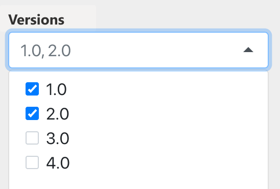
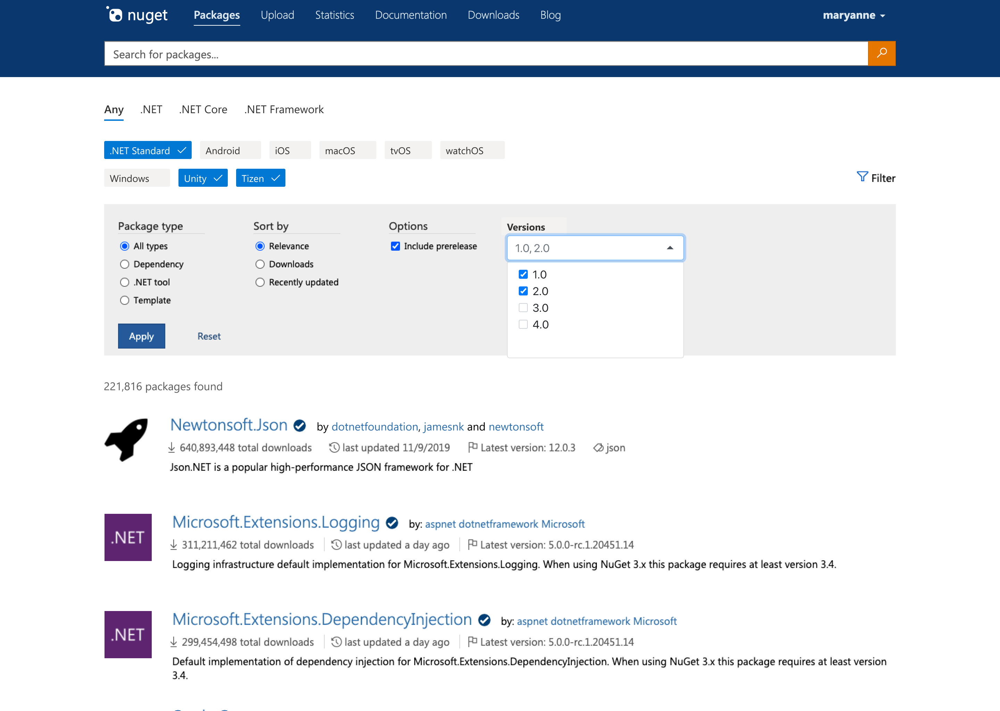
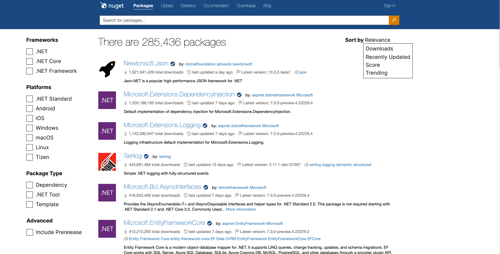
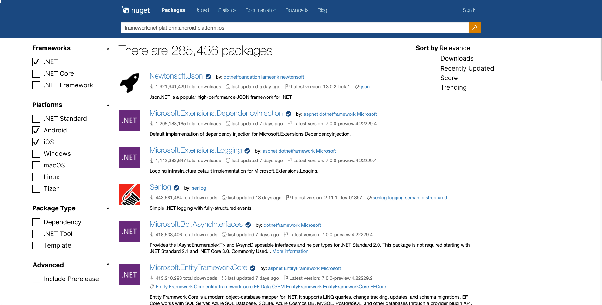
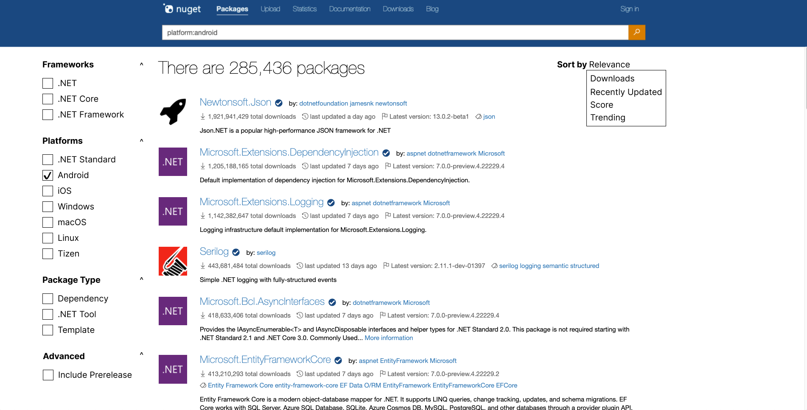

# Target Framework and Platform Filters

- [Jon Douglas](https://github.com/JonDouglas)
- Start Date (2021-11-09)
- [Package discovery: Show and search by TFM/package-compatibility #3098](https://github.com/NuGet/NuGetGallery/issues/3098)

## Summary

<!-- One-paragraph description of the proposal. -->
When a developer is browsing for a NuGet package to include in their project, they can filter packages based on generations of .NET including the target framework & supported platforms that package targets.

## Motivation

<!-- Why are we doing this? What pain points does this solve? What is the expected outcome? -->
Finding a package that is compatible with your project is a daily challenge for the average developer in the .NET ecosystem. Over 21% of developers fail to install a package today because of an incompatibility; it's one of NuGet's top errors known as `NU1202`. On top of it being one of the biggest error codes we see, it is also [the number #1 request on the `NuGetGallery` repository](https://github.com/NuGet/NuGetGallery/issues/3098) for good reason. It should be straight-forward for a developer to separate the generation of .NET they are currently targeting and find packages that are supported on the platforms that the respective generation supports.

## Explanation

### Functional explanation

<!-- Explain the proposal as if it were already implemented and you're teaching it to another person. -->
<!-- Introduce new concepts, functional designs with real life examples, and low-fidelity mockups or  pseudocode to show how this proposal would look. -->
When browsing for packages on NuGet.org, a developer will be able to filter packages based on compatibility filters. These filters will include:

1. The **generation of .NET** such as .NET Framework, .NET Core, .NET (5, 6, and later), and Any.
2. The **supported platforms** for the generation such as .NET Standard, Windows, macOS, Linux, Android, iOS, and more.
3. The **version number** of the generation being used such as .NET 5, .NET Core 3.1, .NET Framework 4.8, and more.

This proposal only accounts for the **majority of packages on NuGet.org**. There are many unique TFMs in the .NET ecosystem, but for the sake of creating a concept that will scale with the future of .NET, many unsupported & low usage TFMs are not considered. Thus this proposal only focuses on the [most common target frameworks](https://docs.microsoft.com/dotnet/standard/frameworks#latest-versions) & omits considering TFMs with fewer than 5,000 packages.

#### Generations of .NET

There are many generations of .NET. For the sake of this proposal, we will focus on defining the three major generations:

- .NET Framework:
  - `net, net11, net20, net35, net40, net403, net45, net451, net452, net46, net461, net462, net463, net47, net471, net472, net48`
- .NET Core:
  - `netcoreapp1.0, netcoreapp1.1, netcoreapp2.0, netcoreapp2.1, netcoreapp2.2, netcoreapp3.0, netcoreapp3.1`
- .NET:
  - `net5.0, net6.0`
- Any:
  - .NET Framework, .NET Core, .NET


#### Supported Platforms

With .NET Core introducing support for cross-platform scenarios, we will define the following as supported platforms:

- .NET Standard:
  - `netstandard, netstandard1.0, netstandard1.1, netstandard1.2, netstandard1.3, netstandard1.4, netstandard1.5, netstandard1.6, netstandard2.0, netstandard2.1`
- Windows:
  - .NET Framework
  - .NET Core
  - .NET 5+
    - `net5.0-windows, net6.0-windows`
  - .NET Standard
- macOS:
  - .NET Core
  - .NET 5+
    - `net6.0-macos`
  - .NET Standard
- Linux:
  - .NET Core
  - .NET 5+
  - .NET Standard
- Android:
  - .NET 6+
    - `net6.0-android`
  - .NET Standard
- iOS:
  - .NET 6+
    - `net6.0-ios`
  - .NET Standard
- macCatalyst:
  - .NET 6+
    - `net6.0-maccatalyst`
  - .NET Standard
- tvOS:
  - .NET 6+
    - `net6.0-tvos`
  - .NET Standard
- Tizen:
  - .NET 6+
    - `net6.0-tizen`
  - .NET Standard

**Note:** .NET Standard is considered a special case that supports majority of these platforms depending on the [version of .NET standard](https://docs.microsoft.com/dotnet/standard/net-standard#net-implementation-support). If the framework precedence of a target framework supports .NET Standard, it's respective versions supported will be implicitly included.


#### Version Numbers

There are many unique version numbers for all generations of .NET & supported platforms. The filtering experience should be smart enough to create a version list based on the current selection. Here are a few scenarios:

- User selects `Any` for the .NET generation.
  - Version filter populates all known versions for .NET Framework, .NET Core, .NET, and .NET Standard.
    - 1.0, 1.1, 1.2, 1.3, 1.4, 1.5, 1.6, 2.0, 2.1, 2.2, 3.0, 3.1, 3.5, 4.0, 4.5, 4.5.1, 4.5.2, 4.6, 4.6.1, 4.6.2, 4.7, 4.7.1, 4.7.2, 4.8, 5.0, 6.0
- User selects `Any` for the .NET generation and `Windows` for the supported platform.
  - Version filter populates all known version for .NET Framework, .NET Core, .NET, and .NET Standard.
  - 1.0, 1.1, 1.2, 1.3, 1.4, 1.5, 1.6, 2.0, 2.1, 2.2, 3.0, 3.1, 3.5, 4.0, 4.5, 4.5.1, 4.5.2, 4.6, 4.6.1, 4.6.2, 4.7, 4.7.1, 4.7.2, 4.8, 5.0, 6.0
- User selects `Any` for the .NET generation and `Android` for the supported platform.
  - Version filter populates all known version for .NET and .NET Standard.
    - 1.0, 1.1, 1.2, 1.3, 1.4, 1.5, 1.6, 2.0, 2.1, 6.0
- User selects `.NET Framework` for the .NET generation.
  - Version filter populates all known version for .NET Framework and .NET Standard.
    - 1.0, 1.1, 1.2, 1.3, 1.4, 1.5, 1.6, 2.0, 2.1, 3.5, 4.0, 4.5, 4.5.1, 4.5.2, 4.6, 4.6.1, 4.6.2, 4.7, 4.7.1, 4.7.2, 4.8
- User selects `.NET Framework` for the .NET generation and `Windows` for the supported platform.
  - Version filter populates all known version for .NET Framework and .NET Standard.
    - 1.0, 1.1, 1.2, 1.3, 1.4, 1.5, 1.6, 2.0, 2.1, 3.5, 4.0, 4.5, 4.5.1, 4.5.2, 4.6, 4.6.1, 4.6.2, 4.7, 4.7.1, 4.7.2, 4.8
- User selects `.NET Core` for the .NET generation and `macOS` for the supported platform.
  - Version filter populates all known version for .NET Framework and .NET Standard.
    - 1.0, 1.1, 1.2, 1.3, 1.4, 1.5, 1.6, 2.0, 2.1, 2.2, 3.0, 3.1

For further scenarios, see the [framework precedence](https://nugettools.azurewebsites.net/6.0.0-preview.3/framework-precedence) tool to understand how the version matrix would be calculated.



**Note:** The label should best represent the ".NET" version. Thus the label name may change from "versions" to "framework versions / .NET versions" or similar.

#### Complete Experience



**Note:** There's opportunity to put a tooltip in the complete experience to help explain what the difference of .NET, .NET Core, .NET Framework is & link to a documentaiton page.

#### Alternate Experience

Instead of filters at the top of the NuGet.org search experience, we can leverage the whitespace on the sides to provide an alternate experience of checkboxes and filter mechanisms that are more consistent with other package managers.



A user selecting checkboxes on the left will autocomplete search syntax in the search bar.



Different search criteria can be combined and added to the search experience depending on the developer's needs.



## Search Syntax (Optional)

Lastly, NuGet should add a protocol in which supports [search syntax](https://docs.microsoft.com/nuget/consume-packages/finding-and-choosing-packages#search-syntax) for frameworks, platforms, and potentially *implementations**.

Here's an ideal `<property>:<term>` for each use-case:

```
framework:net472 framework:net471 framework:net47   # Match the target framework monikers

platform:windows platform:macos platform:linux    # Match the platforms

implementation:netframework implementation:netcore implementation:net  # Match the generation of .NET including both supported frameworks & platforms.
```

- `framework:` - Allows a short-form TFM value to search on.
- `platform:` - Allows a platform value to search on.
- `implementation:` - Allows a generation of .NET to search on (includes all frameworks of the generation).

**Implementations* is the best word to describe a generation of .NET at the time of writing. This can change at anytime.

**Note:** This implementation is pending on technical feasibility. This experience would allow users who know the search syntax to be able to filter within NuGet.org or Visual Studio without having to click through filters.

<!--### Technical explanation-->

<!-- Explain the proposal in sufficient detail with implementation details, interaction models, and clarification of corner cases. -->

## Drawbacks

<!-- Why should we not do this? -->
Not many package managers implement advanced filters or search syntax. .NET has a unique history compared to other ecosystems as it has specific frameworks that run on a subset of platforms until recently going cross-platform in 2016 with the introduction of .NET Core. Furthermore, many developers associate .NET synonymously with .NET Framework, .NET Core, and even .NET 5+. There's a divide of legacy & modern development that needs to be accounted for in these easy-to-use filtering options.

.NET's long history additionally includes includes other projects such as Mono, Xamarin, Silverlight, UAP, Portable Class Libraries (PCL), Windows Store, Micro Framework, Windows Phone, Native (C++), and many more. Given the natural evolution of .NET, many of these projects have a modern equivalent, have low usage in the .NET ecosystem, or are discontinued entirely.

This proposal **does not provide the ability to filter or search by these older TFMs** as mentioned in the explanation above. It may be possible with the search syntax feature, but is not in consideration for the scope of this spec.

## Rationale and alternatives

<!-- Why is this the best design compared to other designs? -->
<!-- What other designs have been considered and why weren't they chosen? -->
<!-- What is the impact of not doing this? -->
The .NET ecosystem currently is divided into two major cohorts: developers using .NET Framework and developers using .NET Core & later(this includes .NET 5+). As newer versions of .NET come out, it is especially important that new & existing developers can filter for what they are looking for while browsing for packages. Whether it's the first job out of college for a .NET developer maintaining a legacy app that targets .NET Framework, or if it's a budding startup wanting to target against the latest .NET SDK, they should be able to easily filter for their job-to-be-done.

### Jobs To Be Done

- James is a desktop developer interested in finding database ORM packages that support the three major desktop OSes: Windows, macOS, and Linux to bring to an architecture review meeting for a new system he is building. He would like to filter database packages that support .NET Core and run on these three platforms.
- Jules is a game developer using the cloud for their game's multiplayer leaderboard services. They would like to filter game backend platform packages that support the latest .NET or include .NET Standard support to write cross-platform code with and can run on Windows, Android, and iOS for the game they are developing.
- Katherine is a fresh college graduate who is supporting an old .NET application at her first job. She would like to filter packages that support .NET Framework 4.8 and run on Windows for a new logging feature she is working on this sprint.

## Prior Art

<!-- What prior art, both good and bad are related to this proposal? -->
<!-- Do other features exist in other ecosystems and what experience have their community had? -->
<!-- What lessons from other communities can we learn from? -->
<!-- Are there any resources that are relevant to this proposal? -->

- [pub.dev](https://pub.dev/) has similar filters on the search page for dart & flutter.
- [pypi](https://pypi.org/) has an extensive filter list of frameworks, OS, and programming languages.
- [debian](https://packages.debian.org/) has filters for release suites and supported architectures.
- [winget](https://docs.microsoft.com/windows/package-manager/winget/search) allows you to filter by a supported app moniker.

## Unresolved Questions

<!-- What parts of the proposal do you expect to resolve before this gets accepted? -->
<!-- What parts of the proposal need to be resolved before the proposal is stabilized? -->
<!-- What related issues would you consider out of scope for this proposal but can be addressed in the future? -->

- Should there be an advanced option to disable .NET Standard from being implicit/on-by-default for more exact matches?
  - Should we consider .NET Standard as a platform in this case or make it more implicit in the filtering?
- Where do we draw the line on precedence for older/out of support TFMs that are still "compatible"?
- Can framework and platforms be mixed in queries?
  - No, it's one framework and multiple platforms for now.
- What benefit to customers would there be to exclude .NET Standard-only libraries from search results?
  - It would allow the ability to search for platform-specific assets that do not have .NET Standard as a fallback.
- Is `implementation` the best word to describe a generation of .NET?
  - Current thinking is that `framework` is still the best word, but it's a bit overloaded with the context of .NET Framework, Target Framework Monikers, and more.

## Future Possibilities

<!-- What future possibilities can you think of that this proposal would help with? -->
- With NuGet.org search syntax supporting frameworks, platforms, and implementations, tooling & .NET open source communities can leverage this to provide browsing & search experiences that match the context of a currently opened solution and it's projects.
- As new platforms become available in future versions of .NET, new filtering & search experiences can be added to help developers targeting those platforms.
- As platforms mature to define a development category such as Cloud, Web, Desktop, Mobile, Gaming, IoT, AI, and more, there will be opportunity to create filters for each of these by using a combination of the filters proposed in this proposal. **For example:**

- With .NET badges & Frameworks tab coming live soon, there is opportunity to revisit adding platform badges to provide a consistent story across details & search and being able to click on any badge & have a populated filter for the next search.