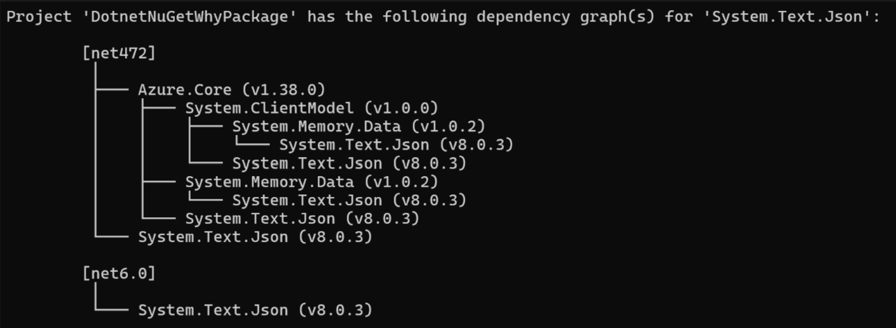
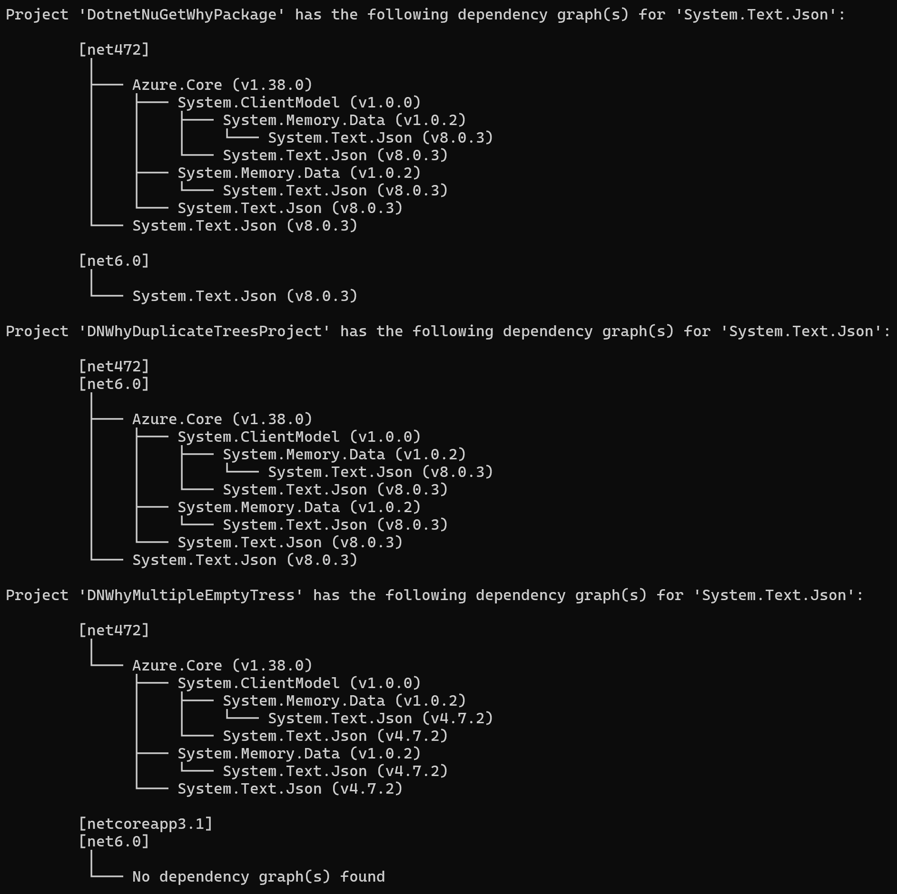
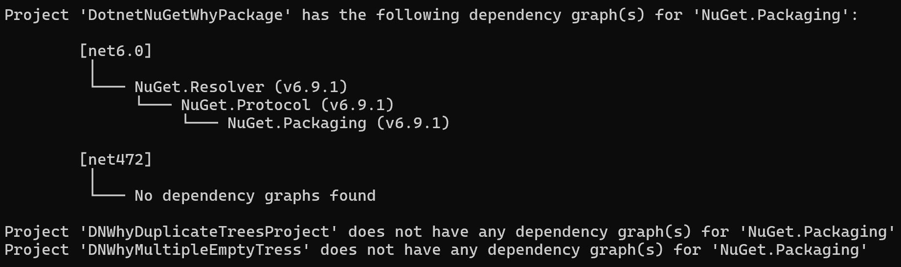

# dotnet nuget why command

- Author: [Kartheek Penagamuri](https://github.com/kartheekp-ms), [Pragnya Pandrate](https://github.com/pragnya17)
- GitHub Issue [11782](https://github.com/NuGet/Home/issues/11782)

## Summary

Currently, there is not a great solution for developers to understand the nature of top-level packages and their transitive dependencies. The solution explorer in Visual Studio does a decent job at allowing a user to dive into each NuGet package & see all transitive dependencies from the top-level dependency.


However, in comparison to Visual Studio, the dotnet CLI does not provide insight into “why” a transitive dependency is listed, although it does list everything that has been resolved as seen below.


## Motivation

A developer should be able to understand where every package in a solution/project originated from. This can help them understand complex dependency chains they may have within their projects. Having this understanding can help a developer promote a transitive dependency quickly & easily to a top-level dependency in case there is a security concern or conflict.

## Explanation

### Functional Explanation

The NuGet restore operation generates a `project.assets.json` file under the `obj` folder for `PackageReference` style project. This file maintains a project's dependency graph. Therefore, this file can be used in order to produce a dependency graph when the `dotnet nuget why` command is called. 

Sample `project.assets.json` file:

```
{
  "version": 3,
  "targets": {
    "net6.0": {
      "Microsoft.CSharp/4.3.0": {
        "type": "package",
        "dependencies": {
          "System.Collections": "4.3.0",
          "System.Diagnostics.Debug": "4.3.0",
          "System.Dynamic.Runtime": "4.3.0",
          "System.Globalization": "4.3.0",
          "System.Linq": "4.3.0",
          "System.Linq.Expressions": "4.3.0",
          "System.ObjectModel": "4.3.0",
          "System.Reflection": "4.3.0",
          "System.Reflection.Extensions": "4.3.0",
          "System.Reflection.Primitives": "4.3.0",
          "System.Reflection.TypeExtensions": "4.3.0",
          "System.Resources.ResourceManager": "4.3.0",
          "System.Runtime": "4.3.0",
          "System.Runtime.Extensions": "4.3.0",
          "System.Runtime.InteropServices": "4.3.0",
          "System.Threading": "4.3.0"
        },
        "compile": {
          ...
          }
        },
        "runtime": {
          ...
        }
      },
      "Microsoft.ML/1.7.1": {
        "type": "package",
        "dependencies": {
          "Microsoft.ML.CpuMath": "1.7.1",
          "Microsoft.ML.DataView": "1.7.1",
          "Newtonsoft.Json": "10.0.3",
          "System.CodeDom": "4.4.0",
          "System.Collections.Immutable": "1.5.0",
          "System.Memory": "4.5.3",
          "System.Reflection.Emit.Lightweight": "4.3.0",
          "System.Threading.Channels": "4.7.1"
        },
        "compile": {
          ...
        },
        "runtime": {
          ...
        },
        "build": {
          ...
        },
        "runtimeTargets": {
          ...
      },
  },
  "libraries": {
    ...
  },
  "projectFileDependencyGroups": {
    "net6.0": [
      "Microsoft.ML >= 1.7.1",
      "Microsoft.ML.SampleUtils >= 0.19.1"
    ]
  },
  "packageFolders": {
    ...
  },
  "project": {
    "version": "1.0.0",
    "restore": {
      ...
    },
    "frameworks": {
      ...
    }
  }
}

```

### Technical Explanation

The `dotnet nuget why` command will print out the dependency graph of a given package only if it is part of the final graph.

```
dotnet nuget why [<PROJECT>|<SOLUTION>] <PACKAGE_NAME>
    [-f|--framework <FRAMEWORK>]

dotnet nuget why -h|--help
```

We will show the resolved versions of packages in the graph, rather than the versions requested by the top-level package.

We will deduplicate graphs when multiple target frameworks in a project have the same dependency graph, showing a combined graph for them. (See [examples](#examples))

We can also use a different color to highlight the target package in the graph to make it easier for users to locate it.

#### Arguments

- PROJECT | SOLUTION

The project or solution file to operate on. If more than one solution is found, an error is thrown. If more than one project is found, the dependency graph for each project is printed. 

- PACKAGE_NAME

The exact package name/id for which the dependency graph has to be identified. Package name wildcards are not supported.

#### Options

- -f|--framework <FRAMEWORK>

Print out the dependency graph of a given package for a specific target framework.

- -?|-h|--help

Prints out a description of how to use the command.

#### Examples

- List dependency graph of a package given `package id`.

  `dotnet nuget why NuGet.Packaging`
  

- List dependency graph of a package given `package id` when there is a diamond dependency (a package is brought in by more than one path).

  `dotnet nuget why System.Text.Json`
  

- List dependency graph of a package given `package id` and `target framework`.

  `dotnet nuget why NuGet.Packaging -f net6.0`
  

- Multiple projects in a solution.

  `dotnet nuget why System.Text.Json`
  

  When the solution includes projects that do not have dependencies on the package

  

## Rationale and Alternatives

We could have considered a minor tweak to the existing experience of “dotnet list package --include-transitive” to provide the user with a sense of a package's dependencies. This could have been a new column next to “Resolved” called “Transitively Referenced” that had a list of the top-level packages that requested the dependency. The corresponding tracking issue can be found here: https://github.com/NuGet/Home/issues/11625. Unfortunately, this solution doesn't provide an easy way to identify the dependency graph `(starting from project -> top-level package -> transitive-dependency (1) -> ..-> transitive dependency (n))` for a particular package.


## Prior Art

Within Visual Studio, there is a new panel in the Package Manager UI called “Transitive Packages” in which all transitive packages are displayed to the user. There is also an additional header titled “Top-level Packages”.

When a user highlights a transitive package, they will see a pop-up that displays what top-level package(s) are bringing it in.


However, the Package Manager UI view still does not provide the user with enough detail about how transitive packages originate; for example, transitive dependencies that are brought in by a project are hidden. Therefore we propose the `dotnet nuget why` command.

The [cargo tree](https://doc.rust-lang.org/cargo/commands/cargo-tree.html) command can also serve as a good example of how to print dependency trees to the console:


The Spectre.Console library provides good tooling for printing console output. Especially relevant for us are the [Tree](https://spectreconsole.net/widgets/tree) module, and the [Markup](https://spectreconsole.net/markup) tooling, which can allow us to show the target package in a different color to highlight its location in the graph.

## Additional improvements / Future work

If not specified, the command searches the current directory for one.

Add a [--version <VERSION>] option to the command if the user wants to print dependency graphs for a specific version of the package. NuGet currently `flattens`, so it only allows one version of a package per framework to be resolved. See NuGet package versioning for more information.

Allow the customer to look up transitive dependencies of more than one package. For example: `dotnet nuget why [<PROJECT>|<SOLUTION>] packages package1, package2` or `dotnet nuget why [<PROJECT>|<SOLUTION>] package 'nuget.*'`.

Allow the customer to look up transitive dependencies of more than one framework. For example: `--framework net6.0 --framework netstandard2.0`.

Create a better visualization of the dependency graph that is printed by the `dotnet nuget why` command by displaying a tree rather than just printing out a list of dependencies. 

Packages acquired through `PackageDownload` are recorded in the `project.assets.json` file under `project -> frameworks -> {frameworkName} -> downloadDependencies`. However, since they are recorded under `downloadDependcies` rather than `dependencies` they are not included in the current output of the `dotnet nuget why` command. In the future packages acquired through `PackageDownload` can be included in the output of the `dotnet nuget why` command.

The NuGet restore operation downloads other packages during dependency resolution which are not part of the final dependency graph that the `dotnet nuget why` command prints out. The absence of a package id and version in the `project.assets.json` file indicates that a package was downloaded during dependency resolution but is not part of the final dependency graph. In the future these other packages can also be included in the dependency graph that the `dotnet nuget why` command prints out.

Use non-zero exit codes for errors such as when the `project.assets.json` file is not present or the package is not found in the `project.assets.json` file.

If we have already shown a package's dependencies in the graph in another place, we can truncate the graph at that node and show a `(*)` symbol to indicate that the package's dependencies have already been shown. We can add a CLI option let users opt-in to this behavior.

## Appendix

- https://github.com/NuGet/Home/blob/dev/proposed/2020/Transitive-Dependencies.md
- [npm-why](https://github.com/amio/npm-why#npm-why-)
- [cargo-tree](https://doc.rust-lang.org/cargo/commands/cargo-tree.html)
- [mvn dependency:tree](https://maven.apache.org/plugins/maven-dependency-plugin/usage.html#dependency:tree)

