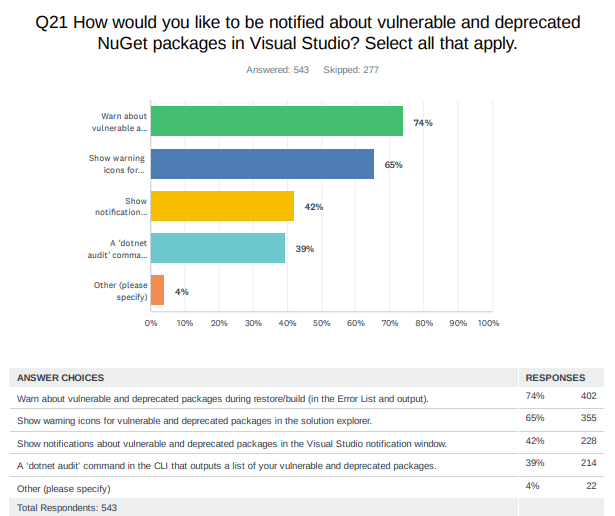
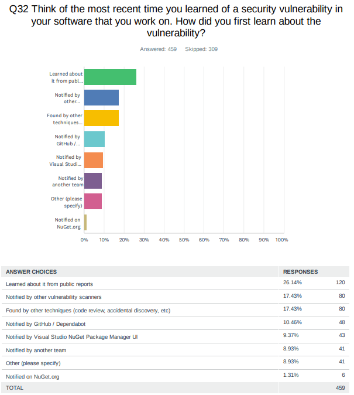
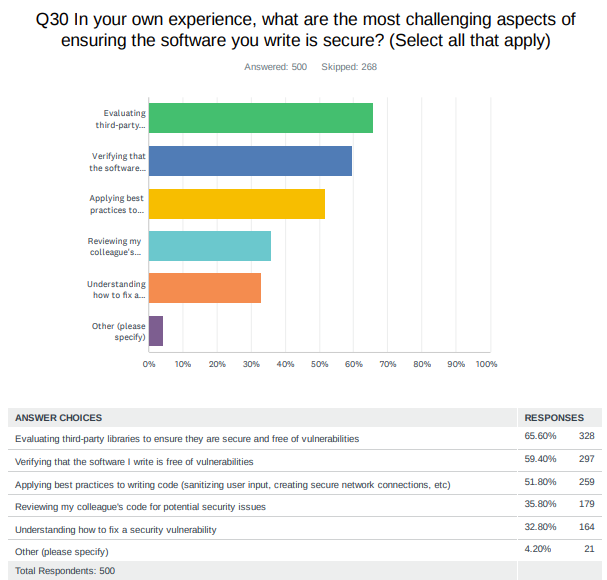
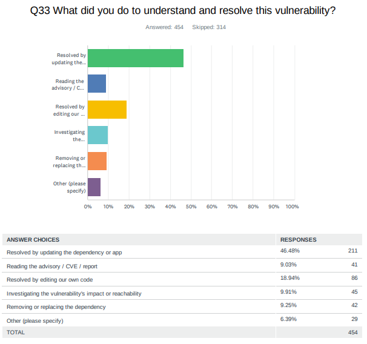
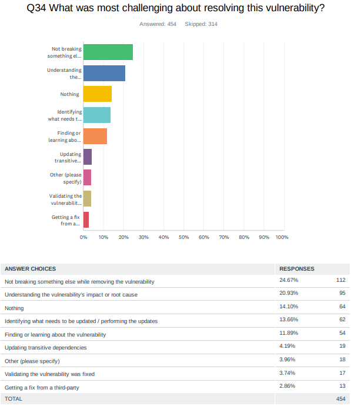

# Auditing projects for package vulnerabilities during restore

- [Jon Douglas](https://github.com/JonDouglas/), [Nikolche Kolev](https://github.com/nkolev92), [Peter Yu](https://github.com/ryuyu)
- Issue: [#8087](https://github.com/NuGet/Home/issues/8087)
- Related: [#11549](https://github.com/NuGet/Home/pull/11549)

## Summary

Audit your dependencies when restoring your NuGet packages with known security vulnerabilities.

## Motivation

Since [launching vulnerability scanning last year](https://devblogs.microsoft.com/nuget/how-to-scan-nuget-packages-for-security-vulnerabilities/), we have seen the world shift towards a zero-trust model with new executive orders, exponentially increasing security advisories and supply chain attacks, and a general sentiment towards securing build environments at all costs.

While we support basic affordances when browsing for NuGet packages in NuGet.org, dotnet CLI, and Visual Studio, we have learned that our developers use these features, but they want better visibility.

We ran a survey in 2022 regarding how developers currently feel about known security advisories and here is what we've learned:

74% of developers would like to be notified of packages at restore/build time. 65% would like to see icons in the solution explorer for problematic packages. 42% of developers would like a security notification in Visual Studio's notification window. 39% of developers would use a dotnet audit command.



Next, we asked developers how they learned about security vulnerabilities in their software. Majority learned from public reports, 3rd-party vulnerability scanners, and code reviews/accidental discovery.



The most challenging aspects for ensuring the software they write is secure is three major things:

1. Evaluating third-party libraries are secure and free of vulnerabilities.
2. Verifying the software they write is free of vulnerabilities.
3. Applying best practices to writing code.



When asked how they understood and resolved the vulnerability, the majority of developers resolved them by updating the dependency or app.



When doing so, the most challenging aspect for them is not breaking something else when doing this and better understanding the vulnerability's information to assess the impact and root cause to see if they are actually affected.



## Explanation

### Functional explanation

When a restore happens whether implicitly, or explicitly, the packages will be audited for vulnerabilities *if* any of the sources declared provide vulnerability information.
If any vulnerabilities are found, the impact, appropriate remediation, and other advisory metadata will be reported to the developer to take action on.

For example, a developer might run `dotnet restore` explicitly or `dotnet add package` which runs restore implicitly. If a package being restored contains a known security advisory, they would see output at the bottom of the restore output that indicates how many vulnerabilities, a break-down of their severities, and the appropriate remediation action to take given the context of their environment. Below are a handful of concepts ranging from a low to high verbosity of information

#### Warning codes

| Warning Code | Severity |
|--------------|----------|
| NU1901 | low |
| NU1902 | moderate |
| NU1903 | high |
| NU1904 | critical |

When there are packages used by the project with vulnerabilities, they will be output like like any other warning or error:

```text
/path/to/project.csproj: warning NU1904: Package 'Contoso.Service.APIs' 1.0.3 has a known critical severity vulnerability, https://github.com/advisories/GHSA-1234-5678-9012.
/path/to/project.csproj: warning NU1902: Package 'Contoso.Forms' 8.4.1 has a known moderate severity vulnerability, https://github.com/advisories/GHSA-1234-5678-9012.
```

If a package has more than 1 vulnerability, each vulnerability will have its own warning. These security issues are often likely independent and may be fixed in different versions.

```bash
/path/to/project.csproj: warning NU1904: Package 'Contoso.Service.APIs' 1.0.3 has a known critical severity vulnerability, https://github.com/advisories/GHSA-1234-5678-9012
/path/to/project.csproj: warning NU1904: Package 'Contoso.Service.APIs' 1.0.3 has a known moderate severity vulnerability, https://github.com/advisories/GHSA-1234-5678-90XY
```

Similarly, if a vulnerable package is either referenced directly by multiple projects, or a project reference causes a package to become a transitive package, it will be listed by each project affected.

#### Enabling Vulnerability Auditing

This feature will be opt-in to start and gather feedback from developers.

To enable the feature, a developer can add `<NuGetAudit>enable</NuGetAudit>` to their project file as a MSBuild property. To disable the feature, a developer can add `<NuGetAudit>disable</NuGetAudit>` or remove the property from the project file.

#### Setting Vulnerability Auditing Modes

There will be different modes to audit vulnerabilities based on the developer's or developer's team preference. To do this, a developer will opt-in to a feature called `<NuGetAuditMode>` which will have different modes such as `direct`, and `all`.

These modes should be pretty straight-forward. `direct` will scan for any top-level vulnerabilities, and `all` will scan for both top-level and transitive-level vulnerabilities. The default will be `direct` until the experience is ready to be `all` given that transitive vulnerabilities are the majority of vulnerability notices (90%+).

When a known vulnerability is found that is of the transitive level, it will include the path to the project containing the top-level package and including the name and version of the package the vulnerable transitive dependency is coming from. Transitive level known vulnerabilities should not be a warning, but rather a message/informational MSBuild severity as they should not break builds but still be brought up in the Error List as informational.

#### Setting an Audit Level

In cases where a developer only cares about a certain threshold of advisory severity, they can set a MSBuild property to set a level such as `<NuGetAuditLevel>moderate</NuGetAuditLevel>` in which auditing will fail. Possible values match the OSV format of `low`, `moderate`, `high`, and `critical`.

#### Excluding Advisories

There is no support for excluding individual advisories at this time.
Developers will be able to `<NoWarn>` the four `NU1901` -> `NU1904` warnings or set the `<NuGetAuditLevel>` to suppress certain severities.
See the section [suppress advisories](#suppress-advisories), under the [future possibilities](#future-possibilities) section, for some early thoughts.

#### Vulnerability warnings in  the solution explorer

Given that restore would be raising a warning, the vulnerability information will automatically appear in the Solution Explorer.
This is the primary motivation for having 1 message per package.

### Source of known vulnerabilities

The proposal is that each NuGet feed will be responsible for providing the NuGet client with a list of known vulnerabilities.

nuget.org currently gets its data from the GitHub Advisories Database.
Therefore, upon initial release, anyone with `https://api.nuget.org/v3/index.json` as a package source and opts into the feature will have GitHub's advisories scanning their packages.
The protocol format is designed to make it easy for other package sources to mirror nuget.org's known vulnerabilities, or [explicitly instruct the NuGet client to use nuget.org's vulnerability data](#allow-sources-to-upstream-vulnerability-information).
Servers can also source their vulnerability data from other sources, as long as they transform the data into [the schema expected by the client](#dedicated-vulnerability-information-resource).

Servers that use nuget.org as an upstream source for their packages have multiple options in providing nuget.org's vulnerability information.
See the [section on allowing source to upstream vulnerability information](#allow-sources-to-upstream-vulnerability-information).

### Technical explanation

During every real restore, i.e. one that regenerates the assets file, NuGet will check all sources that provide vulnerability information and raise warnings for the packages that do.

*Which sources can provide vulnerability information?*
Only V3 http sources can provide vulnerability information. No additional means of providing vulnerability information are proposed here.

#### Technical background

To best understand the technical proposal, it's important to understand the [NuGet package installation process](https://docs.microsoft.com/en-us/nuget/concepts/package-installation-process).

When a package is seen, the client talks to sources and downloads whichever versions are needed. When talking to V3 sources, the client use the `package content` [resource](https://docs.microsoft.com/en-us/nuget/api/package-base-address-resource), which is a static resource that only has information about the available package versions. Only what is contained *within* the package itself affect restore. Nothing else. This allows an equivalence between `http` and `local` sources.

#### Dedicated vulnerability information resource

Checking vulnerability will always take a performance hit, but we want to minimize that. We can:

- Make fewer http calls.
- Minimize the amount of data we are handling.

Both of these can be achieved by adding a means to understand whether a source supports vulnerability. We'd add a resource such as the following:

```json
    {
      "@id": "https://nikolchevulntest.blob.core.windows.net/newcontainer/vulnerabilityindex.json",
      "@type": "VulnerabilityInfo/6.7.0",
      "comment": "The endpoint for discovering information about vulnerabilities of packages in this package source."
    },
```

When NuGet restores, we check whether a source supports vulnerabilities and if so it can go through a protocol of getting this information.

The client needs all the data to make decisions about vulnerabilities.
In order to reduce customer bandwidth in frequently re-downloading the vulnerability data, it is recommended for servers to partition the data into multiple files.
Our recommendation is to have one file which new vulnerabilities are added into, and one or more files which contain historic vulnerabilities that is updated infrequently, allowing the client to re-use cached versions of the file(s).
Periodically, the small file's data can be merged into the large file(s), and the small file cleared.

- The vulnerability resource **must** be an array of objects.
- Each object **must** contain:
  - `@name`, a short name for the page, used for caching, and has a few restrictions:
    - **must** be unique.
    - **must** be between 1 and 32 characters long.
    - **must** only contain  characters `A` to `Z`, `a` to `z`, `0` to `9`, or be `-` or `_`.
  - `@id`, the url that contains the data.
  - `@updated`, a UTC timestamp when the content at `@id` was updated last.
  - `comment`, a user friendly description.
- The vulnerability resource **must** at minimum contain 1 page.
- The pages within the vulnerability resource **must** be exclusive.

One idea for data partitioning is:

- The vulnerability resource contains 2 pages.
  - One page, `base`, represents the data up to a certain point in time.
  - The second page, `update`, represents the data from the last update of `base`, to present.
  - Periodically, for example once a month, the data from `update` **should** be migrated to `base`.
  - If an entry needs to be removed from `base`, `base` should be updated.
- Other partitioning strategies are workable as well. It is up to the server implementation to be considerate to customers with low bandwidth or metered download allowances.

This would allow for the client to do the following:

1. Fetch the main vulnerability resource if available.
1. Compare its version of the base resource to the remote one, based on the updated property. Re-download if different.
1. Compare its version of the update resource to the remote, based on the updated property. Re-download if different.

This should allow for incremental downloads over a short period of time, without an unnecessarily complex update protocol. Given that we're downloading a gziped version, it is unlikely that the payload size becomes a problem anytime soon.

```json
[
  {
    "@name": "base",
    "@id": "https://api.nuget.org/v3/vulnerability-base.index.json",
    "@updated": "2022-11-15T15:30:00.0000000Z",
    "comment": "The base data for vulnerability update periodically"
  },
  {
    "@name": "update",
    "@id": "https://api.nuget.org/v3/vulnerability-update.index.json",
    "@updated": "2022-11-30T15:30:00.0000000Z",
    "comment": "The patch data for the vulnerability. Contains all the vulnerabilities since base was last updated."
  }
]
```

- The page within the vulnerability resource **must** have the `packageid` as a primary key.
- The value of that **must** be an array of objects.
- The objects within the array of objects **must** contain:
  - Severity, an `int`, where `0` means `low`, `1` means `medium`, `2` means `high`, `3` means `critical`
  - Advisory url, a url.
  - Versions, a version range in [NuGet range syntax](https://learn.microsoft.com/nuget/concepts/package-versioning#version-ranges) of affected package versions. This can contain prerelease versions as appropriate.
- The package id **should** be lower case, but it **must** be a case insensitive string, expected to be a valid package id as prescribed by NuGet.
- The version range **must** be case insensitive and normalized (does not include the metadata information). Server implementations written in .NET can use the `NuGet.Versioning` package's `VersionRange.ToNormalizedString()` method to get a compliant output.

```json
{
  "adplug": [
    {
      "severity": 3,
      "url": "https://github.com/advisories/GHSA-874w-m2v2-mj64",
      "versions": "(, 2.3.1)"
    }
  ],
  "bond.core.csharp": [
    {
      "severity": 2,
      "url": "https://github.com/advisories/GHSA-rqrc-8q8f-cp9c",
      "versions": "[3.0.0, 9.0.1]"
    }
  ]
}
```

Having a dedicated vulnerability information resource will allow upstreams to easily use the NuGet.org data within their source.

## Drawbacks

- Vulnerability checking will have a performance hit.

## Rationale and alternatives

Most of the alternatives/ideas covered below are not exclusive.

### Vulnerability dedicated resources updating alternatives

There are many ways to solve the updating problem.

Instead of using the `custom` @updated property, we could instead use HTTP constructs.

- Use ETag instead of an intermediate resource. This would technically have 1 fewer call than the current proposal.
- Use If-Modified-Since and simply always request both the base and update resources.
- Version the vulnerabilities by the year information was known to source.
  - Implement something similar to what the [catalog resource](https://learn.microsoft.com/en-us/nuget/api/catalog-resource) is.
  - This would allow certain vulnerabilities to never be re-downloaded, but it will continuously increased, even if it is unlikely to ever become unreasonable.

- Multiple resource files organized in buckets such as the first character of the package id or some other [arbitrary bucketing method](https://en.wikipedia.org/wiki/Consistent_hashing).
  - This will not improve the overall performance, but theoretically would limit the frequency of the data being refreshed.

- Multiple resource files organized by severity. This could reduce the traffic and make restore faster, but only if customers only care about certain severities.

### Vulnerability reporting not tied to sources

All of NuGet's HTTP traffic is through sources.
The vulnerability information does not have to be tied to sources.
It could be something that's configured independently.

This information could be something that's provided by nuget.org, similarly to licenses.nuget.org.
This would be a url that the user would provide in their configuration. The advantage is that the user does not need their source to provide any vulnerability information.

- Pros:
  - Vulnerabilities are not inherently tied to sources. This is explicit effort undertaken by nuget as shepherds of the eco-system to provide vulnerability information.
  - This can be additive. We can ship vulnerabilities tied to sources first and then update later.

- Cons:
  - The client has an established protocol and a means to configure a source.
  - Experimentation is arguably easier as we're not introducing new syntax, at least not immediately.
  - The challenge is that we'd need to establish a protocol, and something that could be slower on the uptake.

### Optimizing vulnerability check cadence

Most restores are no-op and only checking vulnerabilities when restore actually happen is a straightforward optimization.
Sometimes restore use the local data from the global packages folder to complete a restore.
An additional optimization would be to only check the vulnerabilities when we've already made any http call.

A project that rarely changes package versions, and rarely installs or removes packages, will very infrequently fail NuGet's no-op check on a developer's machine.
Therefore, developers working on such repositories will not provider NuGet many opportunities to check for vulnerabilities as part of a restore.
However, it is expected that such projects will have a CI build which will perform a full restore, so this is not a scenario that we believe needs a design to mitigate at this time.

## Prior Art

- NPM automatically audits dependencies when packages are installed.
  - NPM achieves this by checking the vulnerabilities for the full graph, by submitting the graph to a compute resource that provides a list of the vulnerabilities.
  - The biggest difference is that NuGet restore is run significantly more frequently than npm install is. As such npm's vulnerability checking performance is not as critical as NuGet's.
- [pip-audit](https://github.com/pypa/pip-audit) scans for packages with known vulnerabilities using the Python Packaging Advisory Database.
- [cargo-audit](https://docs.rs/cargo-audit/latest/cargo_audit/) audits cargo.lock files for creates containing security vulnerabilities.
- [snyk](https://snyk.io/product/open-source-security-management/) provides security tools for open source vulnerability scanning and CLI experiences.
- [DependencyCheck](https://github.com/jeremylong/DependencyCheck) scans software for known vulnerabilities.

## Unresolved Questions

<!-- What parts of the proposal do you expect to resolve before this gets accepted? -->
<!-- What parts of the proposal need to be resolved before the proposal is stabilized? -->
<!-- What related issues would you consider out of scope for this proposal but can be addressed in the future? -->
- Should the opt in property be named `NuGetVulnerabilityAudit`?
  - The motivation is that we might want to include deprecation in auditing at some point. Should customers that opted into vulnerability audit get that experience automatically even if they didn't intend to? Customers might only be interested in vulnerability auditing, but not deprecation auditing.
- How does this feature support CPM? Do packages that are not restored but may have a vulnerable version get reported?

## Future Possibilities

- Vulnerability scanning can be extended to SBOMs.
- Support can be added to automatically fix vulnerable dependencies (i.e. a fix experience in CLI / Tooling)
- Consideration of SDK/Framework scanning for implicit PackageReference that may be vulnernable.
- Readiness to enable `<NuGetAuditMode>` to `all` for .NET/VS vNext:
    - Customer feedback from .NET 8.
    - Satisfaction of direct dependency scanning.
    - Noise ratio of transitive dependency scanning (i.e. new warnings)
    - Performance/scalability impact of transitive dependency scanning.
    - Version resolution to ensure proper vulnerability reporting.
    - UI/UX considerations for distinguishing direct/transitive vulnerability warnings.
    - Incremental scanning/caching to avoid redundant scans.
    - Documentation and education resources for the functionality.
    - Prioritization and suppression of severity / advisories.

Additionally, most of the [`Rationale and alternatives`](#rationale-and-alternatives) are really future possibilities on their own as they are not always exclusive to the current approach. Here's some further possibilities:

### Suppress advisories

We can add a way to suppress advisories, either through the NuGet.config, project file or any other configuration file that allows a developer to exclude advisories for various parameters such as a package ID, GHSA ID, or CVE ID.

An example of how the nuget.config could look like:

```xml
  <supressVulnerabilities>
    <add key="https://github.com/advisories/GHSA-g3q9-xf95-8hp5" />
    <add key="https://github.com/advisories/GHSA-1234-5678-9012" />
  </suppressingVulnerabilities>
```

An idea how the project side could look like:
Today, you can suppress warnings by using their warning codes at both the project and the package level.

Example:

```xml
  <PropertyGroup>
    <NoWarn>$(NoWarn);NU1901</NoWarn>
  </PropertyGroup>

  <ItemGroup>
    <PackageReference Include="PackageId" Version="3.0.0" NoWarn="NU1901" />
  </ItemGroup>
```

We can extend a similar functionality to the advisory urls via their own dedicated property.

```xml
<RestoreSuppressedAdvisoryUrls>https://github.com/advisories/GHSA-g3q9-xf95-8hp5</RestoreSuppressedAdvisoryUrls>

 <PropertyGroup>
    <RestoreSuppressedAdvisoryUrls>$(NoWarn);https://github.com/advisories/GHSA-g3q9-xf95-8hp5</RestoreSuppressedAdvisoryUrls>
  </PropertyGroup>

  <ItemGroup>
    <PackageReference Include="PackageId" Version="3.0.0" SuppressedAdvisoryUrls="https://github.com/advisories/GHSA-g3q9-xf95-8hp5" />
  </ItemGroup>
```

The project level and package level metadata are not necessarily a package deal, we can choose to only add one.

### Allow sources to upstream vulnerability information

While the NuGet tooling supports multiple sources, not all configurations are going to contain nuget.org, and thus won't easily get the data curated from the [GitHub Advisory Database](https://devblogs.microsoft.com/nuget/how-to-scan-nuget-packages-for-security-vulnerabilities/).

The [V3 protocol](https://learn.microsoft.com/en-us/nuget/api/overview) and the resource architecture would allow a source to link to a resource that may not be hosted by them.
Not every source would want to setup a pipeline for processing vulnerability information. They can instead just "point" to the nuget.org information.

For example, an Azure Artifacts source could have this in their index.json:

```json
{
  "resources" [

  {
    "@id": "https://api.nuget.org/v3/vulnerability.json",
    "@type": "VulnerabilityInfo/6.7.0",
    "comment": "The base data for vulnerability update periodically"
  }
  ]
}
```

While the nuget.org data only contains vulnerability information about packages on nuget.org, often times an `upstream` source is setup by customers, and while they reference their own private feed, they can still download packages from nuget.org. The vulnerability information is valuable in these scenarios.

If this upstream approach is taken, it is very likely that the vulnerability checking has a lot of misses, but this is an understood trade-off.

It is **very important* that if the upstream sources link to the nuget.org vulnerability, the actual nuget.org urls are used wherever possible, as this would allow the client to easily deduplicate the vulnerability information.

### Command Line Restore output

Restore output could be modified to provide a vulnerability summary.

```bash
Found 2 vulnerabilities (0 low, 1 moderate, 0 high, 1 critical) in 2 package(s)

warning NU1904: Package 'Contoso.Service.APIs' 1.0.3 has a known critical severity vulnerability, https://github.com/advisories/GHSA-1234-5678-9012.
warning NU1902: Package 'Contoso.Forms' 8.4.1 has a known moderate severity vulnerability, https://github.com/advisories/GHSA-1234-5678-9012.
```

In cases where no known vulnerabilities are found, restore can provide a normal verbosity message for every project:

```bash
No known vulnerabilities found for <project path>.

```

In addition at normal verbosity, we could log a report for each project whose vulnerabilities were audited.

```bash
Found 2 vulnerabilities (0 low, 2 moderate, 0 high, 0 critical) in 2 package(s)

Top-level Package       Requested	Resolved	Severity	Advisory URL
> Contoso.Forms		8.4.1	        8.4.1		Moderate	https://github.com/advisories/GHSA-1234-5678-9012

Transitive Package	Resolved	Severity	Advisory URL
> Microsoft.Data.OData	5.2.0	        Moderate	https://github.com/advisories/GHSA-1234-5678-90XY
```

### Providing vulnerability information through a json, remotely or locally

Other components may want to provide vulnerability information that's not tied to a source.
Whatever approach we take there will be a way to represent the vulnerability information through a json file.

### Surfacing deprecation information

Vulnerabilities and deprecation share some similarities.
From a customer point of view, they often also wish to be aware when a package is deprecated.

However, nuget.org's implementation is that package deprecation information is stored per-version, rather than as ranges, as GitHub's package vulnerability information is.
NuGet.org also has a lot more deprecated package information than vulnerability information.
Therefore, it would be a more significant performance hit.

At the time of writing, a file containing deprecation information is 140x the size of the vulnerability information.

### Vulnerabilities in dependencies

Due to transitive packages, thinking about a package having vulnerabilities is best thought of in the context of a project.
Having vulnerability data at restore time, would allow to potentially gather information about packages that themselves are not vulnerable, but bring in vulnerable packages within their graph.
This information could be a helpful signal for package authors to update their dependency graph.
