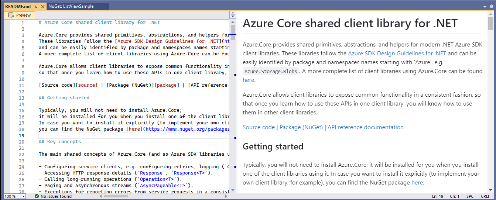

# Markdown Readme shown after Package Installation
* Start Date: 6/20/23
* Authors: Donnie Goodson ([donnie-msft](https://github.com/donnie-msft))
* Issue: https://github.com/NuGet/Home/issues/12674

## Summary

Currently, installing a package containing a Readme file using NuGet Package Manager in Visual Studio (PM UI) will result in that readme being opened if it is a `.txt` file. Packages can also contain `.md` Readme files with markdown content, but these files are not opened automatically after install. The goal of this spec is to make a consistent experience for markdown readmes.

## Motivation

Customers who expect a Readme to open after package installation with the PM UI currently do not see a markdown readme file automatically. As we continue growing a community of package authors who include markdown readme files, it's natural that PM UI should open them, when available.

Expanding our supported file types for this feature serve as an entry point for us to gain technical experience integrating a markdown rendering strategy into the product.

## Explanation

### Functional Explanation

When performing a package action in the PM UI, if that package has a markdown readme file, open the file as if the customer chose it from File -> Open in VS.

The VS editor already provides a markdown `Preview` button when a markdown file is opened. The proposal is that this markdown preview is sufficient to make a useful and consistent experience for our customers who expect to see a Readme after package installation.

Example: 
The package `Azure.Core` v1.32.0 obtained from nuget.org contains a markdown readme. When manually opening its `README.md` in VS, and clicking the `Preview` button, the rendered markdown is shown as in the following screenshot:

### Technical Explanation

The VS editor exposes an `IVsTextView` option: a boolean property `ShowMarkdownPreview`, which can be used to enable the markdown preview automatically. Ideally, only the rendered markdown can be shown, but there would be value even if only the split window showing markdown code and rendered markdown is technically feasible.

Reference to property (Internal access only): [code](https://devdiv.visualstudio.com/DefaultCollection/DevDiv/_search?action=contents&text=ShowMarkdownPreviewOptionId&type=code&lp=code-Project&filters=ProjectFilters%7BDevDiv%7DRepositoryFilters%7BVS-Platform%7D&pageSize=25&result=DefaultCollection/DevDiv/VS-Platform/GBmain//src/Productivity/MarkdownLanguageService/Impl/Markdown.Platform/Preview/PreviewMargin.cs)

The PM UI code which opens text readmes is in: [NuGetPackageManager.cs](https://github.com/NuGet/NuGet.Client/blob/dev/src/NuGet.Core/NuGet.PackageManagement/NuGetPackageManager.cs#L3544)

## Drawbacks

None

## Rationale and Alternatives

If the usage of opening Readme's automatically after installation is low, we may not need to implement this feature.

## Prior Art

Text readmes (`.txt`) already open automatically, so the timing for when to load the file is already in place.
The VS Editor team already has an option to enable the preview automatically.

## Unresolved Questions

None

## Future Possibilities 

[Support viewing README files in Visual Studio](https://github.com/NuGet/Home/issues/12583)