# NuGet Command Experiences for VS Code & C# Dev Kit Solution Explorer

- Allie Barry, Jon Douglas, Jean-Pierre Briede

## Summary

This proposal introduces a Visual Studio Code NuGet package management experience including command palette flows and integration with C# Dev Kit. It covers the initial experiences for adding, removing, and updating a NuGet package. This document covers the minimum viable product (MVP) for a NuGet command palette experience, and leaves room for growth and expansion on these initial concepts, both in enhancing these 3 features, or in the addition of more NuGet command palette features.

## Table of Contents

1. [Motivation](#motivation)
2. [Functional Explanation](#functional-explanation)
    - [Browse and Install a Package - Entry Points](#browse-and-install-a-package---entry-points)
    - [Browse and Install a Package - Operation Flow](#browse-and-install-a-package---operation-flow)
    - [Remove a Package - Entry Points](#removing-a-package---entry-points)
    - [Remove a Package - Operation Flow](#removing-a-package---operation-flow)
    - [Update - Entry Points](#updating-a-package---entry-points)
    - [Update a Package - Operation Flow](#updating-a-package---operation-flow)
    - [Authentication to Private Feeds](#authentication-to-private-feeds)
3. [Technical Explanation](#technical-explanation)
4. [Drawbacks](#drawbacks)
5. [Rationale and Alternatives](#rationale-and-alternatives)
6. [Prior Art](#prior-art)
7. [Unresolved Questions](#unresolved-questions)
8. [Future](#future-possibilities)

## Motivation

Visual Studio Code now supports "C# Dev Kit" which is an extension that allows a .NET/C# developer to use familiar Visual Studio tooling for their purposes. This proposal brings integrated Visual Studio Code-like experiences directly into the extension to make it easier for .NET/C# developers to manage their packages and package-related tasks.

Requests for NuGet functionality are at an all-time high since the general availability of C# Dev Kit. NuGet feature requests remain in the top 3 of GitHub issues on the C# Dev Kit repository. It was a popular ask at MVP Summit, Microsoft Build, and dotnetConf.

In a recent Visual Studio for Mac/C# Dev Kit survey, when asked about "features or experiences missing from the VS Code experience that are critical to their workflow", 20 out of 157 respondents mentioned NuGet package manager functionality. They specifically called out "being able to look up available NuGet packages to solve specific problems", "updating to the latest version of NuGet packages” and wanting a "visual experience".

For each feature, there are two "entry points" presented for how users can reach each package operation. The operations will be the same for each entry point. The purpose of this is to allow for VS Code developers who are familiar with and comfortable using the command palette to continue doing so when managing NuGet packages, but to also cater to and integrate seamlessly into C# Dev Kit Solution Explorer. We wanted to tap into the rich and expansive C# experience that Dev Kit offers through the solution explorer, and utilize it to provide a more visual NuGet experience without yet having a full UI. This concept came from exploration of ways that developers can currently interact with elements in the C# Dev Kit solution explorer (ex. files, folders, etc.), and wanting to allow developers to interact with packages in the solution explorer in an intuitive way based on this.

Given the high demand for this functionality, we first plan to integrate NuGet package management into C# Dev Kit and the VS Code command palette to get a solution for managing NuGet packages into the hands of users as soon as possible. From there, we plan to explore and build a visual UI to complement and enhance this experience.

## Functional Explanation

Each package operation (add, remove, and update), will essentially be broken down into two “steps”: the entry point and the operation. For step 1 (the entry point), the user will have two options:
a. Command Palette
b. Solution Explorer
These two options represent different ways that the user can initiate a NuGet package operation in their project. Once the operation is initiated, step 2 (the operation), will behave the same way, and have the same flow, regardless of the entry point chosen. Below is a diagram which visually represents this logic for the package installation operation.

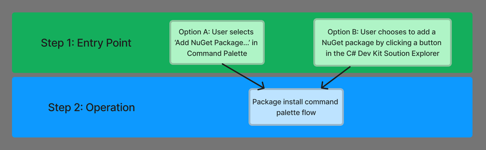

This format will be used for all operations in the MVP including add package, remove package, update package. The following sections will provide more detail for the flow of each of these operations.

### Browse and Install a Package - Entry Points

#### Option A: Command Palette Entry Point

A new command is listed named `NuGet: Add package...``.

Next, if the user has multiple projects, they will be presented with with a quickpicks dialog asking them to choose, from a dropdown list, which of their projects they would like to add the package to.
For now, this will be a single selection, where the user can only select one project at a time.
If the user only has one project, they will not need to choose a project and they will skip to the next step.

#### Option B: Solution Explorer Entry Point

At the Project level node in the solution explorer, we plan to add an item to the right-click menu that reads “Add a NuGet Package”.

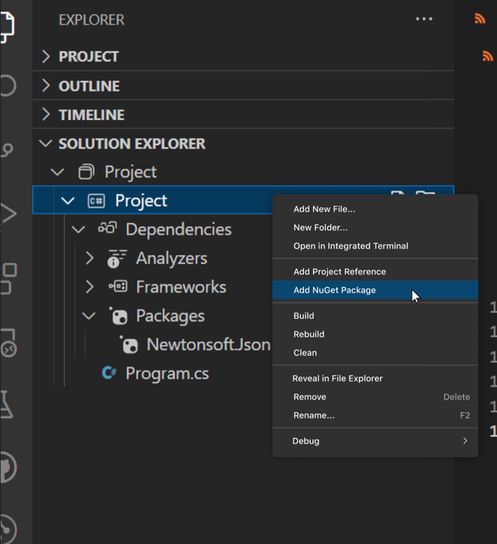

Additionally, in the solution explorer, there is a "Dependencies" node, and within that node, there is a "Packages" node   , which contains a list of all the NuGet packages directly installed into the solution in question. This folder only is visible in the solution explorer if there are already previously installed NuGet packages in the project. If the Packages folder is visible, when a user hovers over it, they will see a small icon showing the NuGet logo with a plus sign next to it appear in line on the far right  (actual icon to be used: pending design).

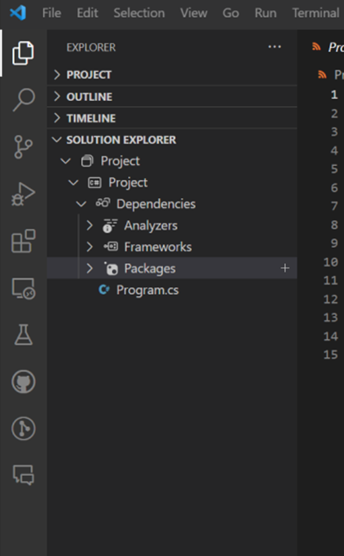

Additionally, there will be another right-click menu on the Packages node  (if it is visible), providing them with options to manage their NuGet packages. Specifically, they will see an option to "Add package...".

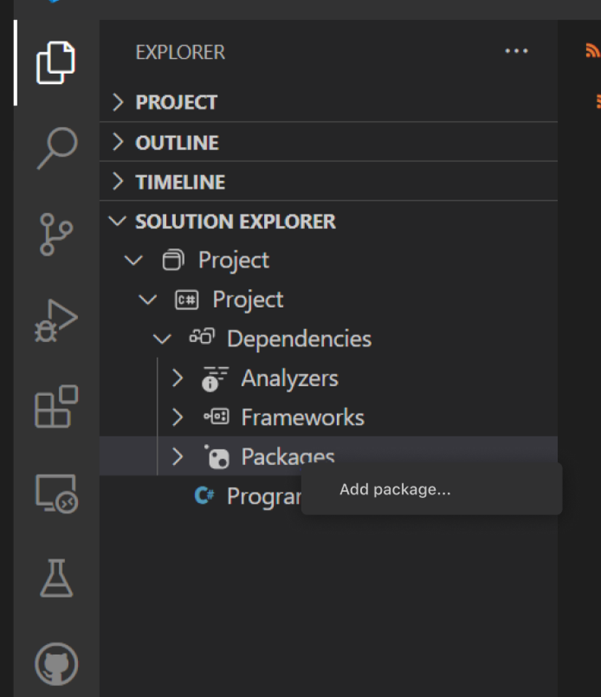

### Browse and Install a Package - Operation Flow

First, the user will see a search box to provide a search term for a respective package to be found on their package sources. If the user wants to search specifically by a package attribute , and nuget.org is one of the configured package sources, they can do so by following the convention 'owner:Microsoft'. Otherwise, the search will search across all package attributes. (To see more information about what is supported with the syntax, see here : [Find and evaluate NuGet packages | Microsoft Learn](https://learn.microsoft.com/en-us/nuget/consume-packages/finding-and-choosing-packages))

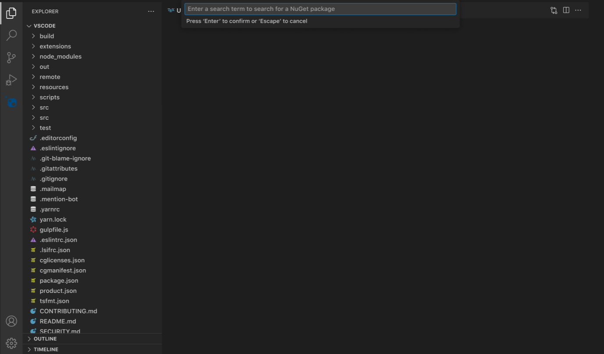

The developer can then enter a search term to search for a NuGet package, and press enter. At this point, if they would like to cancel the operation, they can press the 'Escape' key on the keyboard. There will be a line of text underneath the search box that alerts the user of the functions of both the 'Enter' and 'Escape' keys here.

When the developer presses enter, the results box will appear and provide them a selectable list of packages  that match their search term.  The search results will show the top 50 relevant packages which match this search term. For the first iteration of this experience, only the package ID will be shown in the search results. There are a few other possible options for what the search results could look like in the "Future Possibilities" section later in this document.

Once a package is selected from the list, the user will then be prompted to select the version number that they would like to install.

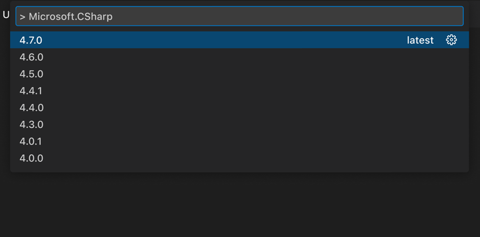

Once the user selects their desired version number  , the package will be installed . 
If for some reason, the installation operation has failed, then the user will receive a toast notification which will read "Package X failed to install due to an error.". This toast will also include a button that says "More Information", which when clicked, will direct the developer to the output window where they can see why the installation failed.

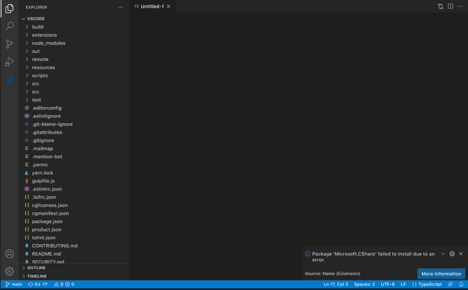

### Removing a Package - Entry Points

#### Option A: Command Palette Entry Points

A new command is listed named `NuGet: Remove a package...``.

When a developer selects this command, they will be prompted to select which project they would like to remove a package from with a dropdown of all of their projects. If the user only has one project, they will not see this option, and will skip to the next step.

Next, the user will be prompted in a search box to provide a search term for a respective package to be found within the packages they have installed in their current project.  Beneath the search bar, a list of all packages installed in the project will appear, and the developer will have the option to enter a search term to narrow down the list, or just select directly from the list provided.

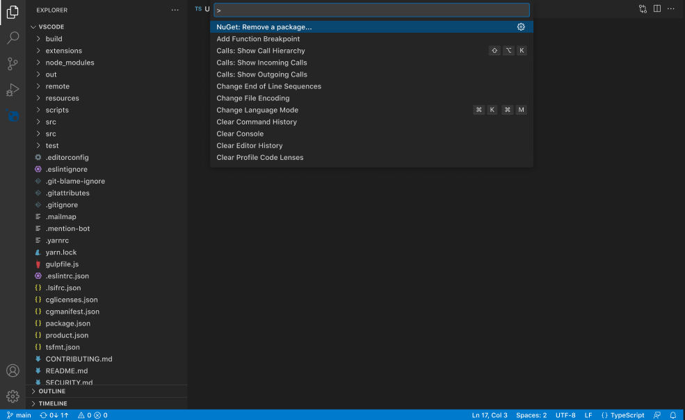

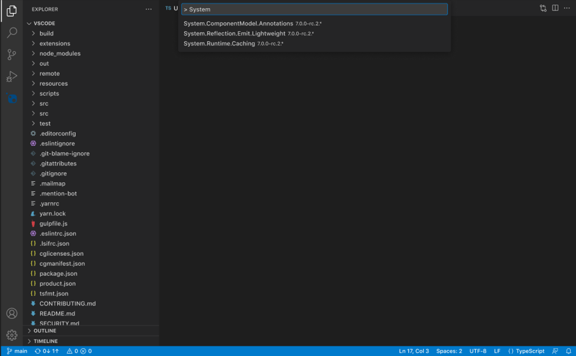

#### Option B: Solution Explorer Entry Points

When a user hovers over a package that they have installed in their solution explorer, they will see two small icons appear, one of which being a 'minus sign'.

Additionally, if the developer right clicks on a specific package in the folder, they will see a menu of options for operations to perform on this specific package.  One of these options will be: "Remove NuGet package...".

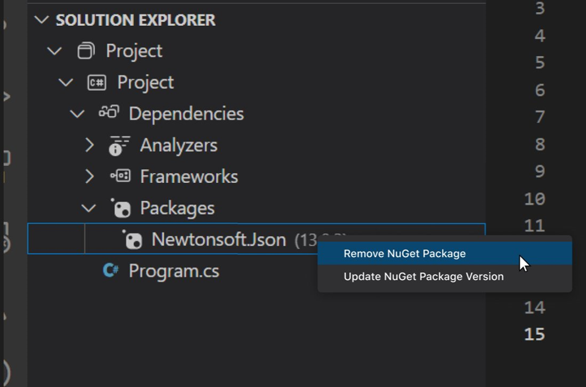

### Removing a Package - Operation Flow

Once the user selects their desired package to be removed through one of the two entry points, they will be prompted to confirm their choice with a pop-up   . If the user confirms this by clicking 'Remove', the package will be removed from their project.  They will also have the option to cancel the operation at this point.

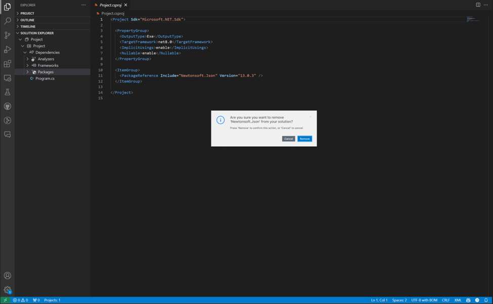

### Updating a Package - Entry Points

#### Option A: Command Palette Entry Point

A new command is listed named `NuGet: Update a package...``.

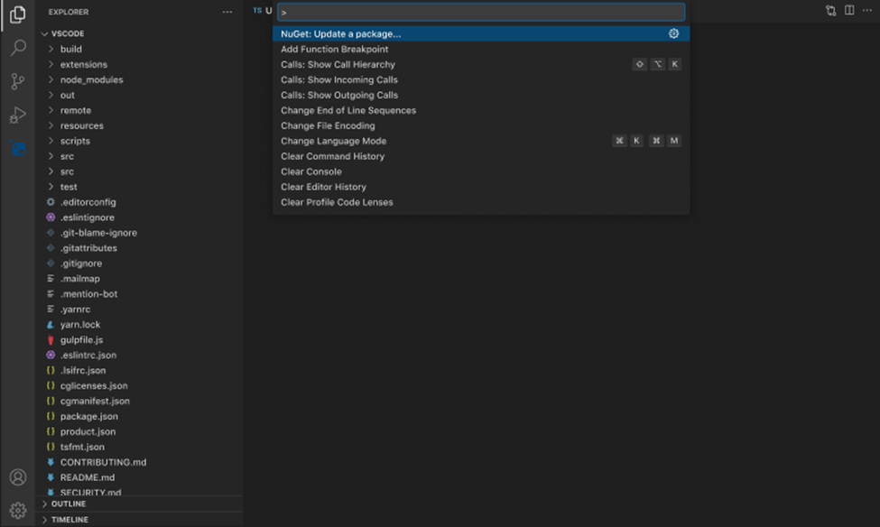

When a developer selects this command, they will be prompted to select which project they would like to update a package in with a dropdown of all of their projects. If the user only has one project, they will not see this option, and will skip to the next step.

Next, the user will be prompted in a search box to provide a search term for a respective package to be found within the packages they have installed in their current project.   Beneath the search bar, a list of all packages installed in the project will appear, and the developer will have the option to enter a search term to narrow down the list, or just select directly from the list provided.

#### Option B: Solution Explorer Entry Points

When a user hovers over a package that they have installed in their solution explorer, they will see two small icons appear, one of which being a 'up-arrow'.

Additionally, if the developer right clicks on a specific package in the folder, they will see a menu of options for operations to perform on this specific package.  One of these options will be: "Update NuGet package version".

### Updating a Package - Operation Flow

When the user selects the package they would like to update , they will then see a list of all available versions of the package they've selected. They will also see a label that says 'current' next to the version they have currently installed.

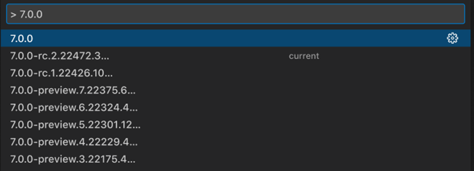

Once the user makes this selection, if necessary, the package version number will be updated in the solution.

### Authentication to private feeds

If the user is attempting to perform a package operation on a package from an Azure Artifacts feed that requires the user to sign-in and authenticate their credentials, they will receive a toast, pictured below:

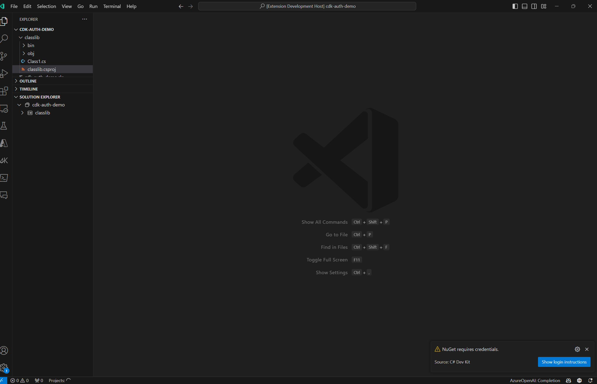

When the user clicks the Show login instructions button, the NuGet output window will open, and the user will have 90 seconds to sign in and verify their credentials.

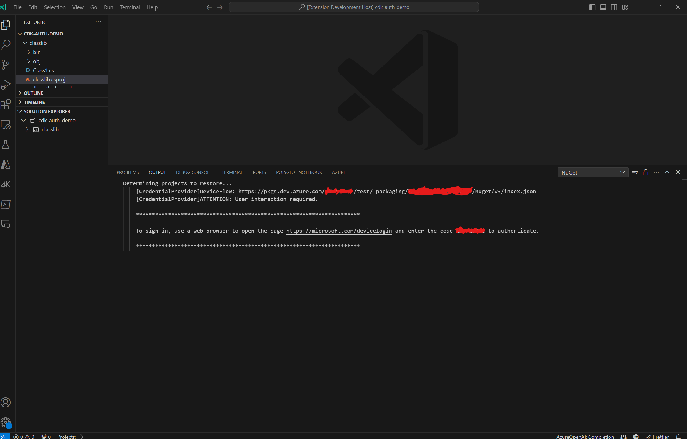

If the user fails to accomplish this within the time constraint provided, the operation will fail and they will have to retry from the beginning. If the user doesn’t sign-in in time, or at all, and the operation fails, they will receive a toast alerting them of this.

## Technical Explanation

<!-- Explain the proposal in sufficient detail with implementation details, interaction models, and clarification of corner cases. -->

TBD

## Drawbacks

<!-- Why should we not do this? -->

A potential drawback to this solution is that many user have specifically requested a "package management UI" or a more visual experience. Additionally, we received signal from users who are familiar with using NuGet in Visual Studio that they expect and desire similar UI experience to what is provided there. While this solution does provide a more visual experience than what is currently available (i.e. performing NuGet operations through the CLI), it might not fully meet the expectations of users who desire a UI. We plan to address this in future iterations of NuGet in VS code with a UI.

## Rationale and alternatives

This design provides a starting point for a build-able and iterable experience for NuGet package management within VS Code and C# Dev Kit. It includes all of the basic features and functionality that users would require and expect for basic package management functions in VS Code. Additionally, it provides new value to users by including a visual experience and searching capabilities that were not previously available for VS Code developers. This design also provides a lot of room for additional information/details and functions to be added into this base experience. We plan to utilize customer feedback to help us understand what information about packages that users would expect to see at each step of these commands, as well as what commands and features should be added next.

It also utilizes familiar functionality for users who are already familiar with both the VS Code command palette and C# dev kit. We worked with the Dev Kit team and closely analyzed current VS Code functionality, as well as how developers prefer to use this functionality, to help inform this experience.

## Prior Art

Prior art that we took inspiration from, most importantly includes what exists currently in VS Code and C# Dev Kit. We wanted to provide an experience that is closely integrated into what exists in and how users interact with these platforms, so we relied on this heavily when making design choices.

Additionally, there is a relatively popular NuGet extension that already exists for VS Code. Since its popular (over 1 million downloads), we looked at this to inform what users might want from a NuGet experience in VS Code. We also wanted to understand how we could provide additional and differentiated value from this solution and expanded on the functionality that it provides.

We also took inspiration from the already existing Maven extension in VS Code to understand how other package managers currently operate in VS Code.

## Unresolved Questions

- Will we include keyboard shortcuts for any commands?

## Future Possibilities

Some future possibilities for this proposal fall into two categories: adding information/package details to enhance the feature experiences proposed here, and adding additional features to enhance the overall package management experience in VS Code.

To enhance the add/remove/update experiences, we could add more package details/information in the quickpicks results list for each of these operations. Due to the limited real estate space in the search results for each package, it is important that we ensure that we are displaying the most relevant information that would help users to make the most informed decision about a package. For example, we could include package owners, version number, a snippet of the description, icons, tags, or other information. Different package operations might require different information to be showed, so we plant o do customer development to understand what would make the most sense to display at different stages in the package management process. An example of what this might look like for an example scenario is displayed below.

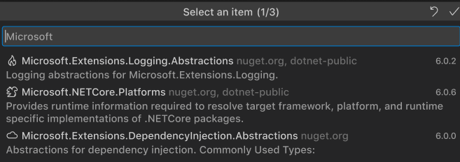

We could also allow for operations like updates, installs and uninstalls to be performed on multiple packages at a time by enabling multi-select in a future iteration to enhance these experiences.

Some ideas for features to add in future iterations are: clearing package caches/folders, packaging a library, pushing a package to a source, managing package sources, NuGet restore, central package management, package source mapping, opening a package manager UI.

Another potential future possibility would be to add icons next to packages in the solution explorer to signal at a glance things such as if an update is available, if there is a known vulnerability in the package, if the package has been deprecated, or other package statuses. For more information on this concept,  is a proposal for this feature in the Visual Studio NuGet UI. An example of what this could look like is shown below:

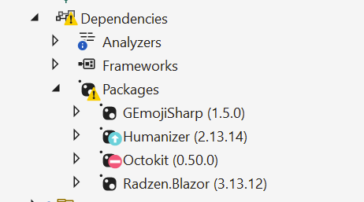
