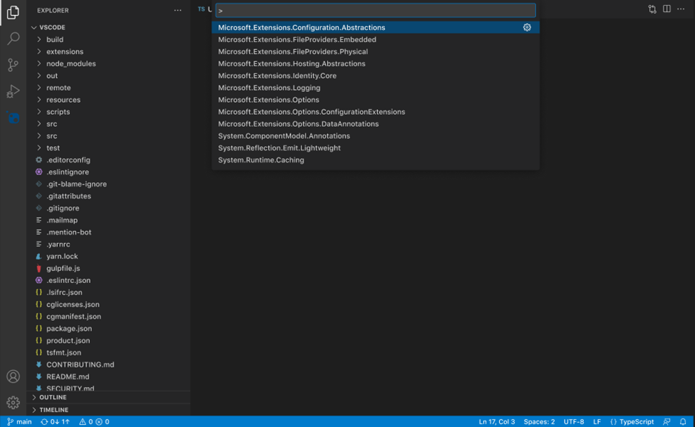

# NuGet Package Management: Command Palette & Quick Picks in Visual Studio Code/C# Dev Kit - MVP

- Jon Douglas, Allie Barry, Jean-Pierre Briede
- GitHub Issue <!-- GitHub Issue link -->

## Summary

<!-- One-paragraph description of the proposal. -->
This proposal introduces a command palette experience including 'quickpick' flows and integration with C# DevKit for NuGet package management. It covers the initial experiences for adding, removing, and updating a NuGet package. This document covers the minimum viable product (MVP) for a NuGet command palette experience, and leaves room for growth and expansion on these initial concepts, both in enhancing these 3 features, or in the addition of more NuGet command palette features.

## Table of Contents

1. [Motivation](#motivation)
2. [Functional Explanation](#functional-explanation)
    - [Browse and Install a Package - Command Palette](#option-1-navigating-to-add-package-directly-in-command-palette)
    - [Browse and Install a Package - C# Dev Kit](#option-2-navigating-to-nuget-add-package-command-through-c-devkit-solution-explorer)
    - [Removing a Package - Command Palette](#option-1-navigating-to-remove-package-directly-in-command-palette)
    - [Removing a Package - C# Dev Kit](#option-2-navigating-to-nuget-remove-package-command-through-c-devkit-solution-explorer)
    - [Updating a Package - Command Palette](#option-1-navigating-to-update-package-directly-in-command-palette)
    - [Updating a Package - C# Dev Kit](#option-2-navigating-to-nuget-update-package-command-through-c-devkit-solution-explorer)
3. [Technical Explanation](#technical-explanation)
4. [Drawbacks](#drawbacks)
5. [Rationale and Alternatives](#rationale-and-alternatives)
6. [Prior Art](#prior-art)
7. [Unresolved Questions](#unresolved-questions)
8. [Future](#future-possibilities)

## Motivation

<!-- Why are we doing this? What pain points does this solve? What is the expected outcome? -->
Visual Studio Code now supports "C# Dev Kit" which is an extension that allows a .NET/C# developer to use familiar Visual Studio tooling for their purposes. This proposal brings integrated Visual Studio Code-like experiences directly into the extension to make it easier for .NET/C# developers to manage their packages and package-related tasks.

Requests for NuGet functionality are at an all time high since the general availability of C# Dev Kit. NuGet feature requests remain in the top 3 of GitHub issues on the C# Dev Kit repository. It was a popular ask at MVP Summit, Microsoft Build, and dotnetConf.

In a recent Visual Studio for Mac/C# Dev Kit survey, when asked about "features or experiences missing from the VS Code experience that are critical to their workflow", 20 out of 157 respondents mentioned NuGet package manager functionality. They specifically called out "being able to look up available NuGet packages to solve specific problems", "updating to the latest version of NuGet packages", and wanting a "visual experience".

For each feature, there are two "entry points" presented for how users can reach each command. The commands will be exactly the same for each entry point. The purpose of this is to allow for VS Code developers who are familiar with and comfortable using the command palette to continue doing so when managing NuGet packages, but to also cater to and integrate seamlessly into C# DevKit. We wanted to tap into the rich and expansive C# experience that Dev Kit offers, and utilize it to provide a more visual NuGet experience without yet having a full UI. This concept came from exploration of ways that developers can currently interact with elements in the C# Dev Kit solution explorer (ex. files, folders, etc.), and wanting to allow developers to interact with packages in the solution explorer in an intuitive way based on this.

Given the high demand for this functionality, we first plan to integrate NuGet package management into C# Dev Kit and the VS Code command palette to get a solution for managing NuGet packages into the hands of users as soon as possible. From there, we plan to explore and build a visual UI to compliment and enhance this experience.

## Functional Explanation

<!-- Explain the proposal as if it were already implemented and you're teaching it to another person. -->
<!-- Introduce new concepts, functional designs with real life examples, and low-fidelity mockups or pseudocode to show how this proposal would look. -->

### Browse and Install a Package

#### Option 1: Navigating to add package directly in command palette

A new command is listed named `NuGet: Add package...``.

When a developer selects this command, they might first have to set the context for where they would like this package to be installed, at the project level or at the solution level for projects with multiple solutions. If, in a certain use case this distinction needs to be made, the user will first have to specify the context in the first quickpick option. There are a few other options for how we could allow the user to set the context for operations detailed in the 'Unanswered questions' section of this document.

The rest of the flow will be the same for both project and solution level installations. Next, they will see a search box to provide a search term for a respective package to be found on their package sources. If the user wants to search specifically by a package attribute, they can do so by following the convention 'owner:Microsoft'. Otherwise, the search will search across all package attributes. (To see more information about what is supported with the syntax, see here: .)

The developer can then enter a search term to search for a NuGet package, and press enter. At this point, if they would like to cancel the operation, they can press the 'Escape' key on the keyboard. There will be a line of text underneath the searchbox that alerts the user of the functions of both the 'Enter' and 'Escape' keys here.

When the developer presses enter, the results box will appear and provide them a selectable list of packages that match their search term. For the first iteration of this experience, only the package ID will be shown in the search results. There are a few other possible options for what the search results could look like in the "Future Possibilities" section later in this document.

Once a package is selected from the list, the user will then be prompted to select the version number that they would like to install.

Once the user selects their desired version number, the package will be installed. Once installation has either succeeded or failed, the developer will receive a toast notification notifying them of the status of the installation operation. If the installation has succeeded, the notification will read " Package X was successfully installed". If the installation has failed then the notification will read "Package X failed to install due to an error.". This toast will also include a blue button that says "More Information", which when clicked, will direct the developer to the output window where they can see why the installation failed.

#### Option 2: Navigating to 'NuGet: Add Package' command through C# DevKit Solution Explorer

A developer will also be able to access the same add package command through a right click experience built directly into the solution explorer offered through C# DevKit. We want to provide an experience that aligns closely with the experience that is currently offered in, and future plans for, C# Dev Kit. When interacting with the solution explorer for C# projects that is offered through DevKit, many of the elements that exist today can be interacted with through a similar right-click experience, as well as icons that appear on hover of these elements that allow for quick selection of common functions. We want to incorporate this functionality into the NuGet VS Code experience to allow for a seamless and well-rounded experience for C# Developers.

In the solution explorer, there is a "Dependencies" node, and within that node, there is a "Packages" node, which contains a list of all of the NuGet packages directly installed into the solution in question. When a user hovers over this "Packages" folder, they will see a small plus sign icon appear in line on the far right.

Additionally, when the user right clicks on this Packages folder, they will see a menu show up, providing them with options to manage their NuGet packages. Specifically, they will see an option to "Add package...".

When the user selects the "Add package" menu list item, or when they select the 'plus sign' icon that appears on hover next to the
'Packages' folder, the command palette will open and they will be guided through the same package install process described in option 1, starting with the empty search box to search for a specific package.

### Removing a Package

#### Option 1: Navigating to remove package directly in command palette

A new command is listed named `NuGet: Remove a package...``.

When a developer selects this command, it will prompt them in a search box to provide a search term for a respective package to be found within the packages they have installed in their current solution. Beneath the search bar, a list of all packages installed in the solution will appear, and the developer will have the option to enter a search term to narrow down the list, or just select directly from the list provided.

When the user selects the package they would like to remove, if it is a project with multiple solutions, and the package is installed at the project level, the user will need to choose if they would like the package to be removed at the solution level or the project level.

Once they make this choice, if necessary, they will be prompted to confirm their choice with a pop-up bar. If the user confirms this by clicking 'Remove', the package will be removed from their solution. They will also have the option to cancel the operation at this point.

#### Option 2: Navigating to 'NuGet: Remove package' command through C# DevKit solution explorer

A developer will also be able to access the same remove package command through an experience built directly into the solution explorer offered through C# DevKit.

When a user hovers over a package that they have installed in their solution explorer, they will see two small icons appear, one of which being a 'minus sign'.

Additionally, if the developer right clicks on a specific package in the folder, they will see a menu of options for operations to perform on this specific package. One of these options will be: "Remove package...".

When the user either clicks the minus sign in the solution explorer or clicks the 'Remove package...' menu item, they will be prompted to confirm their choice with a pop-up bar. When the user selects the 'Remove package...' option, the package will be removed from their solution, and it will disappear from their Dev Kit solution explorer. They will also have the option to cancel the operation at this point.

### Updating a Package

#### Option 1: Navigating to update package directly in command palette

A new command is listed named `NuGet: Update a package...``.

When a developer selects this command, it will prompt them in a search box to provide a search term for a respective package to be found within the packages they have installed in their current solution. Beneath the search bar, a list of all packages installed in the solution will appear, and the developer will have the option to enter a search term to narrow down the list, or just select directly from the list provided.

When the user selects the package they would like to update, they will then see a list of all available versions of the package they've selected. They will also see a label that says 'current' next to the version they have currently installed.

When the user selects the package they would like to update, if it is a project with multiple solutions, and the package is installed at the project level, the user will need to choose if they would like the package to be updated at the solution level or the project level.

Once the user makes this selection if necessary, the package version number will be updated in the solution.

#### Option 2: Navigating to 'NuGet: Update Package' command through C# DevKit solution explorer

A developer will also be able to access the same update package command through an experience built directly into the solution explorer offered through C# DevKit.

When a user hovers over a package that they have installed in their solution explorer, they will see two small icons appear, one of which being a 'up arrow'.

Additionally, if the developer right clicks on a specific package in the folder, they will see a menu of options for operations to perform on this specific package. One of these options will be: "Update package...".

When the user selects the 'Update package' option or clicks the up arrow icon in the solution explorer, they will be guided through the same command palette flow described in option 1, starting from the version selection page.

## Technical Explanation

<!-- Explain the proposal in sufficient detail with implementation details, interaction models, and clarification of corner cases. -->

TBD

## Drawbacks

<!-- Why should we not do this? -->

A potential drawback to this solution is that many user have specifically requested a "package management UI" or a more visual experience. Additionally, we received signal from users who are familiar with using NuGet in Visual Studio that they expect and desire similar UI experience to what is provided there. While this solution does provide a more visual experience than what is currently available (i.e. performing NuGet operations through the CLI), it might not fully meet the expectations of users who desire a UI. We plan to address this in future iterations of NuGet in VS code with a UI.

## Rationale and alternatives

<!-- Why is this the best design compared to other designs? -->
<!-- What other designs have been considered and why weren't they chosen? -->
<!-- What is the impact of not doing this? -->

This design provides a starting point for a buildable and iterable experience for NuGet package management within VS Code and C# Dev Kit. It includes all of the basic features and functionality that users would require and expect for basic package management functions in VS Code. Additionally, it provides new value to users by including a visual experience and searching capabilities that were not previously available for VS Code developers. This design also provides a lot of room for additional information/details and functions to be added into this base experience. We plan to utilize customer feedback to help us understand what information about packages that users would expect to see at each step of these commands, as well as what commands and features should be added next.

It also utilizes familiar functionality for users who are already familiar with both the VS Code command palette and C# dev kit. We worked with the Dev Kit team and closely analyzed current VS Code functionality, as well as how developers prefer to use this functionality, to help inform this experience.

## Prior Art

<!-- What prior art, both good and bad are related to this proposal? -->
<!-- Do other features exist in other ecosystems and what experience have their community had? -->
<!-- What lessons from other communities can we learn from? -->
<!-- Are there any resources that are relevant to this proposal? -->

Prior art that we took inspiration from, most importantly includes what exists currently in VS Code and C# Dev Kit. We wanted to provide an experience that is closely integrated into what exists in and how users interact with these platforms, so we relied on this heavily when making design choices.

Additionally, there is a relatively popular NuGet extension that already exists for VS Code. Since its popular (over 1 million downloads), we looked at this to inform what users might want from a NuGet experience in VS Code. We also wanted to understand how we could provide additional and differentiated value from this solution and expanded on the functionality that it provides.

We also took inspiration from the already existing Maven extension in VS Code to understand how other package managers currently operate in VS Code.

## Unresolved Questions

<!-- What parts of the proposal do you expect to resolve before this gets accepted? -->
<!-- What parts of the proposal need to be resolved before the proposal is stabilized? -->
<!-- What related issues would you consider out of scope for this proposal but can be addressed in the future? -->

- Will we include keyboard shortcuts for any commands?
- For removing a package, can we utilize the existing delete command & key binding?
- For removing a package, will we require users to confirm their choice before the package is removed? or for updating? adding?
- Is it possible to ask the user to confirm their choice with a pop-up notification?
- Can we allow users to backflow through commands, or undo their last selection and return to the last page in the command flow?
- How do we want to allow the user to set the context (solution vs project level) for different package operations?
    1. two separate add package commands for project / solution (Add package in project... Add package in solution...)
    2. one add package command where the first quickpick asks for the context (project or solution level)
    3. use any existing selected context and back-propagate to the closest .csproj or directory.packages.props file.

## Future Possibilities

<!-- What future possibilities can you think of that this proposal would help with? -->

expand on possibilities for future iterations ( more package details in the quick picks list, multi select for package uninstall and updates, etc.)

Some future possibilities for this proposal fall into two categories: adding information/package details to enhance the feature experiences proposed here, and adding additional features to enhance the overall package management experience in VS Code.

To enhance the add/remove/update experiences, we could add more package details/information in the quickpicks results list for each of these operations. Due to the limited real estate space in the search results for each package, it is important that we ensure that we are displaying the most relevant information that would help users to make the most informed decision about a package. For example, we could include package owners, version number, a snippet of the description, icons, tags, or other information. Different package operations might require different information to be showed, so we plant o do customer development to understand what would make the most sense to display at different stages in the package management process. An example of what this might look like for an example scenario is displayed below.

We could also allow for operations like updates, installs and uninstalls to be performed on multiple packages at a time by enabling multi-select in a future iteration to enhance these experiences.

Some ideas for features to add in future iterations are: clearing package caches/folders, packaging a library, pushing a package to a source, managing package sources, NuGet restore, central package management, package source mapping, opening a package manager UI.

Another potential future possibility would be to add icons next to packages in the solution explorer to signal at a glance things such as if an update is available, if there is a known vulnerability in the package, if the package has been deprecated, or other package statuses. For more information on this concept,  is a proposal for this feature in the Visual Studio NuGet UI. An example of what this could look like is shown below:

