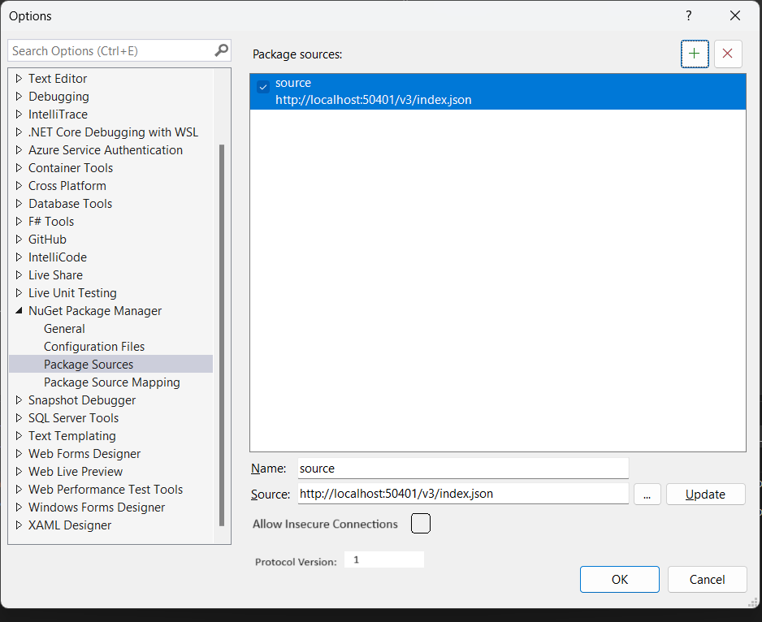

# ***PMUI Package Source option shows source properties***
<!-- Replace `Title` with an appropriate title for your design -->

- [Nigusu](https://github.com/Nigusu-Allehu) <!-- GitHub username link -->
- <!-- GitHub Issue link -->

## Summary

<!-- One-paragraph description of the proposal. -->
Currently the package sources option in the PMUI shows two properties only for each source: Name, and source(path/url). However a package source could have the following attributes: `protocolVersion`, `allowInsecureConnections`. I propose we should add a way for users to view and edit these properties in the PMUI.

## Motivation 

<!-- Why are we doing this? What pain points does this solve? What is the expected outcome? -->
This will make user experience simpler.

## Explanation

### Functional explanation

<!-- Explain the proposal as if it were already implemented and you're teaching it to another person. -->
<!-- Introduce new concepts, functional designs with real life examples, and low-fidelity mockups or  pseudocode to show how this proposal would look. -->
Say you are trying to view the package sources that have been configured for your project and you open the package source option. With new impelementation, you will now be able to view and edit all attributes of your sources. It would look as follows

### Technical explanation

<!-- Explain the proposal in sufficient detail with implementation details, interaction models, and clarification of corner cases. -->

- Add a check box for the `AllowInsecureConnections` attribute
- Add a text box for the `ProtocolVersion` attribute.
The values for the checkbox and text box will be populated by loading the values from the config files. And on update write the new values back to the config file.

## Drawbacks

<!-- Why should we not do this? -->

## Rationale and alternatives

<!-- Why is this the best design compared to other designs? -->
<!-- What other designs have been considered and why weren't they chosen? -->
<!-- What is the impact of not doing this? -->
Leave it as it is and have users directly write to the config files.

## Prior Art

<!-- What prior art, both good and bad are related to this proposal? -->
<!-- Do other features exist in other ecosystems and what experience have their community had? -->
<!-- What lessons from other communities can we learn from? -->
<!-- Are there any resources that are relevant to this proposal? -->

## Unresolved Questions

<!-- What parts of the proposal do you expect to resolve before this gets accepted? -->
<!-- What parts of the proposal need to be resolved before the proposal is stabilized? -->
<!-- What related issues would you consider out of scope for this proposal but can be addressed in the future? -->

## Future Possibilities

<!-- What future possibilities can you think of that this proposal would help with? -->
