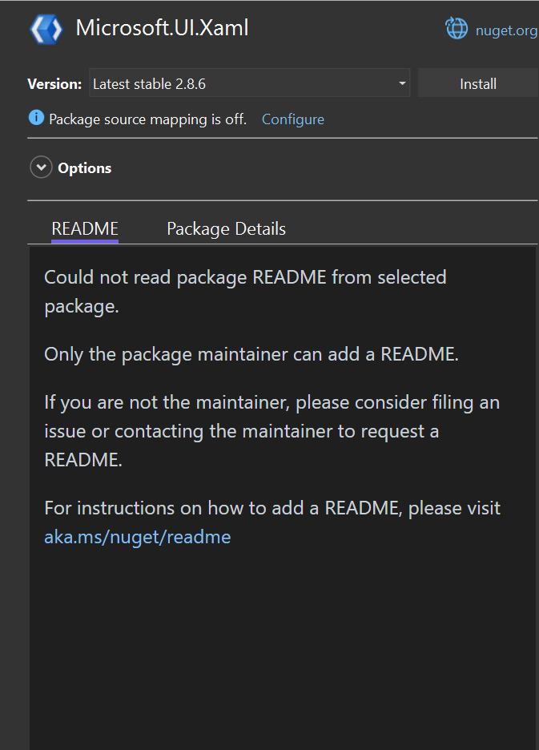

# Markdown README Rendering in PM UI

- Jonatan Gonzalez ([jgonz120](https://github.com/jgonz120)) 
- Issue [#12583](https://github.com/NuGet/Home/issues/12583) <!-- GitHub Issue link -->
- [Feature Spec](https://github.com/NuGet/Home/blob/7943122dffa435f4daeee600efcc5b744cd2e97e/accepted/2023/PMUI-README-rendering.md)

## Summary

We want to update the packages pane in the PMUI to render the README for the selected package. 
We also need to update the Nuget Server API to provide a link to download the README directly, without having to download the nupkg first.

## Motivation 

The README file is an essential source of information that can help customers understand what a package does.
By rendering the README file directly in the PM UI, customers can easily access the information they need to determine if a package will be helpful to them while searching, browsing, and managing their projects’ packages.
This enhancement streamlines the user experience and may encourage package authors to create comprehensive README documentation when customers will be more likely to rely on it for useful information about the package.

## Explanation

### Functional explanation
#### PM UI
When a package is selected we will determine if a README file exists and if it does we'll render it in the PM UI.

The PM UI will be updated to have tabs for the Package Details and the the README.
This UX will be displayed for both the Browse and installed tabs.
It will also be displayed for both the solution level and project level package managers.


When no README is available we will display a messsage in the README section.


##### README File Sources
* RawReadmeFileUrl in the [package metadata](https://learn.microsoft.com/en-us/nuget/api/registration-base-url-resource).
* README direct download specified in the [service index](https://learn.microsoft.com/en-us/nuget/api/service-index).
* Downloaded nupkg.

#### Nuget API
A new version of the [package metadata](https://learn.microsoft.com/en-us/nuget/api/registration-base-url-resource) will be documented which will include the field **RawReadmeFileUrl**. This will be a link to download the README and will only be filled if a readme is available to download.

A new [resource](https://learn.microsoft.com/en-us/nuget/api/overview#resources-and-schema) will be documented for the [service index](https://learn.microsoft.com/en-us/nuget/api/service-index). This will define a URL which can be used to download the README.

### Technical explanation

#### PM UI
##### Rendering Markdown
We will use the [Microsoft.VisualStudio.Markdown.Platform](https://dev.azure.com/azure-public/vside/_artifacts/feed/vs-impl/NuGet/Microsoft.VisualStudio.Markdown.Platform/overview/18.0.39-preview-g659b28ccd8) package to render the README in the IDE. This will allow us to leverage a centralized tool for rendering markdown in the IDE. 

A new instance of the [IMarkdownPreview](https://devdiv.visualstudio.com/DevDiv/_git/VS-Platform?path=%2Fsrc%2FProductivity%2FMarkdownLanguageService%2FImpl%2FMarkdown.Platform%2FPreview%2FIMarkdownPreview.cs) can be created using [PreviewBuilder](https://devdiv.visualstudio.com/DevDiv/_git/VS-Platform?path=/src/Productivity/MarkdownLanguageService/Impl/Markdown.Platform/Preview/PreviewBuilder.cs).

We can use the Preview builder as follows:
```C#
//This creates a new instance of the preview builder
var markdownPreview = new PreviewBuilder().Build();

//We update the current markdown being rendered by calling "UpdateContentAsync"
markdownPreview.UpdateContentAsync(markDown ?? string.Empty, ScrollHint.None)

//IMarkdownPreview.VisualElement contains the FrameworkElement to be passed to the view
MarkdownPreviewControl = markdownPreview.VisualElement
```
##### Locating the README
We will check which options have been implemented by the feed for downloading the README file. 

If the package metadata version indicates the RawReadmeFileUrl field should be available, then this will be the only option we use for downloading the ReadMe. 

If the README resource has been added to the service index then we will use the URL format defined to download the README.
This will involve checking that URL for every package. 

If neither of these options are available we will use look for the README in the local file system.
Meaning we will only render the README for already downloaded packages.

It will be up to the individual feeds to implement a solution that works best for them, or even implement both. 

## Drawbacks
MarkdownPreview control currently marked as obsolete since the interface has not been finalized.
So when an upgrade is made we may have to change how we use the control.

WebView2 controls always render ontop of other controls in the view.
[Secnario 25254665](https://microsoft.visualstudio.com/Edge/_workitems/edit/25254665).
PM UI needs to be updated to ensure items don't scroll off screen.

## Rationale and alternatives
By using an existing control we maintain consistency throughout the IDE and can rely on the owner to fix any bugs with the control.

Due to concerns about performance we will not be downloading the full nupkg temporarily just to access the README.

## Prior Art
The IMarkdownPreview is currently being used when creating a new pull request inside of Visual Studio.
 

nuget.org currently renders the README and our users will expect them to look the same.
Ex. https://www.nuget.org/packages/Newtonsoft.Json#README-body-tab

## Unresolved Questions
1. Will we show README in the updates tab?
1. ~~What do we show if the package has a README.txt instead of md?~~
    * The README is spec is written as only accepting MD.
    So we will use the nuspec to determine where the README is and treat it as md, even if the file is actually txt. 
1. ~~What do we show if there is no README defined?~~
    * Show the README tab with a message saying there is no README for the selected pacakge/version.
1. ~~Where do we get the README from when it's not on the disk?~~
    - There is no documented way of getting the README from the server without downloading the nupkg.
    Will need to document options for feeds to implement.
1. ~~Where are the README files saved in a package?~~
    - Can use Nuget.Packaging to get README location from nuspec.
1. What do we want the UX to be when an exception or error occurs while reading a README file? 
1. ~~Do we want the README to update whenever a new version is selected for the current package?~~
   - Yes.
<!-- What parts of the proposal do you expect to resolve before this gets accepted? -->
<!-- What parts of the proposal need to be resolved before the proposal is stabilized? -->
<!-- What related issues would you consider out of scope for this proposal but can be addressed in the future? -->

## Future Possibilities
Investigate ways for encouraging package owners to publish READMEs through this experience. 

Implement the option for users to opt out of rendering all images from README, similar to outlook with external images.