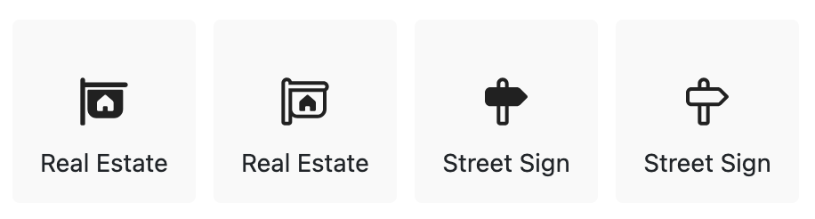
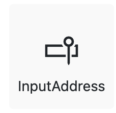
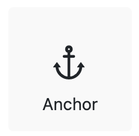

# ***Replacing the Blue Checkmark***
<!-- Replace `Title` with an appropriate title for your design -->

- Author Name Allie Barry
- GitHub Issue <!-- GitHub Issue link -->

## Summary

<!-- One-paragraph description of the proposal. -->
The purpose of this proposal is to provide a replacement for the blue checkmark as a signifier of prefix reservation on NuGet. This proposal aims to maintain the concept of prefix reservation, as it is a crucial defense mechanism against dependency confusion attacks, while fixing the confusion that it currently causes for package trust. This proposal is a small first step to conquering the larger problem of package trust and publisher authenticity within the NuGet ecosystem.

## Motivation

<!-- Why are we doing this? What pain points does this solve? What is the expected outcome? -->

The blue checkmark icon is a common paradigm across many online platforms that is known to signal some sort of "verification", trust, or authenticity on the platform. Additionally, it can often signal that the recipient of the icon is important or respected in some way. A quick Bing search of "blue checkmark meaning" returns the following: "A blue checkmark is a symbol used on many social media platforms to indicate that an account’s identity has been verified. Verification is usually reserved for accounts that are most likely to be targeted by copycats, like celebrities, brands, or influencers...The badge has one simple purpose, and that is to show that the user is an official profile". NuGet's usage of the icon goes against this paradigm, and is therefor misleading and a cause for concern.

Knowing that a package is linked to an authentic publisher is a challenge for NuGet today. The current blue checkmark misinforms developers into thinking a publisher is verified when the reality is the prefix is reserved. Common paradigms in other marketplaces are to verify ownership through different means such as a DNS record ownership and provide a blue checkmark next to the owner’s account name. These are options for us as we look beyond this proposal and towards tackling the problem of conveying package owner trust on NuGet. First, however, its imperative that we change the false trust that is placed in the blue checkmark, and find a different way to convey prefix reservation.

The blue checkmark is a known cause for confusion and misplaced perceptions of trust within the NuGet ecosystem. It is actively causing confusion because people think it means far more than it does, granting trust where none exists. In a December 2023 survey on NuGet.org, ~30% of respondents indicated having used the blue checkmark to evaluate package trust in the past month. This is largely problematic in that a significant portion of users in our ecosystem are placing trust in an unreliable source, and this could make them vulnerable to attacks.

## Explanation

### Functional explanation

<!-- Explain the proposal as if it were already implemented and you're teaching it to another person. -->
<!-- Introduce new concepts, functional designs with real life examples, and low-fidelity mockups or  pseudocode to show how this proposal would look. -->

The core of this proposal is to simply change the blue checkmark icon to a different signifier of prefix reservation. We don't want to just do away with the icon without a replacement since prefix reservation is still an important concept in the NuGet ecosystem. Our goal in selecting a new icon is to find something that represents "reserved" rather than "verified". Below is a mock-up screenshot of the proposed new prefix reservation icon.

The lock icon is a known indicator of security -- which is the purpose of the prefix reservation concept. However, the lock icon doesn't necessarily imply authenticity or some sort of vetted trust. It does a better job of communicating increased security that might come with using a package whose prefix is reserved in terms of protecting from attacks such as dependency confusion, without the potential for misplaced trust in a certain package author. There isn't as much obvious external context with something like a lock icon, as opposed to the blue checkmark (whose context is described in detail in the motivation section above).

Additionally, the lock icon is used as an analogy to the concept that prefix reservation is similar to "reserving your own land" on NuGet. Reserving a prefix on NuGet allows you to have full jurisdiction over all packages with a specific ID prefix. In a way, this is analogous to reserving "real estate" in NuGet -- you own a specific prefix, similar to how you might purchase and own a property. Similar to putting a lock on a house to restrict unwanted people from coming in, you can now put a lock on your reserved prefix to restrict unwanted parties from utilizing it.

This new icon will appear in all of the same places, and behave the same way as the current blue checkmark icon. The only thing that will change with the implementation of this proposal is the appearance of the icon.

### Technical explanation

<!-- Explain the proposal in sufficient detail with implementation details, interaction models, and clarification of corner cases. -->
TBD

## Drawbacks

<!-- Why should we not do this? -->
Potential drawbacks here are that changing the icon could be confusing for long-time users of NuGet. They might be used to seeing the blue checkmark and familiar with what it means. However, the new icon clearly conveys its meaning and, in union with the fact that the location and placement of the icon will be the same, should result in as little confusion as possible.

Additionally, with a change like this, it is imperative that we communicate the reasoning and implications of this change with users. We will plan to write a blog post and utilize other means (idea: a banner or notification on NuGet.org somewhere?) to notify users and minimize confusion.

## Rationale and alternatives

<!-- Why is this the best design compared to other designs? -->
<!-- What other designs have been considered and why weren't they chosen? -->
<!-- What is the impact of not doing this? -->
There were a few alternative icons also considered for the icon to replace the blue checkmark. They are pictured below.

Ultimately, the decision was made on the lock icon since it most obviously represents its function.

## Prior Art

<!-- What prior art, both good and bad are related to this proposal? -->
<!-- Do other features exist in other ecosystems and what experience have their community had? -->
<!-- What lessons from other communities can we learn from? -->
<!-- Are there any resources that are relevant to this proposal? -->
Twitter/X - "verified user" blue checkmark icon

## Unresolved Questions

<!-- What parts of the proposal do you expect to resolve before this gets accepted? -->
<!-- What parts of the proposal need to be resolved before the proposal is stabilized? -->
<!-- What related issues would you consider out of scope for this proposal but can be addressed in the future? -->
Are there any unknown implications/context to the lock icon? Is there a different icon that would be better to communicate prefix reservation? Should we have an icon to indicate prefix reservation in the first place? Is there anything else about the placement/behavior of the icon that should be changed given this proposal and other context?

## Future Possibilities

<!-- What future possibilities can you think of that this proposal would help with? -->
This proposal leaves open a lot of opportunity to actually answer the question of how we can communicate trust or authenticity in a package, or in an author. How can we actually accomplish what the blue checkmark was falsely conveying? How can we anchor trust of off something that is already known/trustworthy, and how can we do this in a way so as to not add or increase operational cost (i.e. individually vetting or verifying authors)?
