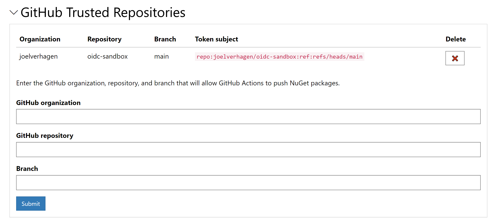
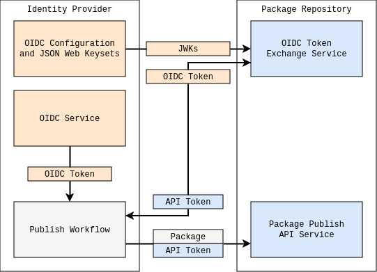
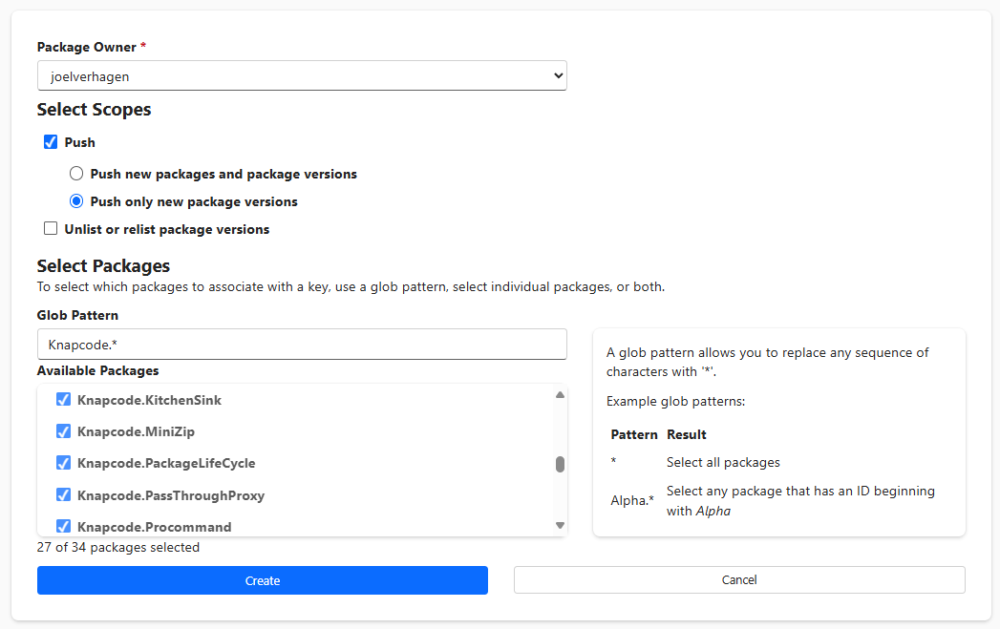

# Trusted Publishers, using OpenID Connect for NuGet push

- Author: Joel Verhagen ([@joelverhagen](https://github.com/joelverhagen) on GitHub)
- Issue: [NuGet/NuGetGallery#9332](https://github.com/NuGet/NuGetGallery/issues/9332)

## Summary

The term "Trusted Publishers" refers to a **trusted** build environment that will **publish** the package to NuGet.org.
A simple example would be building a NuGet package on GitHub Actions and publishing the .nupkg to NuGet.org via a
Trusted Publishers *trust policy*, without the need for an API key.

When publishing a package to NuGet.org, users must provide an API key to the tooling, such as `dotnet nuget push
--api-key {API_KEY}`. This API key is created manually through the NuGet.org web UI and has a fixed lifetime.
Additionally, it is relatively long lived, living for up to a year before expiring. If the API key is configured to live
a long time, it's less maintenance for the package author but has a longer viability (negative impact) if leaked. If the
API key is configured for a short time, the package author must rotate it more often in any continuous
integration/deployment (CI/CD) system they use.

Alternative to using CLI tooling for publishing is to use the NuGet.org web UI to upload the package manually.

Both using an API key for CLI operations and using the web UI have drawbacks.

This document describes a new authentication method that builds on the existing OpenID Connect (OIDC) standard and
provides several usability and security benefits.

Similar situations exist for other NuGet package sources, such as using a Personal Access Token in Azure Artifacts
(Azure DevOps) as a package source password
([docs](https://learn.microsoft.com/en-us/azure/devops/artifacts/nuget/dotnet-exe?view=azure-devops#publish-packages-from-external-sources))
or using an API key for GitHub Packages
([docs](https://docs.github.com/en/packages/working-with-a-github-packages-registry/working-with-the-nuget-registry#publishing-a-package-using-a-github-personal-access-token-as-your-api-key)).
This document focuses on NuGet.org but the design proposed could be applied to other package sources, depending on that
source's available authentication mechanisms.

This document is inspired by [Trusted Publishers for All Package
Repositories](https://repos.openssf.org/trusted-publishers-for-all-package-repositories) document. A broad description
of motivation, how the design works, and other interesting details are available there. This NuGet proposal will
duplicate a bit of the information provided in that document but more so focus on the details that are specific to
NuGet. You should be able to understand this document without reading the OpenSSF document, but you will miss some of
the rich context and prior art.

## Terminology

There is a lot of lingo in this document, so here is a reference:

| Term              | Definition                                                                                                                                                                               |
| ----------------- | ---------------------------------------------------------------------------------------------------------------------------------------------------------------------------------------- |
| CI/CD             | continuous integration/continuous deployment, technologies like GitHub Actions for building or deploying code automatically                                                              |
| forge             | A place to store code, often a SaaS offering like GitHub, GitLab, or Bitbucket, often has a CI/CD offering paired                                                                        |
| JWKs              | JSON web key set, a set of public keys that can be used to verify an OIDC token                                                                                                          |
| JWT               | A JSON web token, a format of bearer token used for web authentication flows including OIDC, contains interesting "claims" (properties) in clear text                                    |
| NuGet API key     | one of the authentication mechanisms used for uploading packages to a package source, a hex string starting with `oy2` when from NuGet.org                                               |
| nupkg             | The file extension for a NuGet package, produced by NuGet pack, uploaded by NuGet push                                                                                                   |
| OIDC              | OpenID Connect, an authentication protocol build on OAuth 2.0, think of it as a way for NuGet.org to trust GitHub Actions via a JWT included in package upload                           |
| pack              | The name of the package creation operation, produces a .nupkg and optionally a .snupkg                                                                                                   |
| package source    | A NuGet.org package feed, or package registry (all synonymous), a destination for push operations                                                                                        |
| push              | The name of the package upload operation in NuGet ecosystem                                                                                                                              |
| Trusted Publisher | A name for a CI/CD environment that can generate OIDC tokens, using workload identity, [described by OpenSSF](https://repos.openssf.org/trusted-publishers-for-all-package-repositories) |

## Motivation 

The motivation is best summarized by the [Trusted Publishers for All Package
Repositories](https://repos.openssf.org/trusted-publishers-for-all-package-repositories) document, published by the
[OpenSSF Securing Software Repositories Working Group](https://github.com/ossf/wg-securing-software-repos) (say that 10
times fast).

> The goal of Trusted Publishers is to reduce the need for long-lived tokens or credentials to be shared with external
> systems when authenticating with package repositories. 

A long-lived NuGet.org API key poses a real security risk for package authors. If that token were to be leaked, a
malicious actor could publish packages on behalf of the package authors, threatening the security of all users of that
package. There are some mitigations for this risk, such as [author-signed
packages](https://learn.microsoft.com/en-us/nuget/reference/signed-packages-reference), but it's still a very real risk.

The Trusted Publishers pattern allows the package author to perform a one-time trust policy configuration inside of a
package registry (NuGet.org in this case) and thereafter depend on their secure build environment (such as GitHub
Actions) to properly authenticate with NuGet.org, exercising the trust policy while publishing a package.

Any secret related to this new flow is short-lived, meaning leaks are less impactful. The burden of rotating an API key
in a secret store that is available to the package author's publishing pipeline is removed. 

So, it's a usability win and a security win!

## Functional explanation

At the core of this design is a requirement. The package author must publish their package to NuGet.org from an
environment that is supported by the Trusted Publishers feature. The build environment must support OpenID Connect
(OIDC) tokens because they take the place of long-lived NuGet API keys as the credential. The NuGet package source must
also be configured to allow OIDC tokens from this specific build environment.

For the sake of understanding, we'll use GitHub and GitHub Actions as the example below, but it's important to note that
other build environments (i.e. other Trusted Publishers) could be added later without too much difficulty. To think
about Bitbucket or GitLab support (for example), simply replace the GitHub feature mentioned with the related feature on
the other forge.

A package author performs the following steps to make use of the Trusted Publishers feature:

[Prerequisite](#prerequisite-set-up-a-github-repository-for-the-nuget-package): set up a GitHub repository for the NuGet
package
   - This is all the package's code to be built and uploaded in the trusted build environment.

[Step 1](#step-1-add-a-github-actions-trust-policy-to-your-nugetorg-account): add a GitHub Actions trust policy to your
NuGet.org account
   - This is to instruct NuGet.org to accept a pattern of GitHub tokens as a valid credential, in lieu of API key.

[Step 2](#step-2-add-a-github-actions-workflow-with-nugetorg-trusted-publisher-authentication): add a GitHub Actions
workflow with NuGet.org Trusted Publisher authentication
   - This instructs the NuGet client tooling to authenticate with NuGet.org using a GitHub Actions OIDC token.

[Step 3](#step-3-execute-the-workflow-to-push-the-package-to-nugetorg): execute the workflow to push the package to
NuGet.org
   - This will trade the GitHub Action OIDC token for a short-lived NuGet API key and perform the package push with the
     temporary API key.

Let's expand each of these steps for better understanding.

### Prerequisite: set up a GitHub repository for the NuGet package

This step is pretty self explanatory. Many developers, even hobbyist developers who are only producing packages for
their own consumption, already have their source code stored in a Git repository, hosted on GitHub.

Additionally, GitHub Actions must be enabled for your repository. For public repositories, there is a generous free
tier, enabled by default after adding a workflow YAML definition to your repository. For more information, see [About
billing for GitHub
Actions](https://docs.github.com/en/billing/managing-billing-for-github-actions/about-billing-for-github-actions). I
will provide more details below on what the GitHub Actions workflow YAML looks like for NuGet.org Trusted Publishers.
There is no requirement on whether the GitHub repository is public or private. Any valid token issued by the
`https://token.actions.githubusercontent.com` issuer is acceptable.

From our data, 61% of active packages have a repository URL or [SourceLink](https://github.com/dotnet/sourcelink)
pointing to GitHub on the latest version of their package.

Here is a summary of known forges, based on package URL, repository URL, SourceLink information on NuGet.org:

<!--
   let ForgeBySourceLink = NiPackageVersions
   | where IsLatestSemVer2
   | project Identity
   | join kind=inner NiNuGetPackageExplorerFiles on Identity
   | where Created > ago(365d)
   | where array_length(SourceUrlRepoInfo) > 0
   | mv-expand SourceUrlRepo = SourceUrlRepoInfo
   | extend Host = tostring(SourceUrlRepo.Repo.Host)
   | extend RepoType = tostring(SourceUrlRepo.Repo.Type)
   | extend Forge = case(
      RepoType == "GitHub", "GitHub",
      Host endswith "codeberg.org", "Codeberg",
      Host endswith "gitea.com", "Gitea",
      Host endswith "gitlab.com", "GitLab",
      Host endswith "bitbucket.org", "Bitbucket",
      Host endswith "gitee.com", "Gitee",
      Host endswith ".visualstudio.com" or Host endswith "dev.azure.com", "Azure DevOps",
      Host endswith "github.com", "GitHub",
      Host contains "gitlab", "GitLab",
      Host contains "bitbucket", "GitLab",
      "")
   | where isnotempty(Forge)
   | summarize FileCount = sum(toint(SourceUrlRepo.FileCount)) by Identity, Forge
   | summarize arg_max(FileCount, Forge) by Identity
   | project-away FileCount
   | project-rename SourceLinkForge = Forge;
   let ForgeByManifestUrl = NiPackageVersions
   | where IsLatestSemVer2
   | project Identity
   | join kind=inner NiPackageManifests on Identity
   | where Created > ago(365d)
   | project-away Owners
   | join kind=inner NiPackageOwners on LowerId
   | join kind=inner NiPackageDownloads on Identity
   | extend RepositoryUrl = tostring(RepositoryMetadata.Url)
   | project-reorder Id, Version, ProjectUrl, RepositoryUrl
   | extend HasUrl = isnotempty(ProjectUrl) or isnotempty(RepositoryUrl) and tolower(ProjectUrl) != "project_url_here_or_delete_this_line"
   | extend Forge = case(
      strcat(RepositoryUrl, ProjectUrl) contains "codeberg.org", "Codeberg",
      strcat(RepositoryUrl, ProjectUrl) contains "gitea.com", "Gitea",
      strcat(RepositoryUrl, ProjectUrl) contains "gitlab.com", "GitLab",
      strcat(RepositoryUrl, ProjectUrl) contains "bitbucket.org", "Bitbucket",
      strcat(RepositoryUrl, ProjectUrl) contains "gitee.com", "Gitee",
      strcat(RepositoryUrl, ProjectUrl) contains ".visualstudio.com" or strcat(RepositoryUrl, ProjectUrl) contains "dev.azure.com", "Azure DevOps",
      strcat(RepositoryUrl, ProjectUrl) contains "github.com", "GitHub",
      "(unknown)")
   | project Identity, LowerId, Owners, TotalDownloads, ManifestUrlForge = Forge;
   let LatestPackageForges = ForgeByManifestUrl
   | join kind=leftouter ForgeBySourceLink on Identity
   | extend Forge = coalesce(SourceLinkForge, ManifestUrlForge)
   | project-away Identity1, SourceLinkForge, ManifestUrlForge;
   let Summary = LatestPackageForges
   | summarize
      ["Package IDs"] = count(),
      Owners = count_distinct(tostring(Owners)) by Forge
   | order by ['Package IDs'] desc;
   let TotalPackageIds = toscalar(Summary | summarize sum(['Package IDs']));
   let TotalUniqueOwnersSets = toscalar(Summary | summarize sum(Owners));
   Summary
   | extend ["% of package IDs"] = round(100.0 * ['Package IDs'] / TotalPackageIds, 2)
   | extend ["% of owners"] = round(100.0 * Owners / TotalUniqueOwnersSets, 2)
-->

| Forge        | Package IDs | Owners | % of package IDs | % of owners | Has CI/CD OIDC                                                                                                                                         |
| ------------ | ----------- | ------ | ---------------- | ----------- | ------------------------------------------------------------------------------------------------------------------------------------------------------ |
| GitHub       | 74440       | 14742  | 61.37            | 55.77       | [Yes](https://docs.github.com/en/actions/security-for-github-actions/security-hardening-your-deployments/about-security-hardening-with-openid-connect) |
| (unknown)    | 42738       | 10997  | 35.24            | 41.6        |
| Azure DevOps | 1448        | 238    | 1.19             | 0.9         | [Yes, but Azure-specific](https://learn.microsoft.com/en-us/azure/devops/pipelines/release/configure-workload-identity?view=azure-devops)              |
| Gitee        | 1440        | 188    | 1.19             | 0.71        | No?                                                                                                                                                    |
| GitLab       | 825         | 165    | 0.68             | 0.62        | [Yes](https://docs.gitlab.com/ee/integration/openid_connect_provider.html)                                                                             |
| Bitbucket    | 392         | 98     | 0.32             | 0.37        | [Yes](https://support.atlassian.com/bitbucket-cloud/docs/integrate-pipelines-with-resource-servers-using-oidc/)                                        |
| Codeberg     | 6           | 3      | 0                | 0.01        | No?                                                                                                                                                    |
| Gitea        | 1           | 1      | 0                | 0           | No?                                                                                                                                                    |

(considering only latest package versions metadata of packages published in the past year, our definition of "active
packages")

For this reason, we are focused on GitHub Actions as the first Trusted Publisher that NuGet.org supports.

### Step 1. add a GitHub Actions trust policy to your NuGet.org account

Somehow, NuGet.org must verify that an uploaded package is coming from the right person.

Prior to Trusted Publishers, an **API key** acted as both the username and password to authenticate as the package owner
during package upload. For web UI upload on NuGet.org, the user's logged in session (via browser cookies) authenticates
the user. In lieu of these two older authentication methods, a package author must tell NuGet.org that they *trust*
package uploads GitHub Actions coming from a specific **repository**. In addition to restrictions on which GitHub
repository and workflow are applicable to the trust policy, API scoping will be allowed similar to API keys.

In short, a GitHub Actions trust policy is restricted in two ways:

1. **Which GitHub Actions repository and workflow is trusted?**
2. **What NuGet API operations can be used inside the GitHub actions workflow?**

#### Which GitHub Actions repository and workflow is trusted?

The user will sign in to NuGet.org, navigate to a new "Trusted Publishers" account page, and configure a trusted GitHub
repository using a form like this:



In the form, the package author would provide 3 critical pieces of information:

1. The GitHub organization or username owning the repository.
2. The GitHub repository name.
3. Some filter on which GitHub Action workflow runs should be allowed to push packages.

The filter on which workflow runs should be allowed to publish packages can potentially be very specific. GitHub Actions
supplies a variety of metadata in the OIDC token available to workflow runs. Refer to [Understanding the OIDC
token](https://docs.github.com/en/actions/deployment/security-hardening-your-deployments/about-security-hardening-with-openid-connect#understanding-the-oidc-token)
to see all of the properties.

We will start with the following workflow filters:
- Filtering for a *branch* pattern (e.g. `main` or `releases/*`), as shown in the UI above (branch filter)
- Filtering for a specific *environment* (a property optionally set in the workflow)
- Filtering for a specific *workflow path* (relative file path within the repository)
- Filtering for a *tag* pattern (e.g. `v*`)

The screenshot above only shows the branch filter, so the UI will need to be expanded to cover the desired workflow
filters. A suggest UI would have 4 checkboxes:
- [ ] Filter by workflow: __________
- [ ] Filter by environment: __________
- [ ] Filter by branch: __________ (wildcard pattern supported)
- [ ] Filter by tag: __________ (wildcard pattern supported)

The branch and tag option are mutually exclusive.

At least one filter would need to be checked as to prevent an overly broad trust policy.

Additional filters can be added in the future based on other properties provided in the GitHub OIDC token.

In short, by adding this trust policy, the package author is saying:

> I trust GitHub to only issue tokens for my repository for my GitHub Actions workflow *and* these tokens are sufficient
> credentials for uploading packages to my NuGet.org account.

Once the package author has added this trust policy, NuGet.org will trust GitHub Actions OIDC tokens matching this
pattern much like an existing long-lived API key, with the added benefit of the trust policy never expiring.

NuGet package sources must ensure a secure, authenticated session for the user that is adding the trust policy.
NuGet.org requires two-factor authentication for all web UI sign-ins.

#### What NuGet API operations can be used inside the GitHub Actions workflow?

We will not implement scoping rules as flexible as the current long-lived API key flow on the GitHub Actions trust
policy. See the [Enable existing scoping features allowed on long-lived API
keys](#enable-existing-scoping-features-allowed-on-long-lived-api-keys) section below for why we are keeping it simple.

In short, all NuGet API key operations will be supported by the GitHub Actions workflow: pushing new package IDs,
updating existing package IDs, unlisting/relisting package versions.

The user must still select the package owner that the trust policy applies to since this allows a new package ID to have
the proper owner: either the user themself or an organization they are a member of. This resolves the ["Pending" Trusted
Publishers](https://repos.openssf.org/trusted-publishers-for-all-package-repositories#pending-trusted-publishers)
problem.

Multiple trust policies can be defined. If any of the trust policies match the incoming package and GitHub Action token,
the operation will be allowed. If the package ID is new and there is ambiguity on which package owner should be assigned
to the package (due to multiple matching trust policies), the most recently created trust policy will be used.

If a package is transferred to another owner (i.e. the owner of the trust policy is removed as a owner of the package
the policy was intended for), the trust policy will no longer be effective. This is much like the current API key flow
where you could create an API key for `Microsoft.*`, but this does not give you access to all `Microsoft.*` packages --
only ones that the package owner scope has direct ownership of at the time of package push.

### Step 2: add a GitHub Actions workflow with NuGet.org Trusted Publisher authentication

Without Trusted Publisher authentication, an upload to NuGet.org from GitHub Actions would look like this. This is a
YAML document that describes the steps to perform in the GitHub Actions CI pipeline.

```yaml
on:
  workflow_dispatch:
jobs:
  build:
    runs-on: ubuntu-latest
    steps:
      - uses: actions/checkout@v4

      - name: NuGet pack
        run: dotnet pack src/Knapcode.MyBestPackage --output artifacts

      # use a long-lived NuGet API key set in GitHub Actions secret, manually configured in the repository
      - name: NuGet push
        run: dotnet nuget push artifacts/*.nupkg -k ${{secrets.NUGET_API_KEY}} -s https://api.nuget.org/v3/index.json
```

The package author must keep the `NUGET_API_KEY` secret up to date and ensure that they don't leak the secret value, on
accident (e.g. accidentally committing it to a GitHub repo). At least once a year (more frequently based on the API key
lifetime), the package author will need to sign in to NuGet.org, refresh the API key, and set it in the repository
secrets in GitHub.

To enable Trusted Publisher authentication, the GitHub Actions workflow will look something like this:

```yaml
on:
  workflow_dispatch:
permissions:
  contents: read # required for checkout
  id-token: write # required to get a token
jobs:
  build:
    runs-on: ubuntu-latest
    steps:
      - uses: actions/checkout@v4

      - name: NuGet pack
        run: dotnet pack src/Knapcode.MyBestPackage --output artifacts

      # this step fetches a GitHub Actions OIDC token and trades it for a short-lived NuGet API key
      # the NuGet API key is stored as a step output for use in the next step
      - name: NuGet login
        uses: nuget/login@v1
        id: login
        with:
          user: joelverhagen # this is the user profile which has the GitHub Actions trust policy
          source: https://api.nuget.org/v3/index.json
      
      # this is exactly the same as before, but uses a short-lived API acquired on the fly
      - name: NuGet push
        run: dotnet nuget push artifacts/*.nupkg -k ${{steps.login.outputs.NUGET_API_KEY}} -s https://api.nuget.org/v3/index.json
```

This experience could be further improved with changes in the .NET SDK, such as allowing the push API key to come from
an environment variable ([NuGet/Home#12539](https://github.com/NuGet/Home/issues/12539)) or adding a `dotnet nuget
apikey set` command ([NuGet/Home#6437](https://github.com/NuGet/Home/issues/6437)), either of which could be done
automatically inside the `nuget/login` step.

The `user` parameter to the `nuget/login` step is the name of the user profile that has the GitHub Actions trust policy
set, as described in the previous section. This can be a little confusing if the package is actually owned by an
organization that the user is a member of. In this case, the `user` parameter will still be the user profile, but the
trust policy will have a **Package owner** set to be the organization name. This aligns with the current API key
experience where API keys (and therefore trust policies) are not set on the organization. Instead, they are set by the
user who is a member of the organization. The package will be recorded as being pushed by a specific user *on behalf of*
an organization instead of being pushed by the organization directly. 

As with the current experience with long-lived API keys, the API key is limited in what it can do based on the scopes
assigned to the trust policy.

If a symbol package (.snupkg) is produced along with the .nupkg, it can also be pushed using the same API key. `dotnet
nuget push` handles this automatically.

### Step 3: execute the workflow to push the package to NuGet.org

In the sample above, the workflow has a `workflow_dispatch` trigger meaning it can be queued manually. However your
workflow is triggered, it will perform the following steps as described in the workflow YAML.

A flow chart of data flow between the Trusted Publisher (Identity Provider) and the Package Repository (NuGet.org) is
shown below. This is lovingly *stolen* from the OpenSSF Trusted Publishers document linked above.



This describes a two-legged authentication flow. The first leg is trading an OIDC token for an API key. The second leg
is using the API key for a privileged action, like package upload.

In written form, this happens:

1. The `nuget/login` workflow step does this:
   - Fetch a GitHub Actions OIDC token, enabled via the `id-token: write` workflow permission
   - Send the OIDC token to a NuGet.org endpoint, along with the NuGet.org username
1. NuGet.org does this:
   - Receive the OIDC token, verify the token using the public GitHub Actions keyset and other JWT rules
   - Verify the provided username has a trust policy matching the OIDC token
   - Generate a short-lived API key and return it to the caller
1. The `nuget/login` workflow step does this:
   - Receive the short-lived API key and set it as a step output
2. The `dotnet nuget push` workflow step does this:
   - Use the provided API key to perform a package push, using the [`PackagePublish`
     resource](https://learn.microsoft.com/en-us/nuget/api/package-publish-resource)
3. NuGet.org does this:
   - Verify the provided package and package operation match the scopes on the API key
   - Publish the package!

## Technical explanation

See the [technical document](trusted-publishers-oidc-for-nuget-push.technical.md) in this case directory for more
information.

## Drawbacks

This workflow only helps users who want to build and push their packages on a recognized Trusted Publisher. Not all
CI/CD systems will be supported so some users will still need to use the older authentication flows such as long-lived,
manually rotated API keys.

The trust policy is configured once and works forever. An API key forces the package author to re-assess CI/CD
infrastructure on a regular basis. We can consider a ["dead man's
switch"](https://en.wikipedia.org/wiki/Dead_man%27s_switch) approach to force the package owner to attest that the trust
policy is still desired if this is a big concern.

If a series of pushes in a workflow outlive a short-lived API keys, later pushes may fail with "API key expired" errors.
This could be mitigated by creating a NuGet credential provider that fetches the API key during the push operation, if
it detects the current API key is expired.

Because a trust policy is defined at the user level, there can be a mismatch of user or organization profile the trust
policy is acting on behalf of. This is disambiguated by the "package owner" scope on the trust policy, much like the
existing long-lived API key flow, but this can still be confusing. If we find this flow doesn't work well for users, an
additional parameter can be added to the `nuget/login` step which is `owner`. If provided, this will assert that the
desired package owner is `X` (such as an organization name). If no trust policy is found on the user for that package
owner, a helpful error could be provided. We can wait on implementing this until we hear more from users.

## Rationale and alternatives

### Naming

The name "trusted publishers" may seem overly vague. There has been conversations about this [on Hacker
News](https://news.ycombinator.com/item?id=35646436). I think NuGet should use the term Trusted Publishers to align with
other registries and OpenSSF guidance, but mention terms like "OIDC", "workload identity", or "GitHub Actions"
generously in blogs and docs to aid in understanding. See the name of this spec as an example.

### Two-legged vs. one-legged authentication

Original prototypes did not perform a two-legged authentication flow. The OIDC token was used directly during the push
operation.

The two-legged approach gives use two big wins:

1. We control the duration the the main credential lives for. The package source can choose how long the NuGet API key
   lives for. Manual revocation or secret leak detection systems can work for this. NuGet.org has no control over how
   long the GitHub Actions OIDC token lives. It's true that GitHub OIDC token could be leaked also, but this problem can
   be mitigated with `jti` controls and even stricter validations of the `exp` claim (i.e. enforcing a shorter lifetime
   for the token trade).
2. Existing versions of NuGet client tooling can work without any change, since they already accept an API key.
   Currently NuGet authentication plugins do not support `Bearer` token auth
   ([NuGet/Home#12877](https://github.com/NuGet/Home/issues/12877),
   [dotnet/runtime#91867](https://github.com/dotnet/runtime/issues/91867)) so this would limit how NuGet client tooling
   could express the OIDC token during push for a one-legged approach.

### NuGet operations that support Trusted Publishers

Currently there are two branches of authentication in NuGet world. First is API-key based authentication for package
push, package delete (unlist), and package relist. These flows will support Trusted Publisher-based short-lived API
keys. This spec focuses on package push but package delete (unlist) and package relist should be supported also, as long
as the implementation cost/complexity is not affected too much. Any additional operation the changes package state could
be assessed in the future (such as a package deprecation API). All of these "modify package" operations use the
`X-NuGet-ApiKey` header to send the API key in clear text, thus requiring HTTPS to be secure.

The other branch of NuGet authentication is package source authentication for **read-only** operations. This typically
uses a username/password-like flow via HTTP `Basic` authorization header. This flow is not impacted by Trusted
Publishers and existing mechanisms will not change (such as how credential providers work). Note that token-based
package sources such as Azure DevOps stuff bearer tokens into the `Basic` password field, as a workaround for NuGet's
lack of bearer token support (as mentioned in the previous section).

Trusted Publishers will have the biggest impact on the ecosystem when it is supported on NuGet.org. This only needs the
first branch of auth (API-key) so considering read-only (package download/restore) scenarios is not needed now.

### Entra ID authentication

We could opt to enable Entra ID service principal-based authentication. Then, users could leverage existing Entra ID
support for workload identity federation
([docs](https://learn.microsoft.com/en-us/entra/workload-id/workload-identity-federation)) which uses Federated Identity
Credentials ([docs](https://learn.microsoft.com/en-us/graph/api/resources/federatedidentitycredentials-overview)). This
is similar to [VS Marketplace](https://marketplace.visualstudio.com/) and how it could provide extension publishing from
CI/CD workflows. In the end, this approach could support GitHub Actions via
[`azure/login`](https://github.com/azure/login) or any compute environment you want (such as an Azure VM with a managed
identity), as long as you can authenticate as an Entra ID service principal. The drawback of this is that NuGet.org
would have no control over the workload identity tokens which are accepted and would be opening up a lot more
authentication scenarios than we really need at this point. This would also require us rationalizing how an Entra ID
service principal relates to a NuGet.org user or organization profile.

Today NuGet.org allows Entra ID (formerly AAD, Azure Active Directory) user sign in as well as personal Microsoft
account (MSA) sign in. Therefore there is already some relationship between NuGet.org and Entra ID. In what way this
existing integration would be affected by a service principal flow is unclear. So this idea would be a lot more work!
Maybe it's something we need in the distant future, but not now.

### Enable existing scoping features allowed on long-lived API keys

Today, long-lived API keys can be scoped by package owner, by allowed action, and by package ID (via a wildcard
pattern).



For more information about scopes on API keys, see [Scoped API
keys](https://learn.microsoft.com/en-us/nuget/nuget-org/scoped-api-keys). In summary:

- **Package owner**: for users that are members of one or more organizations, it's important to know which package owner
  this trust policy acts on behalf of. For example, in my screenshot above the package owner is set to `joelverhagen`,
  so packages owned only by my `snoozecorp` organization will not accept package uploads via this trust policy. This is
  also important to define who is the initial owner of a package that is newly created. In this example, if I push a new
  `Knapcode.MyBestPackage` package ID, the new package ID will be owned by `joelverhagen`, not `snoozecorp` or any other
  organization that I am a member of based on this package owner definition.

- **Scopes**: the scope radio buttons and checkboxes define what kind of operations the trust policy can be used for.
  For example, can the trust policy be used to unlist packages in addition to publishing new packages? Can only versions
  on existing package IDs be published? Or new package IDs be created as well?

- **Glob pattern**: this defines which package IDs the trust policy can apply to, based on a wildcard pattern (called
  "glob" in this context for historical reasons). If you want the trust policy to apply to all package IDs you own, you
  would specify `*`. Note that a broad wildcard like `*` does not supersede access controls on package IDs you do not
  own. It just defines which if your packages the trust policy can work for.

The screenshot above allows only new package versions to be pushed for packages owned by `joelverhagen`, having IDs
starting in `Knapcode.`. New package IDs cannot be created in this case nor can packages be unlisted.

The package owner scoping is necessary so that an API key operates on behalf of the proper package owner (i.e. the user
themself or an organization they are a member of).

The other two scoping options both have a mix of adoption, as shown below.

#### Allowed action usage

<!--

  WITH
  CredentialScopes AS (
      SELECT
          c.[Key] AS CredentialKey,
          c.UserKey,
          c.Created,
          c.ExpirationTicks,
          s.[Key] AS ScopeKey,
          s.Subject,
          s.AllowedAction,
          s.OwnerKey,
          IIF(s.AllowedAction = 'package:verify', 1, 0) AS AllowsPackageVerify,
          IIF(s.AllowedAction = 'package:push', 1, 0) AS AllowsPackagePush,
          IIF(s.AllowedAction = 'package:unlist', 1, 0) AS AllowsPackageUnlist,
          IIF(s.AllowedAction = 'package:pushversion', 1, 0) AS AllowsPackagePushVersion
      FROM dbo.[Credentials] c
      LEFT OUTER JOIN dbo.Scopes s ON c.[Key] = s.CredentialKey
      WHERE c.Expires > SYSDATETIME() AND c.[Type] LIKE 'apikey.%'
  ),
  CredentialAllowedActions AS (
      SELECT
          CredentialKey,
          IIF(SUM(AllowsPackageVerify) > 0, 1, 0) AS AllowsPackageVerify,
          IIF(SUM(AllowsPackagePush) > 0, 1, 0) AS AllowsPackagePush,
          IIF(SUM(AllowsPackageUnlist) > 0, 1, 0) AS AllowsPackageUnlist,
          IIF(SUM(AllowsPackagePushVersion) > 0, 1, 0) AS AllowsPackagePushVersion
      FROM CredentialScopes
      GROUP BY CredentialKey
  ),
  CredentialAllowedActionsSummary AS (
      SELECT AllowsPackagePush, AllowsPackagePushVersion, AllowsPackageUnlist, COUNT(*) AS [Count]
      FROM CredentialAllowedActions
      WHERE AllowsPackageVerify = 0
      GROUP BY AllowsPackagePush, AllowsPackagePushVersion, AllowsPackageUnlist
  )
  SELECT
      AllowsPackagePush [Push],
      AllowsPackagePushVersion [Push version],
      AllowsPackageUnlist [Unlist],
      ROUND(100.0 * [Count] / (SELECT SUM([Count]) FROM CredentialAllowedActionsSummary), 2) AS [% of total]
  FROM CredentialAllowedActionsSummary
  ORDER BY [Count] DESC

-->

| Push | Push version | Unlist | % of total | Notes                                              |
| ---- | ------------ | ------ | ---------- | -------------------------------------------------- |
| 1    | 0            | 0      | 79.76      | Push new IDs and update existing IDs               |
| 1    | 0            | 1      | 12.58      | Push new IDs and update existing IDs, allow unlist |
| 0    | 1            | 0      | 6.77       | Update existing IDs                                |
| 0    | 0            | 1      | 0.48       | Allow unlist                                       |
| 0    | 1            | 1      | 0.41       | Update existing IDs, allow unlist                  |

Note that "Push" implies "Push version" allowed action.

The first two rows should be considered "high privilege" API keys. They account for about 93% of the API keys. This
suggests users do not care much about limiting the allowed action of an API key.

#### Package ID pattern usage

<!--

  WITH
  CredentialInfo AS (
      SELECT
          c.[Key] AS CredentialKey,
          c.UserKey,
          c.Created,
          c.ExpirationTicks,
          s.[Key] AS ScopeKey,
          s.Subject,
          s.AllowedAction,
          s.OwnerKey,
          IIF(s.Subject = '*', 1, 0) AS MatchAll,
          IIF(s.Subject != '*' AND s.Subject LIKE '%*', 1, 0) AS MatchPrefix,
          IIF(s.Subject != '*' AND s.Subject LIKE '*%', 1, 0) AS MatchSuffix,
          IIF(s.Subject != '*' AND s.Subject LIKE '%*%', 1, 0) AS MatchPrefixSuffix,
          IIF(s.Subject NOT LIKE '%*%', 1, 0) AS MatchExact
      FROM dbo.[Credentials] c
      LEFT OUTER JOIN dbo.Scopes s ON c.[Key] = s.CredentialKey
      WHERE c.Expires > SYSDATETIME() AND c.[Type] LIKE 'apikey.%' AND s.AllowedAction != 'package:verify'
  ),
  CredentialSubjects AS (
      SELECT
          CredentialKey,
          SUM(MatchAll) AS MatchAll,
          SUM(MatchPrefix) AS MatchPrefix,
          SUM(MatchSuffix) AS MatchSuffix,
          IIF(SUM(MatchPrefix) = 0 AND SUM(MatchSuffix) = 0 AND SUM(MatchPrefixSuffix) > 0, SUM(MatchPrefixSuffix), 0) AS MatchPrefixSuffix,
          SUM(MatchExact) AS MatchExact
      FROM CredentialInfo
      GROUP BY CredentialKey
  ),
  CredentialSubjectTypes AS (
      SELECT
          CredentialKey,
          CASE
              WHEN MatchAll > 0 THEN 'Glob, match all'
              WHEN MatchExact = 1 AND MatchAll + MatchPrefix + MatchSuffix + MatchPrefixSuffix = 0 THEN 'Exact match, single'
              WHEN MatchExact > 1 AND MatchAll + MatchPrefix + MatchSuffix + MatchPrefixSuffix = 0 THEN 'Exact match, multiple'
              WHEN MatchExact = 0 AND MatchAll + MatchPrefix + MatchSuffix + MatchPrefixSuffix > 0 THEN  'Glob, partial match'
              ELSE 'Glob and exact match'
          END AS [Type]
      FROM CredentialSubjects
  ),
  CredentialSubjectsSummary AS (
      SELECT [Type], COUNT(*) AS [Count]
      FROM CredentialSubjectTypes
      GROUP BY [Type]
  )
  SELECT
      [Type],
      ROUND(100.0 * [Count] / (SELECT SUM([Count]) FROM CredentialSubjectsSummary), 2) AS [% of total]
  FROM CredentialSubjectsSummary
  ORDER BY [Count] DESC

-->

| Type                  | % of total | Example                              |
| --------------------- | ---------- | ------------------------------------ |
| Glob, match all       | 57.26      | `*`                                  |
| Exact match, single   | 20.58      | `NuGet.Protocol`                     |
| Glob, partial match   | 14.59      | `NuGet.*`                            |
| Exact match, multiple | 6.92       | `NuGet.Protocol`, `NuGet.Frameworks` |
| Glob and exact match  | 0.65       | `Microsoft.*`, `NuGet.Protocol`      |

This form of scoping based on package ID has a lot more variety than the previous section. Close to half of users go
very broad with their scoping (`*`, allow all package IDs). The 2nd place scoping is very specific: only a single
package ID can be modified with the API key.

The current UI defaults to an empty glob pattern text field and a list of visible checkboxes for all of the package IDs
the user has upload permissions for. This requires the user to provide *some* input. It's not clear whether this UI
gently encourages users to click the checkboxes since that's probably quicker than typing. If I were to guess, the adoption
of `*` would go up a lot if we defaulted the package ID text field to `*`.

#### Conclusion

Since the majority use case for both allowed action and package ID scoping is a very permissive option, we won't enable
these two scoping options for short-lived API keys. The short-lived API keys will be able to perform any operation on
any package ID (e.g. `*` pattern).

We can add this level of configuration later as users request it.

The package owner dropdown is still needed.

## Prior Art

- This feature has been prototyped and demoed to the NuGet team a couple of times, as far back as February of 2022. More
  recently, a prototype was made using credential providers and one-legged auth:
  - [joelverhagen/token-login-sample](https://github.com/joelverhagen/token-login-sample) - sample one-legged auth
    GitHub Actions workflow
  - [joelverhagen/token-login](https://github.com/joelverhagen/token-login) - sample one-legged auth step (used by the
    above)
  - [NuGet/NuGetGallery@jver-oidc](https://github.com/NuGet/NuGetGallery/tree/jver-oidc) - branch on NuGetGallery to
    supported one-legged auth
- [Trusted Publishers for All Package
Repositories](https://repos.openssf.org/trusted-publishers-for-all-package-repositories), by Seth Larson
- Trusted Publishers has been implemented by:
  - Python Package Index, a.k.a. PyPI ([blog](https://blog.pypi.org/posts/2023-04-20-introducing-trusted-publishers/),
    [docs](https://docs.pypi.org/trusted-publishers/))
  - RubyGems ([blog](https://blog.rubygems.org/2023/12/14/trusted-publishing.html),
    [docs](https://guides.rubygems.org/trusted-publishing/))
  - pub.dev ([docs](https://dart.dev/tools/pub/automated-publishing))

## Unresolved Questions

Ask away!

## Future Possibilities

### Enable additional CI/CD systems that support OIDC tokens
  
Azure DevOps is next on the popularity list. Their workload identity federation is very focused on Azure today
([blog](https://devblogs.microsoft.com/devops/workload-identity-federation-for-azure-deployments-is-now-generally-available/)).

Gitee appears to be a Chinese source forge. We have not heard from our users about Gitee and NuGet.org integration.

PyPI supports GitLab. We could follow suit if we hear from our users.

The Trusted Publishers (i.e. forges, CI/CD platforms) that NuGet.org chooses to adopt in the future will be evaluated on
a case-by-case basis. We will consider factors such (but not limited to):
- Does the Trusted Publisher provide a generic or NuGet-targeted OIDC token system?
  - In other words, we don't want to hack in Trusted Publisher support if the OIDC token is really meant for something
    besides NuGet.
- How popular is the Trusted Publisher in our user base?
  - Trusted Publishers need specific UI elements on NuGet.org and this specific work should justifiable given our other
    priorities.
- Is there transparency from the Trusted Publisher around the issued tokens?
  - In other words, is it very clear to us and the even package consumers that a token is a sufficient replacement for
    an API-key from a security perspective.

### Enforce short-lived (OIDC) auth for onboarded packages/package owners

When a package owner opts to start using this Trusted Publishers feature, they have improved their security posture from
no longer depending on long-lived secrets that have are very damaging if leaked. We could choose to enforce this
improved authentication flow by doing some combination of the following:

- Invalidate all existing API keys at the time of trust policy creation
- Require short-lived API keys (no UI or long-lived API key auth) on a package ID after it has a single short-lived API
  key push
- Require all packages owned by the user to use short-lived API keys after a trust policy is created

It's unclear how these enforcements would work for packages with multiple owners or with users that are members of
organizations.

We will consider this sort of enforcement some time after the initial release of the feature. We won't know what kind of
blockers users will run in to and in what cases they may still need to use short lived and long lived API keys at the
same time.

### Enable NuGet authentication provider integration, to avoid token expiration for long workflows

We will wait for evidence that our selected short-lived token lifetime duration is not sufficient for all workflow push
operations. As mentioned in the technical document, we will start with 15 minutes and adjust later if needed.

### Connect this effort with build provenance, tracked by [NuGet/Home#13581](https://github.com/NuGet/Home/issues/13581)

This effort can be seen as a first step to enable build provenance, since it encourages package authors to move their
build, pack, and push operations to a trusted build environment.
