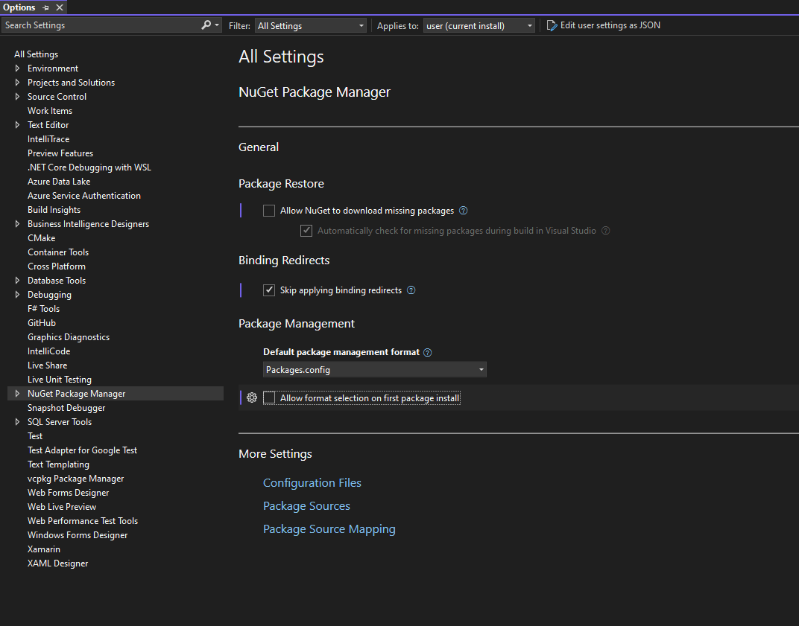

# NuGet onboarding to Unified Settings in Visual Studio
<!-- Replace `Title` with an appropriate title for your design -->

- Donnie Goodson ([donnie-msft](https://github.com/donnie-msft))
- GitHub Issue <https://github.com/NuGet/Client.Engineering/issues/2712>

## Summary

<!-- One-paragraph description of the proposal. -->

Visual Studio Options are moving to a new user interface called "Unified Settings".
The Visual Studio (VS) IDE team is responsible for the UI controls, and individual product teams will maintain a JSON file declaring the structure and data types for settings in the IDE.

## Motivation

<!-- Why are we doing this? What pain points does this solve? What is the expected outcome? -->

The Visual Studio Editor team created Unified Settings to make the configuration experience have a Consistent UI, scoping capabilities, and the ability to share and sync settings across devices.
A blog was published to expand on this motivation and collect feedback from the community, [Unified Settings: Share Your Feedback](https://devblogs.microsoft.com/visualstudio/unifiedsettings/).

For NuGet, the improved maintainability will reduce ad-hoc UI code and allow the team to focus on the effect of the settings, and not the UI around the settings.
I expect significantly less usability and accessibility issues around NuGet's VS Options because of this standardized UI.

## Explanation

### Functional explanation

<!-- Explain the proposal as if it were already implemented and you're teaching it to another person. -->
<!-- Introduce new concepts, functional designs with real life examples, and low-fidelity mockups or  pseudocode to show how this proposal would look. -->

NuGet's repository will maintain a `registration.json` file to declare all VS Settings, including localizible names, data types, default values, and any dependencies among the values of other settings.

A prototype of the NuGet General Options page in Unified Settings is shown below.
Note that the `Clear NuGet Cache` button is missing at this time.

Since NuGet uses a custom `nuget.config` to store settings values, a custom data store will be indicated by using an External Settings API provided by the VS IDE team.

### Technical explanation

<!-- Explain the proposal in sufficient detail with implementation details, interaction models, and clarification of corner cases. -->

### External API
...

## Drawbacks

<!-- Why should we not do this? -->
No drawbacks have been identified.

## Rationale and alternatives

<!-- Why is this the best design compared to other designs? -->
<!-- What other designs have been considered and why weren't they chosen? -->
<!-- What is the impact of not doing this? -->
No alternatives have been identified.

## Prior Art

<!-- What prior art, both good and bad are related to this proposal? -->
<!-- Do other features exist in other ecosystems and what experience have their community had? -->
<!-- What lessons from other communities can we learn from? -->
<!-- Are there any resources that are relevant to this proposal? -->

The legacy Visual Studio Options for NuGet will serve as a starting point for the migration to Unified Settings.

## Unresolved Questions

<!-- What parts of the proposal do you expect to resolve before this gets accepted? -->
<!-- What parts of the proposal need to be resolved before the proposal is stabilized? -->
<!-- What related issues would you consider out of scope for this proposal but can be addressed in the future? -->

No questions have been identified.

## Future Possibilities

<!-- What future possibilities can you think of that this proposal would help with? -->

No future possibilities have been identified.