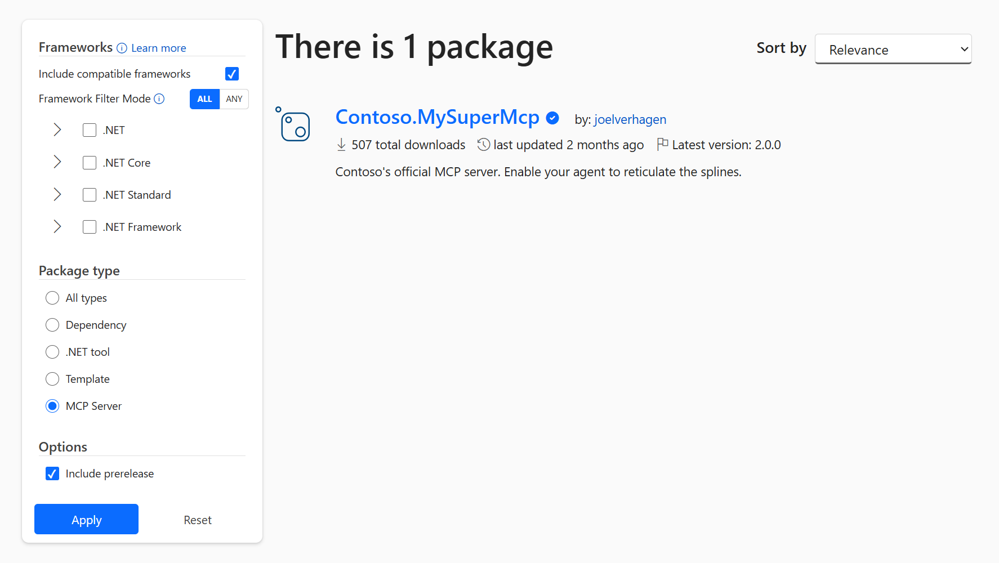
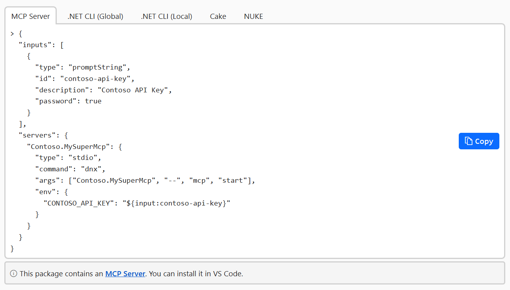
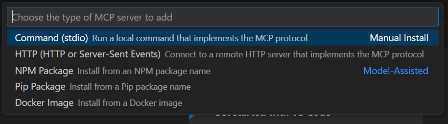

# Using NuGet for MCP servers

- Author Names: Jon Douglas ([@jondouglas](https://github.com/jondouglas)), Joel Verhagen ([@joelverhagen](https://github.com/joelverhagen))
- GitHub Issue: [NuGet/NuGetGallery#10461](https://github.com/NuGet/NuGetGallery/issues/10461)

## Summary

Today it is possible for an [MCP](https://modelcontextprotocol.io/introduction) server to be implemented in many different programming languages. The protocol is relatively agnostic to the underlying programming language. However, client tooling such as VS Code is tailored to specific runtimes when installing and launching a local MCP server. VS Code, for example, supports [Docker, Python, and npm MCP servers](https://code.visualstudio.com/docs/copilot/chat/mcp-servers#_configuration-format) (as of June 2025). Other runtimes such as .NET are supported via custom steps, such as wrapping the app in Docker/npx or installing the MCP server out of band and then executing it by a command name available in `PATH`.

This document describes several steps needed to improve the use of local MCP servers written in .NET. We focus primarily on the packaging (NuGet) perspective but will reference ongoing or completed work in the .NET ecosystem.

We will streamline the authoring, discovery, installation, and execution of local MCP servers written in .NET.

The main missing pieces are:

1. [Well-defined conventions to identify MCP server packages and startup instructions.](#improve-mcp-server-authoring)
2. [Browsing experience on NuGet.org tailored to MCP server packages](#improve-browsing-experience)
3. [Single-shot execution of .NET tools](#enable-single-shot-execution-for-net-tools)
4. [Support for NuGet packages in the MCP metaregistry](#add-support-for-nuget-packages-in-the-mcp-registry)
5. [Support for NuGet package MCP server installation in IDEs, e.g., VS Code](#add-support-for-nuget-packages-in-vs-code)

## Motivation

As an MCP server author, it should be easy to create MCP servers in .NET and host them on NuGet.org or a private feed.

As an MCP server consumer (user), it should be easy to discover MCP servers and execute them in your IDE of choice. 

Most of the groundwork is done to ship a .NET MCP server. The SDK is available at [modelcontextprotocol/csharp-sdk](https://github.com/modelcontextprotocol/csharp-sdk). However, conventions for packaging them with NuGet are not well defined.

Some Microsoft MCP servers are implemented in .NET but distributed via npm, for example [@azure/mcp](https://www.npmjs.com/package/@azure/mcp). This is a fine approach if a Node.js runtime and npm packaging are not concerns. For MCP authors that want to target an environment where the .NET runtime is available, and not depend on npm, Python, or Docker, we should enable an end-to-end experience using just .NET and the MCP client IDE of choice (e.g., VS Code).

## Explanation

### Improve MCP server authoring

#### Today's experience

To create a .NET MCP server today, the experience is somewhat self-guided and results in a NuGet package that looks no different from any other .NET CLI tool.

An MCP server author can create a .NET console app, consume the [ModelContextProtocol NuGet package](https://www.nuget.org/packages/ModelContextProtocol), and implement tools that will be available to the LLM. The SDK helps with the stdio-based protocol that allows the end user's IDE to launch, discover, and invoke tools.

The author will decide what CLI arguments or environment variables are needed to invoke the MCP server.

When the MCP server is ready, the author will pack the [project as a tool with `<PackAsTool>`](https://learn.microsoft.com/en-us/dotnet/core/tools/global-tools-how-to-create) and publish the NuGet package to NuGet.org (or their private package feed), so that it can be used by other people.

This approach works, but has a couple of problems:

- The package has no indication that it is an MCP server. It just has the `DotnetTool` package type like any other .NET tool.
  - NuGet.org and other package sources have no way of filtering packages to "MCP" or tailoring the browsing experience.
- The package provides no guidance to the end user on how to start the MCP server.
  - The end user doesn't have a good way of knowing the needed `command`, `args`, and `env` settings they should use.
- The package author needs to set up their project just right, with a console app, .NET tool, and MCP dependency.

#### New package type

To address the filtering and discoverability problem, we will introduce an additional NuGet package type of `McpServer`.

Currently, .NET tools get the `DotnetTool` package type, defined in the resulting package manifest (.nuspec file) generated by `dotnet pack`. [As of .NET 10](https://github.com/dotnet/sdk/pull/48039), it is possible to add additional package types to .NET tool packages using the `<PackageType>McpServer</PackageType>` MSBuild property in the tool .csproj.

The resulting MCP server .nupkg will have two package types: `DotnetTool` and `McpServer`. For more information on package types, [see NuGet documentation](https://learn.microsoft.com/en-us/nuget/reference/nuspec#packagetypes).

#### Startup instructions

To allow the package author to communicate the needed parameters to launch the MCP server, we will take a phased approach. First, we will instruct the package author to provide a sample code block in their package README markdown matching the following format:

```json
{
  "inputs": [
    {
      "type": "promptString",
      "id": "contoso-api-key",
      "description": "Contoso API Key",
      "password": true
    }
  ],
  "servers": {
    "Contoso.MySuperMcp": {
      "type": "stdio",
      "command": "dnx",
      "args": ["Contoso.MySuperMcp", "--", "mcp", "start"],
      "env": {
        "CONTOSO_API_KEY": "${input:contoso-api-key}"
      }
    }
  }
}
```

NuGet.org will scrape the README.md for a JSON code block with a `servers` JSON property containing a property matching the current package ID. If found, it will place the JSON in the command palette for easy copying. If not found, a default MCP JSON will be generated:


```json
{
  "servers": {
    "Contoso.MySuperMcp": {
      "type": "stdio",
      "command": "dnx",
      "args": ["Contoso.MySuperMcp", "--version", "1.0.1"]
    }
  }
}
```

In a future phase, we can introduce a more machine-readable format for the MCP server's inputs, args, and environment variables. This would require alignment across other programming ecosystems (Python or npm MCP servers have the same need) and IDEs (VS Code and other MCP-enabled tools).

#### Project template

To improve the project setup experience, we will introduce a new project template. The template will be available via `dotnet new mcp-server`. This will create a .csproj for a CLI tool, with a stable MCP SDK dependency version, and an `McpServer` server package type.

The .csproj will have the following shape:

```xml
<Project Sdk="Microsoft.NET.Sdk">

  <PropertyGroup>
    <OutputType>Exe</OutputType>
    <TargetFramework>net10.0</TargetFramework>
    <RootNamespace>Contoso.MySuperMcp</RootNamespace>

    <PackAsTool>true</PackAsTool>
    <PackageType>McpServer</PackageType>
  </PropertyGroup>

  <ItemGroup>
    <PackageReference Include="ModelContextProtocol" Version="1.0.0" />
  </ItemGroup>

</Project>
```

### Improve browsing experience

#### Today's experience

An MCP server can be published as a .NET tool or with any custom package type.

.NET tool MCP servers are not differentiated from any other .NET tool, so an end user can't find them easily among the hundreds of .NET tools or thousands of other NuGet packages.

It is possible to filter by any package type using the NuGet.org search UI by manipulating the URL, or by using the V3 search API. But this is hard to discover for end users.

#### Search filtering

Currently, only three package types are recognized by NuGet.org and enabled for default package type filtering.

We will add the "MCP Server" (`McpServer`) type to the list.



#### Package details page

The package details page will be enhanced to have a new MCP Server tab in the command palette, using the JSON snippet scraped from the README.md (or generated if not found). 



See the [Startup instructions](#startup-instructions) section above for more details.

### Enable single-shot execution for .NET tools

#### Today's experience

It is not possible to download and run a .NET tool in a single command today. This is in contrast to npm, Python, and Docker. For example, an MCP server on npm can be started by VS Code using `npx`. 

#### New experience: `dotnet tool exec` / `dnx`

The .NET team is working on a single-shot experience similar to `npx`. This is not work done by the NuGet team, so we'll just link to the existing efforts.

- GitHub issues: [dotnet/sdk#31103](https://github.com/dotnet/sdk/issues/31103), [dotnet/sdk#47517](https://github.com/dotnet/sdk/issues/47517)
- Design document: [dotnet/designs#334 - Add a design proposal for dotnet tool exec and dnx](https://github.com/dotnet/designs/pull/334) 

The sample JSON above leverages this new single-shot command execution.

### Add support for NuGet packages in the MCP registry

#### Today's experience

The [official MCP registry](https://github.com/modelcontextprotocol/registry/discussions/11) is not yet live, but the discussion and protocol description around it clearly list [several supported underlying registries](https://github.com/modelcontextprotocol/registry/blob/a4cefcf05f81466ad65e7c3971e76d0f6d60783e/docs/openapi.yaml#L173-L176) for hosting the local server's code.

Current list: `npm`, `docker`, `pypi`, `homebrew`

#### Add NuGet to the list

We will work with the MCP server registry team to add `nuget` to the list.

We will publish/link to guidance on how to publish a NuGet-based MCP server to the MCP registry. This step is performed after the package is published to NuGet.org.

### Add support for NuGet packages in VS Code

#### Today's experience

Similar to the previous section, NuGet is not a recognized MCP server host.



#### Add NuGet to the list

We will work with the VS Code team to add a NuGet option to the list, which updates the user's `mcp.json` to invoke `dnx` with the provided package ID.

Once Visual Studio has a corresponding experience ([the current experience is manually editing the `mcp.json`](https://learn.microsoft.com/en-us/visualstudio/ide/mcp-servers?view=vs-2022)), we will ensure NuGet is supported similarly.

## Rollout plan

1. Enable `McpServer` support on NuGet.org search and the package details page, behind a feature flag.
2. Work with Microsoft and community MCP server implementers to package as NuGet.
   - As of June 2025, there are 28 .NET tools on NuGet.org that use the MCP SDK. Newer versions should have the `McpServer` package type.
   - Some Microsoft MCP servers are implemented in .NET but distributed via npm, for example [@azure/mcp](https://www.npmjs.com/package/@azure/mcp).
3. Wait for `dnx` to land in a .NET 10 preview.
4. Work with the MCP registry and VS Code to get NuGet support, perhaps providing PRs/OSS contributions ourselves.
5. Enable MCP server UI on NuGet.org.
6. Publish a document on learn.microsoft.com on how to create your own NuGet MCP server. 

## Future Possibilities

We will wait to publish an MCP server template until the .NET MCP SDK has announced a stable API surface area. It is currently in prerelease.

## Prior Art

We should replicate what is already working for npm, PyPI, and Docker.

## Unresolved Questions

- What guidance should be provided for private MCP server implementations?
  - For example, if you publish an `McpServer` to your Azure DevOps feed, what MCP registry should be used?
- What schema should be used for a machine-readable MCP server startup instruction?
  - The package author could include an `mcp.json` in the NuGet package [matching the MCP registry OpenAPI spec](https://github.com/modelcontextprotocol/registry/blob/a4cefcf05f81466ad65e7c3971e76d0f6d60783e/docs/openapi.yaml#L183-L201).
- How are client runtime requirements expressed?
  - For example, if an MCP server needs a certain .NET version, how is this communicated to the end user before failure occurs?

## Drawbacks

TBD.

## Rationale and alternatives

TBD.
