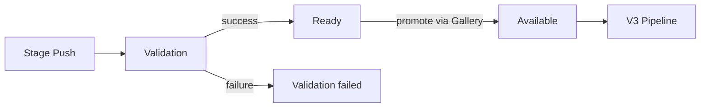
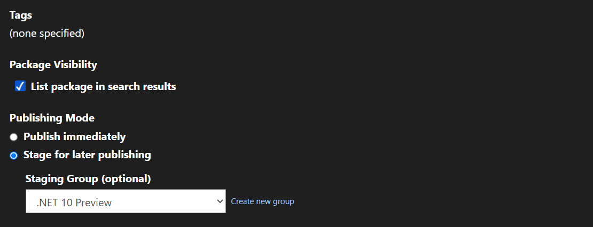
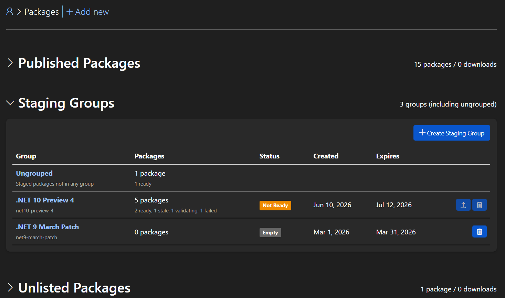
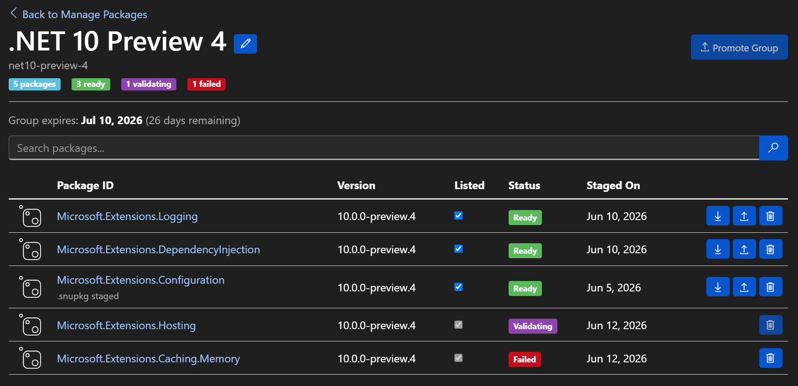
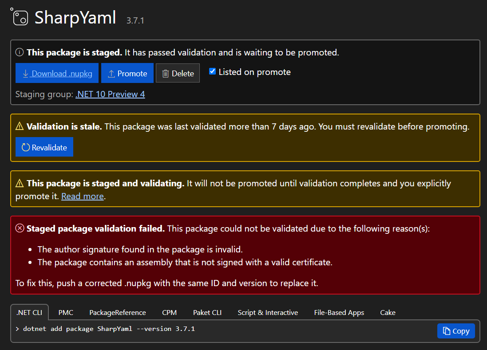
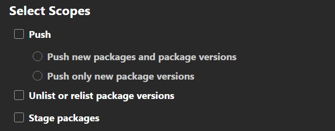
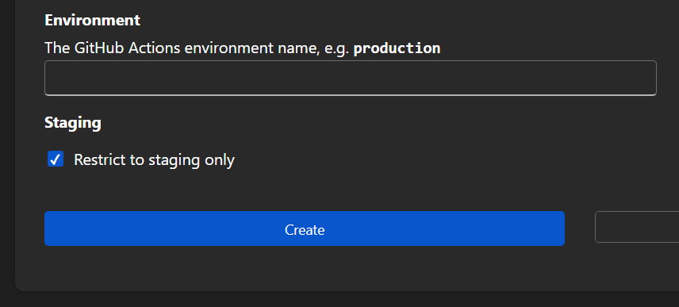

# Package Staging

- Author: James Parsons ([@japarson](https://github.com/japarson))
- GitHub Issue: [NuGet/NuGetGallery#3931](https://github.com/NuGet/NuGetGallery/issues/3931)

## Summary

Package staging lets authors push packages to nuget.org ahead of time, run them through full validation (malware scanning, signing), and promote them later with a single action through the Gallery UI. Staged packages are invisible to consumers until promoted. Promotion is only available for users with two-factor authentication enabled.

This builds on the [2024 Release Staging and Deprecation proposal](../2024/release-staging-and-deprecation.md) with a narrower scope focused on staging and promotion, informed by direct feedback from the .NET release team and security requirements around supply chain protection.

## Motivation

### Supply chain protection

Authors can configure CI/CD with an API key scoped only to package staging. This key can upload staged packages but cannot publish through the normal push endpoint. Promotion requires a user with 2FA enabled. If the pipeline or its staging-only key is compromised, an attacker can upload only packages that remain invisible to consumers until promoted.

Staging is entirely opt-in. The existing `dotnet nuget push` command and push API continue to work exactly as they do today, including for older SDK versions. Staging uses a separate endpoint that newer SDKs may expose through commands such as `dotnet nuget stage push`. The exact command names and syntax shown in this proposal are illustrative and not final.

### Security embargo timing

.NET security releases are coordinated with public disclosure of vulnerabilities. The team cannot push packages before 10 AM Pacific because early availability would give attackers time to analyze changes and derive exploits before users can patch. But validation takes 40 to 60 minutes after push, so the packages are not available until well after disclosure. This creates a window where the vulnerability is publicly known but the fix is not yet restorable.

Staging eliminates this gap. Packages are pre-validated and sitting in a staged state. At the coordinated disclosure time, promotion makes them available without waiting for validation.

### Pre-validation

The .NET team pushes 2000+ packages to nuget.org every Patch Tuesday. Validation (malware scanning, certificate checks, repository co-signing) takes 40 to 60 minutes for that volume. If a package fails validation, the team discovers it on release day and has to rebuild, re-sign, and re-push during a tight embargo window.

Staging lets authors push packages days or weeks early. Validation runs during that window. Failures are caught and fixed before release day, not during it.

### Publish latency

Today, the time from push to all packages being restorable includes validation plus the V3 pipeline (catalog, flat container, registration, search). For large pushes of 2000+ packages, total time was about 2 hours during the March 2026 Patch Tuesday. Recent work has brought V3 ingestion for that volume down from about 1 hour to around 5 minutes. By removing validation from the critical path, the only remaining cost is the V3 pipeline, which should bring total time from promotion to restorable down from 2 hours to around 5 minutes for properly staged and validated packages.

## Explanation

#### Staging a package



Authors push packages to nuget.org using a new staging endpoint. The staging API is advertised as a `PackageStaging/1.0.0` resource type in the service index. Sources that do not advertise this resource do not support staging.

The package goes through the same validation pipeline as a normal push: malware scanning, author signature checks, certificate revocation checks, and repository co-signing. The difference is what happens after validation succeeds. Instead of becoming publicly available, the package becomes ready for promotion. It is not visible on nuget.org to anyone except the package owner and it is not searchable or restorable by anyone including the owner.

If validation fails, the author is notified and can fix the issue and stage a replacement. Since this happens days or weeks before release, there is no time pressure.

Re-pushing the same content is a no-op (safe for CI/CD retries). Pushing different content for the same ID and version replaces the staged package, re-runs validation, and resets the expiration timer. Replacing a grouped package keeps its group membership.

Symbol packages (`.snupkg`) can also be staged when their parent package is staged or already available. If a staged parent is not yet ready, symbol validation waits until it is. Symbol ingestion remains deferred until promotion.

Staging reserves the package ID and version just like a normal push. A package version originally created through staging may be staged again if it is deleted or expires before promotion. A version created by normal push or previously promoted cannot be reactivated through staging.

The Upload page also supports staging via a Publishing Mode option:


*Figure 1. Upload Package page with Publishing Mode selector.*

#### Staging groups

Packages can optionally be organized into staging groups. A group is a named collection of staged packages owned by a user or organization.

Packages and symbol packages belong to separate staging groups and are promoted independently. Symbol failures do not block package promotion.

```
dotnet nuget stage group create my-release --name "My Release"
dotnet nuget stage push MyPackage.1.0.0.nupkg --group my-release
```

##### Managing groups

Groups are useful for coordinating releases across many packages. A team can stage hundreds of packages into a single group over several days, verify all of them pass validation, and then promote the entire group at once.

Groups are ephemeral. They are deleted after a successful promotion and expire after a configurable TTL. Each release gets its own group.

A package can belong to at most one group. Ungrouped packages can be staged and promoted individually.

Group display names can be edited after creation. Group IDs are immutable.



*Figure 2. Manage Packages page showing staging groups and package counts.*

##### Group detail

The group detail view shows every package in the group along with its current validation status. Owners can edit the group display name and promote the entire group when all packages are ready.



*Figure 3. Staging group detail view with validation status and group metadata.*

#### Promotion

Promotion is only available through the nuget.org Gallery UI. There is no API endpoint for promoting staged packages. This is intentional.

When a user clicks "Promote" on a staged package or group, the user must be logged into nuget.org with two-factor authentication enabled on their account.

For groups, the owner promotes the entire group at once. If any package in the group is still validating or failed validation, the group cannot be promoted until the issue is resolved.

Promotion runs asynchronously, and owners can refresh the page to view progress. Group members are processed independently, so a group may partially succeed; failed items remain visible for correction.

The Gallery keeps an owner-visible history of package and group promotions, including their outcomes.

After promotion, the packages enter the normal V3 pipeline and become restorable through the standard process. The public "published" timestamp is set at promotion time, not at stage time.

The package detail page shows staged packages to the owner with validation status, promote, download (for inspection), replace, and delete actions.


*Figure 4. Package detail page for a staged package showing promotion and staging group controls.*

#### Trusted Publishing integration

[Trusted Publishing](../2024/trusted-publishers-oidc-for-nuget-push.md) (OIDC) is the recommended authentication method for staging, but API keys are also supported. A new "Stage packages" API key scope is added alongside Push, Push only new versions, and Unlist.



*Figure 5. API key management showing the new "Stage packages" scope.*

Trusted Publishing configurations support a "Restrict to staging only" scope. When configured with this scope, a GitHub Actions workflow (or other supported CI/CD provider) can stage packages but cannot push directly to the public feed. This is enforced in both directions: the staging endpoints accept staging-only credentials, and the normal push endpoint rejects them with 403.



*Figure 6. Trusted Publishing policy configuration with "Restrict to staging only" option.*

Existing Trusted Publishing policies are unaffected. Staging must be explicitly enabled on a policy.

#### Visibility and expiration

Staged packages are not visible to anyone except the package owner. They do not appear in search results, package pages, restore operations, or any V3 API responses.

| Consumer | Staged package visible? |
| -------- | ---------------------- |
| dotnet restore | No |
| nuget.org search | No |
| nuget.org package page (public) | No |
| nuget.org package management (owner) | Yes |
| V3 flat container / registration / catalog | No |
| API package metadata | No |

Staged packages are not restorable by anyone, including the owner. There is no authenticated restore path against staged content. Owners who need to verify that an interdependent package set restores correctly before promoting should use their own private feed or a local feed for integration testing, then stage to nuget.org once satisfied.

Staged packages that are never promoted are automatically cleaned up after a configurable TTL (default: 30 days). Owners receive email notifications before expiration and when packages are deleted.

For grouped packages, the TTL is on the group, not individual packages. It resets whenever a new package is pushed to the group. When the TTL expires, the entire group and all its packages are deleted.

Groups are deleted after a successful promotion since they have served their purpose. Empty groups persist until TTL or manual deletion.

#### Blocked actions while staged

Deprecation, unlisting, and other metadata edits are not available while a package is in staged status. These actions require the package to be promoted first. A staged package has no public-facing metadata to annotate.

#### Notifications

- Email when a package or symbol package is staged, alerting owners to unexpected credential use
- Email when validation fails or takes unusually long
- One summary when an individual or group promotion completes
- Email before staged content expires
- Email when staged content is deleted after expiration

Group promotion results are summarized rather than emailed separately for every package.

#### Rate limits

Staging push and delete operations share the same quota budget as normal push/unlist. A stage push counts against the same per-key hourly counter as a regular push. This prevents staging from being used to circumvent existing rate limits.

#### Limits

- Configurable total staged artifacts per owner (default: 350), with elevated limits for large publishers
- Configurable TTL per owner

## Drawbacks

- **Promotion is not automatable.** Requiring Gallery UI login with 2FA means promotion cannot be scripted or run from CI/CD. This is intentional for security but adds a manual step to release workflows. Someone has to log in on release day.

- **No atomic promotion.** We are not guaranteeing that all packages in a group become restorable at the exact same instant. The V3 pipeline processes packages in batches and there will be a small window (minutes) where some packages are available and others are not. This is the same behavior that exists today when packages trickle through validation. Package authors who need strict ordering should manage dependency sequencing on their side. NuGet restore retries with backoff will naturally resolve transient "not found" errors within minutes.

- **New concepts for users.** Staging, groups, and the two-step push/promote workflow add complexity to the NuGet experience. Most package authors who push one or two packages at a time may not need or use this feature.

## Rationale and alternatives

### Why Gallery-only promotion

The core security insight is that CI/CD systems are attack surfaces. API keys can leak. OIDC-configured GitHub Actions can be compromised. If an attacker gains the ability to push packages, they can push malicious packages today. Staging with Gallery-only promotion creates a hard boundary: even with full CI/CD compromise, the attacker can only create invisible staged packages. A human logged in with 2FA must approve promotion.

### Why not scheduled promotion

Automatically promoting at a specific date/time was considered but rejected for the initial release. Scheduled promotion would bypass the human-in-the-loop requirement. It also introduces complexity around time zones, failure handling, and what happens if the schedule fires during an outage. Teams can achieve a similar result by staging ahead of time and manually promoting when ready.

## Prior Art

- **npm provenance and staged publishing.** npm supports staged publishing where packages are uploaded but not made available until explicitly published. npm requires a 2FA challenge at publish time. npm uses a 72-hour TTL for staged packages.
- **Azure Container Registry / MCR staging.** Microsoft Container Registry uses a staging prefix for container images that are not yet publicly available. At publish time, a new manifest references the same content-addressable blobs with zero copy.

## Future Possibilities

- **Step-up 2FA at promotion.** A future enhancement could require a fresh 2FA challenge at the moment of promotion (similar to npm's publish confirmation and GitHub's sudo mode), providing stronger proof of presence beyond the login session.
- **Mandatory staging for high-impact packages.** The login-2FA gate only protects packages that opt into staging. A future enhancement could require staging for packages above a download threshold or allow owners to mark a package ID as "staging required."
- **Authenticated pre-promote restore.** Allow owners to test-restore a staged group before promoting, verifying that interdependent packages resolve correctly as a set.
- **Two-person approval.** Require two distinct identities to approve a promotion before it proceeds, providing defense-in-depth against single-account compromise.
