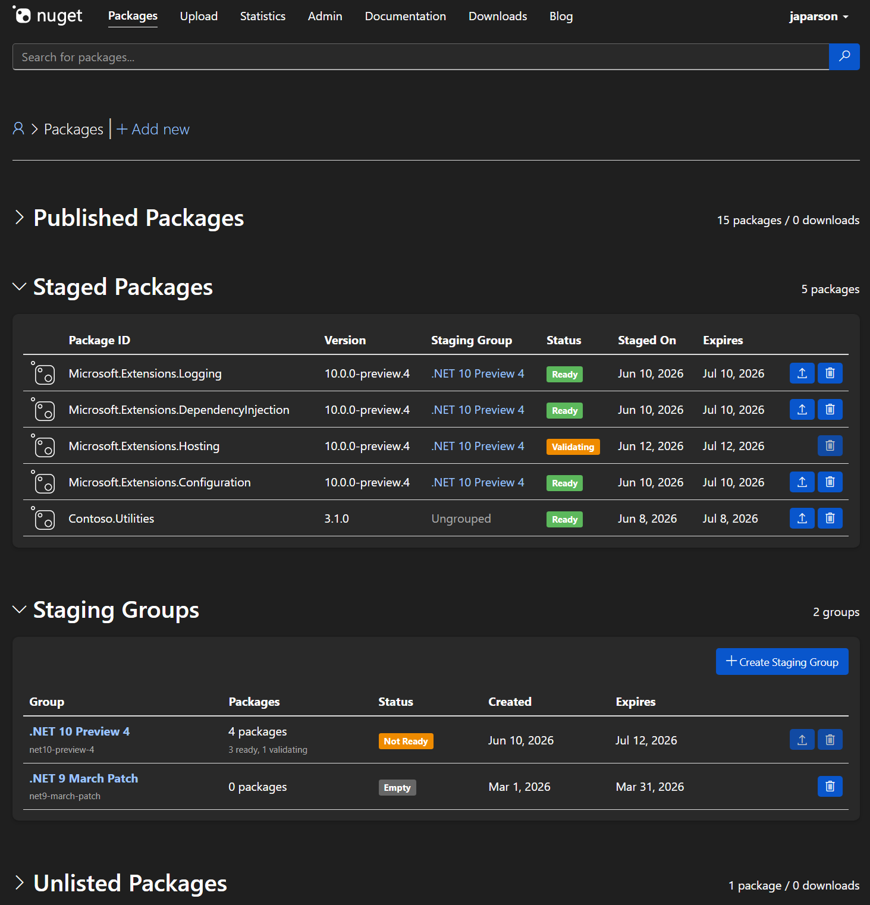

# Package Staging

- Author: James Parsons ([@japarson](https://github.com/japarson))
- GitHub Issue: [NuGet/NuGetGallery#3931](https://github.com/NuGet/NuGetGallery/issues/3931)

## Summary

Package staging lets authors push packages to nuget.org ahead of time, run them through full validation (malware scanning, signing), and publish them later with a single action through the Gallery UI. Staged packages are invisible to consumers until published. Publishing requires logging into nuget.org, which enforces two-factor authentication as a proof of presence check.

This builds on the [2024 Release Staging and Deprecation proposal](../2024/release-staging-and-deprecation.md) with a narrower scope focused on staging and publishing, informed by direct feedback from the .NET release team and security requirements around supply chain protection.

## Motivation

### Supply chain protection

If a CI/CD pipeline is compromised or credentials leak, an attacker can push malicious packages to nuget.org today. Staging introduces a separation between pushing and publishing. CI/CD can only stage packages. A human must log into nuget.org (which requires two-factor authentication) to publish them. Even if an attacker compromises a build pipeline, they can only stage invisible packages that never reach consumers.

### Security embargo timing

.NET security releases are coordinated with public disclosure of vulnerabilities. The team cannot push packages before 10 AM Pacific because early availability would give attackers time to analyze changes and derive exploits before users can patch. But validation takes 40 to 60 minutes after push, so the packages are not available until well after disclosure. This creates a window where the vulnerability is publicly known but the fix is not yet restorable.

Staging eliminates this gap. Packages are pre-validated and sitting in a staged state. At the coordinated disclosure time, publishing makes them available without waiting for validation.

### Pre-validation

The .NET team pushes 2000+ packages to nuget.org every Patch Tuesday. Validation (malware scanning, certificate checks, repository co-signing) takes 40 to 60 minutes for that volume. If a package fails validation, the team discovers it on release day and has to rebuild, re-sign, and re-push during a tight embargo window.

Staging lets authors push packages days or weeks early. Validation runs during that window. Failures are caught and fixed before release day, not during it.

### Publish latency

Today, the time from push to all packages being restorable includes validation plus the V3 pipeline (catalog, flat container, registration, search). For 2000 packages, total time was about 2 hours during the March 2026 Patch Tuesday. By removing validation from the critical path, the only remaining cost is the V3 pipeline, which should bring the total time from publish to restorable down significantly.

## Explanation

#### Staging a package


Authors push packages to nuget.org using a new staging endpoint. The CLI command looks like:

```
dotnet nuget stage push MyPackage.1.0.0.nupkg
```

The package goes through the same validation pipeline as a normal push: malware scanning, author signature checks, certificate revocation checks, and repository co-signing. The difference is what happens after validation succeeds. Instead of becoming publicly available, the package enters a "staged" state. It is not restorable, not searchable, and not visible on nuget.org to anyone except the package owner.

If validation fails, the author is notified the same way as a normal push failure. They can fix the issue and re-push. Since this happens days or weeks before release, there is no time pressure.

Re-pushing the same content is a no-op. Pushing different content for the same ID and version replaces the staged package and re-runs validation.

#### Staging groups

Packages can optionally be organized into staging groups. A group is a named collection of staged packages owned by a user or organization.

```
dotnet nuget stage group create my-release --name "My Release"
dotnet nuget stage push MyPackage.1.0.0.nupkg --group my-release
```

Groups are useful for coordinating releases across many packages. A team can stage hundreds of packages into a single group over several days, verify all of them pass validation, and then publish the entire group at once.

Groups are ephemeral. They are deleted after a successful publish and expire after 30 days of inactivity. Each release gets its own group.

A package can belong to at most one group. Ungrouped packages can be staged and published individually.

#### Publishing

Publishing is only available through the nuget.org Gallery UI. There is no API endpoint for publishing staged packages. This is intentional.

nuget.org requires two-factor authentication for all accounts. When a user logs in and clicks "Publish" on a staged package or group, they have already proven their identity through 2FA. This proof of presence is the security boundary between staging (automated, CI/CD) and publishing (human, authenticated).

For individual packages, the owner navigates to their package management page, finds the staged package, and clicks "Publish." For groups, the owner publishes the entire group at once. If any package in the group is still validating or failed validation, the group cannot be published until the issue is resolved.

After publishing, the packages enter the normal V3 pipeline and become restorable through the standard process.

#### Trusted Publishing integration

[Trusted Publishing](../2024/trusted-publishers-oidc-for-nuget-push.md) (OIDC) is the recommended authentication method for automated package publishing on nuget.org. API keys are strongly discouraged and should be replaced with Trusted Publishing.

Trusted Publishing configurations will support a new "stage only" permission scope. When configured with this scope, a GitHub Actions workflow (or other supported CI/CD provider) can stage packages but cannot publish them. This aligns with the security model: CI/CD stages, humans publish.

#### Gallery UI

The nuget.org Manage Packages page adds two new sections:




#### Visibility and expiration

Staged packages are not visible to anyone except the package owner. They do not appear in search results, package pages, restore operations, or any V3 API responses.

| Consumer | Staged package visible? |
| -------- | ---------------------- |
| dotnet restore | No |
| nuget.org search | No |
| nuget.org package page (public) | No |
| nuget.org package management (owner) | Yes |
| V3 flat container / registration / catalog | No |
| API package metadata | No |

Staged packages that are never published are automatically cleaned up after 30 days. This is longer than npm's 72-hour expiration because some release cycles are monthly, and teams may stage packages 2 to 3 weeks before release.

For grouped packages, the TTL is on the group, not individual packages. It resets whenever a new package is pushed to the group. When the TTL expires, the entire group and all its packages are deleted. Owners receive email notifications 7 days before expiration and when packages are deleted.

Groups are deleted after a successful publish since they have served their purpose. Empty groups persist until TTL or manual deletion.

#### Limits

- Max 20 staging groups per owner
- Max 1000 packages per group
- Max 5000 ungrouped staged packages per owner

## Drawbacks

- **Publish is not automatable.** Requiring Gallery UI login means publishing cannot be scripted or run from CI/CD. This is intentional for security but adds a manual step to release workflows. Someone has to log in and click "Publish" on release day.

- **No atomic publish.** We are not guaranteeing that all packages in a group become restorable at the exact same instant. The V3 pipeline processes packages in batches and there will be a small window (minutes) where some packages are available and others are not. Package authors who need strict ordering should manage dependency sequencing on their side.

- **New concepts for users.** Staging, groups, and the two-step push/publish workflow add complexity to the NuGet experience. Most package authors who push one or two packages at a time may not need or use this feature.

## Rationale and alternatives

### Why Gallery-only publishing

The core security insight is that CI/CD systems are attack surfaces. API keys can leak. OIDC-configured GitHub Actions can be compromised. If an attacker gains the ability to push packages, they can push malicious packages today. Staging with Gallery-only publishing creates a hard boundary: even with full CI/CD compromise, the attacker can only create invisible staged packages. A human with 2FA must approve publication.

We considered adding 2FA to the CLI to support API-based publishing, but nuget.org does not currently support 2FA for CLI operations and there are no near-term plans to add it. Gallery login already requires 2FA, so restricting publishing to the Gallery achieves proof of presence without any new authentication infrastructure.

### Why not use API keys for staging

API keys are strongly discouraged on nuget.org and are being replaced by Trusted Publishing (OIDC). Adding new API key scopes for staging would invest in a deprecated authentication mechanism. Trusted Publishing is the recommended path for automated workflows, and staging scope will be added there.

### Why not scheduled publishing

Automatically publishing at a specific date/time was considered but rejected for the initial release. Scheduled publishing would bypass the proof of presence requirement. It also introduces complexity around time zones, failure handling, and what happens if the schedule fires during an outage. Teams can achieve a similar result by staging ahead of time and manually publishing when ready.

## Prior Art

- **npm provenance and staged publishing.** npm supports staged publishing where packages are uploaded but not made available until explicitly published. npm uses a 72-hour TTL for staged packages.
- **Azure Container Registry / MCR staging.** Microsoft Container Registry uses a staging prefix for container images that are not yet publicly available. At publish time, a new manifest references the same content-addressable blobs with zero copy.

## Future Possibilities

- **Proof of presence for CLI.** If nuget.org adds 2FA support for CLI operations in the future, publishing could be extended to the CLI with a step-up authentication challenge.
