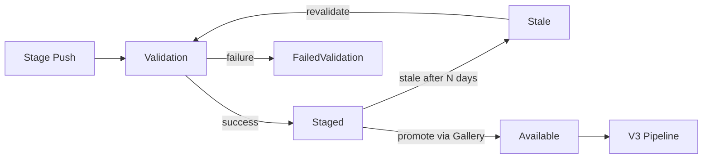

# Package Staging

- Author: James Parsons ([@japarson](https://github.com/japarson))
- GitHub Issue: [NuGet/NuGetGallery#3931](https://github.com/NuGet/NuGetGallery/issues/3931)

## Summary

Package staging lets authors push packages to nuget.org ahead of time, run them through full validation (malware scanning, signing), and promote them later with a single action through the Gallery UI. Staged packages are invisible to consumers until promoted. Promotion requires a step-up two-factor authentication challenge (TOTP or WebAuthn) at the moment of action, providing a proof of presence check.

This builds on the [2024 Release Staging and Deprecation proposal](../2024/release-staging-and-deprecation.md) with a narrower scope focused on staging and promotion, informed by direct feedback from the .NET release team and security requirements around supply chain protection.

## Motivation

### Supply chain protection

If a CI/CD pipeline is compromised or credentials leak, an attacker can push malicious packages to nuget.org today. Staging introduces a separation between pushing and promoting. CI/CD can only stage packages. A human must log into nuget.org and complete a step-up 2FA challenge to promote them. Even if an attacker compromises a build pipeline, they can only stage invisible packages that never reach consumers.

Staging is entirely opt-in. The existing `dotnet nuget push` command and push API continue to work exactly as they do today, including for older SDK versions. Staging uses a separate endpoint (`dotnet nuget stage push`) that is only available in newer SDKs. The two paths are independent.

### Security embargo timing

.NET security releases are coordinated with public disclosure of vulnerabilities. The team cannot push packages before 10 AM Pacific because early availability would give attackers time to analyze changes and derive exploits before users can patch. But validation takes 40 to 60 minutes after push, so the packages are not available until well after disclosure. This creates a window where the vulnerability is publicly known but the fix is not yet restorable.

Staging eliminates this gap. Packages are pre-validated and sitting in a staged state. At the coordinated disclosure time, promotion makes them available without waiting for validation.

### Pre-validation

The .NET team pushes 2000+ packages to nuget.org every Patch Tuesday. Validation (malware scanning, certificate checks, repository co-signing) takes 40 to 60 minutes for that volume. If a package fails validation, the team discovers it on release day and has to rebuild, re-sign, and re-push during a tight embargo window.

Staging lets authors push packages days or weeks early. Validation runs during that window. Failures are caught and fixed before release day, not during it.

### Publish latency

Today, the time from push to all packages being restorable includes validation plus the V3 pipeline (catalog, flat container, registration, search). For large pushes of 2000+ packages, total time was about 2 hours during the March 2026 Patch Tuesday. Recent work has brought V3 ingestion for that volume down from about 1 hour to around 5 minutes. By removing validation from the critical path, the only remaining cost is the V3 pipeline, which should bring total time from promotion to restorable down from 2 hours to around 5 minutes for properly staged and validated packages.

## Explanation

#### Staging a package



Authors push packages to nuget.org using a new staging endpoint. The CLI command looks like:

```
dotnet nuget stage push MyPackage.1.0.0.nupkg
```

The package goes through the same validation pipeline as a normal push: malware scanning, author signature checks, certificate revocation checks, and repository co-signing. The difference is what happens after validation succeeds. Instead of becoming publicly available, the package enters a "staged" state. It is not visible on nuget.org to anyone except the package owner and it is not searchable or restorable by anyone including the owner.

If validation fails, the author is notified the same way as a normal push failure. They can fix the issue and re-push. Since this happens days or weeks before release, there is no time pressure.

Re-pushing the same content is a no-op (safe for CI/CD retries). Pushing different content for the same ID and version replaces the staged package, re-runs validation, and resets the expiration timer. Replacing a grouped package keeps its group membership.

Symbol packages (`.snupkg`) can also be staged. The parent `.nupkg` must already be staged or validating. Symbol validation and ingestion are deferred until promotion.

Staging the first version of a new package ID reserves the ID permanently, same as a normal push. If that staged version is later deleted or expires, the ID remains reserved.

The Upload page also supports staging via a Publishing Mode option:


*Figure 1. Upload Package page with Publishing Mode selector.*

#### Revalidation

Validation results go stale over time. Malware signature databases update daily and certificate revocation status can change. A package that passed validation weeks ago may no longer be clean.

After a configurable staleness window (default: a few days), the package transitions to a "Stale" state in the UI. Stale packages cannot be promoted until the owner triggers revalidation. Only external-state checks rerun: certificate revocation and malware scanning. Content-only checks (signature structure, package format) are skipped since the bytes have not changed.

Owners receive email notifications when packages go stale.

#### Staging groups

Packages can optionally be organized into staging groups. A group is a named collection of staged packages owned by a user or organization.

```
dotnet nuget stage group create my-release --name "My Release"
dotnet nuget stage push MyPackage.1.0.0.nupkg --group my-release
```

##### Managing groups

Groups are useful for coordinating releases across many packages. A team can stage hundreds of packages into a single group over several days, verify all of them pass validation, and then promote the entire group at once.

Groups are ephemeral. They are deleted after a successful promotion and expire after a configurable TTL. Each release gets its own group.

A package can belong to at most one group. Ungrouped packages can be staged and promoted individually.

Group display names can be edited after creation. Group IDs are immutable.


*Figure 2. Manage Packages page showing staging groups and package counts.*

##### Group detail

The group detail view shows every package in the group along with its current validation status. Owners can revalidate stale or failed packages, edit the group display name, and promote the entire group when all packages are ready.


*Figure 3. Staging group detail view with validation status, revalidation controls, and group metadata.*

#### Promotion

Promotion is only available through the nuget.org Gallery UI. There is no API endpoint for promoting staged packages. This is intentional.

When a user clicks "Promote" on a staged package or group, the Gallery presents a step-up 2FA challenge (TOTP code entry or WebAuthn/passkey tap). This is not the session-level 2FA from login; it is a fresh challenge at the moment of action, similar to npm's publish confirmation and GitHub's sudo mode. The challenge result is valid for 5 minutes, so promoting multiple packages in quick succession does not require repeated challenges.

For groups, the owner promotes the entire group at once. If any package in the group is still validating, failed validation, or stale, the group cannot be promoted until the issue is resolved.

After promotion, the packages enter the normal V3 pipeline and become restorable through the standard process. The public "published" timestamp is set at promotion time, not at stage time.

The package detail page shows staged packages to the owner with validation status, promote, download (for inspection), replace, and delete actions.


*Figure 4. Package detail page for a staged package showing promotion and staging group controls.*

#### Trusted Publishing integration

[Trusted Publishing](../2024/trusted-publishers-oidc-for-nuget-push.md) (OIDC) is the recommended authentication method for staging, but API keys are also supported. A new "Stage packages" API key scope is added alongside Push, Push only new versions, and Unlist.


*Figure 5. API key management showing the new "Stage packages" scope.*

Trusted Publishing configurations support a "Restrict to staging only" scope. When configured with this scope, a GitHub Actions workflow (or other supported CI/CD provider) can stage packages but cannot push directly to the public feed. This is enforced in both directions: the staging endpoints accept staging-only credentials, and the normal push endpoint rejects them with 403.


*Figure 6. Trusted Publishing policy configuration with "Restrict to staging only" option.*

Existing Trusted Publishing policies are unaffected. Staging must be explicitly enabled on a policy.

#### Visibility and expiration

Staged packages are not visible to anyone except the package owner. They do not appear in search results, package pages, restore operations, or any V3 API responses.

| Consumer | Staged package visible? |
| -------- | ---------------------- |
| dotnet restore | No |
| nuget.org search | No |
| nuget.org package page (public) | No |
| nuget.org package management (owner) | Yes |
| V3 flat container / registration / catalog | No |
| API package metadata | No |

Staged packages are not restorable by anyone, including the owner. There is no authenticated restore path against staged content. Owners who need to verify that an interdependent package set restores correctly before promoting should use their own private feed or a local feed for integration testing, then stage to nuget.org once satisfied.

Staged packages that are never promoted are automatically cleaned up after a configurable TTL (default: a few days, extended for teams with longer release cycles). Owners receive email notifications before expiration and when packages are deleted.

For grouped packages, the TTL is on the group, not individual packages. It resets whenever a new package is pushed to the group. When the TTL expires, the entire group and all its packages are deleted.

Groups are deleted after a successful promotion since they have served their purpose. Empty groups persist until TTL or manual deletion.

#### Blocked actions while staged

Deprecation, unlisting, and other metadata edits are not available while a package is in staged status. These actions require the package to be promoted first. A staged package has no public-facing metadata to annotate.

#### Notifications

- Email when a package is staged (alerts owners to unexpected staging from a leaked credential)
- Email when a package or group is promoted
- Email 7 days before expiration
- Email when a group or package is deleted due to expiration
- Email when packages go stale and need revalidation

All notifications are aggregated into a single digest per owner per event. A group promotion with 2000 packages sends one email, not 2000.

#### Rate limits

Staging push and delete operations share the same quota budget as normal push/unlist. A stage push counts against the same per-key hourly counter as a regular push. This prevents staging from being used to circumvent existing rate limits.

#### Limits

- Max 20 staging groups per owner
- Max 1000 packages per group
- Configurable total staged packages per owner (default and elevated tiers available)
- Configurable TTL and staleness window per owner

#### CLI commands

All commands discover the staging endpoint via the `PackageStaging/1.0.0` resource type in the service index. Sources that do not advertise this resource return an error indicating staging is not supported.

All commands support `--format json` for machine-readable output. Authentication is via API key (`-k`) or Trusted Publishing (OIDC).

```
dotnet nuget stage
  push <PACKAGE_PATH>                  Stage a package
  list [<ID> <VERSION>]                List staged packages or get detail
  delete <ID> <VERSION>                Delete a staged package
  group
    create <GROUP_ID>                  Create a staging group
    list [<GROUP_ID>]                  List groups or get group detail
    update <GROUP_ID>                  Update group display name
    delete <GROUP_ID>                  Delete a group
    add <GROUP_ID> <ID> <VERSION>      Add a package to a group
    remove <GROUP_ID> <ID> <VERSION>   Remove a package from a group
```

**`dotnet nuget stage push`**

Push a package to staging. The package goes through validation and transitions to Staged on success.

```
dotnet nuget stage push <PACKAGE_PATH> [options]

Arguments:
  PACKAGE_PATH    Path to the .nupkg or .snupkg file to stage.

Options:
  -s, --source <SOURCE>     The package source to use. Defaults to nuget.org.
  --group <GROUP_ID>        Add the package to a staging group. The group must already exist.
  --unlist                   Mark the package as unlisted when promoted.
  --format <FORMAT>         Output format: text (default) or json.
```

Examples:
```
dotnet nuget stage push MyPackage.1.0.0.nupkg
dotnet nuget stage push MyPackage.1.0.0.nupkg --group my-release
dotnet nuget stage push MyPackage.1.0.0.nupkg --group my-release --unlist
```

**`dotnet nuget stage list`**

List staged packages for the authenticated user. When a package ID and version are provided, returns detail for that specific package.

```
dotnet nuget stage list [<PACKAGE_ID> <VERSION>] [options]

Arguments:
  PACKAGE_ID      (Optional) The package ID to get detail for.
  VERSION         (Optional) The package version.

Options:
  -s, --source <SOURCE>     The package source to use. Defaults to nuget.org.
  --group <GROUP_ID>        Filter to packages in a specific group.
  --format <FORMAT>         Output format: text (default) or json.
```

**`dotnet nuget stage delete`**

Delete a staged package. Works on packages in any staged state (staged, validating, or failed).

```
dotnet nuget stage delete <PACKAGE_ID> <VERSION> [options]

Arguments:
  PACKAGE_ID      The package ID to delete.
  VERSION         The package version to delete.

Options:
  -s, --source <SOURCE>     The package source to use. Defaults to nuget.org.
  --no-confirm              Skip the confirmation prompt.
  --format <FORMAT>         Output format: text (default) or json.
```

**`dotnet nuget stage group create`**

Create a new staging group.

```
dotnet nuget stage group create <GROUP_ID> [options]

Arguments:
  GROUP_ID        The group identifier. Lowercase letters, numbers, and dashes only.

Options:
  -s, --source <SOURCE>     The package source to use. Defaults to nuget.org.
  --name <DISPLAY_NAME>     Optional display name for the group. Defaults to the group ID.
  --organization <ORG>      Assign ownership to an organization instead of the calling user.
  --format <FORMAT>         Output format: text (default) or json.
```

**`dotnet nuget stage group list`**

List staging groups for the authenticated user. When a group ID is provided, returns group detail including all packages and their statuses.

```
dotnet nuget stage group list [<GROUP_ID>] [options]

Arguments:
  GROUP_ID        (Optional) The group identifier to get detail for.

Options:
  -s, --source <SOURCE>     The package source to use. Defaults to nuget.org.
  --format <FORMAT>         Output format: text (default) or json.
```

**`dotnet nuget stage group update`**

Update a staging group's display name.

```
dotnet nuget stage group update <GROUP_ID> [options]

Arguments:
  GROUP_ID        The group identifier to update.

Options:
  -s, --source <SOURCE>     The package source to use. Defaults to nuget.org.
  --name <DISPLAY_NAME>     New display name for the group.
  --format <FORMAT>         Output format: text (default) or json.
```

**`dotnet nuget stage group delete`**

Delete a staging group and all its staged packages.

```
dotnet nuget stage group delete <GROUP_ID> [options]

Arguments:
  GROUP_ID        The group identifier to delete.

Options:
  -s, --source <SOURCE>     The package source to use. Defaults to nuget.org.
  --no-confirm              Skip the confirmation prompt.
  --format <FORMAT>         Output format: text (default) or json.
```

**`dotnet nuget stage group add`**

Add a staged package to a group.

```
dotnet nuget stage group add <GROUP_ID> <PACKAGE_ID> <VERSION> [options]

Arguments:
  GROUP_ID        The group to add the package to.
  PACKAGE_ID      The package ID.
  VERSION         The package version.

Options:
  -s, --source <SOURCE>     The package source to use. Defaults to nuget.org.
  --format <FORMAT>         Output format: text (default) or json.
```

**`dotnet nuget stage group remove`**

Remove a staged package from a group (the package remains staged but ungrouped).

```
dotnet nuget stage group remove <GROUP_ID> <PACKAGE_ID> <VERSION> [options]

Arguments:
  GROUP_ID        The group to remove the package from.
  PACKAGE_ID      The package ID.
  VERSION         The package version.

Options:
  -s, --source <SOURCE>     The package source to use. Defaults to nuget.org.
  --format <FORMAT>         Output format: text (default) or json.
```

## Drawbacks

- **Promotion is not automatable.** Requiring Gallery UI login with step-up 2FA means promotion cannot be scripted or run from CI/CD. This is intentional for security but adds a manual step to release workflows. Someone has to log in and complete a 2FA challenge on release day.

- **No atomic promotion.** We are not guaranteeing that all packages in a group become restorable at the exact same instant. The V3 pipeline processes packages in batches and there will be a small window (minutes) where some packages are available and others are not. This is the same behavior that exists today when packages trickle through validation. Package authors who need strict ordering should manage dependency sequencing on their side. NuGet restore retries with backoff will naturally resolve transient "not found" errors within minutes.

- **New concepts for users.** Staging, groups, revalidation, and the two-step push/promote workflow add complexity to the NuGet experience. Most package authors who push one or two packages at a time may not need or use this feature.

- **Revalidation adds friction.** If packages sit staged for a while, owners must revalidate before promoting. This is an intentional security tradeoff: accepting a small amount of friction to ensure validation results are fresh at promotion time.

## Rationale and alternatives

### Why Gallery-only promotion

The core security insight is that CI/CD systems are attack surfaces. API keys can leak. OIDC-configured GitHub Actions can be compromised. If an attacker gains the ability to push packages, they can push malicious packages today. Staging with Gallery-only promotion creates a hard boundary: even with full CI/CD compromise, the attacker can only create invisible staged packages. A human with step-up 2FA must approve promotion.

### Why step-up 2FA at promotion

Session-level 2FA (at login) is not sufficient. If someone walks away from their laptop, or if an attacker has browser session access, they could promote without re-authenticating. The step-up challenge at the moment of promotion ensures proof of presence at the exact time of action, not just at session start. This follows the same pattern as npm's publish confirmation and GitHub's sudo mode.

### Why not scheduled promotion

Automatically promoting at a specific date/time was considered but rejected for the initial release. Scheduled promotion would bypass the proof of presence requirement. It also introduces complexity around time zones, failure handling, and what happens if the schedule fires during an outage. Teams can achieve a similar result by staging ahead of time and manually promoting when ready.

## Prior Art

- **npm provenance and staged publishing.** npm supports staged publishing where packages are uploaded but not made available until explicitly published. npm requires a 2FA challenge at publish time. npm uses a 72-hour TTL for staged packages.
- **Azure Container Registry / MCR staging.** Microsoft Container Registry uses a staging prefix for container images that are not yet publicly available. At publish time, a new manifest references the same content-addressable blobs with zero copy.

## Future Possibilities

- **Proof of presence for CLI.** If nuget.org adds step-up 2FA support for CLI operations in the future, promotion could be extended to the CLI with a real-time authentication challenge.
- **Mandatory staging for high-impact packages.** The 2FA-at-promote gate only protects packages that opt into staging. A future enhancement could require staging for packages above a download threshold or allow owners to mark a package ID as "staging required."
- **Authenticated pre-promote restore.** Allow owners to test-restore a staged group before promoting, verifying that interdependent packages resolve correctly as a set.
- **Two-person approval.** Require two distinct identities to approve a promotion before it proceeds, providing defense-in-depth against single-account compromise.
