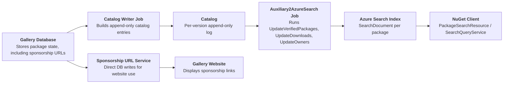
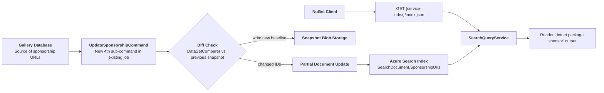
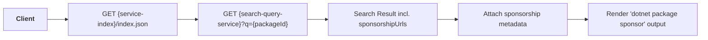
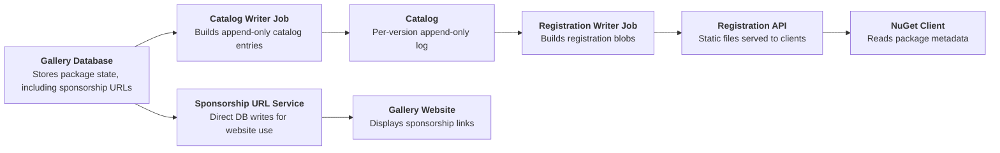
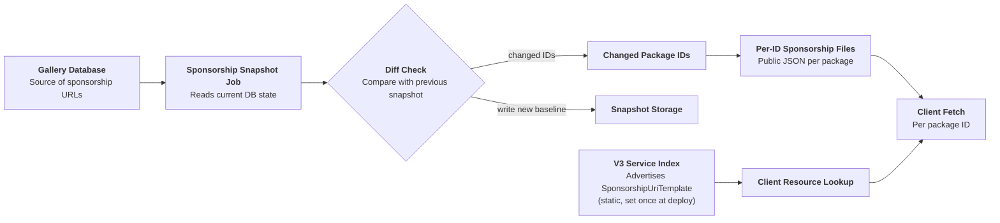
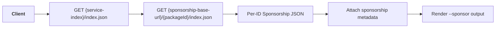

# **Indicate Sponsorship Needs for NuGet Packages**

- Author: [@kalebfik](https://github.com/kalebfik)
- GitHub Issue: [10703](https://github.com/NuGet/NuGetGallery/issues/10703)

## Summary

Add a new `dotnet package sponsor` command that lists installed packages with sponsorship links

## Motivation

Currently, sponsorship links are set by package owners on NuGet.org.
Users have expressed interest in seeing this information on the client side through PM UI, CLI, Copilot, etc.

This proposal adds a non-disruptive, opt-in way to surface sponsorship information.

## Explanation

### Functional Explanation

This proposal adds a new `dotnet package sponsor` command, giving sponsorship discovery a dedicated and purpose-built surface. 

When you run `dotnet package sponsor`, output is grouped by project and includes sponsorship links for each matching package:

```text
Project 'Contoso.App' has the following sponsorship information:
   > Contoso.Forms
      https://github.com/sponsors/contoso
      https://patreon.com/sponsor/contoso-forms
      https://opencollective.com/contoso-forms
   > Contoso.Utilities
      https://opencollective.com/contoso-utilities
```

In the case that a source either supports sponsorships but has no packages looking for them or a source does not support sponsorships, a respective message will be shown: 

```text
// No packages looking for sponsorship
No packages in project 'Contoso.Tools' are looking for sponsors.
```

```text
// Source does not provide sponsorship information
Source 'X' does not provide sponsorship information
```

For private/internal feeds, users can explicitly query nuget.org sponsorship data:

```text
dotnet package sponsor --source https://api.nuget.org/v3/index.json
```

`dotnet package sponsor` also supports JSON output via `--format json`. 
Since sponsorship is a per-package-ID concept independent of target framework, sponsorsable packages are listed per-project under `sponsorablePackages`

```json
{
  "version": 1,
  "parameters": "dotnet package sponsor",
  "sources": [
    "https://api.nuget.org/v3/index.json"
  ],
  "projects": [
    {
      "path": "/path/to/Contoso.App.csproj",
      "sponsorablePackages": [
        {
          "id": "Contoso.Forms",
          "urls": [
            "https://github.com/sponsors/contoso",
            "https://patreon.com/sponsor/contoso-forms",
            "https://opencollective.com/contoso-forms"
          ]
        },
        {
          "id": "Contoso.Utilities",
          "urls": [
            "https://opencollective.com/contoso-utilities"
          ]
        }
      ]
    }
  ]
}
```

### Sponsorship document format

| Name | Type | Required | Notes |
| --- | --- | --- | --- |
| packageId | string | yes | The package ID this document describes |
| sponsorshipUrls | array of objects | yes | The package's current sponsorship links |

Each `sponsorshipUrls` element:

| Name | Type | Required | Notes |
| --- | --- | --- | --- |
| url | string | yes | The sponsorship URL |
| timestamp | string | yes | When this URL was added, in ISO 8601 |

Sample response:

```json
{
  "packageId": "Contoso.Forms",
  "sponsorshipUrls": [
    {
      "url": "https://github.com/sponsors/contoso",
      "timestamp": "2025-01-15T00:00:00Z"
    }
  ]
}
```

- **Scope:** solution-wide across all projects.
- **Transitive packages:** respects `--include-transitive`; no sponsor-specific behavior is required.
- **Multiple sponsorship URLs:** The CLI will display the same sponsorship URLs that are received from NuGet.org
- **Empty state:** if a project has no sponsorable packages, show a per-project message indicating none were found.

### Technical Explanation

#### Proposed `dotnet package sponsor` design

`dotnet package sponsor` fetches sponsorship data via `PackageSearchResource` against the feed's `SearchQueryService`.

**Current flow:**



**Proposed server flow:**

- Add a **sub-command**, e.g. `UpdateSponsorshipCommand`, to the existing `Auxiliary2AzureSearchCommand` array.
- Following the `UpdateOwnersCommand` pattern, read `PackageRegistration.SponsorshipUrls` per package ID from the Gallery database, diff against the last-indexed snapshot, and push partial-document updates to Azure Search for changed IDs only, setting a new `SponsorshipUrls` field on `SearchDocument`.
- A new `SponsorshipDataClient`, mirroring `OwnerDataClient`'s read/write pattern, would maintain the last-indexed snapshot used for diffing.
- No new V3 service-index resource `@type` is required.



**Client behavior:**

- For each package, it queries `PackageSearchResource` and reads the new `sponsorshipUrls` field from the search result.



### Proposed alternative design:
 A dedicated `SponsorshipUriTemplate` V3 resource with per-package-ID fetch, consumed by a new `--sponsor` flag within `dotnet list package`

#### Proposed nuget.org server endpoint

The proposal adds one new resource `@type` to the existing V3 service index (`GET https://api.nuget.org/v3/index.json`), following the same shape already used by `RegistrationsBaseUrl` and `PackageBaseAddress/3.0.0` entries in that document today:

```json
{
  "@id": "https://api.nuget.org/v3/sponsorship/{id-lower}/index.json",
  "@type": "SponsorshipUriTemplate/6.14.0",
  "comment": "URI template used by NuGet Client to construct sponsorship metadata URL for packages"
}
```

- **Verb/shape:** `GET`, unauthenticated, no request body — matches the existing `registration5-semver1/{id-lower}/index.json` and `v3-flatcontainer/{id-lower}/...` patterns.
- **Path:** one static JSON blob per package ID (lowercased), not per version — mirrors the id-only shape of `OwnerDetailsUriTemplateResourceV3`.
- **Response:** the `packageId`/`sponsorshipUrls[]` document already defined below in "Sponsorship document format."
- **Missing ID / no sponsorship data:** returns `404`, matching the existing behavior of `registration5-semver1` for unknown/unlisted package IDs — the client treats `404` as "no sponsorship data," not an error.
- **Hosting:** served as a static blob from the same Azure Storage account/CDN tier used for registration and flat-container blobs today, not from the Gallery web app — keeps it cacheable and off the SQL-backed request path.

#### Current flow



#### Proposed server flow: DB → API data flow

- A new, dedicated **Sponsorship Snapshot Job**:
reads `PackageRegistration.SponsorshipUrls` directly from the Gallery database for all package IDs, independent of the catalog/registration pipeline.
- It loads the prior run's snapshot from blob storage and diffs old vs. new per package ID.
- For each **changed** ID only, it serializes the current `SponsorshipUrls` for that package into the JSON shape in "Sponsorship document format" below, and writes/overwrites the single blob at `sponsorship/{id-lower}/index.json`.
- It writes the new full snapshot back to blob storage so the next run has a baseline to diff against.
- The `SponsorshipUriTemplate` entry in the V3 service index is static.
The job does **not** need to update the service index on every run; the index only needs to be updated once, when the resource is first deployed.



#### Client behavior

- Client discovers `SponsorshipUriTemplate` from the service index.
- Client resolves per-package URL and fetches sponsorship JSON.
- A new `SponsorshipUriResourceV3` follows an ID-template pattern similar to owner-details URI resources and an HTTP deserialize flow similar to registration resources.
- `--sponsor` reuses existing package resolution paths used by other report flags.


#### Comparing the two proposals

| | Main: `dotnet package sponsor` + Search reuse | Secondary: `--sponsor` flag + dedicated resource |
| --- | --- | --- |
| New command surface? | Yes — new `dotnet package sponsor` verb | No — reuses `list package` |
| New scheduled job? | No — sub-command in existing `Auxiliary2AzureSearchCommand` | Yes — new, independent Sponsorship Snapshot Job |
| New V3 protocol resource/`@type`? | No — reuses `SearchQueryService` | Yes — new `SponsorshipUriTemplate` `@type`, new provider, new client resource class |
| Works on feeds without Search? | No | Yes, in principle |
| Extra network round-trip vs. an existing command? | No — same call as `list package search` | Yes — separate per-ID fetch |
| Implementation cost | Lower — reuses `UpdateOwnersCommand` pattern | Higher — new job + new protocol surface |

#### Deployment rollout: DEV → INT → PROD (applies to either proposal)

NuGet.org runs three parallel, structurally identical environments, each with its own V3 service index — verified directly by fetching each one:

| Environment | Gallery | V3 service index | Purpose |
| --- | --- | --- | --- |
| DEV | `https://dev.nugettest.org` | `https://apidev.nugettest.org/v3/index.json` | First deploy target; internal-only, data may not be preserved |
| INT | `https://int.nugettest.org` | `https://apiint.nugettest.org/v3/index.json` | Integration/staging; mirrors PROD topology for pre-release validation |
| PROD | `https://www.nuget.org` | `https://api.nuget.org/v3/index.json` | Public, live service |

Rollout sequence:

1. **DEV** — Deploy the chosen proposal's server-side change and prototype the client changes against DEV's service index; confirm end-to-end: DB write → diff job → data published → client fetch → CLI output.
2. **INT** — Promote to INT and observe for several days against realistic package/owner data to catch issues that only surface with realistic data volume and timing.
3. **PROD** — After clean INT observation, promote to `api.nuget.org`/`www.nuget.org`.

## Drawbacks

- **No link priority/reorder support** The CLI will display sponsorship information in the same order as the queried package source, not performing any sorting of its own 
- **CLI-only scope.** PM UI (Phase 2), popup link-out (Phase 3), Copilot/IDE, and NuGet.org/PM UI Search surfaces are deferred.
- **Freshness is cache-policy dependent.** Sponsorship data is fetched through the local HTTP cache, which currently has a fixed 30 minute TTL (time to live) 


## Rationale and alternatives

1. **Command alternatives**
- New `dotnet package fund` verb: mirrors `npm fund` naming, kept as an alternative naming option to `dotnet package sponsor`

- `dotnet list package --sponsor`: Reuses existing report-flag pattern as `--vulnerabilities` or `--outdated`.


2. **Display alternatives**
- a default JSON-only output: inconsistent with existing report UX that consumers already expect from `dotnet list package`. **`--format json`** will be supported.

3. **Restore-time messaging**
- Restore is a noise-sensitive surface run on every build; an explicit, per-invocation command keeps this information fully opt-in without polluting the default build/restore loop.

4. **Bake sponsorship into package metadata**: `npm fund` has precedent for this.
- The `funding` field lives directly in package metadata.
- npm's own guidance suggests keeping funding links at the package or author level.
- Doing the same for NuGet could be noisy for the CLI, and stale sponsorship information could be an issue.

**Impact of not doing this:** sponsorship links remain visible only on the nuget.org website; there is no way for the CLI, PM UI, or other client tooling to programmatically surface which dependencies are seeking sponsorship, limiting discoverability for package authors relying on this signal for funding.

## Prior Art

- **[2023 community proposal](https://github.com/NuGet/Home/blob/sponsor-link/proposed/2023/sponsor-link.md)**: Initial community proposal for the overall idea — introduced the `--sponsor` flag concept, sponsor metadata authors could set, a Visual Studio UI link, and an opt-in restore-time summary message.
- **[`npm fund`](https://docs.npmjs.com/cli/v10/commands/npm-fund/)**:  `npm fund` has precedent for this.
`funding` field lives in metadata. 
NPM suggests to have funding links live on package or author level.
They also state that it is noisy to the CLI, and stale funding information could be an issue
- **[Gallery UI Sponsorship Implementation](https://github.com/NuGet/Engineering/blob/prabora-needs-sponsorship-feature/Server.Specs/2025/NeedsSponsorship.md)**: companion server-side proposal for surfacing sponsorship needs directly in the nuget.org Gallery UI; relevant precedent/parallel effort for surfacing the same underlying sponsorship data.
- **`--deprecated`/`--vulnerable`**: precedent for opt-in report-style information that consumers already use and understand, informing this proposal's output/UX conventions even though it uses a dedicated verb rather than a flag.
- **PM UI's existing project/license/report-abuse links**: precedent for Phase 2 — PM UI already shows package-supplied links to consumers using an established, low-risk pattern.
- **[`nuget/home#14739`](https://github.com/nuget/home/issues/14739)**: Open issue for PM UI sponsorship button

## Unresolved Questions

None at this time

## Future Possibilities

- **Phase 2: VS Package Manager UI hyperlinks** for sponsorship links, directly addressing [nuget/home#14739](https://github.com/nuget/home/issues/14739).
- **Phase 3: Compact link-out CLI display** using template-driven website links (`nuget.org/.../{id}/sponsor`) once sponsor popup URLs are independently addressable.
- **Search and Browse Visibility** for PM UI Browse and nuget.org search experiences
- **Copilot/IDE surfaces**: See [Issue 14738](https://github.com/NuGet/Home/issues/14738)
