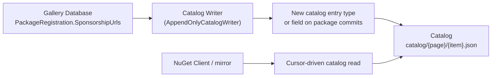
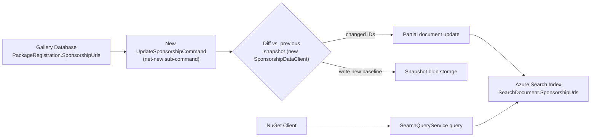
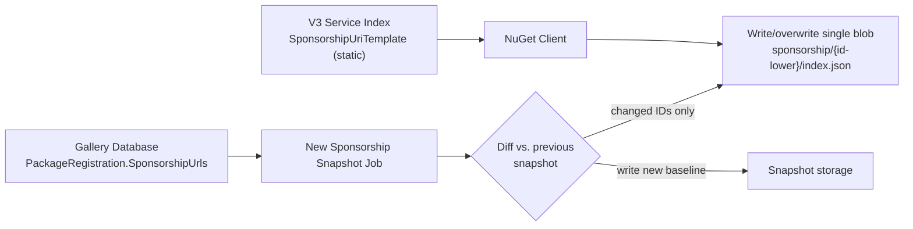
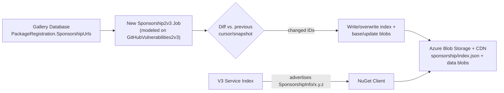

# **Publish Package Sponsorship Data via the NuGet V3 Protocol**

- Author: [@kalebfik](https://github.com/kalebfik)
- GitHub Issue: [10703](https://github.com/NuGet/NuGetGallery/issues/10703)

## Summary

Add server-side infrastructure on nuget.org to publish per-package-ID sponsorship URLs — currently stored only in the Gallery database (`PackageRegistration.SponsorshipUrls`) and shown only on the nuget.org website — through a client-consumable channel in the V3 protocol.

## Goals

- Publish sponsorship URLs through the V3 protocol so client tooling can consume them.
- Keep the data **package-ID-only** — there is no version dimension to sponsorship, and the publication mechanism should not introduce one.
- Avoid embedding sponsorship data inside existing metadata documents.
- Reuse existing, proven publication mechanics rather than inventing new infrastructure patterns where an existing one fits.

## Non-Goals

- Client-side consumption UX (CLI verb/flag design, PM UI surfaces, IDE/Copilot integration) — covered in the companion client specs.
- Authoring/validation of sponsorship URLs — already implemented by `SponsorshipUrlService`; unchanged by this proposal.
- Sponsorship for anything other than package IDs.

## Solution

Four server-side approaches were discussed for publishing sponsorship data. 
All were evaluated against the goals above; they differ in where the data lives and how clients discover/fetch it.

### Approach 1: Publish through the Catalog



**Required changes:**
- New catalog entry type (or a new field appended to existing package catalog entries) representing a sponsorship change, written via the existing `AppendOnlyCatalogWriter`.
- A trigger mechanism to enqueue a catalog commit whenever `PackageRegistration.SponsorshipUrls` changes. 
`Db2CatalogJob` only picks up packages via `GalleryDatabaseQueryService.GetPackagesCreatedSince`/`GetPackagesEditedSince`, which query the `Packages.Created`/`Packages.LastEdited` columns.
`SponsorshipUrlService` only writes to `PackageRegistration.SponsorshipUrls` and never touches `Package.LastEdited`, so a sponsorship change produces **no signal at all** in the existing catalog polling mechanism today; 
this would be new trigger plumbing, not a configuration change.
- Catalog readers (NuGet.Client's catalog reader, mirrors, external tooling) would need new logic to recognize and handle the new entry type/field.

**Example catalog page entry, if added as a new field on the existing per-version `catalogEntry`:**
```json
{
  "@id": "https://api.nuget.org/v3/catalog0/data/2026.07.20.12.00.00/contoso.forms.1.2.3.json",
  "@type": ["PackageDetails"],
  "id": "Contoso.Forms",
  "version": "1.2.3",
  "sponsorshipUrls": [
    "https://github.com/sponsors/contoso"
  ],
  "commitId": "8f2e1a4c-9b3d-4e5f-8a6b-1c2d3e4f5a6b",
  "commitTimeStamp": "2026-07-20T12:00:00Z"
}
```
Note this repeats the same `sponsorshipUrls` value on every version's entry for a given ID.
There is no existing per-ID-only catalog entry shape to attach it to instead.

**Example catalog page entry, if added as a brand-new non-version-keyed entry type (`SponsorshipDetails`):**
```json
{
  "@id": "https://api.nuget.org/v3/catalog0/data/2026.07.20.12.05.00/sponsorship.contoso.forms.json",
  "@type": ["SponsorshipDetails"],
  "id": "Contoso.Forms",
  "sponsorshipUrls": [
    "https://github.com/sponsors/contoso"
  ],
  "commitId": "1a2b3c4d-5e6f-4a7b-8c9d-0e1f2a3b4c5d",
  "commitTimeStamp": "2026-07-20T12:05:00Z"
}
```
This avoids per-version duplication, but is a new `@type` that every catalog reader must learn to recognize and skip unlike the version-keyed variant above, which existing readers already know how to parse.

**Benefits:**
- Reuses existing and proven catalog infrastructure.
- No new job or new V3 resource type needed 

**Trade-offs:**
- The catalog is a per-version, append-only log by design; 
representing an ID-level concept means either duplicating the sponsorship data across every version's entries or introducing a new non-version-keyed entry type that doesn't fit today's per-version commit shape.
- No existing trigger fires a catalog commit for a registration-level edit.
- Every catalog consumer (client, mirrors, third-party tooling) needs new code to understand the new entry type.

### Approach 2: Publish through the Search endpoint

Add a new `SponsorshipUrls` field to the existing `SearchDocument`/Azure Search index schema, populated by a new sub-command in the existing `Auxiliary2AzureSearchCommand` job, modeled on `UpdateOwnersCommand.cs`.



**Required changes:**
- New `UpdateSponsorshipCommand`, added as a 4th sub-command alongside `UpdateOwnersCommand`, `UpdateDownloadsCommand`, `UpdateVerifiedPackagesCommand` in the existing job, modeled on `UpdateOwnersCommand`'s shape.
- New `SponsorshipDataClient`, modeled on `OwnerDataClient`, to read/write the diffing snapshot.
- New `SponsorshipUrls` field added to `SearchDocument` and the Azure Search index schema.
- `Db2AzureSearchCommand` must be updated to seed the new field during full rebuilds, or a documented two-step rebuild (full rebuild + run `UpdateSponsorshipCommand`) must be established as the recovery procedure.
- The diff job compares **DB vs. the live Search index state**, otherwise an index-only data loss (e.g., a bad rebuild) would go undetected and unrepaired.

**Example partial document update sent to Azure Search** (mirroring the existing `SearchDocument.UpdateOwners` model):
```json
{
  "value": [
    {
      "key": "contoso.forms",
      "sponsorshipUrls": ["https://github.com/sponsors/contoso"],
      "@search.action": "merge"
    }
  ]
}
```

**Example `SearchQueryService` response, with the new field included in an existing search result**:
```json
{
  "totalHits": 1,
  "data": [
    {
      "@id": "https://azuresearch-usnc.nuget.org/query?q=contoso.forms",
      "@type": "Package",
      "registration": "https://api.nuget.org/v3/registration5-semver1/contoso.forms/index.json",
      "id": "Contoso.Forms",
      "version": "1.2.3",
      "description": "A sample package.",
      "authors": ["Contoso"],
      "totalDownloads": 152034,
      "verified": true,
      "sponsorshipUrls": [
        "https://github.com/sponsors/contoso"
      ],
      "versions": [
        { "version": "1.2.3", "downloads": 152034, "@id": "https://api.nuget.org/v3/registration5-semver1/contoso.forms/1.2.3.json" }
      ]
    }
  ]
}
```
No new V3 service-index `@type` is needed.
`sponsorshipUrls` is a new, optional field on the response already returned by the existing `SearchQueryService`/`SearchAutocompleteService` entry in the service index.

**Benefits:**
- Reuses an existing scheduled job cadence and pipeline.
- Data arrives attached to the same search result clients already fetch for other purposes.
- Naturally ID-only — `SearchDocument` is keyed per package ID, not per version.

**Trade-offs:**
- Ties sponsorship availability to Search being deployed/healthy.
A feed without Search (or during a Search outage) cannot serve this data at all.
- The rebuild/data-loss: a full index rebuild does not currently restore sponsorship data, requiring either a code change to `Db2AzureSearchCommand` or a documented manual recovery step.
- Diffing must be done carefully against live index state to avoid an undetectable-loss gap.

### Approach 3: New per-package-ID static blob + new resource type

Add a new V3 service-index `@type` (`SponsorshipUriTemplate`) that advertises a URI template clients expand per package ID to fetch a single, small static JSON document.
Mirrors the shape of `OwnerDetailsUriTemplateResourceV3` and reuses `BlobStorageVulnerabilityWriter`-style publication mechanics, but at per-ID resolution instead of a single index+base/update blob set.



**Required changes:**
- New, dedicated job that reads `PackageRegistration.SponsorshipUrls` for all packages, diffs against a previous snapshot, and writes one small JSON blob per **changed** package ID at a predictable path (`sponsorship/{id-lower}/index.json`).
- New `@type` entry in the V3 service index (`SponsorshipUriTemplate/6.14.0`) with a URI template, added once at deploy time.
- Blob storage/CDN hosting for the per-ID JSON documents, following existing static-file hosting conventions (same account/CDN tier as registration/flat-container blobs).
- New client-side `SponsorshipUriResourceV3`/provider to discover the template and expand it per package ID.

**Example V3 service index entry** (`GET https://api.nuget.org/v3/index.json`), following the same shape used by `RegistrationsBaseUrl`/`PackageBaseAddress`:
```json
{
  "@id": "https://api.nuget.org/v3/sponsorship/{id-lower}/index.json",
  "@type": "SponsorshipUriTemplate/6.14.0",
  "comment": "URI template used by NuGet Client to construct the per-package sponsorship metadata URL"
}
```

**Example per-package-ID blob**, `GET https://api.nuget.org/v3/sponsorship/contoso.forms/index.json`:
```json
{
  "packageId": "Contoso.Forms",
  "sponsorshipUrls": [
    "https://github.com/sponsors/contoso",
    "https://opencollective.com/contoso-forms"
  ],
  "lastUpdated": "2026-07-20T12:00:00Z"
}
```
**Proposed:** a package ID with no sponsorship data configured returns `404`.
 It follows the same convention as `registration5-semver1`to return `404` for an unknown/unlisted package ID, since it is served from static blob storage rather than a live database lookup.

**Benefits:**
- Per-ID resolution means a client only fetches data for packages it cares about, rather than downloading an index of all sponsorship-enabled packages.
- Works independent of Search.
- Naturally ID-only — the URI template itself is keyed on package ID, no version segment.

**Trade-offs:**
- Requires an extra network round trip per package ID (one fetch per package needing a check).
- Requires entirely new job infrastructure, plus a new client-side URI-template resource type.

### Approach 4: Publish all sponsorship data (vulnerability-style)

Add a new, standalone V3 service-index resource — modeled on the publication mechanics of `BlobStorageVulnerabilityWriter`, but with an ID-only schema.



**Required changes:**
- New job project, modeled on `GitHubVulnerabilities2v3`'s `Job.cs` structure: read `PackageRegistration.SponsorshipUrls` for all packages, diff against a cursor/snapshot, write changed entries to blob storage.
- New blob schema: index blob (list of package IDs with sponsorship data + a pointer/version) plus base+update blobs, following `BlobStorageVulnerabilityWriter`'s index/base/update pattern.
- New `@type` entry in the V3 service index (e.g. `SponsorshipInfo/6.14.0`), added once at deploy time.
- Cache-control headers on published blobs, matching the pattern already used for vulnerability blobs.
- New client-side resource provider/resource class to discover and download the full/incremental dataset.

**Example V3 service index entry:**
```json
{
  "@id": "https://api.nuget.org/v3/sponsorship/index.json",
  "@type": "SponsorshipInfo/6.14.0",
  "comment": "Base URL of the NuGet sponsorship information resources."
}
```

**Example index blob**, `GET https://api.nuget.org/v3/sponsorship/index.json`:
```json
[
  {
    "name": "base",
    "url": "https://api.nuget.org/v3/sponsorship/2026.07.20.00.00.00/sponsorship.base.json",
    "updated": "2026-07-20T00:00:00Z",
    "comment": "The base data for sponsorship URLs, updated periodically."
  },
  {
    "name": "update",
    "url": "https://api.nuget.org/v3/sponsorship/2026.07.20.00.00.00/2026.07.20.12.00.00/sponsorship.update.json",
    "updated": "2026-07-20T12:00:00Z",
    "comment": "The patch data for sponsorship URLs. Contains all changes since base was last updated."
  }
]
```

**Example base blob** (full snapshot, keyed by package ID — no version dimension, unlike `VulnerabilityInfoResourceV3`'s advisory entries):
```json
{
  "Contoso.Forms": [
    { "url": "https://github.com/sponsors/contoso" },
    { "url": "https://opencollective.com/contoso-forms" }
  ],
  "Contoso.Utilities": [
    { "url": "https://opencollective.com/contoso-utilities" }
  ]
}
```

**Example update blob** (incremental changes only, applied on top of base):
```json
{
  "Contoso.Forms": [
    { "url": "https://github.com/sponsors/contoso" }
  ]
}
```
An ID present in `update` with an empty array (`[]`) signals that package's sponsorship URLs were removed since `base` was last generated.

**Benefits:**
- Sponsorship has its own resource, schema, and blob namespace; no coupling to Search or Registration internals.
- Matches an established publication pattern already running in production (vulnerabilities).
- No data loss: next scheduled run always republishes full state from the DB.

**Trade-offs:**
- Requires a brand-new job/pipeline: new infrastructure to deploy, monitor, and operate.
- Clients that only need a handful of packages still discover/download from a dataset describing all sponsorship-enabled packages, rather than fetching just what they need.

### Comparing the four approaches

| | 1: Catalog | 2: Search | 3: Per-ID static blob | 4: One-shot (vulnerability-style) |
| --- | --- | --- | --- | --- |
| New scheduled job? | No — reuses catalog writer, but needs new trigger plumbing | No — new sub-command in existing job | Yes | Yes |
| New V3 `@type`? | No | No — reuses `SearchQueryService` | Yes | Yes |
| Works without Search deployed? | Yes | No | Yes | Yes |
| Naturally ID-only? | No — catalog is per-version by design | Yes | Yes | Yes |
| Full-rebuild/data-loss recovery | Requires re-deriving from DB history; no existing precedent for this | Requires `Db2AzureSearchCommand` change or documented manual step | Simple — cursor-driven full republish | Simple — cursor-driven full republish |
| Client fetch pattern | Cursor-driven catalog read | Rides along with existing search query | One fetch per package ID | One fetch for full/incremental dataset |
| Consumer impact if new entry/field unrecognized | Every catalog consumer needs new parsing logic | Existing search clients simply ignore unknown field (safe) | Only clients that adopt new resource type are affected | Only clients that adopt new resource type are affected |

## Alternatives Considered

The following were also evaluated and are not being pursued as the primary proposal, for the reasons noted:

- **Registration piggyback (add `sponsorshipUrls` to the registration leaf/index):** Registration documents are version-scoped (`registration5-semver1/{id}/{version}.json`); 
embedding an ID-scoped field there would require either duplicating it on every version's leaf or restructuring registration's per-version shape.
- **Package-authored metadata (nuspec-level, `npm fund`-style):** Would bake sponsorship directly into package metadata (nuspec); also raises staleness concerns since nuspec content is immutable once a version is pushed, while sponsorship URLs can change at any time.
- **Live, per-request compute (query DB directly on each V3 request):** No existing V3 resource computes anything against the Gallery SQL database at request time; 
every comparable resource (registration, flat-container, search index, vulnerability blobs) is precomputed/cached, and introducing the first live-DB-backed V3 endpoint would be a new operational risk class.

## Detailed Implementation Design

This section applies the common data-storage and safeguard requirements identified for whichever approach is selected.

### Data Model and Storage

- **Source of truth remains unchanged:** `PackageRegistration.SponsorshipUrls` in the Gallery SQL database. 
This proposal only adds a *publication* path from that existing source; 
it does not change how sponsorship URLs are authored or validated.
- **Published schema (Approaches 3 and 4):**
  ```json
  {
    "packageId": "Contoso.Forms",
    "sponsorshipUrls": [
      { "url": "https://github.com/sponsors/contoso" }
    ]
  }
  ```

- **Published schema (Approach 2):** a new `SponsorshipUrls: string[]` field added directly to the existing `SearchDocument` and the Azure Search index schema.
- **Published schema (Approach 1):** a new catalog entry type, or a new field on package catalog entries, carrying the current sponsorship URLs at time of the triggering event — still per-version in shape since it rides on the existing per-version catalog commit structure.
- **Storage medium:** Azure Blob Storage + CDN for Approaches 1, 3, and 4 (same tier used for catalog/registration/flat-container/vulnerability blobs today); Azure Search's own index storage for Approach 2 — no new storage technology introduced in any option.

### Throttling and Endpoint Safeguards

Protections currently in place are:
- **Catalog and static blobs (Approaches 1/3/4):** protected by CDN caching and cache-control headers, not app-level throttling — the origin is shielded because clients almost always hit CDN edge cache, not the Gallery/job infrastructure directly.
- **Search (Approach 2):** protected only by request-shape limits, not a rate limiter.

This proposal does not introduce new throttling infrastructure beyond what's already standard for the chosen publication mechanism — Approaches 1/3/4 inherit CDN-based protection "for free" from being static/append-only blobs; Approach 2 inherits whatever protections Search already has and does not add new ones.

### Reliability / Failure Modes

| Failure scenario | Approach 1: Catalog | Approach 2: Search | Approach 3: Per-ID blob | Approach 4: One-shot |
| --- | --- | --- | --- | --- |
| Publishing job/writer fails mid-run | Catalog commit is atomic per page; next run continues from cursor — no partial-page corruption | Partial index update; next run's diff picks up from last successful cursor, but only detects DB-side changes | Partial publish; next run's diff picks up from last successful cursor — no data loss beyond the outage window | Partial publish; same cursor-based recovery |
| Blob/index data lost or corrupted (infra-side, no DB change) | Catalog is append-only and durable; can be re-derived from DB history if ever needed, though no existing precedent does this | **Gap:** if only the search index (not the DB) loses data, and the diff job only compares DB vs. its own snapshot, the loss goes undetected — job must be built to diff against live index state to close this gap | Next scheduled run **republishes full state**, since the job always has the DB as ground truth | Same as Approach 3 — DB remains ground truth, next run rebuilds |
| Full infrastructure rebuild | Would require re-deriving catalog entries from DB history — no existing tooling does this today | `Db2AzureSearchCommand` does not currently seed sponsorship; must add seeding logic or require running `UpdateSponsorshipCommand` immediately after every full rebuild as a documented step | N/A — separate storage from Search | N/A — separate storage from Search |
| Gallery DB itself has stale/incorrect sponsorship data | Out of scope — this proposal only publishes what's in the DB; DB-side data integrity is `SponsorshipUrlService`'s existing responsibility | Same | Same | Same |

### Security / Abuse Prevention

- No new authentication surface.
All four approaches produce **publicly readable, unauthenticated** data, matching the existing visibility of sponsorship URLs on the public nuget.org website today.
- URL validation/allowlisting is unchanged.
It is enforced at write time by the existing `SponsorshipUrlService` (domain allowlist, 10-URL cap); 
this proposal does not add additional validation at publish time, since it only republishes already-validated data.

### Observability

- Job run success/failure, duration, and per-run changed-ID counts should be emitted as telemetry, following the existing pattern in `GitHubVulnerabilities2v3`'s `ITelemetryService`/`Auxiliary2AzureSearch`'s existing job telemetry.

### Testing Strategy

- Unit tests for the diff/comparer logic, following existing coverage patterns for `UpdateOwnersCommand`/`DataSetComparer` (Approach 2) or `BlobStorageVulnerabilityWriter` (Approaches 3/4).
- Integration/functional tests against DEV verifying end-to-end: DB write → job/writer run → published data → client fetch, mirroring existing integration test coverage for the vulnerability publication pipeline.

### Deployment / Rollout

NuGet.org runs three parallel, structurally identical environments:

| Environment | Gallery | V3 service index |
| --- | --- | --- |
| DEV | `https://dev.nugettest.org` | `https://apidev.nugettest.org/v3/index.json` |
| INT | `https://int.nugettest.org` | `https://apiint.nugettest.org/v3/index.json` |
| PROD | `https://www.nuget.org` | `https://api.nuget.org/v3/index.json` |

Rollout sequence: deploy to DEV and validate end-to-end → promote to INT and observe for several days against realistic data volume/timing → promote to PROD.

## Execution Phases

1. **Phase 1 (this proposal):** server-side publication of sponsorship data via the selected approach.
2. **Phase 2+ (client-side):** client consumption surfaces (CLI command/flag, PM UI, IDE/Copilot).

## Risks and Open Questions

- Final approach selection (1, 2, 3, or 4) is pending spec review.
