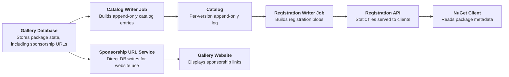
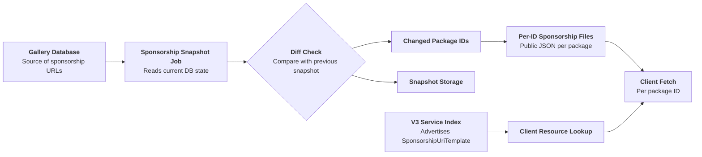
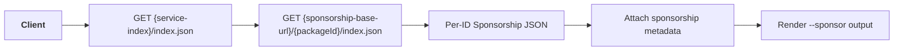

# **Indicate Sponsorship Needs for NuGet Packages**

- Author: [@kalebfik](https://github.com/kalebfik)
- GitHub Issue: [10703](https://github.com/NuGet/NuGetGallery/issues/10703)

## Summary

Add a new `--sponsor` flag to `dotnet list package` that lists installed packages with sponsorship links.

## Motivation

Currently, sponsorship links are set by package owners on NuGet.org.
Users have expressed interest in seeing this information on the client side through PM UI, CLI, Copilot, etc.

This proposal adds a non-disruptive, opt-in way to surface sponsorship information.

## Explanation

### Functional Explanation

This proposal adds `--sponsor` to `dotnet list package`, following the same opt-in report pattern as `--deprecated`, `--outdated`, and `--vulnerable`.

When you run `dotnet list package`, it restores the project and lists package dependencies:

```text
Top-level Package       Requested           Resolved
<PACKAGE_NAME>          <REQUESTED_VERSION> <RESOLVED_VERSION>
```

With `--sponsor`, output is grouped by project and includes sponsorship links for each matching package:

```text
Project 'Contoso.App' has the following sponsorship information:
   > Contoso.Forms
      https://github.com/sponsors/contoso
      https://patreon.com/sponsor/contoso-forms
      https://opencollective.com/contoso-forms
   > Contoso.Utilities
      https://opencollective.com/contoso-utilities
```

When there are no packages looking for sponsors, there will be a message: 

```text
No packages in project 'Contoso.Tools' are looking for sponsors.
```

For private/internal feeds, users can explicitly query nuget.org sponsorship data:

```text
dotnet list package --sponsor --source nuget.org
```

- **Scope:** solution-wide across all projects.
- **Transitive packages:** respects `--include-transitive`; no sponsor-specific behavior is required.
- **Multiple sponsorship URLs:** up to 10 URLs are stored. 
- **Empty state:** if a project has no sponsored packages, show a per-project message indicating none were found.

### Technical Explanation

**Proposed design:** a dedicated `SponsorshipUriTemplate` V3 resource with per-package-ID fetch, consumed by the `--sponsor` flag described above.

#### Current flow



#### Proposed server flow

- A background snapshot job reads `PackageRegistration.SponsorshipUrls` for all package IDs.
- It loads the prior snapshot, diffs old vs. new, and identifies changed package IDs.
- For each changed ID, it writes one public JSON document (per package ID, not per version).
- It updates the V3 service index to advertise the sponsorship resource location.



#### Sponsorship document format

| Name | Type | Required | Notes |
| --- | --- | --- | --- |
| packageId | string | yes | The package ID this document describes |
| sponsorshipUrls | array of objects | yes | The package's current sponsorship links |

Each `sponsorshipUrls` element:

| Name | Type | Required | Notes |
| --- | --- | --- | --- |
| url | string | yes | The sponsorship URL |
| timestamp | string | yes | When this URL was added, in ISO 8601 |

Sample response:

```json
{
  "packageId": "Contoso.Forms",
  "sponsorshipUrls": [
    {
      "url": "https://github.com/sponsors/contoso",
      "timestamp": "2025-01-15T00:00:00Z"
    }
  ]
}
```

#### Client behavior

- Client discovers `SponsorshipUriTemplate` from the service index.
- Client resolves per-package URL and fetches sponsorship JSON.
- A new `SponsorshipUriResourceV3` follows an ID-template pattern similar to owner-details URI resources and an HTTP deserialize flow similar to registration resources.
- `--sponsor` reuses existing package resolution paths used by other report flags.



## Drawbacks

- **No link priority/reorder support** With append/remove semantics, default ordering is oldest-added first.
- **CLI-only scope.** PM UI/Copilot/IDE and Azure Search-backed surfaces are deferred.
- **Freshness is cache-policy dependent.** Origin updates can be immediate, but user visibility depends on cache behavior.

## Rationale and alternatives

Proposed solution: a new V3 resource for sponsorship data, plus a `--sponsor` flag on `dotnet list package`, so developers can discover which dependencies are seeking sponsors.

Alternatives considered:

1. **Discovery alternatives**
- Whole-ecosystem/bulk discovery (mirroring the batch-published `VulnerabilityInfo` blob mechanism): out of scope — that mechanism publishes on a days-long batch cadence, which conflicts with the need for sponsorship removals (e.g. a compromised link) to take effect promptly.
- Local cache or assets-file discovery: stale/non-authoritative for current dependency graph.
- Separate tool outside `dotnet`/`nuget.exe`: inconsistent with existing CLI patterns.

2. **Command alternatives**
- New `dotnet sponsor` verb: higher cross-repo cost (`dotnet/sdk`) than adding a report flag.
- Combining report-type flags: would require changing the existing mutex behavior in `GetReportType` (currently a deliberate implementation choice, not a hard architectural constraint), for limited benefit over a dedicated flag.

3. **Server delivery alternatives**
- Inline registration field/pointer: ties freshness to catalog events and duplicates per-version data.
- Bulk index like `VulnerabilityInfo`: disproportionate work for sponsorship's per-ID shape.
- Registration + fallback hybrid: more client complexity for limited v1 value.
- Restore-time warnings: rejected because sponsorship is informational, not an actionable security signal.

4. **Display alternatives**
- JSON-only output: inconsistent with existing report UX.
- Link-out popup flow: depends on separate website work, deferred.


**Impact of not doing this:** sponsorship links remain visible only on the nuget.org website; there is no way for `dotnet list package`, PM UI, or other client tooling to programmatically surface which dependencies are seeking sponsorship, limiting discoverability for maintainers relying on this signal for funding.

## Prior Art

- **`OwnerDetailsUriTemplateResourceV3`/`OwnerDetailsUriResourceV3Provider`**: closest precedent — an id-only URI template (no version segment), with graceful `null` resolution on feeds that don't support it. Combined with `RegistrationResourceV3`'s HTTP-fetch-and-deserialize pattern to form the proposed `SponsorshipUriResourceV3`.
- **`ThrottledForEachAsync` and existing report fetch flows**: precedent for deduped, throttled fan-out orchestration.
- **`--deprecated`/`--vulnerable`**: precedent for opt-in report flags with mutually exclusive report modes.
- **`ISponsorshipUrlService.Add`/`Remove` semantics**: append/remove behavior implies "first shown" equals oldest-added in v1.

## Unresolved Questions


## Future Possibilities

- **Compact link-out CLI display** using template-driven website links when sponsor popup URLs are independently addressable.
- **VS Package Manager UI hyperlinks** for sponsorship links.
- **Azure Search-backed visibility** for PM UI Browse and nuget.org search experiences.

<!-- What future possibilities can you think of that this proposal would help with? -->
