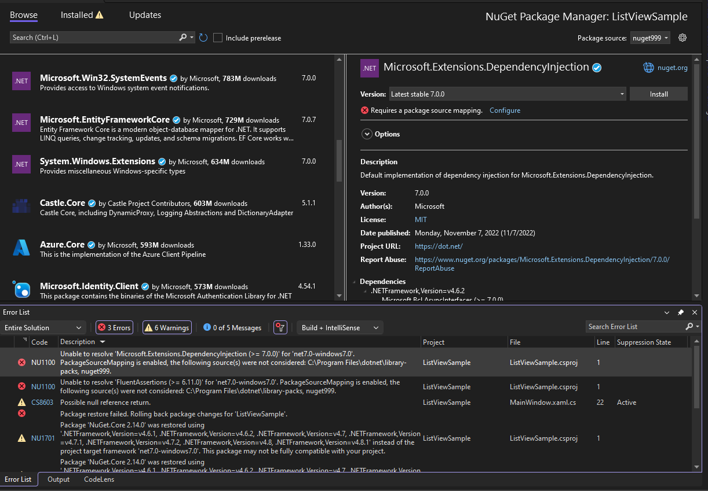
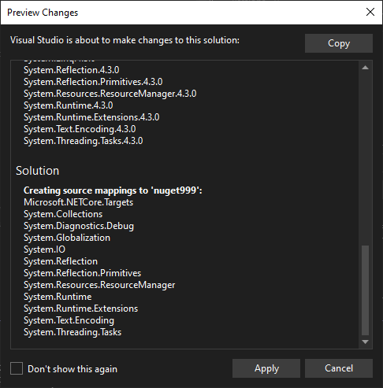
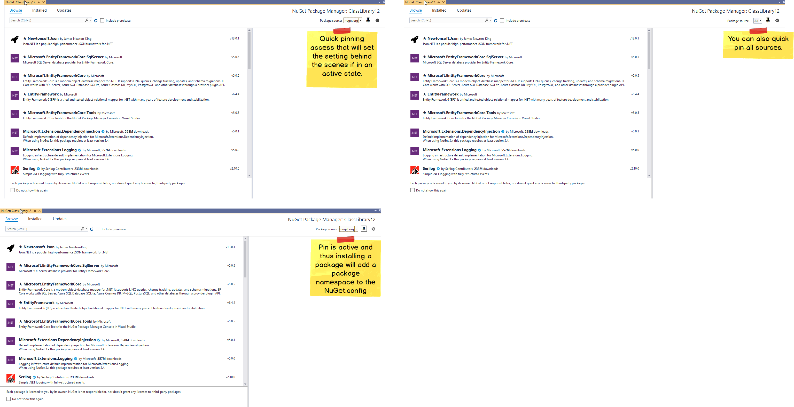
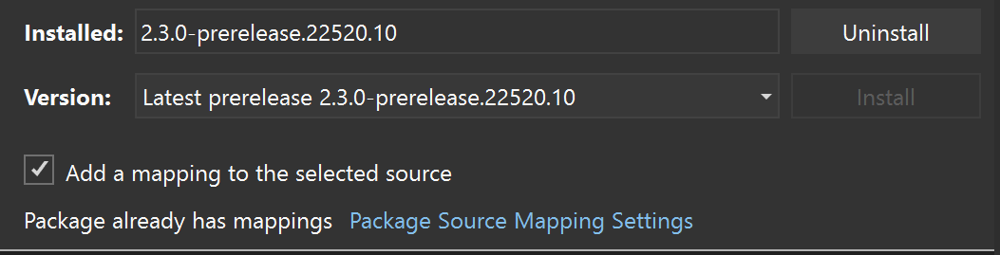
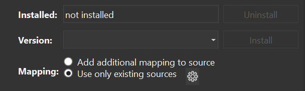
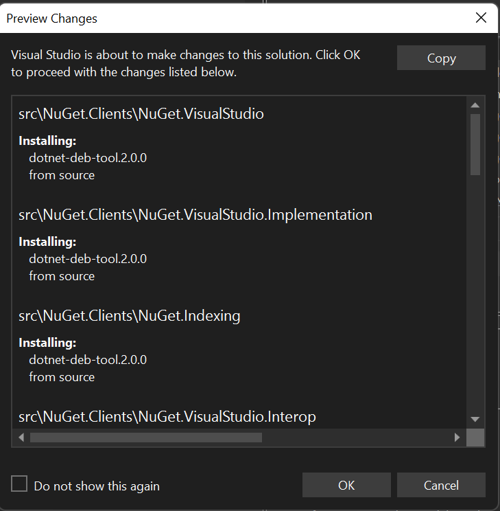

# Package Source Mapping Package Management Actions in the PM UI 
* Start Date: 6/25/22
* Authors: Ella McNally, Donnie Goodson ([donnie-msft](https://github.com/donnie-msft))
* Issue: https://github.com/NuGet/Home/issues/11797
* Status: Proposed

## Summary

Currently, Install/Update Package Management actions in the NuGet Package Manager in Visual Studio (PM UI) do not support creating new package source mappings.
We want to allow customers to continue using Package Source Mapping as they use the PM UI to manage their packages. 

Package Source Mapping in Restore was introduced in: https://github.com/NuGet/Home/blob/dev/implemented/2021/PackageSourceMapping.md

Package Source Mapping Status in the PM UI was introduced in: [Package Source Mapping Package Management Status in the PM UI ](package-source-mapping-status-PMUI.md)

## Terminology
- _Added package(s)_ - An Install adds the top-level package, and may also bring in transitive dependency packages.
- _Install_ - Refers to the PM UI Action of Install or Update package functionality in the PM UI
- _Preview Window_ - the dialog which appears during a package install/update action in the PM UI to show the affected packages.
- _Selected source_ - the NuGet Package Source(s) chosen in the Drop-down control in the upper-right of the PM UI.

## Motivation

Adding support for package source mapping actions in PM UI will allow customers to more seamlessly onboard and manage package source mappings while continuing to use the actions they are used to in the PM UI.
It also increases awareness of where their packages will be coming from before initiating a package management action.

Today, an NU1100 error is shown when attempting an Install action while package source mapping is enabled, but the necessary source mappings are not found for the added packages.

## Explanation

### Functional Explanation

For solutions with Package Source Mapping disabled, no behavior changes are indicated by this spec. The PM UI currently indicates in the Details Pane that `"Package source mapping is off."` and provides a `Configure` button which opens the VS Options page where the first mapping can be created.

For solutions with Package Source Mapping enabled and meeting the criteria defined below, the install/update action will attempt to create package source mappings automatically for the top-level package and its transitive dependencies.

Pre-requisites:
- Package source mapping must be enabled
- Top-level package isn't already mapped to selected source
- Package Source drop-down selection must not be `All`

Proposed Behavior:
- Show a new status in the details pane: `A package source mapping will be created`
- The Preview Window (dialog) will indicate added (top-level/transitive) packages being mapped to the selected source by introducing a `Solution` section to the preview dialog.
- The Action will write new package source mappings to the `NuGet.Config` for the dependencies in the graph which don't already have mappings

#### Scenario Applicability

Project type:

- **Applicable**: Only `PackageReference` project(s) in scope

- **Not Applicable**: Non-`PackageReference` project in scope

Selected source:

- **Applicable**: Single source selected in Package Source dropdown.

- **Not Applicable**: Aggregate source (`All`) selected in Package Source dropdown.

|Source Mapping Status | Project Type | Selected Source | Proposal |
|--|--|--|--|
|Package source mapping is off | - | - | None |
|Requires a package source mapping | Not Applicable | - | None (must manually create mappings) |
|Requires a package source mapping | Applicable | Not Applicable | None (must manually create mappings) |
|Requires a package source mapping | Applicable | Applicable| New Status and behavior:  `A package source mapping will be created`|
|Package source mapping found | Applicable | Applicable & selection is a mapped source | None (existing mapping remains) |
|Package source mapping found | Applicable | Applicable & selection is not a mapped source | Automatically create another mapping to selected source & show changes in Preview Window |

### Scenario: Project type(s) not applicable

_(Note: these are behaviors are unchanged)_

- Shows status of "Requires a package source mapping".
- Attempting to Install will result in `NU1100` errors

Example showing Solution PM UI with a Non-`PackageReference` project (eg, `Packages.Config`) in scope:

### Scenario: Project types are all applicable

Example showing Solution PM UI with only `PackageReference` projects in scope automatically creates a source mapping:

### Scenario: Selected source is not applicable

- Shows status of "Requires a package source mapping".
- Install button is disabled

Example showing Project PM UI with the `All` package source selected:

### Scenario: Selected source is applicable

Example showing Project PM UI with a single (not `All`) source selected which will automatically create a source mapping:

 

 The existing Preview Window dialog that shows when the customer hits `Install` or `Update` will be modified to list the mappings that will be made by their action. 
 Since package source mapping is a solution-level concept, a new section titled `Solution` will list the package IDs being added. 
 
 A proposal for the changes to the preview window is shown in the following example:

_Installing `System.Linq` while Package Source Mapping is enabled:_

The customer already has the option to disable this preview dialog, so if they choose to disable it, there will be nothing telling them what new mappings were created.

### Technical Explanation

Package Management action logic will pass down a new mapping package ID and source name to Restore. Preview Restore Utilities will look for this new mapping and use it in the preview restore: By appending 2 package patterns, a "`*`" and the new package ID, along with the new mapping source name to Settings in memory.

If the customer has enabled the Preview Window, then they must consent to the preview result. It's not required to enable the Preview Window in order for mappings to be automatically created, but if it's shown and cancelled, then no mappings will be written.

Once preview restore determines the added packages, those package IDs will be checked against existing mappings to calculate deltas.
The deltas (see tables below) will be written to disk in the applicable `NuGet.Config` after a successful preview restore, and immediately before executing Restore.

The Global Packages Folder (GPF) will not be checked for the Top-Level package, and will be checked for Transitive Packages to determine if it's already been downloaded and from which package source.
If GPF indicates a package source that's enabled, a new mapping for that source indicated in GPF will be created.
If it's missing from GPF or it's from a package source not enabled for this solution, the installation will fail.

If Restore ultimately fails despite a successful Preview Restore, any packages that got downloaded to the GPF due to the action will remain on disk.

### Table: Behavior for Packages not Installed to the GPF

_Selected Source: A_

_Enabled Sources: A, B_

_Package is not already mapped_

Type|Package found on Source|Automatic Mapping Source|
|--|--|--|
Direct|A|A|
Transitive|A|A|
Transitive|B|Error*|

(*) Error responses:
- The existing error for NU1101 will be shown.

### Table: Behavior for Packages Installed to the GPF

_Selected Source: A_

_Enabled Sources: A, B_

_Package is not already mapped_

Type|GPF Source|Automatic Mapping Source|
|--|--|--|
Direct|A|A|
Direct|B|A|
Direct|C|A|
Transitive|A|A|
Transitive|B|B|
Transitive|C|Error*|

(*) Error responses:
- The package is available in the GPF, but the source it came from is not one of your configured sources.

## Drawbacks

None

## Rationale and Alternatives

### Pin icon by the Package Source drop-down
On the previous spec, there was a pin icon next to the sources dropdown to pin a source instead of a checkbox in the details pane. Reviewing with the UX Board, the pin concept may be confusing since there was nothing to explain what it did and it's not near the action buttons. The pin icon is used for different actions already in VS, like to pin a file at the top of the screen. It would be confusing to have the same button do different tasks in different parts of VS.

Here is the mockup for the pin icon:

### A Proposal for Consent to a new Source Mapping
 A `CheckBox` that allows the customer to choose if they want to add a mapping to the package from the selected source when they `Install`/`Update`. This `CheckBox` will always be shown even if package source mapping is not enabled. Package source mapping can be enabled by the customer checking the `CheckBox` to create the first mapping for the solution's settings. Once package source mapping is enabled, the customer must either have a mapping previously configured, or consent to a new mapping by checking the `CheckBox` to install. Otherwise, Restore will fail as it does today.

A `RadioButton` was also considered to toggle between creating a new mapping or just installing with the currently configured mappings.

### Preview Window shows source mapping for each Package
Instead of a new `Solution` section listing the cumulative new package source mappings across the solution, we could show the new package source mappings by each package ID. Within each project group, there are package IDs shown, and we could add "from source \<source name\>" by each.

## Prior Art

Builds upon Package Source Mapping Status in the PM UI, introduced in: [Package Source Mapping Package Management Status in the PM UI ](package-source-mapping-status-PMUI.md)

## Unresolved Questions

None

## Future Possibilities 

1. If a package is found in the Global Packages Folder (GPF), the PM UI could look at the source in the `nupkg.metadata` file. A new mapping could either be created for this source auotmatically, or it could be presented to the customer in the Preview Window or another affordance.

1. Support non-`PackageReference` projects as an applicable scenario. Which project types to support needs to be determined.

1. Support `All` package source as an applicable scenario. Whether mappings will be created for all added packages to all enabled sources needs to be determined.

1. Currently, if an `Install`/`Update` cannot find transitive packages on the mapped source being mapped, the restore will fail. Reaching out to other configured sources and allowing the customer to select a different source for these packages may resolve this issue. However, care must be taken to avoid unintentionally leaking requested package IDs to these secondary sources when the customer hasn't agreed to such a query.