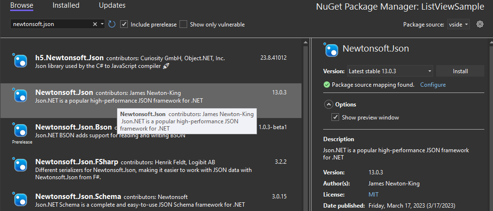

# Display Known Owners on the PM UI Browse Tab
<!-- Replace `Title` with an appropriate title for your design -->

- Donnie Goodson ([donnie-msft](https://github.com/donnie-msft))
- GitHub Issue <https://github.com/NuGet/Home/issues/12501>
- Status: Implemented in VS 17.12 Preview 1 (Packages List portion done in 17.11)

## Summary

A Known Owner is defined as a package owner that's indicated by a package source's [Search API](https://learn.microsoft.com/nuget/api/search-query-service-resource#search-result), as opposed to the free-form field in the `.nuspec`. A package source may change the owner for any given package over time.

Introduce a UI affordance to emphasize which package owners shown in the Packages Manager UI (PM UI) are known by the package source.
In the case of the `nuget.org` package source, each owner will render with a hyperlink typically to the owner's profile page (eg, `'https://www.nuget.org/profiles/<owner name>'`).

Only show `by <author>` when Known Owners are not provided by the selected package sources in PM UI.

## Motivation

<!-- Why are we doing this? What pain points does this solve? What is the expected outcome? -->

Customers need a clear understanding of who created a NuGet package to be more confident the package they've found is correct.
The term "owner" has become overloaded as NuGet has evolved, which has caused confusion.
The "author" metadata is also misleading as it's a free-form text field which doesn't imply any verified credentials.

Customers will be able to identify Known Owners of packages on the Browse Tab in the package list search results and in the package details pane of PM UI.

## Explanation

### Functional explanation

<!-- Explain the proposal as if it were already implemented and you're teaching it to another person. -->
<!-- Introduce new concepts, functional designs with real life examples, and low-fidelity mockups or  pseudocode to show how this proposal would look. -->

Instead of showing only `author` as the PM UI does today, the packages list will now show Known Owners beside each package ID when available from the selected package source.
Author will be shown only when the selected package source does not implement Known Owners.
For this iteration, a single package source must be selected (ie, not `All`) and the `Browse` tab must be selected.

The Details Pane will be capable of showing both Known Owner (when available) and Author for the selected package.

The Known Owner in both of these panes will be shown as a hyperlink.

#### Packages List UI for Owner/Author

When Known Owners are available on a package source, the PM UI Packages list will show:

- Each Known Owner beside each package ID as a hyperlink.
- Multiple Owners will be separated by a comma-delimiter.
- The ToolTip on the  package list item will show all Known Owners as a comma-delimited list of plain-text (the way authors are shown, today).
- Blank space will be shown for packages missing a Known Owner, with nothing beside the package ID.

Example of HyperLinks and a package list item's ToolTip:

Packages coming from [NuGet IntelliCode Package Suggestions](https://devblogs.microsoft.com/nuget/intellicode-package-suggestions-for-nuget-in-visual-studio/#:~:text=IntelliCode%20Package%20Suggestions%20use%20a,Netflix%20recommendations%20for%20NuGet%20packages.) are not sourced from a package source, and therefore will not contain Known Owner metadata nor will they be shown as hyperlinks.
Instead, the author will continue to be shown for these 5 recommended packages.

Example of IntelliCode Suggestions showing their author:

|Package Source supports Known Owners|Package is `*` Recommended|Shown in Packages List|Example
|--|--|--|--|
|No| N/A | Author | "by James Newton-King"
|Yes| No | Owner | "by [jamesnk](https://www.nuget.org/profiles/jamesnk), [newtonsoft](https://www.nuget.org/profiles/newtonsoft), [dotnetfoundation](https://www.nuget.org/profiles/dotnetfoundation)"
|Yes| Yes | Author | "by James Newton-King"

Hyperlink URL values for each Known Owner will depend on which resource the package source supports.
The URL's value will be shown as a tooltip on each hyperlink.

_The following is the order of precedence, starting from highest to lowest precedence:_

1. Owner with an **Owner Details** URL specific to the owner (eg, a **profile** page)
    - Resource: a new `OwnerDetailsUriTemplate`
    - eg, <https://www.nuget.org/profiles/dotnetfoundation>

1. Owner with **Package Details** URL for the package
    - Resource: [`PackageDetailsUriTemplate`](https://learn.microsoft.com/en-us/nuget/api/package-details-template-resource)
    - eg, <https://www.nuget.org/packages/Newtonsoft.Json>

Long lists of owners will be truncated, just as author can become truncated, today.
A complete list of owners will be shown in the tooltip for the package.

#### Packages without a Known Owner

Blank space will be shown for packages missing a Known Owner, with nothing beside the package ID.

For example, using package source `nuget.org`, the package `Mvc3CodeTemplatesCSharp` has no owners.

- A blank is shown where author ("by Microsoft") would have been shown prior to this proposal.

    

#### Details Pane UI for Owner/Author

The Details Pane will show both the Known Owner and the Author.
Historically, Owner has not been shown in the details pane at all.
If Owner is not available, the Owner field will be shown with an indication that the metadata is not specified.

### Technical explanation

<!-- Explain the proposal in sufficient detail with implementation details, interaction models, and clarification of corner cases. -->

#### Resource: `'OwnerDetailsUriTemplate'`

Introduce a template, `OwnerDetailsUriTemplate`, to the NuGet Server API for building URLs for details about an owner.
Similar to [Package details URL template](https://learn.microsoft.com/en-us/nuget/api/package-details-template-resource), the template will allow clients to link to details (eg, a profile page) on the package source.

#### NuGet Client SDK

Currently, `Owners` JSON parsed from the Search API is immediately converted into a comma-delimited string of owners.
To avoid breaking any clients depending on this, `Owners` will continue being a pre-processed string with comma-delimited owners.
A new property, `OwnersEnumerable` will be added to [IPackageSearchMetadata](https://github.com/NuGet/NuGet.Client/blob/dc2fadacd311646754ce6b062489b403338972aa/src/NuGet.Core/NuGet.Protocol/Model/IPackageSearchMetadata.cs) and [PackageSearchMetadataContextInfo](https://github.com/NuGet/NuGet.Client/blob/dc2fadacd311646754ce6b062489b403338972aa/src/NuGet.Clients/NuGet.VisualStudio.Internal.Contracts/ContextInfos/PackageSearchMetadataContextInfo.cs).
The enumerable owners will allow displaying custom UI for each owner.

#### Tabs other than Browse Tab

Package metadata is only retrieved on the Browse Tab, therefore, it is the only tab that currently looks up Owners from a package source.
Other tabs will continue displaying the author.

The [MultiSourcePackageFeed](https://github.com/NuGet/NuGet.Client/blob/1942c17866695ae1175ec3d8b42a6b41bcd6a9c9/src/NuGet.Clients/NuGet.PackageManagement.VisualStudio/PackageFeeds/MultiSourcePackageFeed.cs#L117) queries all package sources for metadata and combines the responses.

## Drawbacks

<!-- Why should we not do this? -->
N/A

## Rationale and alternatives

<!-- Why is this the best design compared to other designs? -->
<!-- What other designs have been considered and why weren't they chosen? -->
<!-- What is the impact of not doing this? -->

### Icon with hyperlink

Including an icon to further indicate that the owner in the packages list easily becomes noisy.

### Special label for owner / author

Using a prefix of `by:` with the colon in the same manner as `www.nuget.org`, we could start letting this imply Owner, and introduce a new term for Author.

Only render `by:` when we have Owners from a package source. The tooltip will reflect the same information.

Render a different string, `contributors:` when we only have Authors and do not have Owners from a package source. The tooltip will reflect the same information.

## Prior Art

<!-- What prior art, both good and bad are related to this proposal? -->
<!-- Do other features exist in other ecosystems and what experience have their community had? -->
<!-- What lessons from other communities can we learn from? -->
<!-- Are there any resources that are relevant to this proposal? -->

N/A

## Unresolved Questions

<!-- What parts of the proposal do you expect to resolve before this gets accepted? -->
<!-- What parts of the proposal need to be resolved before the proposal is stabilized? -->
<!-- What related issues would you consider out of scope for this proposal but can be addressed in the future? -->

1. Edge case: The package source responds with a Known Owner, but doesn't provide URL templates for **Owner Details** nor **Package Details**.

    What URL should the Known Owner hyperlink point to in this case?

    UX Board suggests that a real URL be used with all hyperlinks.
    I had considered a hyperlink that only opens the tooltip when no destination URL is available.

    Further fallback URL ideas:
    1. The Project URL.

        In some cases, this is excellent as it's the github repository URL.
        However, it may be any URL and nuget.org does not validate it.

        _Example of an author with a GitHub repository Project URL_
        

    1. The Registration JSON or Service index JSON file URLs.

## Future Possibilities

<!-- What future possibilities can you think of that this proposal would help with? -->

1. Support multiple package sources (ie, package source: `All`).
    An algorithm currently determines a winner for the same package ID and version when found on multiple sources.
    The proposal is falling back to `author` since determining a winner can be done in another iteration and with community and team discussion.
    When supporting multi-source feeds, a tooltip on the link should indicate the source it's coming from.
    In other words, the winning package source should be identified.

    To demonstrate, on a private feed, here I used Fiddler to inject my name into an `owner` response from the Search endpoint.
    When selecting that feed, my name appears as the owner.

    

    However, when switching to `nuget.org`, the owners are now different:

    

1. Support tabs beyond the Browse tab.
    Consider querying for metadata on the Installed tab so that information like Owners and Download Count can be shown.

1. Apply any configured [Package Source Mappings](https://learn.microsoft.com/en-us/nuget/consume-packages/package-source-mapping) when evaluating multiple package sources for Known Owners.
When a package is mapped, do not read Known Owner from any other unmapped package sources.

1. Show Owners for Recommended Packages.
As the issue [#10714](https://github.com/NuGet/Home/issues/10714) indicates, the recommender feed does not look up metadata for packages, and therefore will not have Known Owner metadata.

1. Stop falling back to `author` when a package source supports Known Owners.

    Package sources could advertise whether they support strict Known Owner so that Clients can choose to hide `author` for packages where Known Owner is missing from the returned metadata.
    Package sources which do not make the strict declaration would continue falling back to `author`.

    For example, for package source `nuget.org`, the package `Mvc3CodeTemplatesCSharp` has no owners.

    - In PM UI, show a blank instead of `author` (ie, remove "by Microsoft"), and add a line to the tooltip re-iterating that no owners exist for the package.

      On <https://www.nuget.org/packages/Mvc3CodeTemplatesCSharp>, there is a warning icon and a message "This package has no owners and is not being actively maintained."

      
