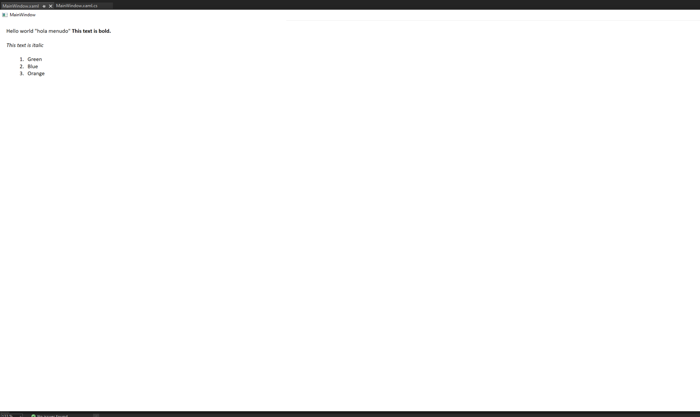

# Automatically Open `README.md` Files When Installing a NuGet Package in Visual Studio Spec

* Status: **In Review**
* Author(s): [David Cueva Cortez](https://github.com/dcc7497)
* Issue: [10353](https://github.com/NuGet/Home/issues/10353) Feature Request: Automatically Open `readme.md` Files
* Type: Feature

## Problem Background

When developers install packages from Visual Studio&#39;s package manger and if that package has a README file, Visual Studio will automatically open a `README.txt` file. However, Visual Studio does not have a way of opening a rendered `README.md` file, just a text version of the README. While the README allows for the developer to get more information about the package, having a rendered markdown file open automatically allows for information to be displayed in an organized manner. When rendered, the markdown file has links one can follow, different sections can be clearly marked with headers, among other things. It provides the same information as a txt file with the added benefit of being rendered in an easier to follow format.

## Who are the customers

* Developers who use Visual Studio and install packages via the NuGet package manager who want detailed information about the package they&#39;re installing.

## Requirements

* Markdown files open automatically after the user has installed the NuGet package in Visual Studio, if available.
* When opened, `README.md` will be rendered as a markdown.
* Markdown file opens in the doc well of Visual Studio.

## Goals

* Display a rendered `README.md` file in the Visual Studio doc well after a package has been installed on the NuGet package manager.

### Proof of Concept

## Non-Goals

* Packages that were downloaded from a web browser and installed into their projects will not have their `README.md` files open automatically in Visual Studio.
* Packages that have their `README.md` file in a location other than the package install directory will not be opened or rendered.
* If a `README.txt` and `README.md` file exist, the default will be to open the `README.txt`

## Solution

I will be using a Model View ViewModel (MVVM) approach to solve this problem. 
* Model: Opening the README does not have much in terms of abstraction of data sources, so no model will be implemented.
* View: The view will be defined as a XAML and have the rendered README bonded to it. The view will be located at `src/NuGet.Clients/NuGet.PackageManagement.UI/XAMLS`.
* ViewModel: The ViewModel will be responsible for storing the contents of the markdown file so that it may be rendered later. The viewmodel will be located at `src/NuGet.Clients/NuGet.PackageManagement.UI/ViewModel`

I will oversee creating a path for the README file if it exists in the package install directory and rendering the file's content at said path via a ToolWindowPane. The ToolWindowPane will be used to display a WPF that renders a markdown viewer and this will occur in the Visual Studio doc well.Rendering the markdown will be achieved by using the [Markdig.Wpf.Signed](https://www.nuget.org/packages/Markdig.Wpf.Signed/) package from NuGet.

## Considerations

* A stretch goal I have is to add in functionality to be able to render a `README.md` file from a location that a user specifies in the nuspec file that is not the package's install directory.