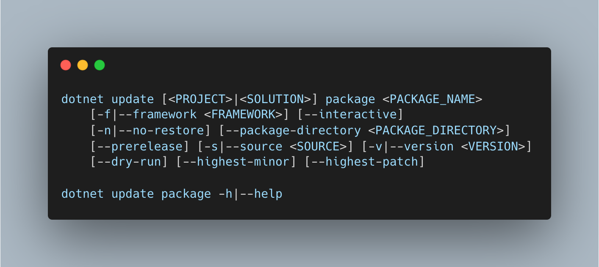

# Title

- [Jon Douglas](https://github.com/JonDouglas)
- Start Date (2022-05-11)
- [#4103](https://github.com/NuGet/Home/issues/4103)

## Summary

<!-- One-paragraph description of the proposal. -->
Staying current on the latest package version is a major challenge for modern .NET developers. Developers would like an update all experience in the .NET CLI similar to what they can do in modern IDEs like Visual Studio and checking all packages to then be updated in bulk. This feature will support the bulk updating of eligible `<PackageReference>` elements throughout their project files and solutions.

`dotnet update package` can automatically update any outdated package(s) to the latest version depending on the update strategy provided by the user.

## Motivation

<!-- Why are we doing this? What pain points does this solve? What is the expected outcome? -->
To rid developers of "DLL Hell" in managing modern .NET dependencies, we would like to implement this feature to rid developers of daily pain of managing their dependencies and staying current with the latest versions of packages to maintain a secure supply chain and new package feature functionality.

## Explanation

### Functional explanation

<!-- Explain the proposal as if it were already implemented and you're teaching it to another person. -->
<!-- Introduce new concepts, functional designs with real life examples, and low-fidelity mockups or  pseudocode to show how this proposal would look. -->
This command will update dependencies to the latest version respecting the semver constraints of your package and its transitive dependencies. It will also install any missing packages if an newer version brings them in. It will take into account lock files and central package management as locations that exist in addition to common definitions of `<PackageReference>` in project file(s).

To ensure compatibility with existing package definitions in various files, we should not overwrite or simplify XML elements, but rather only update package version attributes.



```
dotnet update [<PROJECT>|<SOLUTION>] package <PACKAGE_NAME>
    [-f|--framework <FRAMEWORK>] [--interactive]
    [-n|--no-restore] [--package-directory <PACKAGE_DIRECTORY>]
    [--prerelease] [-s|--source <SOURCE>] [-v|--version <VERSION>]
    [--dry-run] [--highest-minor] [--highest-patch]

dotnet update package -h|--help
```

#### Arguments

- PROJECT | SOLUTION

The project or solution file to operate on. If not specified, the command searches the current directory for one. If more than one solution or project is found, an error is thrown.

- PACKAGE_NAME

The package reference to add. Package name wildcards should be supported and update a subset of a glob-style pattern package name. i.e. `Microsoft.*` would update Microsoft packages. The commonly used symbols to support are:

- `*` - zero or more characters.
- `?` - single occurrence of any character.
- `.` - literal "." character

#### Options

- -f|--framework <FRAMEWORK>

Adds a package reference only when targeting a specific framework.

- -?|-h|--help

Prints out a description of how to use the command.

- --interactive

Allows the command to stop and wait for user input or action. For example, to complete authentication.

- -n|--no-restore

Adds a package reference without performing a restore preview and compatibility check.

- --package-directory <PACKAGE_DIRECTORY>

The directory where to restore the packages. The default package restore location is %userprofile%\.nuget\packages on Windows and ~/.nuget/packages on macOS and Linux. For more information, see Managing the global packages, cache, and temp folders in NuGet.

- --prerelease

Allows prerelease packages to be installed. Available since .NET Core 5 SDK

- -s|--source <SOURCE>

The URI of the NuGet package source to use during the restore operation.

- -v|--version <VERSION>

Version of the package. See NuGet package versioning.

- --dry-run

Displays what would be updated, but doesn't actually do the operation.

- --highest-minor

Considers only the packages with a matching major version number when searching for updated packages.

- --highest-patch

Considers only the packages with a matching major and minor version numbers when searching for updated packages.

#### Examples

- Updates all NuGet packages in the current working directory.

```
dotnet update package
```

- Updates a specific NuGet package in the current working directory.

```
dotnet update package <PACKAGE_NAME>
```

- Updates a glob of NuGet package(s) in the current working directory.

```
dotnet update package Microsoft.*
```

- Displays what would be updated in the update operation for the current working directory.

```
dotnet update package --dry-run
```

#### Exit Codes

- 0 - NuGet succeeded in update.
- 1 - NuGet failed to update.

### Technical explanation

<!-- Explain the proposal in sufficient detail with implementation details, interaction models, and clarification of corner cases. -->

## Drawbacks

<!-- Why should we not do this? -->

While `dotnet add package` provides some of this functionality, it doesn't give much control, ease-of-use, or discoverability to a simple update command.

## Rationale and alternatives

<!-- Why is this the best design compared to other designs? -->
<!-- What other designs have been considered and why weren't they chosen? -->
<!-- What is the impact of not doing this? -->

There currently doesn't exist a .NET CLI equivalent of this command and the impact of not doing this can lead to small papercuts, general dissatisfaction compared to other package management experiences and extensive workarounds instead of a common command that provides a solution.

While there has been one design in the past, it was not extensive enough to gather feedback from the community and surrounding teams on whether the direction is sound to pursue.

## Prior Art

<!-- What prior art, both good and bad are related to this proposal? -->
<!-- Do other features exist in other ecosystems and what experience have their community had? -->
<!-- What lessons from other communities can we learn from? -->
<!-- Are there any resources that are relevant to this proposal? -->

- [NuGet update](https://docs.microsoft.com/en-us/nuget/reference/cli-reference/cli-ref-update)
- [cargo update](https://doc.rust-lang.org/cargo/commands/cargo-update.html)
- [npm update](https://docs.npmjs.com/cli/v8/commands/npm-update)
- [RubyGems update](https://rubygems.org/gems/rubygems-update)
- [dart pub upgrade](https://dart.dev/tools/pub/cmd/pub-upgrade)
- [pip install -U](https://pip.pypa.io/en/stable/cli/pip_install/)

## Unresolved Questions

<!-- What parts of the proposal do you expect to resolve before this gets accepted? -->
<!-- What parts of the proposal need to be resolved before the proposal is stabilized? -->
<!-- What related issues would you consider out of scope for this proposal but can be addressed in the future? -->
- Should this command use `dotnet add package` under the hood for the scenarios that make sense such as finding the latest version of a specific package name?
- What verb makes most sense? `update`, `upgrade`, `refresh`, etc? Update seems the most consistent for package managers such as cargo, npm, rubygems, and NuGet. Upgrade seems the most consistent for package managers such as pip.
- Should `--highest-minor` and `--highest-patch` be replaced with a single `--dependency-version <version>` parameter to account for more scenarios like `Lowest(default)` and `Highest`?

## Future Possibilities

<!-- What future possibilities can you think of that this proposal would help with? -->
- Any CI/CD environment can leverage this CLI command as an easy way to update dependencies or check for them with exit codes.
- Any project can leverage `dotnet update package` and build on-top of it in the ecosystem.
