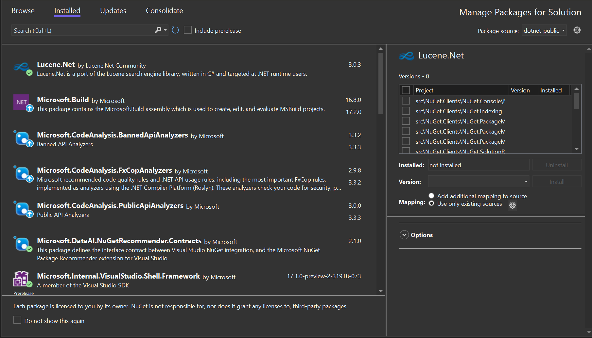
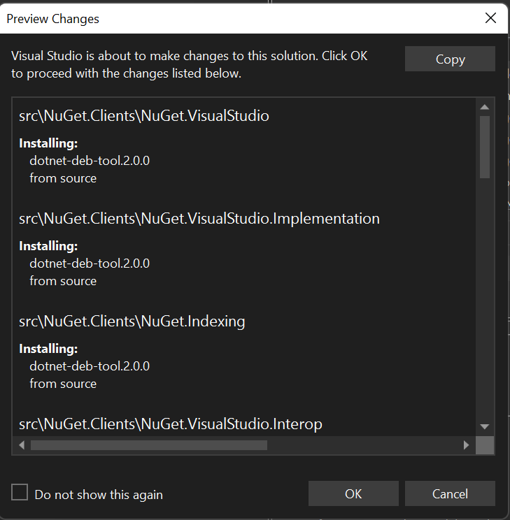

# Package Source Mapping in PMUI 
* Start Date: 6/25/22
* Authors: Ella McNally
* Issue: https://github.com/NuGet/Home/issues/11797

## Summary

Currently there is no support for package source mapping in the PMUI. I will add a feature that allows the user to choose if they want to map the package to the source chosen when they install. This feature is a portion of what was discussed in a previous spec. https://github.com/NuGet/Home/blob/dev/implemented/2021/PackageSourceMapping.md

## Motivation

Adding support for package source mapping in PMUI will allow user to make/view package source mappings with more ease. It will also help the user be more aware of where their packages are coming from and what mappings they have already configured

## Explanation

### Functional Explanation

On the details pane there will be two `RadioButtons` that allow the user to choose if they want to add a mapping to the package from the selected source when they `Install`/`Update` or if they only want to use existing mappings. These `RadioButtons` will always be shown even if package source mapping is not enabled, but neither button will have to be selected to install. Package source mapping can be enabled by the user choosing the `RadioButton` that adds a new mapping. Once package source mapping is enabled, the user must select one of the two `RadioButtons` to install. The `Use only existing mappings` option will be selected by default once package source mapping is enabled. The existing mappings will not be shown, but there will be a link to the package source mapping options page so the user can view the mappings. The link will be a settings icon next to the `RadioButton` (similar to the settings button next to the sources dropdown in the top right of the PMUI). The details pane will look like:


 
The existing preview dialog that shows when the user hits `Install` or `Update` will be modified to list the mapping they just made under the version. The user already has the option to disable this preview dialog, so if they choose to disable it, there will be nothing telling them what mappings they made. The changes to the preview window will look like:



When the user installs a package with the new checkbox, one of 9 scenarios will happen. These scenarios are in the table below:

| |Package Source Mapping is not enabled | Package Source Mapping is enabled and the package has previous mappings | Package Source Mapping is enabled and the package does not have previous mappings |
|---|---|---|---|
|`Add additional mapping to source` | Package source mapping is enabled. New mapping is created. Package is now mapped to only the new source| New mapping is created. Package is now mapped to the new source in addition to previous mappings | New mapping is created. Package is now mapped to only the new source.|
|`Use only existing mappings` | Not possible since this button will be greyed out (since there are no existing mappings)| No new mappings are made. Package only has previous mappings| Not possible since this button will be greyed out (since there are no existing mappings). User must select `Add additional mapping to source` to install. |
|Neither is checked| Package Source Mapping is not enabled. Restore works as normal | Not possible since `Use only existing mappings` will be chosen by default once package source mapping is enabled| Not possible since `Use only existing mappings` will be chosen by default once package source mapping is enabled (unless there are no existing mappings in which case the user must select the other option to `Install`)|

<!--show label saying there are no existing mappings if use existing mappins is greyed out-->

#### Restore Errors

There are a few errors the user could make while trying to install or update a package with a mapping that would make `Restore` fail. First, there could be issues with the transitive packages. Maybe there are transitive packages that are already mapped to a different source or the source that the user is trying to map a package to does not support some of the transitive packages. Additionally, if the user tries to update a package if that package has an existing mapping, then the mapping could be to a different source than the one chosen from the package source dropdown when `Update` is clicked. The user could also try to update a package that is already mapped to a different source (like the last scenario), but the source it is mapped to does not support the version they are trying to update to. I will not add anything to the PMUI addressing these errors. Instead, `Restore` will fail, and the PMUI will look just as it did before the user tried to install the package. The user can see why `Restore` failed in the output window. 


### Technical Explanation

The mapping will not be written to the config until the user selects `OK` on the preview dialog popup. A mapping will only be written to the config if the user selects the checkbox in the details pane. <!--if not checked then key=* ? Does the user have to make a mapping? Maybe if user does not check the box and package source mapping is already enabled then they will get a message saying they should make a mapping--> 

**Example 1** 

```xml
<PackageReference Include="Serilog" Version="11.0.0"/>
```

```xml
<packageSourceMapping>
    <packagesource key="nuget.org">
        <package pattern="Serilog" />
    </packageSource>
</packageSourceMapping>
```

**Result:**

In this example, the user had `nuget.org` selected from the source dropdown. They clicked on the `Serilog` package on the installed tab, chose version `11.0.0`, and selected the checkbox to make a mapping from `Serilog` to `nuget.org`.

## Drawbacks

## Rationale and Alternatives

On the previous spec, there was a pin icon next to the sources dropdown to pin a source instead of a checkbox in the details pane. I thought the pin was confusing since there was nothing to explain what it did. Also the same pin icon is used to different actions already in VS like to pin a file at the top of the screen. It would be confusing to have the same button do different tasks in different parts of VS.

Here is the mockup for the pin icon:


## Prior Art

## Unresolved Questions

Should there be an explicit way to enable or disable package source mapping in the UI? e.g. a `Checkbox` above the `RadioButtons` that says "enable/disable package source mapping?". Currently, package source mapping will be enabled when the user makes the first mapping and disabled when all mappings are removed. 

## Future Possibilities 

Currently there will not be any error messages in the UI if restore fails while trying to `Install`/`Update`. If there is time later, some error messages could be added saying which packages (including transitives) failed to install and why (maybe they have previous mappings to a different source or the source being mapped to does not support the version, etc...).

