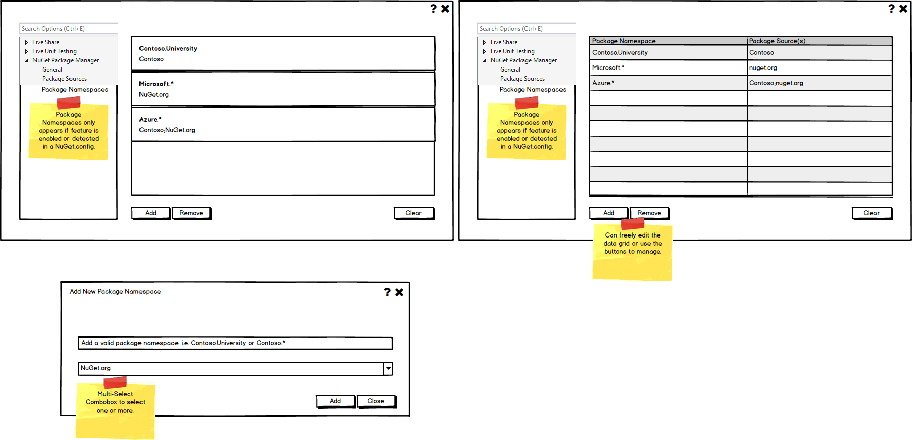
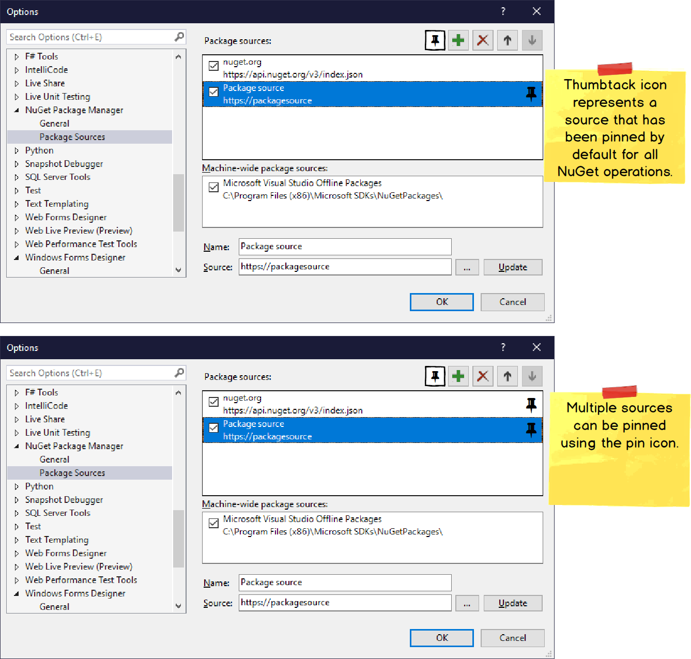

# Package Source Mapping in Visual Studio Options Dialog

* Start Date: 06-10-2022
* Authors: Ella McNally
* Issue: https://github.com/NuGet/Home/issues/11363

## Summary

Currently there is no support for package source mapping in the Visual Studio options dialog. I will be creating a feature where users can pin default sources and choose a specific source(s) for certain package source mappings from sources already provided in package sources page. This feature is a portion of what was discussed in a previous spec. https://github.com/NuGet/Home/blob/dev/implemented/2021/PackageSourceMapping.md

## Motivation 

Adding support for package source mapping in the VS options dialog will allow user to pin sources and add/remove package source mappings with more ease.

## Explanation

### Functional Explanation

#### Package Source Mappings Page 

When the user opens the package source mapping page in the options dialog, they will see a list of all the package source mappings they have already configured and the filepath to the solution level config file. There is a hierarchy of NuGet configs levels: machine, user, and solution. Package source mappings will be read from all of the levels, but only written to the solution level config. This page will have three buttons: _Add_ , _Remove_, and _Clear_.

* Add: Brings user to a pop-up where they can add package source mappings to their project.

* Remove: Lets user remove selected package source mapping from project.

* Clear: Lets user clear all package source mappings from current project.

The popup when the user clicks the add button will have a textbox where a user can type in a package ID. All sources that are defined in package sources page of VS options dialog will appear in a `ComboBox` below. The user checks a `CheckBox` for the sources they would like to use for that package ID. 

The add window has two buttons: _Add_ and _Close_.

* Add: Add button adds package source mapping to project only using selected sources, and the pop-up will disappear. 

* Close: Will close pop-up without adding any package source mappings.

Below are the mockups for the package source mappings page. The top left is the package source mappings page, and the bottom left is the popup that appears when the user clicks the add button.



#### Package Sources Page

I will add a feature that allows a user to pin default sources for all package source mappings that are not specified on the package source mapping page. There will be a pin button, that when clicked, creates a default mapping for all package IDs to the pinned source. A pin icon will appear next to all pinned sources.

Below are mockups of the package sources page with the added pin feature.



### Technical Explanation

#### Package Source Mappings Page

When the user opens the package source mapping page in the options dialog, it will automatically display all previous package source mapping configurations. 

When the user adds a package source mapping to their project, the NuGet config will be updated when the user clicks the okay button. The specified package ID will be mapped to the selected source(s) in the config. 

**Example 1** 

```xml
<PackageReference Include="Microsoft.A" Version="1.0.0"/>
<PackageReference Include="Newtonsoft.Json" Version="11.0.0"/>
<PackageReference Include="Serilog" Version="11.0.0"/>
```

```xml
<packageSourceMapping>
    <packagesource key="nuget.org">
        <package pattern="Serilog" />
        <package pattern="Microsoft.Extensions.Options" />
        <package pattern="Newtonsoft.Json" />
    </packageSource>
</packageSourceMapping>
```

**Result:**

In this example, the user added `Serilog`, `Microsoft.A`, and `Newtonsoft.Json`, separately, on the package source mappings page and selected `nuget.org` as the source from the `ComboBox` for all of them. All three package source mappings will be configured to be installed from `nuget.org`. 

If the user removes one of these package source mappings, it will be deleted from the configuration as well. For example, if the user removes `Serilog`, the above code becomes

```xml
<packageSourceMapping>
    <packagesource key="nuget.org">
        <package pattern="Microsoft.Extensions.Options" />
        <package pattern="Newtonsoft.Json" />
    </packageSource>
</packageSourceMapping>
```

If the user clicks the _Clear_ button on the package source mappings options page, then all package sources will be removed from the configuration, and package source mapping will be disabled. 

If the user removes a source from the package sources page, any mappings to that source will not be deleted in the config. The user will get a message that they are removing a source that still has mappings to it. If a user adds a source that has already has mappings to it in the config, this will also be a message to the user.

If the user adds `*` as the package ID, then the selected sources will be pinned on the package sources page. This is because if the user adds `*` as the package ID, it will be written to the solution level config with `pattern=*` for the selected source(s). See `Example 2` below.

#### Package Sources Page

When the user opens the package sources page, it will automatically display a pin icon with all previously pinned default sources.

When the user pins a package source(s), the NuGet config will be updated. Unless otherwise specified in the package source mappings page, all package IDs will be pinned to this source because the `pattern=*` in the config. 

**Example 2**

```xml
<packageSourceMapping>
    <packagesource key="contoso">
        <package pattern="*" />
    </packageSource>
</packageSourceMapping>
```

**Result:**

In this example, the user pinned the source `contoso` and did not specify any specific package source mappings. All packages will come from the source `contoso` due to matching the `*` pattern. Alternatively, the user could have added `*` as the package ID and selected `contoso` as the source on the package source mappings page. These two options would be written to the solution level config and read by the package sources page in the same way.

### Accessibility 

To ensure screen-reader I will run Accessibility Insights to find any accessibility faults.


## Drawbacks 

Currently, mappings to sources are not deleted in the config file when the source they are mapped to is deleted. It is complicated to remove this code because there are multiple different config files this mapping could be in.


## Rationale and Alternatives 

There were multiple ways to design the package source mappings page (e.g. use a table to display package source mappings/sources), but I found a `ListView` of the package source mappings to be the cleanest look. 

## Prior Art


## Unresolved Questions 


* Should package IDs be validated? <https://github.com/NuGet/Home/issues/10783>


## Future Possibilities 

* Package source mapping in PMUI

* Delete package source mappings from config

* Telemetry for package source mappings page
