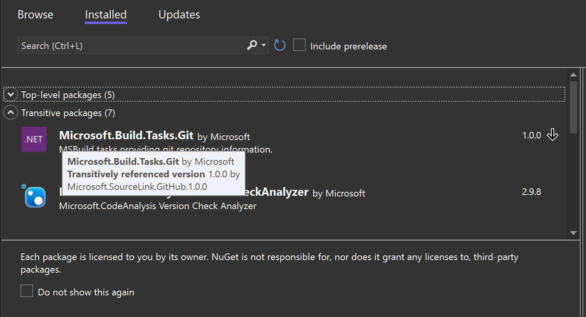

# dotnet nuget why command

- Status: **Draft**
- Author: [Kartheek Penagamuri](https://github.com/kartheekp-ms)
- GitHub Issue [11782](https://github.com/NuGet/Home/issues/11782)

## Problem Background

Developers are often confused with top-level & transitive dependencies in their project. A developer should be able understand where every package originated from. A user should be able to promote a transitive dependency quickly & easily to a top-level dependency in the case there is a security concern on the package version depended on or if promoting to a top-level package will resolve a conflict.

Knowing how a package is being included in a project helps a developer diagnose many problems. It also provides them with an opportunity to understand complex dependency chains they may have within their projects. There is not a great solution that exists to understand the nature of top-level packages and their transitive dependencies. The solution explorer in Visual Studio does the best job at allowing a user to dive into each NuGet package & see all transitive dependencies from the top-level dependency.

The dotnet CLI does not provide the insight into “why” a transitive dependency is listed, although it does list everything that has been resolved.

We could have considered a minor tweak to the existing experience of “dotnet list package --include-transitive” to provide the user with a sense of where the package came from. This could be a new column next to “Resolved” which says “Transitively Referenced” or “Referenced” and has a list of the top-level packages that requested the dependency. Tracking issue can be found here: https://github.com/NuGet/Home/issues/11625.

Within Visual Studio, there will be a new panel within the Visual Studio Package Manager UI named “Transitive Packages” in which all transitive packages will be displayed to the user. For the sake of not confusing the user, there will additionally be a header titled “Top-level Packages” where the current experience is today for top-level packages.

When a user highlights a transitive package, they will see a pop-up that displays how the transitive dependency originated & what top-level package(s) are bringing it in.

Sadly, we don’t have any further CLI or visualizing tool today to answer `Running 'dotnet restore' on a (large) .sln file restores a certain problematic package. How do I know which project(s) in the solution is causing that package to be restored?` question.

## Goals
The main goal is to add `dotnet nuget why` command to .NET CLI to help customers visual the dependency graph for a given package.

## Customers
We are building this for .NET users to be successful with understanding dependency graph for a given package.