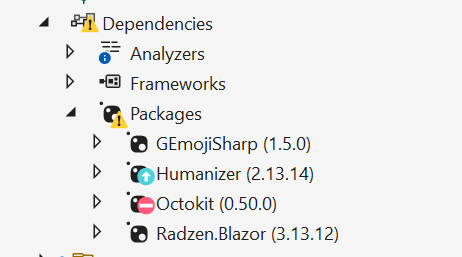

# Title

- [Jon Douglas](https://github.com/JonDouglas), [Tim Heuer](https://github.com/timheuer), McKenna Barlow
- Start Date (2022-05-26)
- [#11547](https://github.com/NuGet/Home/issues/11547)

## Summary

<!-- One-paragraph description of the proposal. -->
Providing developers important information about their package dependencies is one of NuGet's top priorities to secure development environments and encourage the ecosystem to shift left. While NuGet currently provides important information regarding security vulnerabilities, deprecations, and outdated packages in the NuGet package manager inside Visual Studio, there is an opportunity to provide this data in a more common and visible location inside of the solution explorer in Visual Studio, also known as the [common project system](https://github.com/dotnet/project-system).

This proposal introduces package affordances in the solution explorer to help developers take regular action on their dependencies.

## Motivation

<!-- Why are we doing this? What pain points does this solve? What is the expected outcome? -->
An experience in which developers can quickly glance at the various nodes in the solution explorer (dependencies, packages) to understand if there is an issue that needs their attention can assist them in making quicker resolutions to common problems like security vulnerabilities, deprecated packages, and outdated dependencies.

According to GitHub's "Securing the world's software" report in 2020, there is a 59% chance of getting a security alert in the next year on any active repository with supported package ecosystems including NuGet. Developers today frequent the use of open source dependencies in active public repositories of .NET totaling 90%. In many ecosystems, 80% or more of the application's code comes from dependencies in the respective package ecosystem.

When a security vulnerability is disclosed, it is important that it is addressed as soon as possible to [protect against potential cyberattacks](https://www.whitehouse.gov/briefing-room/statements-releases/2022/03/21/fact-sheet-act-now-to-protect-against-potential-cyberattacks/).

While majority of software vulnerabilities are mistakes, there is an increasingly amount of malicious attacks throughout them. Of a given sample of over 500 advisories across all package ecosystems, up to 17% of the advisories are related to explicit malicious behavior including popular attack vectors and attack tactics that can lead to significant disruption or loss of some kind.

Currently a vulnerability takes approximately 4.4 weeks for the community to identify and release a fix for a vulnerability. It then takes 10 weeks to alert on the vulnerability of a security update to when a fix is applied. The fix will take one week to resolve. We want to reduce the total time that a developer is aware of a security update and for them to remediate it.

To take regular action, we want to ensure that dependencies are checked for vulnerabilities, deprecations, and outdated statuses regularly and can be remediated within Visual Studio to keep codebases current.

**Further reading:** https://octoverse.github.com/static/github-octoverse-2020-security-report.pdf

One of the top themes from both the NuGet (Visual Studio) and NuGet.org surveys include "warnings for known package security vulnerabilities and suggested fixes" and "deprecation and vulnerability indicators" averaging 18 points being spent on the feature areas out of 100 total points (7,403pts over 418 responses and 4,405pts 247 responses respectfully). These are two of the top areas that developers would love improvements to. We have confidence that security is on top of developer's minds and they would like to see these experiences in more locations.

## Explanation

### Functional explanation

<!-- Explain the proposal as if it were already implemented and you're teaching it to another person. -->
<!-- Introduce new concepts, functional designs with real life examples, and low-fidelity mockups or  pseudocode to show how this proposal would look. -->

When a developer is working within Visual Studio, they may regularly check their "Dependencies" node within the solution explorer. When expanded, a "Packages" node is available to show the hierarchy of top-level and transitive packages included in a project.

NuGet uses three main words to describe these status of a package, the TL;DR are:

- **Deprecated** - Please don't use this for a disclosed reason and please use a suggested alternative(if any).
- **Vulnerable** - Please don't use this due to a known vulnerability and update/replace/remove/do nothing accordingly.
- **Outdated** - Please consider using a newer version.

Building upon Tim's initial mockup, there should be a UI affordance that demonstrates the truth of each package's status in the solution explorer representing these three words.

For the sake of not annoying developers, we should only bubble up a warning affordance to the top-level node (Packages and Dependencies) if there is a known top-level vulnerability or deprecated package in their package graph.

Outdated packages would still show the indicators if the packages node is expanded however.

Currently, NuGet only uses two icons to display status indicators:

- A warning triangle (vulnerability and deprecation).

- An up arrow (outdated).

Hovering over the package and icon will display the respective information for the status.

- Deprecated - "This package has been deprecated as it is `<deprecation category>`."
- Vulnerable - "This package has at least one vulnerability with `<severity category>` severity."
- Outdated - "This package has version `<latest version>` available.

When right clicking a package, a developer should be able to get to the "Manager NuGet Packages..." context menu action like they can with the "Packages" and "Dependencies" nodes.

Because this feature may need some experimentation to get the right signal from the noise and the potential for exponential transitive-level vulnerabilities, developers will need a way to opt-out from the experience as a whole, and options to opt-in to varying levels of information.

This may need to include a new options panel inside the `Projects and Solutions > SDK-Style Projects` regarding the Package Settings where there's a top-level checkbox for the feature, and either a drop-down indicating a package status level or multiple checkboxes for each status mentioned above.

<!-- ### Technical explanation -->

<!-- Explain the proposal in sufficient detail with implementation details, interaction models, and clarification of corner cases. -->

## Drawbacks

<!-- Why should we not do this? -->
While developers continue to seek this information in more locations, it can also be quite a bit of noise towards the general development experience. Developers tend to compare visual issues in the solution explorer akin to ["DLL Hell"](https://en.wikipedia.org/wiki/DLL_Hell) which we would like to avoid the perception as much as possible while providing valuable information about dependencies.

This feature can potentially collide with existing experiences in which package dependencies may not exist on disk and/or assets file are incorrect and require a restore to resolve. There can also be false positives/negatives with the current state of the project system and the need to reload projects to refresh the package status in realtime.

## Rationale and alternatives

<!-- Why is this the best design compared to other designs? -->
<!-- What other designs have been considered and why weren't they chosen? -->
<!-- What is the impact of not doing this? -->

- [Dependabot](https://github.com/dependabot) provides vulnerability information at the repository level through PRs.
- NuGet.org, dotnet CLI, and NuGet Package Manager inside Visual Studio provide much of this functionality already, but they are multiple clicks and commands away from developers seeing them.

## Prior Art

<!-- What prior art, both good and bad are related to this proposal? -->
<!-- Do other features exist in other ecosystems and what experience have their community had? -->
<!-- What lessons from other communities can we learn from? -->
<!-- Are there any resources that are relevant to this proposal? -->
- NuGet provides status indicators in the NuGet Package manager experience in Visual Studio.
- Visual Studio for Mac provides "outdated" status indicators in the solution explorer.

## Stakeholders

- NuGet
- .NET Project System
- Visual Studio (.NET Tooling)

## Unresolved Questions

<!-- What parts of the proposal do you expect to resolve before this gets accepted? -->
<!-- What parts of the proposal need to be resolved before the proposal is stabilized? -->
<!-- What related issues would you consider out of scope for this proposal but can be addressed in the future? -->
- Should NuGet consider a third icon metaphor for vulnerabilities? Previously we were not successful in doing so, but we can reconsider.

## Future Possibilities

<!-- What future possibilities can you think of that this proposal would help with? -->
- In the future, we hope to streamline context menu actions to resolve individual package issues with a single click without having to open the NuGet Package Manager.
