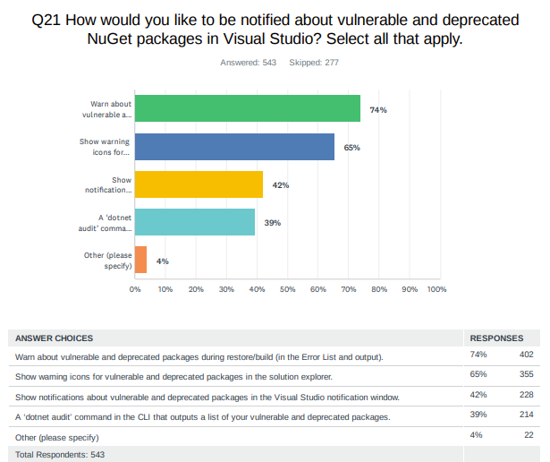
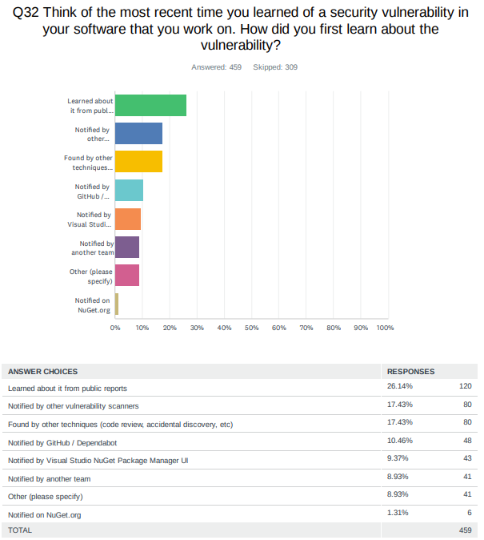
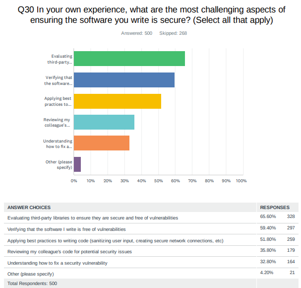
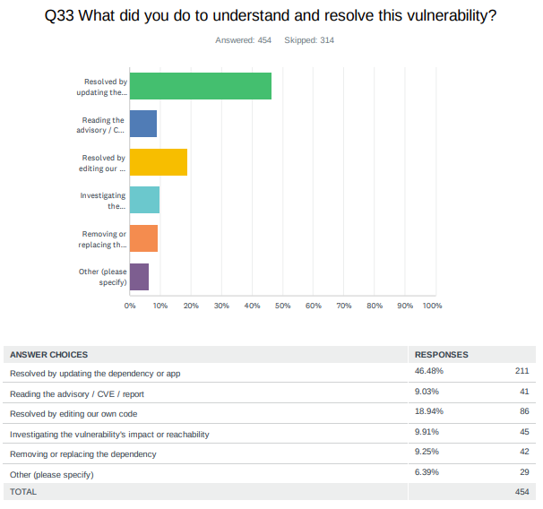
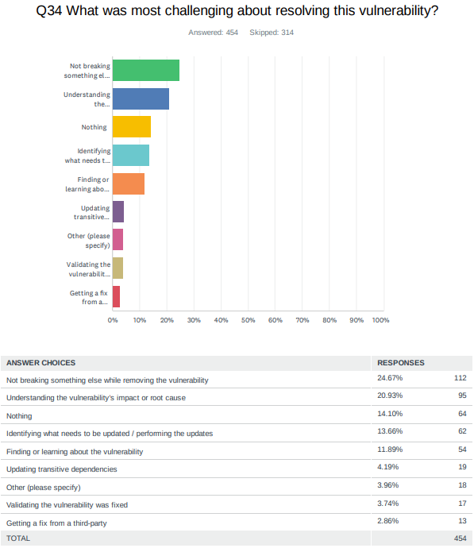

# Auditing projects for package vulnerabilities during restore

- [Jon Douglas](https://github.com/JonDouglas/), [Nikolche Kolev](https://github.com/nkolev92), [Peter Yu](https://github.com/ryuyu)
- Issue: [#8087](https://github.com/NuGet/Home/issues/8087)
- Related: [#11549](https://github.com/NuGet/Home/pull/11549)

## Summary

Audit your dependencies when restoring your NuGet packages with security vulnerabilities reported to GitHub Advisory Database.

## Motivation

Since [launching vulnerability scanning last year](https://devblogs.microsoft.com/nuget/how-to-scan-nuget-packages-for-security-vulnerabilities/), we have seen the world shift towards a zero-trust model with new executive orders, exponentially increasing security advisories and supply chain attacks, and a general sentiment towards securing build environments at all costs.

While we support basic affordances when browsing for NuGet packages in NuGet.org, dotnet CLI, and Visual Studio, we have learned that our developers use these features, but they want better visibility.

We ran a survey in 2022 regarding how developers currently feel about known security advisories and here is what we've learned:

74% of developers would like to be notified of packages at restore/build time. 65% would like to see icons in the solution explorer for problematic packages. 42% of developers would like a security notification in Visual Studio's notification window. 39% of developers would use a dotnet audit command.



Next, we asked developers how they learned about security vulnerabilities in their software. Majority learned from public reports, 3rd-party vulnerability scanners, and code reviews/accidental discovery.



The most challenging aspects for ensuring the software they write is secure is three major things:

1. Evaluating third-party libraries are secure and free of vulnerabilities.
2. Verifying the software they write is free of vulnerabilities.
3. Applying best practices to writing code.



When asked how they understood and resolved the vulnerability, the majority of developers resolved them by updating the dependency or app.



When doing so, the most challenging aspect for them is not breaking something else when doing this and better understanding the vulnerability's information to assess the impact and root cause to see if they are actually affected.



## Explanation

### Functional explanation

When a restore happens whether implicitly, or explicitly, the packages will be audited for vulnerabilities *if* any of the sources declared provide vulnerability information.
If any vulnerabilities are found, the impact, appropriate remediation, and other advisory metadata will be reported to the developer to take action on.

For example, a developer might run `dotnet restore` explicitly or `dotnet add package` which runs restore implicitly. If a package being restored contains a known security advisory, they would see output at the bottom of the restore output that indicates how many vulnerabilities, a break-down of their severities, and the appropriate remediation action to take given the context of their environment. Below are a handful of concepts ranging from a low to high verbosity of information

#### Warning codes and output

| Warning Code | Severity |
|--------------|----------|
| NU1901 | low |
| NU1902 | moderate |
| NU1903 | high |
| NU1904 | critical |

```bash
Found 2 vulnerabilities (0 low, 1 moderate, 0 high, 1 critical) in 2 package(s)

warning NU1904: Package 'Contoso.Service.APIs' 1.0.3 has a known critical severity vulnerability, https://github.com/advisories/GHSA-1234-5678-9012.
warning NU1902: Package 'Contoso.Forms' 8.4.1 has a known moderate severity vulnerability, https://github.com/advisories/GHSA-1234-5678-9012.
```

If a package has more than 1 vulnerability, each vulnerability will have its own warning. These security issues are often likely independent and may require independent fixes.

```bash
Found 2 vulnerabilities (0 low, 1 moderate, 0 high, 1 critical) in 1 package(s)

warning NU1904: Package 'Contoso.Service.APIs' 1.0.3 has a known critical severity vulnerability, https://github.com/advisories/GHSA-1234-5678-9012
warning NU1904: Package 'Contoso.Service.APIs' 1.0.3 has a known moderate severity vulnerability, https://github.com/advisories/GHSA-1234-5678-90XY
```

In cases where no known vulnerabilities are found, restore will provide a normal verbosity message for every project:

```bash
No known vulnerabilities found for <project path>.

```

In addition at normal verbosity, we will log a report for each project whose vulnerabilities were audited.

```bash
Found 2 vulnerabilities (0 low, 2 moderate, 0 high, 0 critical) in 2 package(s)

Top-level Package       Requested	Resolved	Severity	Advisory URL
> Contoso.Forms		8.4.1	        8.4.1		Moderate	https://github.com/advisories/GHSA-1234-5678-9012

Transitive Package	Resolved	Severity	Advisory URL
> Microsoft.Data.OData	5.2.0	        Moderate	https://github.com/advisories/GHSA-1234-5678-90XY
```

#### Enabling Vulnerability Auditing

This feature will be opt-in to start and gather feedback from developers.

To enable the feature, a developer can add `<NuGetAudit>enable</NuGetAudit>` to their project file as a MSBuild property. To disable the feature, a developer can add `<NuGetAudit>disable</NuGetAudit>` or remove the property from the project file.

#### Setting an Audit Level

In cases where a developer only cares about a certain threshold of advisory severity, they can set a MSBuild property to set a level such as `<NuGetAuditLevel>moderate</NuGetAuditLevel>` in which auditing will fail. Possible values match the OSV format of `low`, `moderate`, `high`, and `critical`.

#### Excluding Advisories

There is no support for excluding individual advisories at this time. Developers will be able to `<NoWarn>` the four `NU1901` -> `NU1904` warnings or set the `<NuGetAuditLevel>` to suppress certain severities.

#### Vulnerability warnings in  the solution explorer

Given that restore would be raising a warning, the vulnerability information will automatically appear in the Solution Explorer.
This is the primary motivation for having 1 error message per package.

### Technical explanation

During every real restore, i.e. one that regenerates the assets file, NuGet will check all sources that provide vulnerability information and raise warnings for the packages that do.

*Which sources can provide vulnerability information?*
Only V3 http sources can provide vulnerability information. No additional means of providing vulnerability information are proposed here.

#### Technical background

To best understand the technical proposal, it's important to understand the [NuGet package installation process](https://docs.microsoft.com/en-us/nuget/concepts/package-installation-process).

When a package is seen, the client talks to sources and downloads whichever versions are needed. When talking to V3 sources, the client use the `package content` [resource](https://docs.microsoft.com/en-us/nuget/api/package-base-address-resource), which is a static resource that only has information about the available package versions. Only what is contained *within* the package itself affect restore. Nothing else. This allows an equivalence between `http` and `local` sources.

#### Dedicated vulnerability information resource

Checking vulnerability will always take a performance hit, but we want to minimize that. We can:

- Make fewer http calls.
- Minimize the amount of data we are handling.

Both of these can be achieved by adding a means to understand whether a source supports vulnerability. We'd add a resource such as the following:

```json
    {
      "@id": "https://nikolchevulntest.blob.core.windows.net/newcontainer/vulnerabilityindex.json",
      "@type": "VulnerabilityInfo/6.3.0",
      "comment": "The endpoint for discovering information about vulnerabilities of packages in this package source."
    },
```

When NuGet restores, we check whether a source supports vulnerabilities and if so it can go through a protocol of getting this information.

The client needs all the data to make decisions about vulnerability. In order to not have the client redownload a file and limit the total number of HTTP calls we will ever make, the vulnerability resource will be an index that can contain multiple pages.

- The vulnernability resource **must** be an array of objects.
- Each object **must** contain:
  - `@name`, a user friendly name for the page, **must** be unique.
  - `@id`, the url that contains the data.
  - `@updated`, a UTC timestamp when the content at `@id` was updated last.
  - `comment`, a user friendly description.
- The vulnerability resource **must** at minimum contain 1 page.
- The pages within the vulnerability resource **must** be exclusive.
- The vulnerability resource may 2 pages.
  - One page, `base`, represents the data up to a certain point in time. This page **must** be updated periodically, based on a trigger.
  - The second page, `update`, represents the data from the last update of `base`, to present. This page **should** be updated with new data.
  - Periodically, for example once a month, the data from `update` **should** be migrated to `base`.
  - If an entry needs to be removed from `base`, `base` should be updated.
- Other partioning strategies are workable as well, as long as only 2 pages are receiving all the new data.  
  
This would allow for the client to do the following:

1. Fetch the main vulnerability resource if available.
1. Compare its version of the base resource to the remote one, based on the updated property. Redownload if different.
1. Compare its version of the update resource to the remote, based on the updated property. Redownload if different.

This should allow for incremental downloads over a short period of time, without an unnecessarily complex update protocol. Given that we're downloading a gziped version, it is unlikely that the payload size becomes a problem anytime soon.

```json
[
  {
    "@name": "base",
    "@id": "https://api.nuget.org/v3/vulnerability-base.index.json",
    "@updated": "2022-11-15T15:30:00.0000000Z",
    "comment": "The base data for vulnerability update periodically"
  },
  {
    "@name": "update",
    "@id": "https://api.nuget.org/v3/vulnerability-update.index.json",
    "@updated": "2022-11-30T15:30:00.0000000Z",
    "comment": "The patch data for the vulnerability. Contains all the vulnerabilities since base was last updated."
  }
]
```

- The page within the vulnerability resource **must** have the `packageid` as a primary key.
- The value of that **must** be an object with a normalized `package version` as a primary key.
- The value of that **must** be an array of objects.
- The objects within the array of objects **must** contain:
  - Severity, an `int`, where `0` means `low`, `1` means `medium`, `2` means `high`, `3` means `critical`
  - Advisory url, a url.
- The package id **must** be a case insensitive string, expected to be a valid package id as prescribed by NuGet.
- The version **must** be a case insensitive and normalized (does not include the metadata information).

```json
{
  "adplug": {
    "2.3.0-beta10": [
      {
        "severity": 1,
        "advisoryUrl": "https://github.com/advisories/GHSA-874w-m2v2-1234"
      },
      {
        "severity": 3,
        "advisoryUrl": "https://github.com/advisories/GHSA-874w-m2v2-mj64"
      }
    ],
    "2.3.0-beta100": [
      {
        "severity": 3,
        "advisoryUrl": "https://github.com/advisories/GHSA-874w-m2v2-mj64"
      }
    ]
  },
  "Bond.Core.CSharp": {
    "4.0.1": [
      {
        "severity": 2,
        "advisoryUrl": "https://github.com/advisories/GHSA-rqrc-8q8f-cp9c"
      }
    ]
  }
} 
```

Having a dedicated vulnerability information resource will allow upstreams to easily use the NuGet.org data within their source.

## Drawbacks

- Vulnerability checking will have a performance hit.

## Rationale and alternatives

Most of the alternatives/ideas covered below are not exclusive.

### Vulnerability dedicated resources updating alternatives

There are many ways to solve the updating problem.

Instead of using the `custom` @updated property, we could instead use HTTP constructs.

- Use ETag instead of an intermediate resource. This would technically have 1 fewer call than the current proposal.
- Use If-Modified-Since and simply always request both the base and update resources.
- Version the vulnerabilities by the year informationw was known to source.
  - Implement something similar to what the catalog is.
  - This would allow certain vulnerabilities to never be redownloaded, but it will continously increased, even if it is unlikely to ever become unreasonable.

- Multiple resource files organized in buckets such as the first character of the package id or some other [arbitrary bucketing method](https://en.wikipedia.org/wiki/Consistent_hashing).
  - This will not improve the overall performance, but theoretically would limit the frequency of the data being refreshed.

- Multiple resource files organized by severity. This could reduce the traffic and make restore faster, but only if customers only care about certain severities.

### Vulnerability reporting not tied to sources

All of NuGet's HTTP traffic is through sources.
The vulnerability information does not have to be tied to sources.
It could be something that's configured independently.

This information could be something that's provided by nuget.org, similarly to licenses.nuget.org.
This would be a url that the user would provide in their configuration. The advantage is that the user does not need their source to provide any vulnerability information.

- Pros:
  - Vulnerabilities are not inherently tied to sources. This is explicit effort undertaken by nuget as shepherds of the eco-system to provide vulnerability information.
  - This can be additive. We can ship vulnerabilities tied to sources first and then update later.

- Cons:
  - The client has an established protocol and a means to configure a source.
  - Experimentation is arguably easier as we're not introducing new syntax, at least not immediately.
  - The challenge is that we'd need to establish a protocol, and something that could be slower on the uptake.

### Optimizing vulnerability check cadence

Most restores are no-op and only checking vulnerabilities when restore actually happen is a straightforward optimization.
Sometimes restore use the local data from the global packages folder to complete a restore.
An additional optimization would be to only check the vulnerabilities when we've already made any http call.

## Prior Art

- NPM automatically audits dependencies when packages are installed.
  - NPM achieves this by checking the vulnerabilities for the full graph, by submiting the graph to a compute resource that provides a list of the vulnerabilities.
  - The biggest difference is that NuGet restore is run significantly more frequently than npm install is. As such the performance is not as critical.
- [pip-audit](https://github.com/pypa/pip-audit) scans for packages with known vulnerabilities using the Python Packaging Advisory Database. 
- [cargo-audit](https://docs.rs/cargo-audit/latest/cargo_audit/) audits cargo.lock files for creates containing security vulnerabilities.
- [snyk](https://snyk.io/product/open-source-security-management/) provides security tools for open source vulnerability scanning and CLI experiences.
- [DependencyCheck](https://github.com/jeremylong/DependencyCheck) scans software for known vulnerabilities.

## Unresolved Questions

<!-- What parts of the proposal do you expect to resolve before this gets accepted? -->
<!-- What parts of the proposal need to be resolved before the proposal is stabilized? -->
<!-- What related issues would you consider out of scope for this proposal but can be addressed in the future? -->
- Should the opt in property be named `NuGetVulnerabilityAudit`?
  - The motivation is that we might want to include deprecation in auditing at some point. Should customers that opted into vulnerability audit get that experience automatically even if they didn't intend to? Customers might only be interested in vulnerability auditing, but not deprecation auditing.

## Future Possibilities

- Vulnerability scanning can be extended to SBOMs.
- Support can be added to automatically fix vulnerable dependencies (i.e. a fix experience in CLI / Tooling)

Additionally, most of the [`Rationale and alternatives`](#rationale-and-alternatives) are really future possibilties on their own as they are not always exclusive to the current approach. Here's some further possibilities:

### Suppress advisories

We can add a way to suppress advisories, either through the NuGet.config, project file or any other configuration file that allows a developer to exclude advisories for various parameters such as a package ID, GHSA ID, or CVE ID.

An example of how the nuget.config could look like:

```xml
  <supressVulnerabilities>
    <add key="https://github.com/advisories/GHSA-g3q9-xf95-8hp5" />
    <add key="https://github.com/advisories/GHSA-1234-5678-9012" />
  </suppressingVulnerabilities>
```xml

An idea how the project side could look like:
Today, you can suppress warnings by using their warning codes at both the project and the package level.

Example:

```xml
  <PropertyGroup>
    <NoWarn>$(NoWarn);NU1901</NoWarn>
  </PropertyGroup>

  <ItemGroup>
    <PackageReference Include="PackageId" Version="3.0.0" NoWarn="NU1901" />
  </ItemGroup>

```

We can extend a similar functionality to the advisory urls via their own dedicated property.

```xml
<RestoreSuppressedAdvisoryUrls>https://github.com/advisories/GHSA-g3q9-xf95-8hp5</RestoreSuppressedAdvisoryUrls>

 <PropertyGroup>
    <RestoreSuppressedAdvisoryUrls>$(NoWarn);https://github.com/advisories/GHSA-g3q9-xf95-8hp5</RestoreSuppressedAdvisoryUrls>
  </PropertyGroup>

  <ItemGroup>
    <PackageReference Include="PackageId" Version="3.0.0" SuppressedAdvisoryUrls="https://github.com/advisories/GHSA-g3q9-xf95-8hp5" />
  </ItemGroup>
```

The project level and package level metadata are not necessarily a package deal, we can choose to only add one.

### Allow sources to upstream vulnerability information

While the NuGet tooling does support multiple sources and a means to control which packages come from which source through [Package Source Mapping](https://learn.microsoft.com/en-us/nuget/consume-packages/package-source-mapping), all configurations are not going to contain nuget.org, and thus won't easily get the data curated from the [GitHub Advisory Database](https://devblogs.microsoft.com/nuget/how-to-scan-nuget-packages-for-security-vulnerabilities/).

The [V3 protocol](https://learn.microsoft.com/en-us/nuget/api/overview) and the resource architecture would allow a source to link to a resource that may not be hosted by them.
Not every source would want to setup a pipeline for processing vulnerability information. They can instead just "point" to the nuget.org information.

For example, an Azure Artifacts source could have this in their index.json:

```json
{
  "resources" [

  {
    "@id": "https://api.nuget.org/v3/vulnerability.json",
    "@type": "VulnerabilityInfo/6.3.0",
    "comment": "The base data for vulnerability update periodically"
  }
  ]
}
```

While the nuget.org data only contains vulnerability information about packages on nuget.org, often times an `upstream` source is setup by customers, and while they reference their own private feed, they can still download packages from nuget.org. The vulnerability information is valuable in these scenarios.

If this upstream approach is taken, it is very likely that the vulnerability checking has a lot of misses, but this is an understood trade-off.

It is **very important* that if the upstream sources link to the nuget.org vulnerability, the actual nuget.org urls are used wherever possible, as this would allow the client to easily deduplicate the vulnerability information.

### Providing vulnerability information through a json, remotely or locally

Other components may want to provide vulnerability information that's not tied to a source.
Whatever approach we take there will be a way to represent the vulnerability information through a json file.

### Surfacing deprecation information

From a technical perspective, vulnerabilities and deprecation are *very* similar.
Deprecation data tends to be more plentiful, and as such would be a more significant performance hit. Today, deprecation information is 10x the vulnerability information.

### Vulnerabilities in dependencies

Due to the fact that NuGet flattens, thinking about a package having vulnerabilities is best thought of in the context of a project.
Having vulnerability data at restore time, would allow to potentially gather information about packages that themselves are not vulnerable, but bring in vulnerable packages within their graph.
This information could be a helpful signal for package authors to update their dependency graph.
