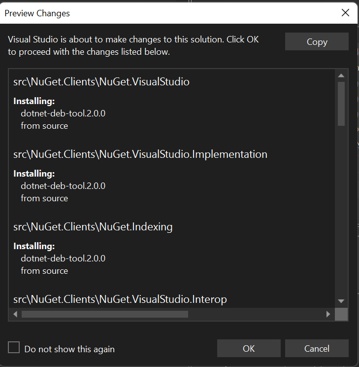

# Package Source Mapping Package Management Actions in the PM UI 
* Start Date: 6/25/22
* Authors: Ella McNally, Donnie Goodson ([donnie-msft](https://github.com/donnie-msft))
* Issue: https://github.com/NuGet/Home/issues/11797
* Status: Draft

## Summary

Currently, Install/Update Package Management actions in the NuGet Package Manager in Visual Studio (PM UI) do not support creating new package source mappings. We want to allow customers to continue using Package Source Mapping as they use the PM UI to manage their packages. 

Package Source Mapping in Restore was introduced in: https://github.com/NuGet/Home/blob/dev/implemented/2021/PackageSourceMapping.md

Package Source Mapping Status in the PM UI was introduced in: [Package Source Mapping Package Management Status in the PM UI ](package-source-mapping-status-PMUI.md)

## Motivation

Adding support for package source mapping actions in PM UI will allow customers to more seamlessly onboard and manage package source mappings while continuing to use the actions they are used to in the PM UI. It also increases awareness of where their packages will be coming from before initiating a package management action.

## Explanation

### Functional Explanation

When a new package source mapping is being created, the Preview Window will appear showing which packages (the top-level and any transitive dependencies) will be mapped. 

(TBD) It is not yet understood whether there will be a new afforance on the details pane in a new row below the Install/Update buttons, or if source mappings will be handled in the background.

#### A Proposal for Consent to a new Source Mapping
 A `CheckBox` that allows the customer to choose if they want to add a mapping to the package from the selected source when they `Install`/`Update`. This `CheckBox` will always be shown even if package source mapping is not enabled. Package source mapping can be enabled by the customer checking the `CheckBox` to create the first mapping for the solution's settings. Once package source mapping is enabled, the customer must either have a mapping previously configured, or consent to a new mapping by checking the `CheckBox` to install. Otherwise, Restore will fail as it does today.

 PSM Enabled|Package Mapped|Current Behavior|Proposed Behavior
---|---|------|------|
No|No|regular install|regular install
Yes|No|Error in Error List|Preview Window appears showing mappings being created to selected source
Yes|Yes|regular install|Allow creating an additional source mapping to selected source for each newly installed package (including transitives)
 
 The existing Preview Window dialog that shows when the customer hits `Install` or `Update` will be modified to list the mappings that will be made by their action. The customer already has the option to disable this preview dialog, so if they choose to disable it, there will be nothing telling them what mappings they made. 
 
 A proposal for the changes to the preview window:


#### Restore Errors

There are a few errors the customer could make while trying to install or update a package with a mapping that would make `Restore` fail. First, there could be issues with the transitive packages. Maybe there are transitive packages that are already mapped to a different source or the source that the customer is trying to map a package to does not support some of the transitive packages. 

The customer could also try to update a package that is already mapped to a different source, but the source it is mapped to does not support the version they are trying to update to. In these scenarios, `Restore` will fail in the same way it does today. The customer can see why `Restore` failed in the output window. 

Currently, `NU1100` is used for both an incompatible TFM, and for a missing Package Source Mapping. 
A proposal to make more specific errors for restore errors related to package source mapping has been made:
- NU1100 is used for both TFM incompatibility and for an unresolved PackageSourceMapping [#12606](https://github.com/NuGet/Home/issues/12606)

### Technical Explanation

Package Management action logic will pass down a new mapping package ID and source name to Restore. Preview Restore Utilities will look for this new mapping and use it in the preview restore: By appending 2 package patterns, a "*" and the new package ID, along with the new mapping source name to Settings in memory.

Once preview restore determines the newly installed package IDs (top-level and transitive), those IDs will be checked against existing mappings. If an existing mapping is found, no new mapping is written for that package.

If a package is found in the Global Packages Folder (GPF), that package will be mapped to the selected source.

If the customer consents to the preview result, the new package source mappings (top-level and transitive) will be written to the applicable `nuget.config`.

**Example 1** 

```xml
<PackageReference Include="Serilog" Version="11.0.0"/>
```

```xml
<packageSourceMapping>
    <packagesource key="nuget.org">
        <package pattern="Serilog" />
        <package pattern="SerilogTransitiveA" />
        <package pattern="SerilogTransitiveB" />
        ...
    </packageSource>
</packageSourceMapping>
```

**Result:**

In this example, the customer had `nuget.org` selected from the source dropdown. They selected the `Serilog` package on the installed tab, chose version `11.0.0`, and selected the checkbox to make a mapping from `Serilog` to `nuget.org`. A mapping was created for the top-level package and for two transitive packages, `SerilogTransitiveA` and `SerilogTransitiveB`, because the transitives did not have an existing mapping.

## Drawbacks

## Rationale and Alternatives

On the previous spec, there was a pin icon next to the sources dropdown to pin a source instead of a checkbox in the details pane. Reviewing with the UX Board, the pin concept may be confusing since there was nothing to explain what it did and it's not near the action buttons. The pin icon is used for different actions already in VS, like to pin a file at the top of the screen. It would be confusing to have the same button do different tasks in different parts of VS.

Here is the mockup for the pin icon:


## Prior Art

## Unresolved Questions

None

## Future Possibilities 

1. Currently, if an `Install`/`Update` cannot find transitive packages on the mapped source being mapped, the restore will fail. Reaching out to other configured sources and allowing the customer to select a different source for these packages may resolve this issue. However, care must be taken to avoid unintentionally leaking requested package IDs to these secondary sources when the customer hasn't agreed to such a query.

1. If a package is found in the Global Packages Folder (GPF), the PM UI could look at the source in the `nupkg.metadata` file. A new mapping could either be created for this source auotmatically, or it could be presented to the customer in the Preview Window or another affordance.