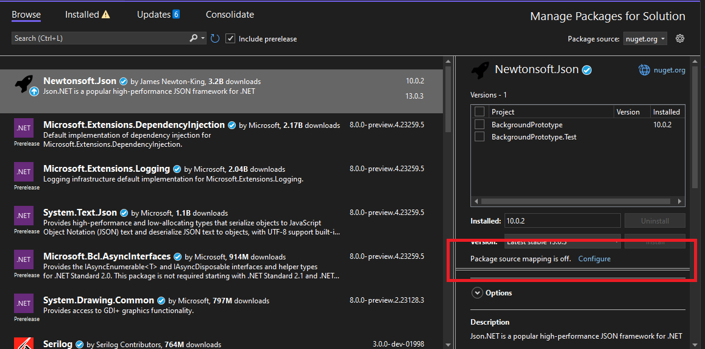
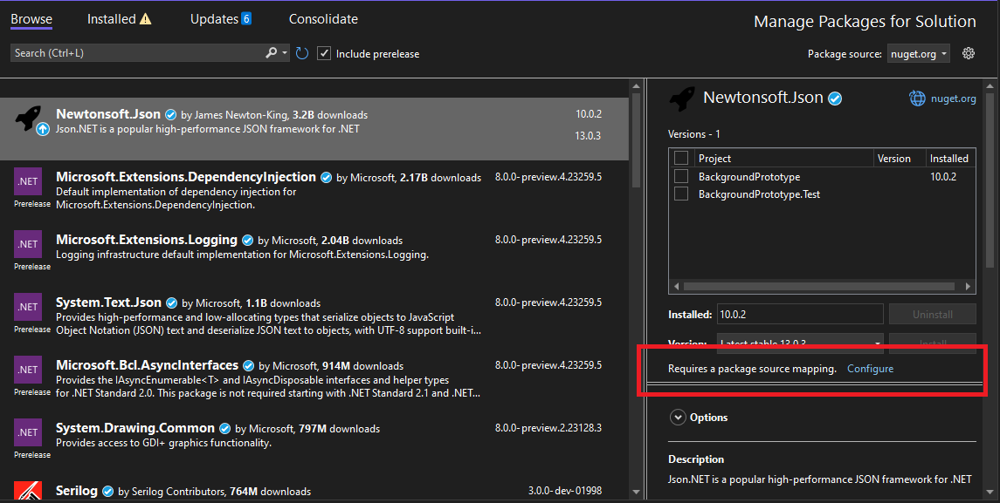
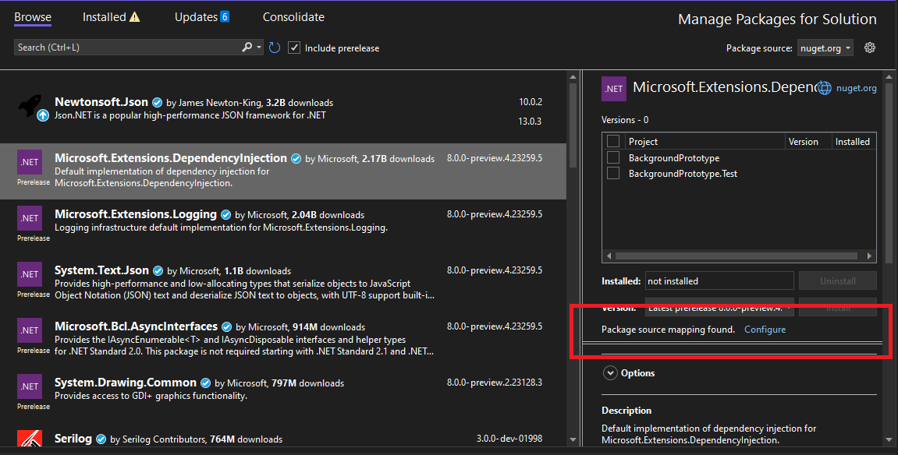
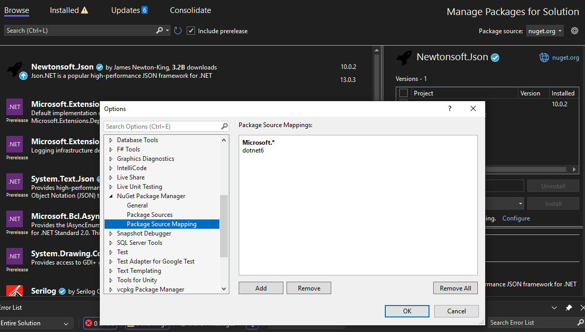

# Package Source Mapping Status in the PM UI 
* Start Date: 5/17/23
* Authors: Donnie Goodson ([donnie-msft](https://github.com/donnie-msft))
* Issue: https://github.com/NuGet/Home/issues/12586

## Summary

Currently, the NuGet Package Manager in Visual Studio (PM UI) does not support the package source mapping feature. Introducing source mapping status for the package selected in the Details Pane of PM UI is the first step to bringing this feature into the PM UI.

Package Source Mapping in Restore was introduced in: https://github.com/NuGet/Home/blob/dev/implemented/2021/PackageSourceMapping.md

## Motivation

Showing in the PM UI Details Pane the package source mapping status, as well as a shortcut to manage the mappings in the VS Options dialog, will allow customers to onboard to, or see the state of, their package source mappings at a glance. The knowledge of whether a package is already mapped may lead a customer to modify their source mappings using the existing VS Options dialog.

As customers begin seeing source mapping status in the PM UI and becoming more aware of the feature, we can learn more about what they want from the PM UI as far as package management actions (i.e., installing/updating a package). The goal is to let customers drive the next evolution of package source mapping in PM UI.

## Explanation

### Functional Explanation

On the details pane there will be new information shown below the Install/Update buttons. 

#### Mapping Status

A label will appear under the `Install/Update` button indicating the Package Source Mapping status.

| Project Onboarded | Selected Package is Mapped | Status Icon | Status Text 
|--------------|-----------|------------|------------|
| Disabled |  N/A      |  | Package source mapping is off. |
| Onboarded  | Not Mapped  |  | Requires a package source mapping. |
| Onboarded  | Mapped |  | Package source mapping found. |

Each of the above "Status Text" are shown in the following samples:

Desired behavior for this status are below:
  - There are no visual indicators for the Package Source Mapping status in details pane ([#12609](https://github.com/NuGet/Home/issues/12609))
  - Install/Update buttons are enabled in Details Pane when the PackageSourceMapping is not found ([#12607](https://github.com/NuGet/Home/issues/12607))

#### Settings link

A button to launch VS Settings to the `NuGet Package Source Mapping` settings page will be beside the label. The behavior is similar to the settings button beside the sources dropdown in the top right of the PM UI. 

The result of pressing the button is shown in the following sample:

Desired behavior for this shortcut are below:
  - VS Options shortcut from PMUI for PackageSourceMappings doesn't scroll to or select the Package ([#12608](https://github.com/NuGet/Home/issues/12608))

### Technical Explanation

Package Source Mappings will be loaded from Settings when the PM UI is initialized and stored in a cache. Status for each selected package will be rendered in the Details Pane by using this cache as its data source.

Any changes to the Settings by external edits to the `nuget.config(s)` will invalidate the source mapping cache and cause the PM UI to refresh. Edits made externally to VS (such as in VSCode or any text editor) will be reflected automatically inside the Details Pane, without showing a stale source mapping status.

Note that this spec will only address the top-level package. In the scenario where a top-level package is mapped, but a transitive package is not mapped, a Package Management action like Install may still fail with a restore error due to the unmapped transitive dependency, just as it does prior to implementing this spec. 

## Drawbacks

## Rationale and Alternatives

No alternatives for how to show the Package Source Mapping status have been proposed.

## Prior Art

None

## Unresolved Questions

None

## Future Possibilities 

- Adapting the Package Management Actions of the PM UI to the Package Source Mapping feature are part of a separate spec: [Package Source Mapping Package Management Actions in the PM UI ](package-source-mapping-actions-PMUI.md)