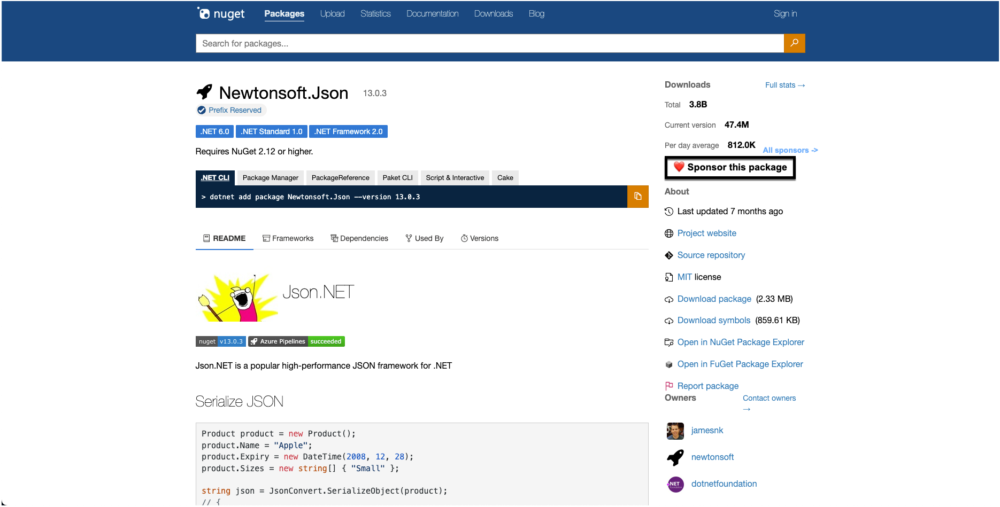
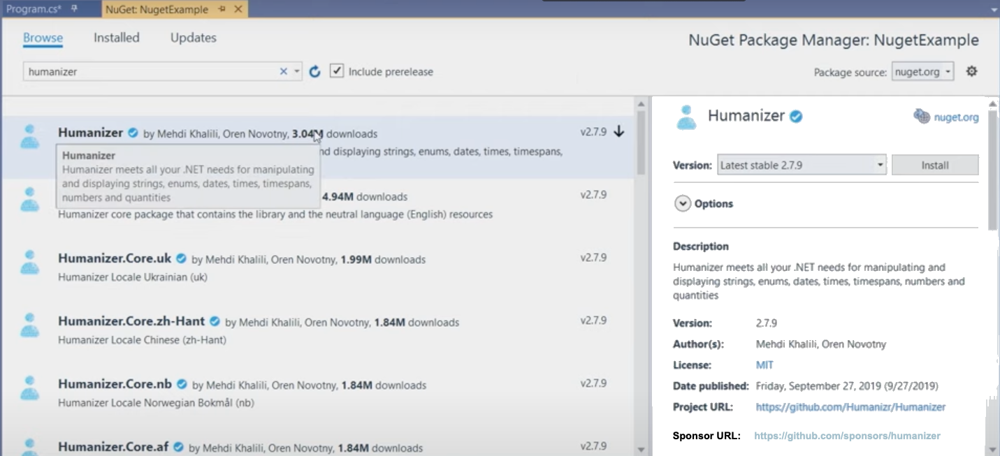

# Sponsor links for NuGet packages
<!-- Replace `Title` with an appropriate title for your design -->

- Jon Douglas <!-- GitHub username link -->
- [#9339](https://github.com/NuGet/NuGetGallery/issues/9339) <!-- GitHub Issue link -->

## Summary

<!-- One-paragraph description of the proposal. -->

Today, more than 9/10 companies use open source software in at least some capacity. One key concern is ensuring that open source is financially sustainable. More specifically, how do we make sure the developers maintaining some of the most critical software being used by these companies, governments, nonprofits, etc are able to keep doing their important work?

This proposal introduces an end-to-end experience of bringing visibility to the sponsorship requirements of open source packages on the NuGet.org registry and make NuGet tooling aware of it. This is to ensure that the sponsorship requirements make it down to the developers who are using open source software in a non-disruptive way.

Package authors will be able to express their sponsorship needs through new `sponsor` package metadata specifying a popular verified funding mechanism (GitHub Sponsors, Patreon, etc). This may consist of a list of reputable funding providers such as patreon, tidelift, github sponsors, and the relative link to each.

Package consumers will be able to see packages looking for funding through different mechanisms. One will be at `restore` time where a new message will be outputted to summarize all the funding requirements in the individual has opt-in to a feature flag such as `<NuGetSponsor>true</NuGetSponsor>`. For more information about any specific package's sponsorship needs, a developer will be able to use a CLI command like `dotnet sponsor package <PACKAGE_NAME>` to learn more about how they can contribute financially. Within an IDE such as Visual Studio, there will be a new sponsorship affordance in the package details page that a developer can click on.

More reading on this problem:

- [GitHub sustainability in open source(2022)](https://github.blog/2022-11-09-financial-sustainability-in-open-source/)
- [Ford Foundation report on unseen labor(2016)](https://www.fordfoundation.org/work/learning/research-reports/roads-and-bridges-the-unseen-labor-behind-our-digital-infrastructure/)

## Motivation 

<!-- Why are we doing this? What pain points does this solve? What is the expected outcome? -->
To bring more awareness of .NET OSS sponsorship needs. Today there is no formal mechanism for this. Package authors use GitHub, package READMEs, blogs, and social media to express their sponsorship needs. The current challenge is that this information hardly makes it to the end-consumer and thus is largely ignored. We expect that by bringing more awareness to these sponsorship requirements, that packages will have more impassioned developers and companies sponsoring them as they see fit.

Additionally, this information being surfaced can help encourage developers who see these requests to advocate for corporate sponsorship budget of critical packages they use in their line of work. Today there are two major sources of funding: software companies and other developers. This proposal hopes to bring more awareness to both scenarios but focuses mostly on the latter.

There is a need to support the free public infrastructure. But right now there is no revenue stream around the time being put into it. People scream if their clocks are off by a second or a security vulnerability hasn't been addressed in a critical OSS package. They say, "Yes, we need you, but we can't give you any money". 

Maintainers don't work on OSS for money. They don't do it for fame. They do it out of pride in craftsmanship and the responsibility for something they believe in. It takes nerves of steel to work for many years on hundreds of thousands of lines of very complex code, with every line of code you touch being visible to the world, knowing that code is used by banks, weapon systems, smartphones, industry, government, and just about everywhere. With the knowing that you'll be ignored and unappreciated until something goes wrong. 

## Explanation

### Functional explanation

<!-- Explain the proposal as if it were already implemented and you're teaching it to another person. -->
<!-- Introduce new concepts, functional designs with real life examples, and low-fidelity mockups or  pseudocode to show how this proposal would look. -->
#### .nuspec / .csproj MSBuild property

The `.nuspec` will introduce a new collection element called `<sponsors>` which is a collection of zero or more `<sponsor>` elements specifying the sponsor requirements for the package.

```xml
<package xmlns="http://schemas.microsoft.com/packaging/2010/07/nuspec.xsd">
    <metadata minClientVersion="100.0.0.1">
        <id>dasdas</id>
        <version>2.0.0</version>
        <title />
        <authors>dsadas</authors>
        <owners />
        <requireLicenseAcceptance>false</requireLicenseAcceptance>
        <description>My package description.</description>
    </metadata>
    <sponsors>
        <sponsor type="Patreon" url="https://www.patreon.com/mypatreonusername" />
        <sponsor type="GitHub Sponsors" url="https://github.com/sponsors/mygithubusername" />
        <sponsor type="Tidelift" url="https://tidelift.com/subscription/pkg/mypackagename" />
    </sponsors>
</package>
```

For .NET projects that use the `PackageReference` format which draws inputs from the project file, one can create a new `<ItemGroup>` for their sponsors such as:

```xml
<ItemGroup>
    <Sponsors Include="Patreon" Url="https://www.patreon.com/mypatreonusername"/>
    <Sponsors Include="GitHub Sponsors" Url="https://github.com/sponsors/mygithubusername"/>
    <Sponsors Include="Tidelift" Url="https://tidelift.com/subscription/pkg/mypackagename"/>
</ItemGroup>
```

#### NuGet.org

On NuGet.org there will be a new `Sponsor this package` button which will open up a webpage to the first defined sponsor in the package metadata. Given there can be multiple sponsors, there may be an additional experience where one can click "all sponsors" and un-collapse the other options available.



#### Visual Studio

In Visual Studio's NuGet package manager UI, there will be a new link that says `Sponsor` which will open up a webpage to the first defined sponsor in the package metadata.



#### dotnet restore

If a developer has the MSBuild property of `<NuGetSponsor>true</NuGetSponsor>` they will see a summary of packages that require funding and an empowering message on how to see the funding needs after a restore.

A simple message will appear at the bottom such as:

```
X packages are looking for sponsors. Run `dotnet list package --sponsor` for more details.
```

#### dotnet list package --sponsor

To list all the packages that are looking for sponsors, one can run `dotnet list package --sponsor` which will provide output for each project. If no sponsors are listed, the project will provide a message saying there are no packages looking for sponsors. Finally, an empowering message will be provided regarding the follow-up command to learn more about sponsoring an individual package:

```plaintext
Project 'Umbraco.Core' has the following package references looking for sponsors
   [net7.0]: 
   Top-level Package                                              Requested            Resolved      
   > Moq                                      					  4.18.2               4.18.2
   > Serilog                                                 	  2.12.0               2.12.0
   
The given project `Umbraco.Web.UI` has no packages looking for sponsors given the current sources.

To learn more about sponsoring a package, run `dotnet sponsor package <PACKAGE_NAME>`.
```

#### dotnet sponsor package <PACKAGE_NAME>

When an individual is feeling generous to sponsor a package, they can run the `dotnet sponsor package <PACKAGE_NAME>` command which will open up the default browser on their machine with the url of the first sponsor defined in the package metadata.

### Technical explanation

<!-- Explain the proposal in sufficient detail with implementation details, interaction models, and clarification of corner cases. -->
Details will be provided once the functional proposal is accepted by the .NET OSS community.

## Drawbacks

<!-- Why should we not do this? -->
There may be arguments that it isn't the package registry's responsibility to bring awareness to sponsorship needs as it should focus purely as a means to index packages and deliver them reliably to consumers.

## Rationale and alternatives

<!-- Why is this the best design compared to other designs? -->
<!-- What other designs have been considered and why weren't they chosen? -->
<!-- What is the impact of not doing this? -->
This isn't the greatest proposal in the world, it is just a tribute to all the other prior arts who provide this functionality. The impact of not doing this work is more systemic and can discourage OSS package authors from wanting to contribute to the NuGet/.NET/C# ecosystem.

## Prior Art

<!-- What prior art, both good and bad are related to this proposal? -->
<!-- Do other features exist in other ecosystems and what experience have their community had? -->
<!-- What lessons from other communities can we learn from? -->
<!-- Are there any resources that are relevant to this proposal? -->

- [npm funding package.json metadata](https://docs.npmjs.com/cli/v9/configuring-npm/package-json#funding)
- [composer funding metadata](https://getcomposer.org/doc/04-schema.md?ref=blog.packagist.com#funding)
- [rubygems funding_uri](https://guides.rubygems.org/specification-reference/)
- [GitHub Sponsors](https://github.com/sponsors)

## Unresolved Questions

<!-- What parts of the proposal do you expect to resolve before this gets accepted? -->
<!-- What parts of the proposal need to be resolved before the proposal is stabilized? -->
<!-- What related issues would you consider out of scope for this proposal but can be addressed in the future? -->

## Future Possibilities

<!-- What future possibilities can you think of that this proposal would help with? -->
- Until the signal to noise ratio is figured out, this will be an opt-in experience for those passionate of becoming more aware of packages that need sponsorship.
  - In the future, it can be an opt-out experience to bring awareness to .NET OSS sustainability.
- The name `Sponsor` today is mostly inspired by GitHub Sponsors. Many other package registry's use the term `funding`, which may be a better name for this functionality. We will do pulse surveys to find the right name.
