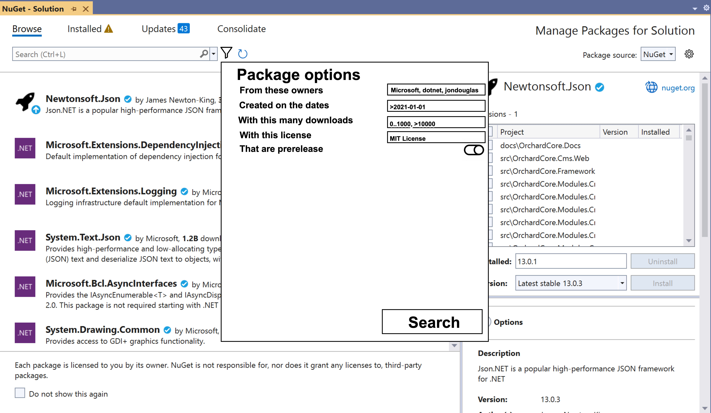
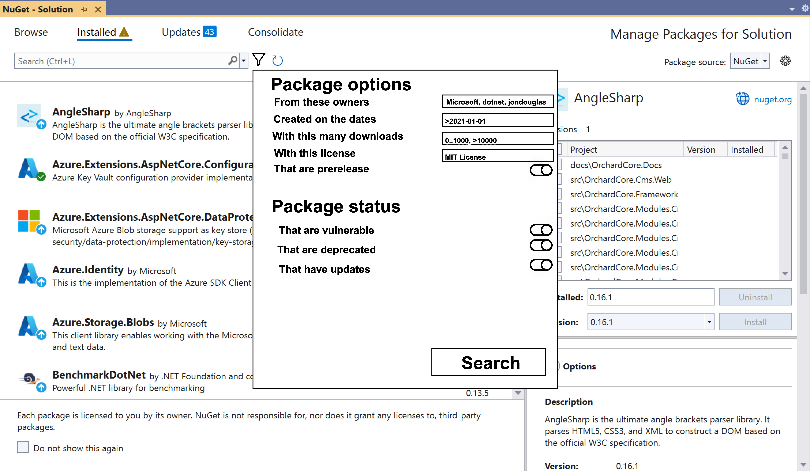
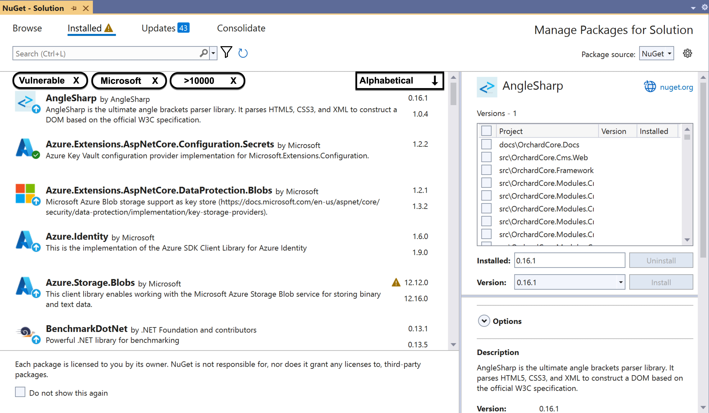

# Visual Studio Filters & Sorting Options

- [Jon Douglas](https://github.com/JonDouglas)
- 2023-06-23

## Summary

<!-- One-paragraph description of the proposal. -->
This proposal represents a common ask for more filters and sorting options in the NuGet Package Manager experience in Visual Studio. 

## Motivation 

<!-- Why are we doing this? What pain points does this solve? What is the expected outcome? -->
As NuGet continues to expand as a package ecosystem, there has become a dire need for being able to filter and sort packages through one's daily management in their IDE of choice. While NuGet.org supports a plethora of filters and sorts on the search experience today, we'd like to bring these similar experiences to the various tabs(browse, installed, etc) in Visual Studio to help aid various jobs-to-be-done when it comes down to package management.

## Explanation

### Functional explanation

<!-- Explain the proposal as if it were already implemented and you're teaching it to another person. -->
<!-- Introduce new concepts, functional designs with real life examples, and low-fidelity mockups or pseudocode to show how this proposal would look. -->

When a developer is using Visual Studio to search and manage NuGet packages, they will see a new filter and sort experience. 

The browse filter experience will allow the developer to filter results based on common concepts such as "frameworks", "prerelease", "owners", "download count", "license", and "created on". 

The installed filter experience will allow the developer to filter results based on all the **browse filter** and additional package status filters such as "deprecated", "vulnerable", and "update".

To apply filters, the developer will click the new filter button next to the search box. This will open up a new window of the possible filtering options to choose from.

When a filter is selected, the filter will show up as a pill/badge affordance in the package list which can be removed by clicking on the "X" associated with the pill/badge. For some filters, they will support multiple values such as frameworks, owners, and licenses. For other filters, they will only support one value such as prerelease, download count, created on, etc. For filters that have popular values but also have custom values, a input box will be provided. For example the license filter will have popular OSS licenses, but with the ability to insert the name of a not well known license as well.

Whenever a filter is applied, it will additionally show up in the Visual Studio search box so that developers get used to the search prefix syntax and can apply filters more quickly in the future.

The sorting experience will allow the developer to sort these options on common concepts such as "alphabetical", "version", "relevance", "downloads", and "recently updated".

The sorting options will show up as a dropdown in the package list.

### Technical explanation

<!-- Explain the proposal in sufficient detail with implementation details, interaction models, and clarification of corner cases. -->

## Drawbacks

<!-- Why should we not do this? -->

The NuGet package manager experience in Visual Studio today somewhat has these filtering concepts built into the default tabs such as "Browse", "Installed", "Update", and "Consolidate". There is however limited sorting options in Visual Studio for package management. By implementing this work, we may be re-inventing a small portion of work such as the current concept of the "Update" and "Consolidate" tabs such as the "update available" package status filter.

## Rationale and alternatives

<!-- Why is this the best design compared to other designs? -->
<!-- What other designs have been considered and why weren't they chosen? -->
<!-- What is the impact of not doing this? -->

One major challenge with search filtering experiences today is knowing the [supported search prefixes](https://learn.microsoft.com/en-us/nuget/consume-packages/finding-and-choosing-packages#search-syntax). Technically one who knows or finds the documentation on this topic could use these in Visual Studio, but it should be more visual and easy to find in the product itself through the means of a user interface that one can interact with.

This concept plays off of inspiration for new package management UI concepts we've designed in the past while also taking on contemporary UI/UX concepts found in popular applications such as Etsy, Spotify, AirBnB, and more. 

Additionally, the advanced search experience helps users learn the current prefixes that are supported while also being consistent with other platforms such as how GitHub implemented advanced search.

## Prior Art

<!-- What prior art, both good and bad are related to this proposal? -->
<!-- Do other features exist in other ecosystems and what experience have their community had? -->
<!-- What lessons from other communities can we learn from? -->
<!-- Are there any resources that are relevant to this proposal? -->
- [NuGet Visual Studio Package Manager UI vNext](https://github.com/microsoft/vscode-dotnettools/issues/62#issuecomment-1582471743)
- [GitHub](https://github.com/search) and [GitHub Advanced Search](https://github.com/search/advanced)
- [Etsy](https://www.etsy.com/search)
- [Airbnb](https://www.airbnb.com/?adults=2&search_mode=flex_destinations_search)
- [Spotify](https://open.spotify.com/search/rock)
- [Google](https://www.google.com/search)

## Unresolved Questions

<!-- What parts of the proposal do you expect to resolve before this gets accepted? -->
<!-- What parts of the proposal need to be resolved before the proposal is stabilized? -->
<!-- What related issues would you consider out of scope for this proposal but can be addressed in the future? -->

## Future Possibilities

<!-- What future possibilities can you think of that this proposal would help with? -->
- There is additionally a concept of "dependency sorting" which would sort dependencies based on the correct order to maintain compatibility such as updating versions. This could be a helpful feature if feasible / done correctly.
