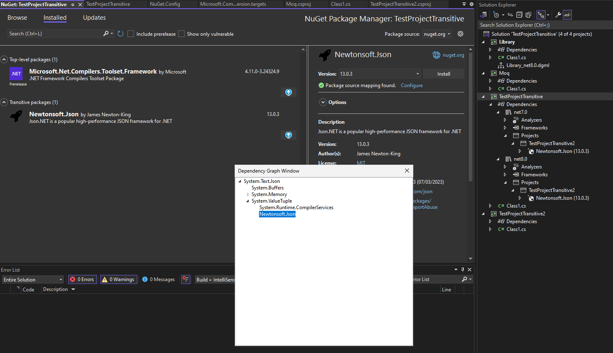

# Display the full origins path for transitive packages.

## Background

Currently, the Package Manager UI displays only the top-level package as the transitive origin for a transitive package. Users have expressed a need to see the full path when addressing vulnerabilities and managing packages.

The command `dotnet nuget why` should help users to see and manage their dependencies, but not all of our costumers know or use dotnet commands.

### Difficulties.
The size of the dependency graph is dependent on the size of the solution. Also, we should be trying to display the similar information as `dotnet nuget why` command. Furthermore, the PM UI does not take Target Framework Monikers (TFMs) into consideration.

### Current implementation
Currently, when you hover over a transitive package it will open a tooltip wich will have a section for `Transitively refernced version` that says which package or project brought that package.

## Proposed design

### Design 1.
This proposed design adds a new button (location needs to be defined) in the `PackageItemControl` that will open a modal, this modal will contain a `TreeView` that represents the dependency graph of the project with the node to package open/expanded.

This information will be calculated at the time we open the PM UI so we will need to make sure this is calculated in the background (we can look at `why` command code to make the dependency graph).

Another way to do the calculation is do it when the user want's to see this (click the button) and cache the graph.

#### Concerns
- PM UI doesn't handle target frameworks so it won't display the same information as `dotnet nuget why` and Solution Explorer.
- There are solutions which the dependency graph is too big and a TreeView may not be the best representation.

### Design 2.
Leave the current implementation and mention the usage of `dotnet nuget why` in the tooltip.

## Work breakdown
- https://github.com/NuGet/Home/issues/13574